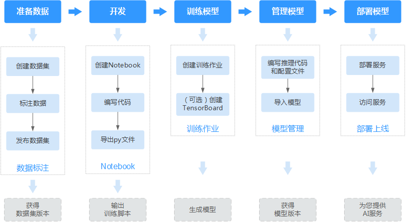
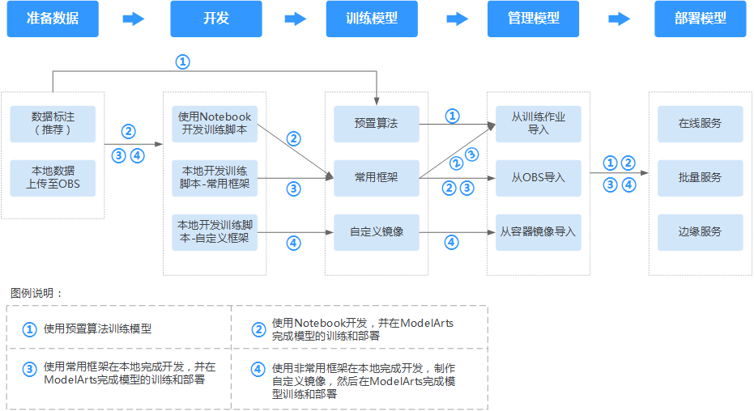

# AI工程师如何使用ModelArts

面向熟悉代码编写和调测，熟悉常见AI引擎的开发者，ModelArts不仅提供了在线代码开发环境，还提供了从数据准备、模型训练、模型管理到模型部署上线的端到端开发流程（即AI全流程开发），帮助您高效、快速的构建一个可用模型。

本文档介绍了如何在ModelArts管理控制台完成AI开发，如果您习惯使用API或者SDK进行开发，建议查看《[ModelArts SDK参考](https://support.huaweicloud.com/sdkreference-modelarts/modelarts_04_0002.html)》和《[ModelArts API参考](https://support.huaweicloud.com/api-modelarts/modelarts_03_0002.html)》获取帮助。

使用AI全流程开发的端到端示例，请参见[使用MXNet构建模型](https://support.huaweicloud.com/qs-modelarts/modelarts_06_0004.html)和[使用Notebook构建模型](https://support.huaweicloud.com/qs-modelarts/modelarts_06_0005.html)。

## AI全流程开发

ModelArts提供的AI全流程开发，兼容开发者的使用习惯，支持多种引擎和用户场景，使用自由度较高。下文介绍使用ModelArts平台，从数据准备到完成模型开发上线的全流程。针对开发者的其他场景，建议参考[ModelArts使用流程详解](#section343984417488)。

**图 1**  AI工程师的使用流程  

**表 1**  使用流程说明

<table><thead align="left"><tr id="row44252014449"><th class="cellrowborder" valign="top" width="11.15%" id="mcps1.2.5.1.1">
流程

</th>
<th class="cellrowborder" valign="top" width="18.459999999999997%" id="mcps1.2.5.1.2">
子任务

</th>
<th class="cellrowborder" valign="top" width="41.93%" id="mcps1.2.5.1.3">
说明

</th>
<th class="cellrowborder" valign="top" width="28.46%" id="mcps1.2.5.1.4">
详细指导

</th>
</tr>
</thead>
<tbody><tr id="row1242020164414"><td class="cellrowborder" rowspan="3" valign="top" width="11.15%" headers="mcps1.2.5.1.1 ">
准备数据

</td>
<td class="cellrowborder" valign="top" width="18.459999999999997%" headers="mcps1.2.5.1.2 ">
创建数据集

</td>
<td class="cellrowborder" valign="top" width="41.93%" headers="mcps1.2.5.1.3 ">
基于您的业务数据，您可以在ModelArts中创建数据集管理和预处理您的数据。

</td>
<td class="cellrowborder" valign="top" width="28.46%" headers="mcps1.2.5.1.4 ">
<a href="创建数据集.md">创建数据集</a>

</td>
</tr>
<tr id="row1421220174419"><td class="cellrowborder" valign="top" headers="mcps1.2.5.1.1 ">
标注数据

</td>
<td class="cellrowborder" valign="top" headers="mcps1.2.5.1.2 ">
针对您创建的数据集，基于业务逻辑标注数据，对数据进行预处理，方便后续训练使用。数据标注的情况将影响模型训练效果。

</td>
<td class="cellrowborder" valign="top" headers="mcps1.2.5.1.3 ">
<a href="图像分类.md">标注数据</a>

</td>
</tr>
<tr id="row15421520174416"><td class="cellrowborder" valign="top" headers="mcps1.2.5.1.1 ">
发布数据集

</td>
<td class="cellrowborder" valign="top" headers="mcps1.2.5.1.2 ">
数据标注完成后，将数据集发布。即可生成一个可以用于模型训练的数据集版本。

</td>
<td class="cellrowborder" valign="top" headers="mcps1.2.5.1.3 ">
<a href="发布数据集.md">发布数据集</a>

</td>
</tr>
<tr id="row742520144411"><td class="cellrowborder" rowspan="3" valign="top" width="11.15%" headers="mcps1.2.5.1.1 ">
开发

</td>
<td class="cellrowborder" valign="top" width="18.459999999999997%" headers="mcps1.2.5.1.2 ">
创建Notebook

</td>
<td class="cellrowborder" valign="top" width="41.93%" headers="mcps1.2.5.1.3 ">
创建一个Notebook作为开发环境。

</td>
<td class="cellrowborder" valign="top" width="28.46%" headers="mcps1.2.5.1.4 ">
<a href="创建并打开Notebook.md">创建并打开Notebook</a>

</td>
</tr>
<tr id="row1342920134413"><td class="cellrowborder" valign="top" headers="mcps1.2.5.1.1 ">
编写代码

</td>
<td class="cellrowborder" valign="top" headers="mcps1.2.5.1.2 ">
在已有的Notebook中编写代码，您也可以使用ModelArts示例，直接构建模型。

</td>
<td class="cellrowborder" valign="top" headers="mcps1.2.5.1.3 ">
<a href="使用ModelArts示例.md">使用ModelArts示例</a>

</td>
</tr>
<tr id="row631411112451"><td class="cellrowborder" valign="top" headers="mcps1.2.5.1.1 ">
导出“py”文件

</td>
<td class="cellrowborder" valign="top" headers="mcps1.2.5.1.2 ">
编写完成的训练脚本，导出成“py”文件才可以用于后续的模型训练、模型管理等操作。

</td>
<td class="cellrowborder" valign="top" headers="mcps1.2.5.1.3 ">
<a href="使用Convert-to-Python-File功能.md">使用Convert to Python File功能</a>

</td>
</tr>
<tr id="row33152115455"><td class="cellrowborder" rowspan="2" valign="top" width="11.15%" headers="mcps1.2.5.1.1 ">
训练模型

</td>
<td class="cellrowborder" valign="top" width="18.459999999999997%" headers="mcps1.2.5.1.2 ">
创建训练作业

</td>
<td class="cellrowborder" valign="top" width="41.93%" headers="mcps1.2.5.1.3 ">
创建一个训练作业，选择可用的数据集版本，然后，上传并使用前面编写完成的训练脚本。训练完成后，将生成模型并存储至OBS中。

</td>
<td class="cellrowborder" valign="top" width="28.46%" headers="mcps1.2.5.1.4 ">
<a href="创建训练作业.md">创建训练作业</a>

</td>
</tr>
<tr id="row112701227144511"><td class="cellrowborder" valign="top" headers="mcps1.2.5.1.1 ">
（可选）创建可视化作业

</td>
<td class="cellrowborder" valign="top" headers="mcps1.2.5.1.2 ">
您可以通过创建可视化作业（TensorBoad类型）查看模型训练过程，您可以通过可视化作业提供信息，了解其模型情况，并对模型进行调整和优化。可视化作业当前仅针对MXNet和TensorFlow引擎。

</td>
<td class="cellrowborder" valign="top" headers="mcps1.2.5.1.3 ">
<a href="管理可视化作业.md">管理TensorBoard</a>

</td>
</tr>
<tr id="row10175132412456"><td class="cellrowborder" rowspan="2" valign="top" width="11.15%" headers="mcps1.2.5.1.1 ">
管理模型

</td>
<td class="cellrowborder" valign="top" width="18.459999999999997%" headers="mcps1.2.5.1.2 ">
编写推理代码和配置文件

</td>
<td class="cellrowborder" valign="top" width="41.93%" headers="mcps1.2.5.1.3 ">
针对您生成的模型，建议您按照ModelArts提供的模型包规范，编写推理代码和配置文件，并将推理代码和配置文件存储至训练输出位置。

</td>
<td class="cellrowborder" valign="top" width="28.46%" headers="mcps1.2.5.1.4 ">
<a href="模型包规范介绍.md">模型包规范介绍</a>

</td>
</tr>
<tr id="row191764243457"><td class="cellrowborder" valign="top" headers="mcps1.2.5.1.1 ">
导入模型

</td>
<td class="cellrowborder" valign="top" headers="mcps1.2.5.1.2 ">
将训练完成的模型导入至ModelArts，方便将模型部署上线。

</td>
<td class="cellrowborder" valign="top" headers="mcps1.2.5.1.3 ">
<a href="导入模型.md">导入模型</a>

</td>
</tr>
<tr id="row8176202413451"><td class="cellrowborder" rowspan="2" valign="top" width="11.15%" headers="mcps1.2.5.1.1 ">
部署服务

</td>
<td class="cellrowborder" valign="top" width="18.459999999999997%" headers="mcps1.2.5.1.2 ">
部署服务

</td>
<td class="cellrowborder" valign="top" width="41.93%" headers="mcps1.2.5.1.3 ">
ModelArts支持将模型部署为在线服务、批量服务和边缘服务。

</td>
<td class="cellrowborder" valign="top" width="28.46%" headers="mcps1.2.5.1.4 "><ul id="ul54953915613"><li><a href="部署为在线服务.md">部署为在线服务</a></li><li><a href="部署为批量服务.md">部署为批量服务</a></li><li><a href="部署为边缘服务.md">部署为边缘服务</a></li></ul>
</td>
</tr>
<tr id="row1717662454513"><td class="cellrowborder" valign="top" headers="mcps1.2.5.1.1 ">
访问服务

</td>
<td class="cellrowborder" valign="top" headers="mcps1.2.5.1.2 ">
服务部署完成后，针对在线服务和边缘服务，您可以访问并使用服务，针对批量服务，您可以查看其预测结果。

</td>
<td class="cellrowborder" valign="top" headers="mcps1.2.5.1.3 "><ul id="ul68251931460"><li><a href="访问在线服务.md">访问在线服务</a></li><li><a href="查看批量服务预测结果.md">访问批量服务</a></li><li><a href="访问边缘服务.md">访问边缘服务</a></li></ul>
</td>
</tr>
</tbody>
</table>

## ModelArts使用流程详解

ModelArts平台提供了从数据准备到模型部署的AI全流程开发，针对每个环节，其使用时相对自由的。针对AI工程师，梳理了ModelArts使用流程详解，您可以选择其中一种方式完成AI开发。

**图 2**  使用流程详解  

