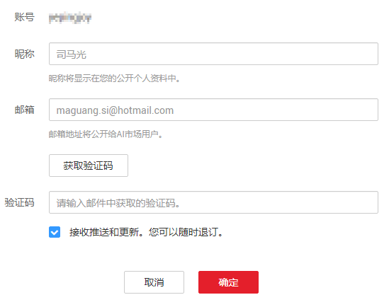
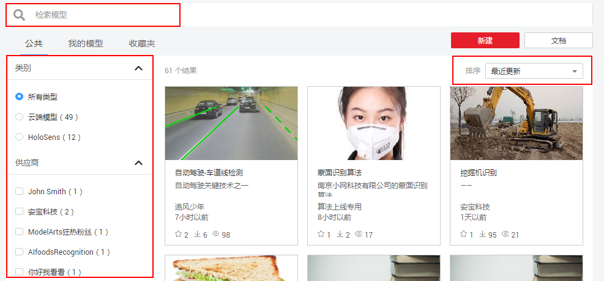
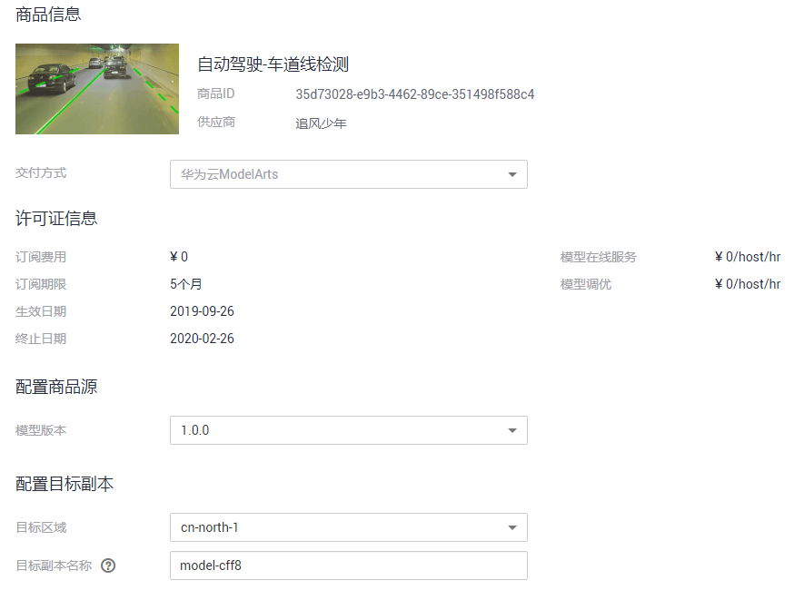
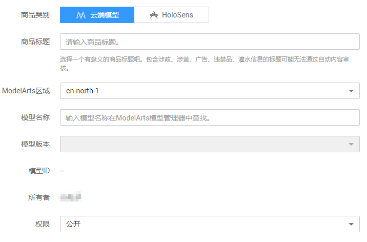

# AI市场（新版）

ModelArts的AI市场（新版）提供了其他用户共享的模型，您可以使用他人分享的信息快速构建模型。同时，您也可以将自己的模型发布至AI市场，共享知识。

> **说明：**   
>-   AI市场（新版）中，当前仅支持了“ModelHub“功能、“HoloSens Store“和“HiLens技能“，未来即将上线“数据集“、“Ipython笔记“、“挑战“、“委托令“、“品评“等功能。  
>-   其中“ModelHub“市场中共享了模型，用于ModelArts平台。“HoloSens Store“用于智能安防行业，详细指导请参见《[智能安防资料书架](https://support.huawei.com/enterprise/zh/category/video-surveillance-pid-1482615596259?submodel=7919735)》。“HiLens技能“为HiLens服务的技能市场功能，详细指导请参见《[HiLens用户指南](https://support.huaweicloud.com/usermanual-hilens/hilens_02_0036.html)》。  

## 新版与旧版的区别

为保证老用户能够继续使用AI市场及其完整的功能，新版和旧版在将“华北-北京一“区域同时存在一段时间。您可以根据自身情况，选择使用新版或旧版，由于新版的AI市场，其性能和体验更佳，推荐您优先选择使用新版。本章节介绍新版的说明和使用介绍，关于旧版的使用指导，请参见[AI市场](zh-cn_topic_0121803214.md)。

**表 1**  新版与旧版AI市场的区别说明

<table><thead align="left"><tr id="row1798511147531"><th class="cellrowborder" valign="top" width="28.992899289928992%" id="mcps1.2.4.1.1">
区别项

</th>
<th class="cellrowborder" valign="top" width="33.73337333733373%" id="mcps1.2.4.1.2">
新版

</th>
<th class="cellrowborder" valign="top" width="37.27372737273727%" id="mcps1.2.4.1.3">
旧版

</th>
</tr>
</thead>
<tbody><tr id="row119851314155319"><td class="cellrowborder" valign="top" width="28.992899289928992%" headers="mcps1.2.4.1.1 ">
哪些区域的ModelArts可以使用

</td>
<td class="cellrowborder" valign="top" width="33.73337333733373%" headers="mcps1.2.4.1.2 ">
华北-北京一

华北-北京四

</td>
<td class="cellrowborder" valign="top" width="37.27372737273727%" headers="mcps1.2.4.1.3 ">
华北-北京一

</td>
</tr>
<tr id="row9985191416538"><td class="cellrowborder" valign="top" width="28.992899289928992%" headers="mcps1.2.4.1.1 ">
通用类型

</td>
<td class="cellrowborder" valign="top" width="33.73337333733373%" headers="mcps1.2.4.1.2 "><ul id="ul119646323224"><li>发布（支持）</li><li>订阅（支持）</li><li>计费（即将支持）</li></ul>
</td>
<td class="cellrowborder" valign="top" width="37.27372737273727%" headers="mcps1.2.4.1.3 "><ul id="ul9763111922215"><li>发布（不支持）</li><li>订阅（支持）</li><li>计费（不支持）</li></ul>
</td>
</tr>
<tr id="row1998541425319"><td class="cellrowborder" valign="top" width="28.992899289928992%" headers="mcps1.2.4.1.1 ">
API

</td>
<td class="cellrowborder" valign="top" width="33.73337333733373%" headers="mcps1.2.4.1.2 "><ul id="ul1145364632216"><li>发布（即将支持）</li><li>订阅（即将支持）</li><li>计费（即将支持）</li></ul>
</td>
<td class="cellrowborder" valign="top" width="37.27372737273727%" headers="mcps1.2.4.1.3 "><ul id="ul17210105522218"><li>发布（支持）</li><li>订阅（支持）</li><li>计费（不支持）</li></ul>
</td>
</tr>
<tr id="row1798541475314"><td class="cellrowborder" valign="top" width="28.992899289928992%" headers="mcps1.2.4.1.1 ">
数据集

</td>
<td class="cellrowborder" valign="top" width="33.73337333733373%" headers="mcps1.2.4.1.2 "><ul id="ul1949211915236"><li>发布（即将支持）</li><li>下载（即将支持）</li></ul>
</td>
<td class="cellrowborder" valign="top" width="37.27372737273727%" headers="mcps1.2.4.1.3 "><ul id="ul886315555226"><li>发布（不支持）</li><li>下载（支持）</li></ul>
</td>
</tr>
<tr id="row1298514149531"><td class="cellrowborder" valign="top" width="28.992899289928992%" headers="mcps1.2.4.1.1 ">
其他

</td>
<td class="cellrowborder" valign="top" width="33.73337333733373%" headers="mcps1.2.4.1.2 "><ul id="ul138011436202318"><li>汉化（支持）</li><li>跨Region（支持）</li></ul>
</td>
<td class="cellrowborder" valign="top" width="37.27372737273727%" headers="mcps1.2.4.1.3 "><ul id="ul1153183815231"><li>汉化（支持）</li><li>跨Region（不支持）</li></ul>
</td>
</tr>
</tbody>
</table>

## 如何进入AI市场（新版）

进入ModelArts管理控制台，在左侧菜单栏中选择“AI市场“。如果您的ModelArts所在区域为“华北-北京一“，那么会同时存在新版和旧版，您可以在弹出的对话框中选择您需要的版本，进入AI市场。如果您的ModelArts所在区域为“华北-北京四“，那么将直接进入新版AI市场。

对于首次使用AI市场的用户，需要在AI市场中完成注册后再使用其功能。

1.  单击页面内任意模型，界面将自动跳转至“注册“页面。
2.  根据界面信息填写“昵称“和“邮箱“，在“邮箱“填写完成后，单击“获取验证码“。

    等待几分钟后，您填写的邮箱将收到华为云发送的邮件，邮件内容中包含验证码。将验证码填写至注册信息中，根据实际情况勾选“接收推送和更新，您可以随时退订“，然后单击“确定“完成注册。

    **图 1**  注册AI市场的账号  
    

## 公共

进入AI市场（新版），界面自动进入“公共“页签，展示AI市场内其他人共享的模型。

-   **查找模型**

    在“公共“页签下，您可以通过如下三种方式快速查找所需模型。

    -   方式1：在搜索框中，输入关键词，AI市场会自动在所有的模型中搜索与关键词相关的模型。
    -   方式2：在左侧的导航栏中，通过“类别“或“供应商“过滤模型，筛选出您想要的模型。
    -   方式3：在右上角的分类下拉框中，选择你所需的分类，筛选出您想要的模型。目前有“最近更新“、“最近发布“、“最多收藏“、“最多浏览“和“最多订阅“五种类别。

    **图 2**  查找模型  
    

-   **查看模型详情**

    在“公共“、“我的模型“、“收藏夹“等页签下，仅展示模型的基本信息，如果想要了解详细信息，可单击模型所在区块进入详情页面。

    在模型详情页面，将展示此模型的描述、价格、版本、Demo、品评等信息，详细内容请从界面获取。

-   **订阅模型**

    在模型详情页面中，单击“订阅“，进入“订单详情“页面，根据界面提示填写详细配置，如“模型版本“、“配置目标副本“等。模型订阅成功后，您可以从“AI市场用户中心“的“我的购买“页面查看此订阅的模型。

    > **说明：**   
    >针对ModelArts提供的官方模型，订阅费用为0。针对其他用户发布至AI市场的模型，会根据发布者的设置收取相应的费用，请通过模型详情了解具体费用，也可以在订阅过程的订单中了解详细费用。  

    **图 3**  配置订阅信息  
    

-   **收藏模型**

    在模型详情页面中，单击右上角的，收藏此模型。模型收藏成功后，您可以在“ModelHub \> 收藏夹“页签下查看您收藏的所有模型。

## 分享或查看我的模型

-   **在AI市场分享模型**
    1.  在“ModelHub \> 公共“页面，单击“新建“可新建一个模型，即将您的模型分享至AI市场中。
    2.  在“新建云端模型“页面，填写相关信息，然后单击立即创建。

        **图 4**  新建云端模型  
        

        **表 2**  参数说明

        
        <table><thead align="left"><tr id="row20808104016011"><th class="cellrowborder" valign="top" width="30.81%" id="mcps1.2.3.1.1">
参数

        </th>
        <th class="cellrowborder" valign="top" width="69.19%" id="mcps1.2.3.1.2">
说明

        </th>
        </tr>
        </thead>
        <tbody><tr id="row980818401207"><td class="cellrowborder" valign="top" width="30.81%" headers="mcps1.2.3.1.1 ">
“商品类别”

        </td>
        <td class="cellrowborder" valign="top" width="69.19%" headers="mcps1.2.3.1.2 "><ul id="ul193331553110"><li>ModelArts：表示新建的模型可用于ModelArts。</li><li>HoloSens：表示新建的模型可用于SDC。</li></ul>
        </td>
        </tr>
        <tr id="row680812405014"><td class="cellrowborder" valign="top" width="30.81%" headers="mcps1.2.3.1.1 ">
“商品标题”

        </td>
        <td class="cellrowborder" valign="top" width="69.19%" headers="mcps1.2.3.1.2 ">
在市场显示的模型名称，建议按照您的模型实现目的设置。

        </td>
        </tr>
        <tr id="row1180854020018"><td class="cellrowborder" valign="top" width="30.81%" headers="mcps1.2.3.1.1 ">
“Modelarts区域”

        </td>
        <td class="cellrowborder" valign="top" width="69.19%" headers="mcps1.2.3.1.2 ">
目前ModelArts只支持“华北-北京一”和“华北-北京四”，因此此参数的可选值只有这两个。

        </td>
        </tr>
        <tr id="row1080813401901"><td class="cellrowborder" valign="top" width="30.81%" headers="mcps1.2.3.1.1 ">
“模型名称”

        </td>
        <td class="cellrowborder" valign="top" width="69.19%" headers="mcps1.2.3.1.2 ">
输入模型的名称，从ModelArts的“模型管理”中搜索对应的模型，并快速获取您分享的模型。

        </td>
        </tr>
        <tr id="row1680812401003"><td class="cellrowborder" valign="top" width="30.81%" headers="mcps1.2.3.1.1 ">
“模型版本”

        </td>
        <td class="cellrowborder" valign="top" width="69.19%" headers="mcps1.2.3.1.2 ">
在选择对应的模型后，您可以选择其版本。此处的“模型版本”和“模型名称”与ModelArts的“模型管理”页面一致。

        </td>
        </tr>
        <tr id="row554416315215"><td class="cellrowborder" valign="top" width="30.81%" headers="mcps1.2.3.1.1 ">
“模型ID”

        </td>
        <td class="cellrowborder" valign="top" width="69.19%" headers="mcps1.2.3.1.2 ">
系统自动定义，根据您选择“模型名称”和“模型版本”会显示其详细对应的ID。

        </td>
        </tr>
        <tr id="row155461531623"><td class="cellrowborder" valign="top" width="30.81%" headers="mcps1.2.3.1.1 ">
“拥有者”

        </td>
        <td class="cellrowborder" valign="top" width="69.19%" headers="mcps1.2.3.1.2 ">
此模型的拥有者名称，即您的账户名。此处不可编辑。

        </td>
        </tr>
        <tr id="row115461931427"><td class="cellrowborder" valign="top" width="30.81%" headers="mcps1.2.3.1.1 ">
“权限”

        </td>
        <td class="cellrowborder" valign="top" width="69.19%" headers="mcps1.2.3.1.2 ">
设置此模型的公开权限。可选：“公开”、“私有”或者“白名单用户组”。

        <ul id="ul1391317012413"><li>“公开”：表示所有可以使用AI市场的用户都可以看到并使用您的模型。</li><li>“私有”：表示只有当前账号可以使用此模型。</li><li>“白名单用户组”：针对ModelArts白名单列表的用户，都可以使用您新建的模型。</li></ul>
        </td>
        </tr>
        </tbody>
        </table>

    3.  模型创建成功后，将罗列在“ModelHub \> 公共“页面。

-   **查看我的模型**

    如果您已经有将模型分享至AI市场，那么您可以进入“ModelHub \> 我的模型“页面，查看您分享的模型。可单击模型进入模型详情页。

