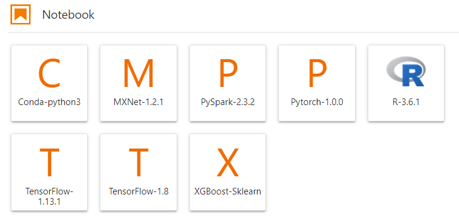
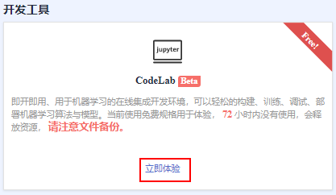
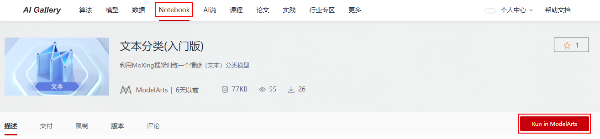
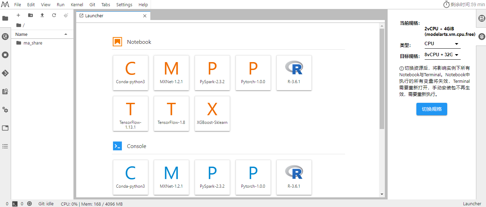
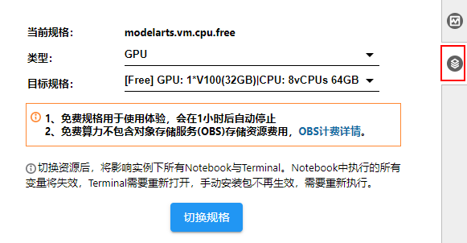
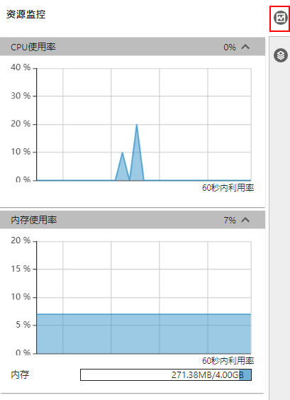
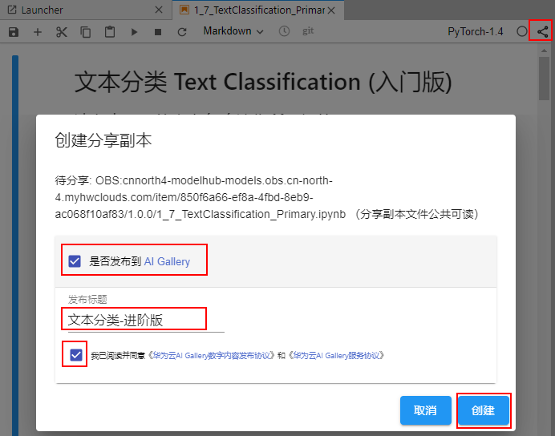
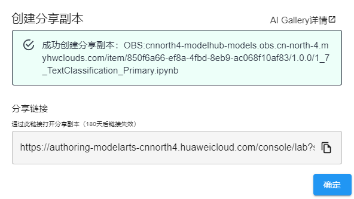

# CodeLab：免费体验Notebook

面向众多开发者，ModelArts提供了CodeLab功能，一方面，一键进入开发环境，同时预置了免费的算力规格，可直接免费体验Notebook功能；另一方面，针对AIGallery社区发布的Notebook样例（.ipynb格式文件），可直接在CodeLab中打开，查看他人分享的样例代码。

## 功能亮点

-   **免费算力**

    CodeLab内置了免费算力，包含CPU和GPU两种。您可以使用免费规格，端到端体验ModelArts Notebook能力。也可使用此免费算力，在线完成您的算法开发。

-   **即开即用**

    无需创建Notebook实例，打开即可编码。

-   **高效分享**

    ModelArts在AI Gallery中提供的Notebook样例，可以直接通过Run in ModelArts，一键打开运行和学习，并且可将样例修改后分享到AI Gallery中直接另存用于个人开发。

    同时，您开发的代码，也可通过CodeLab快速分享到AI Gallery中给他人使用学习。

## 使用限制

-   CodeLab默认打开，使用的是CPU计算资源。如需切换为GPU，请在右侧窗口，更换GPU规格。
-   自启动后，免费规格默认可使用1小时，请注意右上角的剩余时长。超过1小时后，可执行续期操作，且系统每隔一段时间，将提醒确认下续期。
-   免费的CodeLab主要用于体验，72小时内未使用，将释放资源。保存在其中的代码文档将丢失，请注意备份文件以及使用时长。
-   CodeLab中默认内置的AI框架及版本，请通过首页的Notebook下方获取，如下所示。

    **图 1**  支持的框架及版本  
    

## CodeLab入口

-   ModelArts管理控制台的“总览“页

    在“开发工具“区域下方，展示“CodeLab“简介卡片，单击“立即体验“，即可进入。

    **图 2**  CodeLab入口  
    

-   AI Gallery页面提供的Notebook样例

    在[AI Gallery](https://marketplace.huaweicloud.com/markets/aihub/notebook/list/)页面，单击Notebook栏目中的任意Notebook样例，进入详情页，单击“Run in ModelArts“，进入CodeLab并打开该样例。等待右上角连接成功即可运行Notebook样例。

    

> **说明：** 
>-   首次进入CodeLab时，会提醒先登录ModelArts控制台，由于需要进行环境准备，需要等待1\~2分钟才可顺利进入开发页面，请耐心等待。
>-   CodeLab的内部环境依托Notebook功能，因此其工作环境，与JupyterLab界面相似。

## 体验CodeLab

1.  **进入CodeLab主页。**

    从管理控制台总览页进入，展示CodeLab首页。

    **图 3**  CodeLab首页  
    

2.  **常用功能。**

    CodeLab的界面依托于JupyterLab，其相关的常见功能，与JupyterLab相同。

    常用操作指导可参见JupyterLab操作指导：[JupyterLab简介及常用操作](JupyterLab简介及常用操作.md)。

    > **说明：** 
    >由于CodeLab的存储为系统默认路径，在使用“上传文件”或“下载文件至本地”时，只能使用JupyterLab页面提供的功能（存在文件大小限制，目前建议为小于100MB的文件），无法使用JupyterLab中提供的大文件上传下载功能。
    >如需使用大文件上传和下载的功能，建议您前往Notebook，创建一个收费的实例进行使用。

3.  **切换规格。**

    CodeLab支持CPU和GPU两种规格在右侧区域，单击切换规格，修改规格类型。

    **图 4**  切换规格  
    

4.  **资源监控。**

    在使用过程中，如果想了解资源使用情况，可在右侧区域选择“Resource Monitor“，展示“CPU使用率“和“内存使用率“。

    **图 5**  资源监控  
    

5.  分享副本到AI Gallery。单击右上角的，将修改后的Notebook样例保存分享到AI Gallery中，供自己或他人学习使用。

    **图 6**  分享到AI Gallery  
    

    分享成功后，通过分享链接可以打开分享的副本，也可以在AI Gallery中找到分享的Notebook。

    **图 7**  创建分享副本  
    

