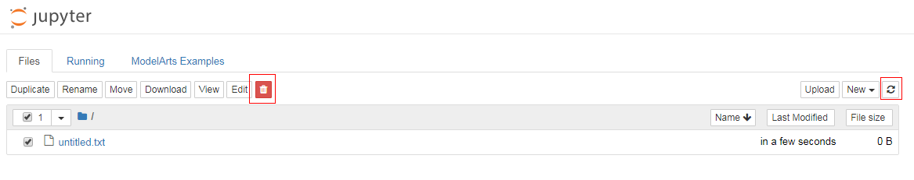

# Jupyter Notebook中删除文件或文件夹

如果需要在Jupyter Notebook中删除文件或文件夹，您可以在“Files“列表中勾选待删除的文件或文件夹，然后单击上方的红色删除按钮，即可删除选中的文件或文件夹。

> **说明：**   
>文件或文件夹删除完成后，需单击右上角的刷新按钮刷新Jupyter页面，清除缓存文件。  

**图 1**  文件列表刷新功能  

