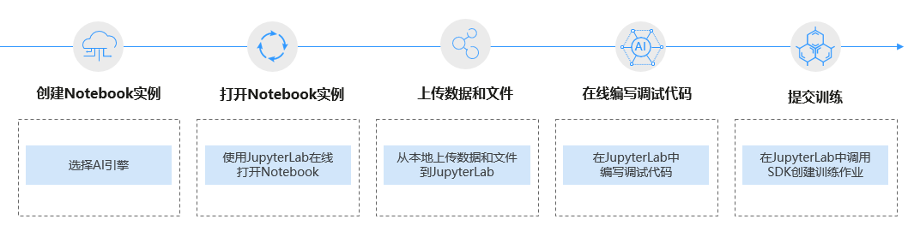

# JupyterLab操作流程

ModelArts支持通过JupyterLab工具在线打开Notebook，开发基于Pytorch、Tensorflow和MindSpore引擎的AI模型。具体操作流程如下图所示。

**图 1**  使用JupyterLab在线开发调试代码  

1.  创建Notebook实例

    在ModelArts控制台中创建一个Notebook开发环境实例，选择要使用的AI框架。具体参见[创建Notebook实例](创建Notebook实例.md)。

2.  使用JupyterLab打开Notebook实例。具体参见[打开JupyterLab](JupyterLab简介及常用操作.md#section195461127123320)。
3.  准备训练数据和代码文件，上传到JupyterLab中。具体参见[从本地上传文件至JupyterLab](从本地上传文件至JupyterLab.md)。
4.  编码和调试

    在JupyterLab中编写代码文件，并运行调试。具体参见[JupyterLab简介及常用操作](JupyterLab简介及常用操作.md)。

5.  在JupyterLab中直接调用ModelArts提供的SDK，创建训练作业，上云训练。

    调用SDK创建训练作业的操作请参见[调用SDK创建训练作业](https://support.huaweicloud.com/sdkreference-modelarts/modelarts_04_0131.html)当前仅支持提交到旧版训练作业）。

