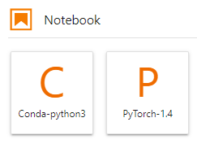

# JupyterLab简介及常用操作

JupyterLab是一个交互式的开发环境，是Jupyter Notebook的下一代产品，可以使用它编写Notebook、操作终端、编辑MarkDown文本、打开交互模式、查看csv文件及图片等功能。

可以说，JupyterLab是开发者们下一阶段更主流的开发环境。JupyterLab支持更加灵活和更加强大的项目操作方式，但具有和Jupyter Notebooks一样的组件。

## 打开JupyterLab

下面介绍如何从运行中的Notebook实例打开JupyterLab。

1.  登录ModelArts管理控制台，在左侧菜单栏中选择“开发环境 \> Notebook“，进入新版Notebook管理页面。
2.  选择状态为“运行中“的Notebook实例，单击操作列的“打开“，访问JupyterLab。

    **图 1**  打开Notebook实例  
    

3.  进入JupyterLab页面后，自动打开Launcher页面，如下图所示。您可以使用开源支持的所有功能，详细操作指导可参见[JupyterLab官网文档](https://jupyterlab.readthedocs.io/en/stable/)。

    **图 2**  JupyterLab主页  
    

## 在JupyterLab中新建ipynb文件

进入JupyterLab主页后，可在“Notebook“区域下，选择适用的AI引擎，单击后将新建一个对应框架的ipynb文件。

由于每个Notebook实例选择的工作环境不同，其支持的AI框架也不同，下图仅为示例，请根据实际显示界面选择AI框架。

**图 3**  选择AI引擎并新建一个ipynb文件  

新建的ipynb文件将呈现在左侧菜单栏中。

**图 4**  新建文件  

## 新建文件并打开Console

Console的本质为Python终端，输入一条语句就会给出相应的输出，类似于Python原生的IDE。

进入JupyterLab主页后，可在“Console“区域下，选择适用的AI引擎，单击后将新建一个对应框架的Notebook文件。

由于每个Notebook实例选择的工作环境不同，其支持的AI框架也不同，下图仅为示例，请根据实际显示界面选择AI框架。

**图 5**  选择AI引擎并新建一个Console  

文件创建成功后，将直接呈现Console页面。

**图 6**  新建文件（Console）  

## 在JupyterLab中编辑文件

JupyterLab可以在同一个窗口同时打开几个Notebook或文件（如HTML、TXT、Markdown等），以页签形式展示。

JupyterLab的一大优点是，可以任意排版多个文件。在右侧文件展示区，您可以拖动打开文件，随意调整文件展示位置，可以同时打开多个文件。

**图 7**  多文件任意编排  

当在一个Notebook中写代码时，如果需要实时同步编辑文件并查看执行结果，可以新建该文件的多个视图。

打开此文件，然后单击菜单栏“File \> New View for Notebook“，即可打开多个视图。

**图 8**  同一个文件的多个视图  

## 自动停止及续期

在创建或启动Notebook时，如果启用了自动停止功能，则在JupyterLab的右上角会显示当前实例停止的倒计时（剩余时长），在倒计时结束前可以单击剩余时间进行续期。

**图 9**  自动停止  

**图 10**  续期  

## JupyterLab常用快捷键和插件栏

**图 11**  JupyterLab常用快捷键和插件栏  

**表 1**  快捷键说明

<table><thead align="left"><tr id="row19732163904312"><th class="cellrowborder" valign="top" width="19.689999999999998%" id="mcps1.2.3.1.1">
快捷键

</th>
<th class="cellrowborder" valign="top" width="80.31%" id="mcps1.2.3.1.2">
说明

</th>
</tr>
</thead>
<tbody><tr id="row17732183912437"><td class="cellrowborder" valign="top" width="19.689999999999998%" headers="mcps1.2.3.1.1 ">

</td>
<td class="cellrowborder" valign="top" width="80.31%" headers="mcps1.2.3.1.2 ">
打开Launcher页面，可快速创建新的Notebook、Console或其他文件。

</td>
</tr>
<tr id="row1073293944310"><td class="cellrowborder" valign="top" width="19.689999999999998%" headers="mcps1.2.3.1.1 ">

</td>
<td class="cellrowborder" valign="top" width="80.31%" headers="mcps1.2.3.1.2 ">
创建文件夹。

</td>
</tr>
<tr id="row14732113994310"><td class="cellrowborder" valign="top" width="19.689999999999998%" headers="mcps1.2.3.1.1 ">

</td>
<td class="cellrowborder" valign="top" width="80.31%" headers="mcps1.2.3.1.2 ">
上传文件。详细说明可参见<a href="从本地上传文件至JupyterLab.md#section172463910383">从本地上传100MB以内的文件到JupyterLab</a>。

</td>
</tr>
<tr id="row373233954317"><td class="cellrowborder" valign="top" width="19.689999999999998%" headers="mcps1.2.3.1.1 ">

</td>
<td class="cellrowborder" valign="top" width="80.31%" headers="mcps1.2.3.1.2 ">
刷新文件目录。

</td>
</tr>
</tbody>
</table>

**表 2**  插件栏常用插件说明

<table><thead align="left"><tr id="row12147193213442"><th class="cellrowborder" valign="top" width="19.3%" id="mcps1.2.3.1.1">
插件

</th>
<th class="cellrowborder" valign="top" width="80.7%" id="mcps1.2.3.1.2">
说明

</th>
</tr>
</thead>
<tbody><tr id="row314711326446"><td class="cellrowborder" valign="top" width="19.3%" headers="mcps1.2.3.1.1 ">

</td>
<td class="cellrowborder" valign="top" width="80.7%" headers="mcps1.2.3.1.2 ">
文件列表。单击此处，将展示此Notebook实例下的所有文件列表。

</td>
</tr>
<tr id="row111471932164413"><td class="cellrowborder" valign="top" width="19.3%" headers="mcps1.2.3.1.1 ">

</td>
<td class="cellrowborder" valign="top" width="80.7%" headers="mcps1.2.3.1.2 ">
罗列ModelArts Examples。

不同Region支持的Examples不一样，请以控制台实际界面为准。

</td>
</tr>
<tr id="row0147173244417"><td class="cellrowborder" valign="top" width="19.3%" headers="mcps1.2.3.1.1 ">

</td>
<td class="cellrowborder" valign="top" width="80.7%" headers="mcps1.2.3.1.2 ">
当前实例中正在运行的Terminal和Kernel。

</td>
</tr>
<tr id="row1614753224420"><td class="cellrowborder" valign="top" width="19.3%" headers="mcps1.2.3.1.1 ">

</td>
<td class="cellrowborder" valign="top" width="80.7%" headers="mcps1.2.3.1.2 ">
快速启动命令。

</td>
</tr>
<tr id="row6791122316234"><td class="cellrowborder" valign="top" width="19.3%" headers="mcps1.2.3.1.1 ">

</td>
<td class="cellrowborder" valign="top" width="80.7%" headers="mcps1.2.3.1.2 ">
属性检查器。

</td>
</tr>
<tr id="row1456581516529"><td class="cellrowborder" valign="top" width="19.3%" headers="mcps1.2.3.1.1 ">

</td>
<td class="cellrowborder" valign="top" width="80.7%" headers="mcps1.2.3.1.2 ">
查看正在打开的文件页签。

</td>
</tr>
<tr id="row15403154985311"><td class="cellrowborder" valign="top" width="19.3%" headers="mcps1.2.3.1.1 ">

</td>
<td class="cellrowborder" valign="top" width="80.7%" headers="mcps1.2.3.1.2 ">
文档结构图。

</td>
</tr>
</tbody>
</table>

**图 12**  导航栏按钮  

**表 3**  导航栏按钮介绍

<table><thead align="left"><tr id="row4624885583"><th class="cellrowborder" valign="top" width="20.27%" id="mcps1.2.3.1.1">
按钮

</th>
<th class="cellrowborder" valign="top" width="79.73%" id="mcps1.2.3.1.2">
说明

</th>
</tr>
</thead>
<tbody><tr id="row166249815817"><td class="cellrowborder" valign="top" width="20.27%" headers="mcps1.2.3.1.1 ">
File

</td>
<td class="cellrowborder" valign="top" width="79.73%" headers="mcps1.2.3.1.2 ">
新建、关闭、保存、重新加载、、重命名、导出、打印Notebook等功能。

</td>
</tr>
<tr id="row862416813588"><td class="cellrowborder" valign="top" width="20.27%" headers="mcps1.2.3.1.1 ">
Edit

</td>
<td class="cellrowborder" valign="top" width="79.73%" headers="mcps1.2.3.1.2 ">
编辑ipynb文件中代码块的相关操作，包括撤销、重做、剪切、复制、粘贴、选择、移动、合并、清除、查找代码块等。

</td>
</tr>
<tr id="row562417815585"><td class="cellrowborder" valign="top" width="20.27%" headers="mcps1.2.3.1.1 ">
View

</td>
<td class="cellrowborder" valign="top" width="79.73%" headers="mcps1.2.3.1.2 ">
查看视图相关操作。

</td>
</tr>
<tr id="row1262414815580"><td class="cellrowborder" valign="top" width="20.27%" headers="mcps1.2.3.1.1 ">
Run

</td>
<td class="cellrowborder" valign="top" width="79.73%" headers="mcps1.2.3.1.2 ">
运行代码块相关操作，例如：运行选中代码块、一键运行所有代码块等。

</td>
</tr>
<tr id="row1262414815816"><td class="cellrowborder" valign="top" width="20.27%" headers="mcps1.2.3.1.1 ">
Kernel

</td>
<td class="cellrowborder" valign="top" width="79.73%" headers="mcps1.2.3.1.2 ">
中断、重启、关闭、改变Kernel相关操作。

</td>
</tr>
<tr id="row26249811588"><td class="cellrowborder" valign="top" width="20.27%" headers="mcps1.2.3.1.1 ">
Tabs

</td>
<td class="cellrowborder" valign="top" width="79.73%" headers="mcps1.2.3.1.2 ">
同时打开多个ipynb文件时，通过Tabs激活或选择文件。

</td>
</tr>
<tr id="row362413895816"><td class="cellrowborder" valign="top" width="20.27%" headers="mcps1.2.3.1.1 ">
Settings

</td>
<td class="cellrowborder" valign="top" width="79.73%" headers="mcps1.2.3.1.2 ">
JupyterLab工具系统设置。

</td>
</tr>
<tr id="row13625188145814"><td class="cellrowborder" valign="top" width="20.27%" headers="mcps1.2.3.1.1 ">
Help

</td>
<td class="cellrowborder" valign="top" width="79.73%" headers="mcps1.2.3.1.2 ">
JupyterLab工具自带的帮助参考。

</td>
</tr>
</tbody>
</table>

**图 13**  ipynb文件菜单栏中的快捷键  

**表 4**  ipynb文件菜单栏中的快捷键

<table><thead align="left"><tr id="row199849672516"><th class="cellrowborder" valign="top" width="20.27%" id="mcps1.2.3.1.1">
快捷键

</th>
<th class="cellrowborder" valign="top" width="79.73%" id="mcps1.2.3.1.2">
说明

</th>
</tr>
</thead>
<tbody><tr id="row898412618254"><td class="cellrowborder" valign="top" width="20.27%" headers="mcps1.2.3.1.1 ">

</td>
<td class="cellrowborder" valign="top" width="79.73%" headers="mcps1.2.3.1.2 ">
保存文件

</td>
</tr>
<tr id="row1698456172513"><td class="cellrowborder" valign="top" width="20.27%" headers="mcps1.2.3.1.1 ">

</td>
<td class="cellrowborder" valign="top" width="79.73%" headers="mcps1.2.3.1.2 ">
添加新代码块

</td>
</tr>
<tr id="row6984156142512"><td class="cellrowborder" valign="top" width="20.27%" headers="mcps1.2.3.1.1 ">

</td>
<td class="cellrowborder" valign="top" width="79.73%" headers="mcps1.2.3.1.2 ">
剪切选中的代码块

</td>
</tr>
<tr id="row179841865254"><td class="cellrowborder" valign="top" width="20.27%" headers="mcps1.2.3.1.1 ">

</td>
<td class="cellrowborder" valign="top" width="79.73%" headers="mcps1.2.3.1.2 ">
复制选中的代码块

</td>
</tr>
<tr id="row3984163251"><td class="cellrowborder" valign="top" width="20.27%" headers="mcps1.2.3.1.1 ">

</td>
<td class="cellrowborder" valign="top" width="79.73%" headers="mcps1.2.3.1.2 ">
粘贴选中的代码块

</td>
</tr>
<tr id="row1498476192519"><td class="cellrowborder" valign="top" width="20.27%" headers="mcps1.2.3.1.1 ">

</td>
<td class="cellrowborder" valign="top" width="79.73%" headers="mcps1.2.3.1.2 ">
执行选中的代码块

</td>
</tr>
<tr id="row159846672516"><td class="cellrowborder" valign="top" width="20.27%" headers="mcps1.2.3.1.1 ">

</td>
<td class="cellrowborder" valign="top" width="79.73%" headers="mcps1.2.3.1.2 ">
终止kernel

</td>
</tr>
<tr id="row17124149102719"><td class="cellrowborder" valign="top" width="20.27%" headers="mcps1.2.3.1.1 ">

</td>
<td class="cellrowborder" valign="top" width="79.73%" headers="mcps1.2.3.1.2 ">
重启kernel

</td>
</tr>
<tr id="row37842112277"><td class="cellrowborder" valign="top" width="20.27%" headers="mcps1.2.3.1.1 ">

</td>
<td class="cellrowborder" valign="top" width="79.73%" headers="mcps1.2.3.1.2 ">
此处下拉框有4个选项，分别是：

Code（写python代码），Markdown（写Markdown代码，通常用于注释），Raw（一个转换工具），-（不修改）

</td>
</tr>
<tr id="row15631915172713"><td class="cellrowborder" valign="top" width="20.27%" headers="mcps1.2.3.1.1 ">

</td>
<td class="cellrowborder" valign="top" width="79.73%" headers="mcps1.2.3.1.2 ">
查看代码历史版本

</td>
</tr>
<tr id="row526416171273"><td class="cellrowborder" valign="top" width="20.27%" headers="mcps1.2.3.1.1 ">

</td>
<td class="cellrowborder" valign="top" width="79.73%" headers="mcps1.2.3.1.2 ">
git插件，图标显示灰色表示当前Region不支持。

</td>
</tr>
<tr id="row743215191274"><td class="cellrowborder" valign="top" width="20.27%" headers="mcps1.2.3.1.1 ">

</td>
<td class="cellrowborder" valign="top" width="79.73%" headers="mcps1.2.3.1.2 ">
当前的资源规格

</td>
</tr>
<tr id="row10845132714314"><td class="cellrowborder" valign="top" width="20.27%" headers="mcps1.2.3.1.1 ">

</td>
<td class="cellrowborder" valign="top" width="79.73%" headers="mcps1.2.3.1.2 ">
单击可以选择Kernel

</td>
</tr>
<tr id="row640915331311"><td class="cellrowborder" valign="top" width="20.27%" headers="mcps1.2.3.1.1 ">

</td>
<td class="cellrowborder" valign="top" width="79.73%" headers="mcps1.2.3.1.2 ">
表示代码运行状态，变为实心圆时，表示代码在运行中。

</td>
</tr>
<tr id="row162011130123113"><td class="cellrowborder" valign="top" width="20.27%" headers="mcps1.2.3.1.1 ">

</td>
<td class="cellrowborder" valign="top" width="79.73%" headers="mcps1.2.3.1.2 ">
分享到AI Gallery

</td>
</tr>
</tbody>
</table>

## 资源监控

在使用过程中，如果想了解资源使用情况，可在右侧区域选择“Resource Monitor”，展示“CPU使用率”和“内存使用率”。

**图 14**  资源监控  

