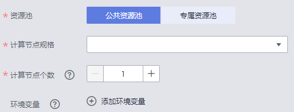
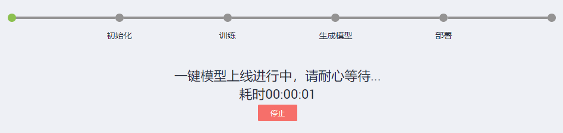

# 一键模型上线

针对已完成标注的标注作业，可以一键创建训练作业、模型导入、部署为在线服务的任务。无需多步操作，快速构建一个可用的服务。

## 背景信息

-   一键模型上线功能当前仅支持“物体检测“和“图像分类“的标注作业。
-   当前，只支持使用预置算法进行训练。针对使用常用框架或自定义镜像方式训练的任务，建议单独创建训练作业。
-   一键模型上线任务创建完成后，将在系统中自动创建对应的训练作业、将训练完成的模型导入ModelArts、并部署为在线服务。用户只需填写一次参数，无需多步操作，即可完成基于数据集的AI全流程开发。
-   关于费用：
    -   训练作业将根据您选择的资源，按需计费。训练一次计费一次，不会产生多余费用。
    -   导入模型暂时不收费。
    -   任务创建完成后，创建的在线服务将处于运行中状态。如果使用公共资源池，将一直处于计费中，请根据实际情况停止服务，避免产生费用。

-   确保您使用的OBS目录与ModelArts在同一区域。

## 创建任务

1.  登录ModelArts管理控制台，在左侧菜单栏中选择“数据管理\>数据标注“，进入“数据标注“管理页面。
2.  在标注作业列表中，选择“图像分类”或“物体检测”类型的标注作业，点击作业名称，进入“标注作业详情页”。
3.  选择“标注”页签，点击下方的“一键模型\>任务创建”，填写任务的基本信息，即此任务的“名称“和“描述“。
4.  填写“训练“相关信息，如[图1](#fig14312143118373)所示。

    创建“一键模型上线任务”时，训练相关参数与训练作业相似，仅支持选择“预置算法“进行训练。其中“预置算法“会基于您的数据集类型，默认关联出相关的“预置算法“。例如“物体检测“类型的数据集，可用的“预置算法“为“Faster\_RCNN\_ResNet\_v1\_50“；“图像分类“的数据集，其可用“预置算法“有“ResNet\_v1\_50“。“运行参数“将根据您选择的“预置算法“不同而不同，且采用其默认值。

    “训练输出位置“、“作业日志路径“、“资源池“、“类型“、“规格“、“计算节点个数“等参数，请参考[创建训练作业](https://support.huaweicloud.com/engineers-modelarts/modelarts_23_0286.html)章节中的步骤完成填写。

    **图 1**  训练相关信息  
    

5.  填写部署相关信息，如[图2](#zh-cn_topic_0197745909_fig830263311452)所示。

    选择任务部署为在线服务使用的资源，“资源池“、“计算节点规格“、“计算节点个数“、“环境变量“参数，可参见[部署为在线服务](https://support.huaweicloud.com/engineers-modelarts/modelarts_23_0060.html)章节填写参数。

    **图 2**  部署相关参数  
    

6.  设置“是否启动数据采集“。默认关闭此功能，如果需要开启此功能，请参见[采集数据](https://support.huaweicloud.com/engineers-modelarts/modelarts_23_0224.html)指导完成填写。
7.  确认您填写的信息无误后，根据界面提示完成任务创建。

    任务开始创建后，需要经过“初始化“、“训练“、“生成模型“、“部署“等过程，部署页面将呈现其任务过程，根据数据集大小不同，其耗费时间不等，请您耐心等待。

    在完成“训练“、“生成模型“、“部署“的任务后，会在界面中呈现“查看训练详情“、“查看模型详情“、“查看服务详情“的链接，您可以单击链接快速跳转至对应页面，查看详情。

    **图 3**  完成任务创建  
    

## 查看任务历史

1.  登录ModelArts管理控制台，在左侧菜单栏中选择“数据管理\>数据标注“，进入“数据标注“管理页面。
2.  在标注作业列表中，选择“图像分类”或“物体检测”类型的标注作业，点击作业名称，进入“标注作业详情页”。
3.  选择“标注”页签，点击下方的“一键模型\>任务历史”，进入“一键模型上线任务历史“页面。详细信息如[图4](#fig15339112517197)所示。

    **图 4**  历史任务详情  
    

