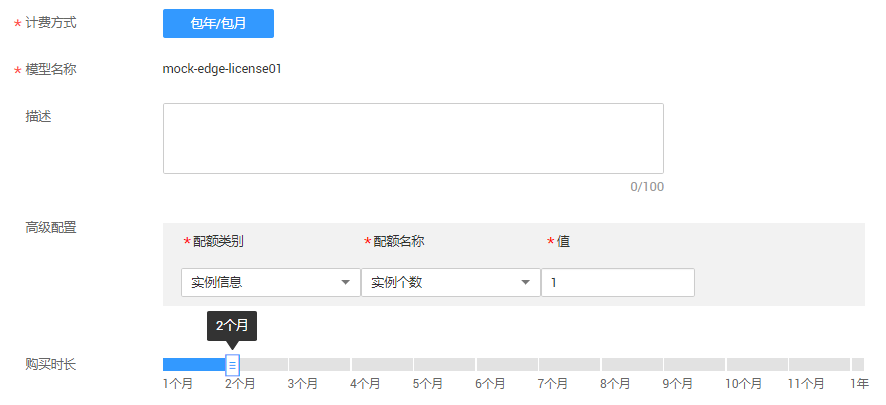
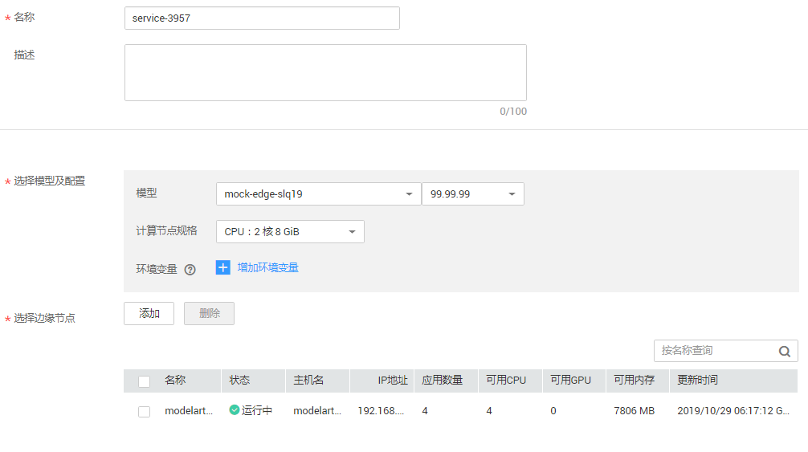

# 云服务订阅模型

针对其他AI服务开发的模型（如文字识别服务），您可以订阅模型，并在ModelArts管理控制台中，快速部署为边缘服务。

在“云服务订阅模型“中，模型具备几种状态：“正常“、“未支付“、“已过期“。

-   “正常“：表示已付费，可以使用的模型。请关注其剩余可用天数。
-   “未支付“：表示已购买未支付费用，或者未购买，此模型暂时无法部署。购买后，模型才能变为正常状态。
-   “已过期“：表示已经超过可用天数，模型暂时无法部署。续费后，模型才能变为正常状态。

## 使用限制

-   只支持部署为边缘服务。
-   当前仅支持部分服务的模型，将持续不断开放新的服务。

## 购买模型

当在其他AI服务完成模型订阅，订阅后的模型将呈现在ModelArts的“模型管理\>订阅列表“中。在完成购买操作后，模型才可用于部署。

1.  登录ModelArts管理控制台，在左侧菜单栏中选择“模型管理\>订阅列表“。
2.  在“订阅列表“页面，选择“未支付“状态的模型，单击操作列的“购买“。
3.  在“购买模型“页面，填写“高级配置“、设置“购买时长“，然后单击“下一步“。

    **图 1**  购买模型  
    

4.  在“规格确认“页面，确认信息无误后，单击“去支付“。
5.  在“支付“页面，确认需支付的“金额“，选择“支付方式“，然后单击“确认支付“。

    支付成功后，您可以通过界面提示链接，快速返回订阅模型的AI服务控制台（如人脸识别服务控制台），或者返回订阅列表页面。

## 部署模型

对于状态为“正常“的模型，可将模型部署为边缘服务。

1.  在“订阅列表“页面，选择“正常“状态的模型，单击操作列的“部署“。
2.  在部署页面，设置边缘服务的名称和描述，同时，选择模型配置以及边缘节点。

    **表 1**  参数说明

    
    <table><thead align="left"><tr id="row1129018169133"><th class="cellrowborder" valign="top" width="26.25%" id="mcps1.2.3.1.1">
参数名称

    </th>
    <th class="cellrowborder" valign="top" width="73.75%" id="mcps1.2.3.1.2">
说明

    </th>
    </tr>
    </thead>
    <tbody><tr id="row196625149129"><td class="cellrowborder" valign="top" width="26.25%" headers="mcps1.2.3.1.1 ">
“名称”

    </td>
    <td class="cellrowborder" valign="top" width="73.75%" headers="mcps1.2.3.1.2 ">
边缘服务的名称。

    </td>
    </tr>
    <tr id="row5421141218"><td class="cellrowborder" valign="top" width="26.25%" headers="mcps1.2.3.1.1 ">
“描述”

    </td>
    <td class="cellrowborder" valign="top" width="73.75%" headers="mcps1.2.3.1.2 ">
边缘服务的简要描述。

    </td>
    </tr>
    <tr id="row192909169134"><td class="cellrowborder" valign="top" width="26.25%" headers="mcps1.2.3.1.1 ">
“选择模型及配置”

    </td>
    <td class="cellrowborder" valign="top" width="73.75%" headers="mcps1.2.3.1.2 ">
此处显示在“订阅列表”中对应的模型及其版本号。

    </td>
    </tr>
    <tr id="row5291716141314"><td class="cellrowborder" valign="top" width="26.25%" headers="mcps1.2.3.1.1 ">
“计算节点规格”

    </td>
    <td class="cellrowborder" valign="top" width="73.75%" headers="mcps1.2.3.1.2 ">
支持如下几种规格。

    <ul id="ul194691155507"><li>“CPU：2核 8GiB”</li><li>“CPU：2核 8GiB GPU：1*P4”</li><li>“自定义规格”，如果选择自定义规格，可以在参数下方设置您所需的“CPU”、“Memory”、“GPU”或“Ascend”。其中，“GPU”和“Ascend”只能二选一。</li></ul>
    </td>
    </tr>
    <tr id="row8292181619132"><td class="cellrowborder" valign="top" width="26.25%" headers="mcps1.2.3.1.1 ">
“环境变量”

    </td>
    <td class="cellrowborder" valign="top" width="73.75%" headers="mcps1.2.3.1.2 ">
设置环境变量，注入环境变量到容器实例。

    </td>
    </tr>
    <tr id="row1029291621311"><td class="cellrowborder" valign="top" width="26.25%" headers="mcps1.2.3.1.1 ">
“选择边缘节点”

    </td>
    <td class="cellrowborder" valign="top" width="73.75%" headers="mcps1.2.3.1.2 ">
边缘节点是您自己的边缘计算设备，用于运行边缘应用，处理您的数据，并安全、便捷地和云端应用进行协同。

    
单击选择边缘节点“添加”，在弹出的“添加节点”对话框中选择节点。选择您已创建的节点后，单击“确定”。

    </td>
    </tr>
    </tbody>
    </table>

    **图 2**  部署为边缘服务  
    

3.  确认信息填写无误后，单击“立即创建“。

    边缘服务创建完成后，可跳转至“部署上线 \> 边缘服务“，查看服务的“状态“，当“状态“变为“运行中“时，表示服务已部署成功。如何访问边缘服务，操作指导请参见[访问边缘服务](访问边缘服务.md)。

## 续费

针对“已过期“或“正常“的模型，您都可以为其续费。

1.  在“订阅列表“页面，选择“已过期“或“正常“状态的模型，单击操作列的“续费“。
2.  在“续费“页面，选择续费时长，然后单击“去支付“。
3.  在“支付“页面，确认需支付的“金额“，选择“支付方式“，然后单击“确认付款“。

    支付成功后，您可以通过界面提示链接，快速返回订阅模型的AI服务控制台（如人脸识别服务控制台），或者返回订阅列表页面。

## 退订

针对“正常“的模型，如果您不再需要订阅此模型，可以执行退订操作。如果模型已部署至边缘服务，不支持退订操作。如果需要执行退订，请先删除使用此模型部署的边缘服务。

1.  在“订阅列表“页面，选择“正常“状态的模型，单击操作列的“退订“。
2.  在“退订资源“页面，选择退订原因，然后单击“退订“。
3.  在弹出的对话框中，确认信息无误后，单击“是“，完成退订操作。

    退订操作提交成功后，您可以通过界面提示链接，查看退订的处理进度。

