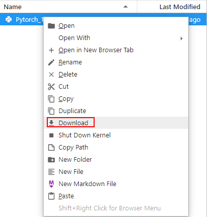

# 从JupyterLab下载文件至本地<a name="modelarts_30_0011"></a>

在JupyterLab中开发的文件，可以下载至本地。无论创建Notebook时存储位置选择默认存储或云硬盘EVS，此处的下载操作都一样。

-   100MB以内的文件，可以直接从JupyterLab中下载到本地，具体操作请参见[从JupyterLab中下载100MB以内的文件至本地](#section2092816813316)。
-   大于100MB的文件，需要先从JupyterLab上传到OBS，再通过OBS下载到本地，具体操作请参见[从JupyterLab中下载大于100MB的文件到本地](#section1343284817)。

## 从JupyterLab中下载100MB以内的文件至本地<a name="section2092816813316"></a>

在JupyterLab文件列表中，选择需要下载的文件，单击右键，在操作菜单中选择“Download“下载至本地。下载的目的路径，为您本地浏览器设置的下载目录。

**图 1**  下载文件<a name="fig115128616340"></a>  


## 从JupyterLab中下载大于100MB的文件到本地<a name="section1343284817"></a>

大于100MB的文件需要先从Notebook中上传到OBS，再从OBS下载到本地，具体操作如下：

1.  在Notebook中，新建一个“ipynb“文件，使用MoXing先将大文件从Notebook上传到OBS中，示例代码如下：

    ```
    import moxing as mox
    mox.file.copy('/home/ma-user/work/obs_file.txt', 'obs://bucket_name/obs_file.txt')
    ```

    其中“/home/ma-user/work/obs\_file.txt“为文件在Notebook中的存储路径，“obs://bucket\_name/obs\_file.txt“为该文件上传到OBS的存储路径。

2.  使用OBS或ModelArts SDK将OBS中的文件下载到本地。
    -   方式一：使用OBS进行下载

        使用OBS下载文件的操作指导：[下载文件](https://support.huaweicloud.com/qs-obs/obs_qs_0009.html)，可以将样例中的“obs\_file.txt“下载到本地。如果您的数据较多，推荐OBS Browser+下载数据或文件夹。

    -   方式二：使用ModelArts SDK进行下载
        1.  在您的本地环境[下载并安装ModelArts SDK](https://support.huaweicloud.com/sdkreference-modelarts/modelarts_04_0004.html)。
        2.  完成ModelArts SDK的[Session鉴权](https://support.huaweicloud.com/sdkreference-modelarts/modelarts_04_0123.html)。
        3.  将OBS中的文件下载到本地，详请参见[从OBS下载数据](https://support.huaweicloud.com/sdkreference-modelarts/modelarts_04_0220.html)。示例代码如下：

            ```
            from modelarts.session import Session
            session=Session(access_key='***',secret_key='***',project_id='***',region_name='***')
            session.download_data(bucket_path="/bucket_name/obs_file.txt",path="/home/user/obs_file.txt")
            ```


