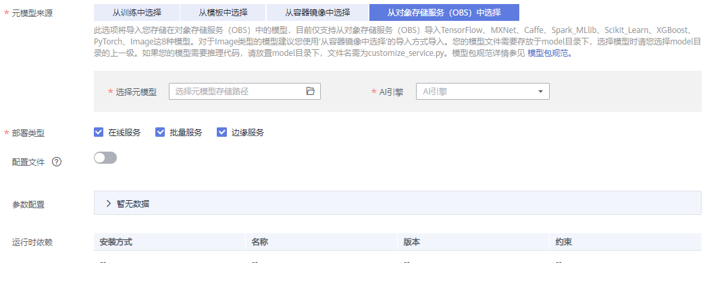

# 从OBS中选择元模型

针对使用常用框架完成模型开发和训练的场景，可以将您的模型导入至ModelArts中，进行统一管理。

## 使用前必读

-   已完成模型开发和训练，使用的AI引擎为ModelArts支持的类型和版本。ModelArts支持如下几种常用引擎及其支持的runtime范围。

    **表 1**  推理支持的常用引擎及其Runtime

    
    <table><thead align="left"><tr id="row21432031201310"><th class="cellrowborder" valign="top" width="26.97%" id="mcps1.2.4.1.1">
模型使用的引擎类型

    </th>
    <th class="cellrowborder" valign="top" width="27.279999999999998%" id="mcps1.2.4.1.2">
支持的运行环境（Runtime）

    </th>
    <th class="cellrowborder" valign="top" width="45.75%" id="mcps1.2.4.1.3">
备注

    </th>
    </tr>
    </thead>
    <tbody><tr id="row71437318132"><td class="cellrowborder" valign="top" width="26.97%" headers="mcps1.2.4.1.1 ">
TensorFlow

    </td>
    <td class="cellrowborder" valign="top" width="27.279999999999998%" headers="mcps1.2.4.1.2 ">
python3.6

    
python2.7

    
tf1.13-python2.7-gpu

    
tf1.13-python2.7-cpu

    
tf1.13-python3.6-gpu

    
tf1.13-python3.6-cpu

    </td>
    <td class="cellrowborder" valign="top" width="45.75%" headers="mcps1.2.4.1.3 ">
python2.7以及python3.6的运行环境搭载的TensorFlow版本为1.8.0。默认使用的runtime为python2.7。

    </td>
    </tr>
    <tr id="row1114312310138"><td class="cellrowborder" valign="top" width="26.97%" headers="mcps1.2.4.1.1 ">
MXNet

    </td>
    <td class="cellrowborder" valign="top" width="27.279999999999998%" headers="mcps1.2.4.1.2 ">
python3.6

    
python2.7

    </td>
    <td class="cellrowborder" valign="top" width="45.75%" headers="mcps1.2.4.1.3 ">
python2.7以及python3.6的运行环境搭载的MXNet版本为1.2.1。默认使用的runtime为python2.7。

    </td>
    </tr>
    <tr id="row16143193119135"><td class="cellrowborder" valign="top" width="26.97%" headers="mcps1.2.4.1.1 ">
Caffe

    </td>
    <td class="cellrowborder" valign="top" width="27.279999999999998%" headers="mcps1.2.4.1.2 ">
python2.7

    
python3.6

    
python2.7-gpu

    
python3.6-gpu

    
python2.7-cpu

    
python3.6-cpu

    </td>
    <td class="cellrowborder" valign="top" width="45.75%" headers="mcps1.2.4.1.3 ">
python2.7、python3.6、python2.7-gpu、python3.6-gpu、python2.7-cpu、python3.6-cpu的运行环境搭载的Caffe版本为1.0.0

    
python2.7、python3.6只能用于运行适用于CPU的模型。推荐使用python2.7-gpu、python3.6-gpu、python2.7-cpu、python3.6-cpu的Runtime。默认使用的runtime为python2.7。

    </td>
    </tr>
    <tr id="row514313161318"><td class="cellrowborder" valign="top" width="26.97%" headers="mcps1.2.4.1.1 ">
Spark_MLlib

    </td>
    <td class="cellrowborder" valign="top" width="27.279999999999998%" headers="mcps1.2.4.1.2 ">
python2.7

    
python3.6

    </td>
    <td class="cellrowborder" valign="top" width="45.75%" headers="mcps1.2.4.1.3 ">
python2.7以及python3.6的运行环境搭载的Spark_MLlib版本为2.3.2。默认使用的runtime为python2.7。

    </td>
    </tr>
    <tr id="row1143331201316"><td class="cellrowborder" valign="top" width="26.97%" headers="mcps1.2.4.1.1 ">
Scikit_Learn

    </td>
    <td class="cellrowborder" valign="top" width="27.279999999999998%" headers="mcps1.2.4.1.2 ">
python2.7

    
python3.6

    </td>
    <td class="cellrowborder" valign="top" width="45.75%" headers="mcps1.2.4.1.3 ">
python2.7以及python3.6的运行环境搭载的Scikit_Learn版本为0.18.1。默认使用的runtime为python2.7。

    </td>
    </tr>
    <tr id="row11432314131"><td class="cellrowborder" valign="top" width="26.97%" headers="mcps1.2.4.1.1 ">
XGBoost

    </td>
    <td class="cellrowborder" valign="top" width="27.279999999999998%" headers="mcps1.2.4.1.2 ">
python2.7

    
python3.6

    </td>
    <td class="cellrowborder" valign="top" width="45.75%" headers="mcps1.2.4.1.3 ">
python2.7以及python3.6的运行环境搭载的XGBoost版本为0.80。默认使用的runtime为python2.7。

    </td>
    </tr>
    <tr id="row9143331141312"><td class="cellrowborder" valign="top" width="26.97%" headers="mcps1.2.4.1.1 ">
PyTorch

    </td>
    <td class="cellrowborder" valign="top" width="27.279999999999998%" headers="mcps1.2.4.1.2 ">
python2.7

    
python3.6

    </td>
    <td class="cellrowborder" valign="top" width="45.75%" headers="mcps1.2.4.1.3 ">
python2.7以及python3.6的运行环境搭载的PyTorch版本为1.0。默认使用的runtime为python2.7。

    </td>
    </tr>
    </tbody>
    </table>

-   针对导入的模型，需符合ModelArts的模型包规范，推理代码和配置文件也需遵循ModelArts的要求，详细说明请参见[模型包规范介绍](模型包规范介绍.md)、[模型配置文件编写说明](模型配置文件编写说明.md)、[模型推理代码编写说明](模型推理代码编写说明.md)。
-   已完成训练的模型包，及其对应的推理代码和配置文件，已上传至OBS目录中。
-   确保您使用的OBS与ModelArts在同一区域。

## 导入模型操作步骤

1.  登录ModelArts管理控制台，在左侧导航栏中选择“模型管理 \> 模型“，进入模型列表页面。
2.  单击左上角的“导入“，进入“导入模型“页面。
3.  在“导入模型“页面，填写相关参数。
    1.  填写模型基本信息，详细参数说明请参见[表2](#table19428112584211)。

        **表 2**  模型基本信息参数说明

        
        <table><thead align="left"><tr id="row2042972515427"><th class="cellrowborder" valign="top" width="18.91%" id="mcps1.2.3.1.1">
参数名称

        </th>
        <th class="cellrowborder" valign="top" width="81.08999999999999%" id="mcps1.2.3.1.2">
说明

        </th>
        </tr>
        </thead>
        <tbody><tr id="row164292250428"><td class="cellrowborder" valign="top" width="18.91%" headers="mcps1.2.3.1.1 ">
名称

        </td>
        <td class="cellrowborder" valign="top" width="81.08999999999999%" headers="mcps1.2.3.1.2 ">
模型名称。支持1～64位可见字符（含中文），名称可以包含字母、中文、数字、中划线、下划线。

        </td>
        </tr>
        <tr id="row5429112564217"><td class="cellrowborder" valign="top" width="18.91%" headers="mcps1.2.3.1.1 ">
版本

        </td>
        <td class="cellrowborder" valign="top" width="81.08999999999999%" headers="mcps1.2.3.1.2 ">
设置所创建模型的版本。第一次导入时，默认为0.0.1。

        </td>
        </tr>
        <tr id="row18429132512429"><td class="cellrowborder" valign="top" width="18.91%" headers="mcps1.2.3.1.1 ">
描述

        </td>
        <td class="cellrowborder" valign="top" width="81.08999999999999%" headers="mcps1.2.3.1.2 ">
模型的简要描述。

        </td>
        </tr>
        </tbody>
        </table>

    2.  填写元模型来源及其相关参数。根据用户的不同场景，“元模型来源“的选择有4种不同方式，请参见[导入模型的4种场景](模型管理简介.md#section179419351998)。当“元模型来源“选择“从OBS中选择“时，其相关的参数配置请参见[表3](#table1631162916535)。

        针对从OBS导入的元模型，ModelArts要求根据[模型包规范](模型包规范介绍.md)，编写推理代码和配置文件，并将推理代码和配置文件放置元模型存储的“model“文件夹下。如果您选择的目录下无对应的推理代码及配置文件，将无法导入模型。

        **图 1**  从OBS中选择元模型  
        

        **表 3**  元模型来源参数说明

        
        <table><thead align="left"><tr id="row362872915531"><th class="cellrowborder" valign="top" width="18.57%" id="mcps1.2.3.1.1">
参数

        </th>
        <th class="cellrowborder" valign="top" width="81.43%" id="mcps1.2.3.1.2">
说明

        </th>
        </tr>
        </thead>
        <tbody><tr id="row862812294533"><td class="cellrowborder" valign="top" width="18.57%" headers="mcps1.2.3.1.1 ">
“选择元模型”

        </td>
        <td class="cellrowborder" valign="top" width="81.43%" headers="mcps1.2.3.1.2 ">
选择模型存储路径，此路径为训练作业中指定的“训练输出位置”。

        </td>
        </tr>
        <tr id="row1262920291539"><td class="cellrowborder" valign="top" width="18.57%" headers="mcps1.2.3.1.1 ">
“AI引擎”

        </td>
        <td class="cellrowborder" valign="top" width="81.43%" headers="mcps1.2.3.1.2 ">
根据您选择的元模型存储路径，将自动关联出对应的“AI引擎”。

        </td>
        </tr>
        <tr id="row0629229135315"><td class="cellrowborder" valign="top" width="18.57%" headers="mcps1.2.3.1.1 ">
“部署类型”

        </td>
        <td class="cellrowborder" valign="top" width="81.43%" headers="mcps1.2.3.1.2 ">
导入模型后，选择此模型支持部署服务的类型，部署上线时只支持部署为此处选择的部署类型，例如此处只选择在线服务，那您的导入后只能部署为在线服务。当前支持“在线服务”、“批量服务”和“边缘服务”。

        </td>
        </tr>
        <tr id="row10630102912539"><td class="cellrowborder" valign="top" width="18.57%" headers="mcps1.2.3.1.1 ">
“配置文件”

        </td>
        <td class="cellrowborder" valign="top" width="81.43%" headers="mcps1.2.3.1.2 ">
系统默认关联您存储在OBS中的配置文件。打开开关，您可以直接在当前界面查看、编辑或从OBS导入您的模型配置文件。

        </td>
        </tr>
        <tr id="row563010299534"><td class="cellrowborder" valign="top" width="18.57%" headers="mcps1.2.3.1.1 ">
“参数配置”

        </td>
        <td class="cellrowborder" valign="top" width="81.43%" headers="mcps1.2.3.1.2 ">
单击右侧的，查看当前模型的入参和出参。

        </td>
        </tr>
        <tr id="row3630102914534"><td class="cellrowborder" valign="top" width="18.57%" headers="mcps1.2.3.1.1 ">
“运行时依赖”

        </td>
        <td class="cellrowborder" valign="top" width="81.43%" headers="mcps1.2.3.1.2 ">
罗列选中模型对环境的依赖。例如依赖“tensorflow”，安装方式为“pip”，其版本必须为1.8.0及以上版本。

        </td>
        </tr>
        </tbody>
        </table>

    3.  设置推理规格和模型说明。
        -   “最小推理规格“：如果您的模型需要一定的规格资源才能完成推理，您可以在此配置自定义推理规格，即您的模型部署上线进行正常推理所需要的规格，后续版本部署上线时系统将会参考您填写的推理规格来分配资源，部署时可视情况修改该规格。需要注意的是此处自定义的规格，仅在部署在线服务且使用专属资源池、部署边缘这两种场景有效。
        -   “模型说明“：为了帮助其他模型开发者更好的理解及使用您的模型，建议您提供模型的说明文档。单击“增加模型说明“，设置“文档名称“及其“URL“。模型说明支持增加多条。

            **图 2**  推理规格和模型说明  
            

    4.  确认信息填写无误，单击“立即创建“，完成模型导入。

        在模型列表中，您可以查看刚导入的模型及其对应的版本。当模型状态变更为“正常“时，表示模型导入成功。在此页面，您还可以创建新版本、快速部署模型、将模型发布至市场、导出模型等操作。

## 后续操作

-   **[部署模型](模型部署简介.md)**：在“模型列表“中，单击模型名称左侧的小三角，打开此模型下的所有版本。在对应版本所在行，单击“操作“列的“部署“，在下拉框中选择部署类型，可以将模型部署上线为导入模型时所选择的部署类型。在部署服务的页面，详细参数填写请参见[模型部署简介](模型部署简介.md)的相关指导。

