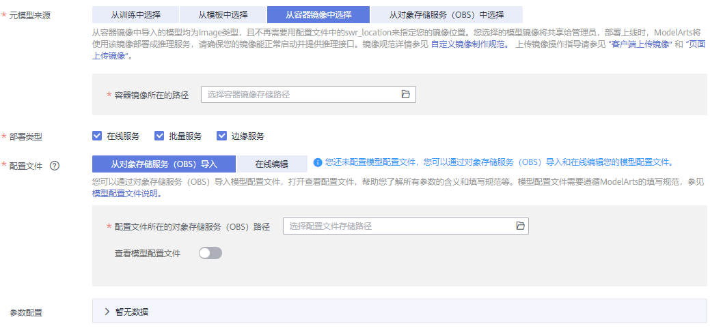
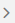

# 从容器镜像中选择元模型

针对ModelArts目前不支持的AI引擎，您可以通过自定义镜像的方式将编写的模型导入ModelArts。

## 使用前必读

-   关于自定义镜像规范和说明，请参见[使用自定义镜像导入模型](使用自定义镜像导入模型.md)。
-   针对您开发并训练完成的模型，需要提供对应的模型配置文件，此文件需遵守ModelArts的填写规范，详情请参见[模型配置文件编写说明](模型配置文件编写说明.md)。编写完成后，需将此文件上传至OBS指定目录下。
-   确保您使用的OBS目录与ModelArts在同一区域。

## 导入模型操作步骤

1.  登录ModelArts管理控制台，在左侧导航栏中选择“模型管理 \> 模型“，进入模型列表页面。
2.  单击左上角的“导入“，进入“导入模型“页面。
3.  在“导入模型“页面，填写相关参数。
    1.  填写模型基本信息，详细参数说明请参见[表1](#table19428112584211)。

        **表 1**  模型基本信息参数说明

        
        <table><thead align="left"><tr id="row2042972515427"><th class="cellrowborder" valign="top" width="18.91%" id="mcps1.2.3.1.1">
参数名称

        </th>
        <th class="cellrowborder" valign="top" width="81.08999999999999%" id="mcps1.2.3.1.2">
说明

        </th>
        </tr>
        </thead>
        <tbody><tr id="row164292250428"><td class="cellrowborder" valign="top" width="18.91%" headers="mcps1.2.3.1.1 ">
名称

        </td>
        <td class="cellrowborder" valign="top" width="81.08999999999999%" headers="mcps1.2.3.1.2 ">
模型名称。支持1～64位可见字符（含中文），名称可以包含字母、中文、数字、中划线、下划线。

        </td>
        </tr>
        <tr id="row5429112564217"><td class="cellrowborder" valign="top" width="18.91%" headers="mcps1.2.3.1.1 ">
版本

        </td>
        <td class="cellrowborder" valign="top" width="81.08999999999999%" headers="mcps1.2.3.1.2 ">
设置所创建模型的版本。第一次导入时，默认为0.0.1。

        </td>
        </tr>
        <tr id="row18429132512429"><td class="cellrowborder" valign="top" width="18.91%" headers="mcps1.2.3.1.1 ">
描述

        </td>
        <td class="cellrowborder" valign="top" width="81.08999999999999%" headers="mcps1.2.3.1.2 ">
模型的简要描述。

        </td>
        </tr>
        </tbody>
        </table>

    2.  填写元模型来源及其相关参数。根据用户的不同场景，“元模型来源“的选择有4种不同方式，请参见[导入模型的4种场景](模型管理简介.md#section179419351998)。当“元模型来源“选择“从容器镜像中选择“时，其相关的参数配置请参见[表2](#table104931647171713)。

        **图 1**  从容器镜像中选择模型  
        

        **表 2**  元模型来源参数说明

        
        <table><thead align="left"><tr id="row14487647101714"><th class="cellrowborder" valign="top" width="26.33%" id="mcps1.2.3.1.1">
参数

        </th>
        <th class="cellrowborder" valign="top" width="73.67%" id="mcps1.2.3.1.2">
说明

        </th>
        </tr>
        </thead>
        <tbody><tr id="row517284302310"><td class="cellrowborder" valign="top" width="26.33%" headers="mcps1.2.3.1.1 ">
“容器镜像所在的路径”

        </td>
        <td class="cellrowborder" valign="top" width="73.67%" headers="mcps1.2.3.1.2 ">
单击从容器镜像中导入模型的镜像，其中，模型均为Image类型，且不再需要用配置文件中的“swr_location”来指定您的镜像位置。

        
制作自定义镜像的操作指导及规范要求，请参见<a href="自定义镜像简介.md">自定义镜像简介</a>。

        
 说明： 

您选择的模型镜像将共享给管理员，请确保具备共享该镜像的权限（不支持导入其他账户共享给您的镜像），部署上线时，ModelArts将使用该镜像部署成推理服务，请确保您的镜像能正常启动并提供推理接口。

        

        </td>
        </tr>
        <tr id="row29331240162319"><td class="cellrowborder" valign="top" width="26.33%" headers="mcps1.2.3.1.1 ">
“部署类型”

        </td>
        <td class="cellrowborder" valign="top" width="73.67%" headers="mcps1.2.3.1.2 ">
导入模型后，选择此模型支持部署服务的类型，部署上线时只支持部署为此处选择的部署类型，例如此处只选择在线服务，那您的导入后只能部署为在线服务。当前支持“在线服务”、“批量服务”和“边缘服务”。

        </td>
        </tr>
        <tr id="row1475083810235"><td class="cellrowborder" valign="top" width="26.33%" headers="mcps1.2.3.1.1 ">
“配置文件”

        </td>
        <td class="cellrowborder" valign="top" width="73.67%" headers="mcps1.2.3.1.2 ">
支持“从OBS导入”或“在线编辑”的方式，配置文件需满足ModelArts编写规范，详情请参见<a href="模型包规范介绍.md">模型包规范介绍</a>。当选择“从OBS导入”时，您需要指定配置文件存储的OBS路径，且您可以打开“查看模型配置文件”右侧的开关，在线查看或编辑此配置文件。

        </td>
        </tr>
        <tr id="row16323132522313"><td class="cellrowborder" valign="top" width="26.33%" headers="mcps1.2.3.1.1 ">
“参数配置”

        </td>
        <td class="cellrowborder" valign="top" width="73.67%" headers="mcps1.2.3.1.2 ">
单击右侧的，查看当前模型的入参和出参。

        </td>
        </tr>
        </tbody>
        </table>

    3.  设置推理规格和模型说明。
        -   “最小推理规格“：如果您的模型需要一定的规格资源才能完成推理，您可以在此配置自定义推理规格，即您的模型部署上线进行正常推理所需要的规格，在后续版本部署上线时系统将会参考您填写的推理规格来分配资源，部署时可视情况修改该规格。需要注意的是此处自定义的规格，仅在部署在线服务且使用专属资源池、部署边缘这两种场景有效。
        -   “模型说明“：为了帮助其他模型开发者更好的理解及使用您的模型，建议您提供模型的说明文档。单击“增加模型说明“，设置“文档名称“及其“URL“。模型说明支持增加多条。

            **图 2**  推理规格和模型说明  
            

    4.  确认信息填写无误，单击“立即创建“，完成模型导入。

        在模型列表中，您可以查看刚导入的模型及其对应的版本。当模型状态变更为“正常“时，表示模型导入成功。在此页面，您还可以创建新版本、快速部署模型、将模型发布至市场、导出模型等操作。

## 后续操作

-   **[部署模型](模型部署简介.md)**：在“模型列表“中，单击模型名称左侧的小三角，打开此模型下的所有版本。在对应版本所在行，单击“操作“列的“部署“，在下拉框中选择部署类型，可以将模型部署上线为导入模型时所选择的部署类型。在部署服务的页面，详细参数填写请参见[模型部署简介](模型部署简介.md)的相关指导。

