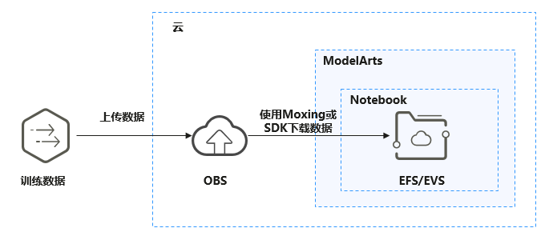
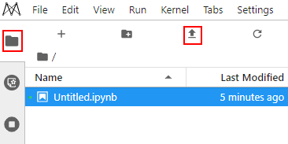

# 从本地上传文件至JupyterLab<a name="modelarts_30_0010"></a>

您可以将本地文件上传到JupyterLab的Notebook中，方便使用。

-   100MB以内的文件可以直接上传。JupyterLab文件管理页面中直接拖入，或者单击“Upload Files“快捷键上传，具体操作请参见[从本地上传100MB以内的文件到JupyterLab](#section172463910383)。
-   大于100MB的文件，考虑到文件上传的可靠性与可用性，建议通过OBS进行中转，迁移到Notebook开发容器中，在JupyterLab内直接上传时会提示受限。

    建议用户将大文件打包压缩，先上传到OBS桶中，然后再从OBS桶下载到Notebook中。从OBS桶下载文件到Notebook中走的是内部高速网络，下载速度很有保证。具体操作请参见[从本地上传大于100MB的文件到JupyterLab](#section1176916016110)。

    **图 1**  数据通过OBS中转上传到Notebook<a name="fig15668759124612"></a>  
    


## 从本地上传100MB以内的文件到JupyterLab<a name="section172463910383"></a>

进入JupyterLab页面后，您可以单击左上角“Upload Files“图标，将本地的代码文件上传至JupyterLab调试运行。

此功能上传的文件大小只有100MB，如果您的文件大小超过限制，建议使用其他方式上传，详细请参见[从本地上传大于100MB的文件到JupyterLab](#section1176916016110)。

**图 2**  上传文件<a name="fig162661614164017"></a>  


## 从本地上传大于100MB的文件到JupyterLab<a name="section1176916016110"></a>

大于100MB的文件建议通过OBS进行中转，需要先从本地上传到OBS，再从OBS下载到Notebook，具体操作如下：

1.  从本地上传文件至OBS。具体操作请参见[上传文件至OBS桶](https://support.huaweicloud.com/qs-obs/obs_qs_0008.html)。
2.  将OBS中的文件下载到Notebook，可以通过在Notebook中运行代码的方式完成数据下载，具体方式有2种，ModelArts的SDK接口或者调用Moxing接口。
    -   方法一：使用ModelArts SDK的[从OBS下载数据](https://support.huaweicloud.com/sdkreference-modelarts/modelarts_04_0220.html)接口将OBS中的文件下载到Notebook后进行操作。

        > **说明：** 
        >当单个文件大小超过5GB时，无法使用此方式上传。推荐使用MoXing接口上传大文件。

        示例代码：

        ```
        from modelarts.session import Session
        session = Session()
        session.download_data(bucket_path="/bucket-name/dir1/sdk.txt", path="/home/user/sdk/obs.txt")
        ```

    -   方法二：使用[Moxing操作OBS文件](https://support.huaweicloud.com/moxing-devg-modelarts/modelarts_11_0005.html)将OBS中的文件同步到Notebook后进行操作。

        读取一个OBS文件。例如读取“obs://bucket\_name/obs\_file.txt“文件内容，返回string（字符串类型）。

        ```
        file_str = mox.file.read('obs://bucket_name/obs_file.txt')
        ```

        也可以使用打开文件对象并读取的方式来实现，两者是等价的。

        ```
        with mox.file.File('obs://bucket_name/obs_file.txt', 'r') as f:
          file_str = f.read()
        ```


