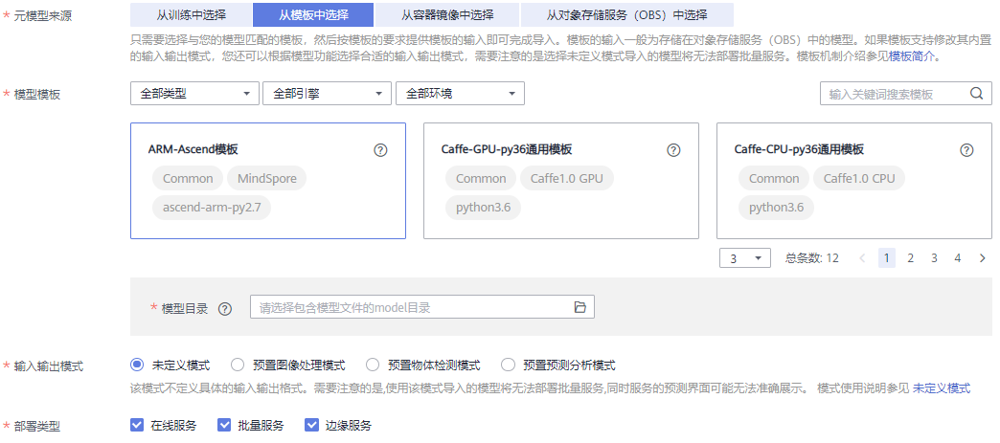
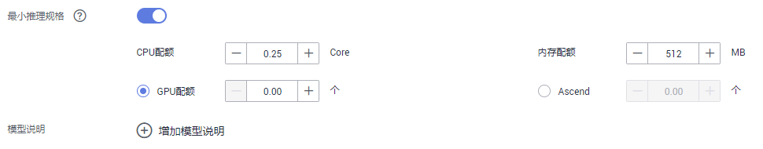

# 从模板中选择元模型

相同功能的模型配置信息重复率高，将相同功能的配置整合成一个通用的模板，通过使用该模板，可以方便快捷的导入模型，而不用编写config.json配置文件。

## 背景信息

-   由于相同功能的模型配置信息重复率高，ModelArts将相同功能的配置整合成一个通用的模板，用户通过使用该模板，可以方便快捷的导入模型。模板的详细说明请参见[模型模板简介](模型模板简介.md)。
-   目前支持的模板请参见[支持的模板](模型模板简介.md#section44801025155417)，各模板相应的输入输出模式说明，请参见[支持的输入输出模式](模型模板简介.md#section737759781)。
-   确保您已按照相应模板的模型包规范要求将模型上传至OBS。
-   确保您使用的OBS与ModelArts在同一区域。
-   导入和管理模型是免费的，不会产生费用。

## 导入模型操作步骤

1.  登录ModelArts管理控制台，在左侧导航栏中选择“模型管理 \> 模型“，进入模型列表页面。
2.  单击左上角的“导入“，进入“导入模型“页面。
3.  在“导入模型“页面，填写相关参数。
    1.  填写模型基本信息，详细参数说明请参见[表1](#table83985217130)。

        **表 1**  模型基本信息参数说明

        
        <table><thead align="left"><tr id="row173971621121316"><th class="cellrowborder" valign="top" width="18.91%" id="mcps1.2.3.1.1">
参数名称

        </th>
        <th class="cellrowborder" valign="top" width="81.08999999999999%" id="mcps1.2.3.1.2">
说明

        </th>
        </tr>
        </thead>
        <tbody><tr id="row153971121191316"><td class="cellrowborder" valign="top" width="18.91%" headers="mcps1.2.3.1.1 ">
名称

        </td>
        <td class="cellrowborder" valign="top" width="81.08999999999999%" headers="mcps1.2.3.1.2 ">
模型名称。支持1～64位可见字符（含中文），名称可以包含字母、中文、数字、中划线、下划线。

        </td>
        </tr>
        <tr id="row939882115139"><td class="cellrowborder" valign="top" width="18.91%" headers="mcps1.2.3.1.1 ">
版本

        </td>
        <td class="cellrowborder" valign="top" width="81.08999999999999%" headers="mcps1.2.3.1.2 ">
设置所创建模型的版本。第一次导入时，默认为0.0.1。

        </td>
        </tr>
        <tr id="row166370427135"><td class="cellrowborder" valign="top" width="18.91%" headers="mcps1.2.3.1.1 ">
标签

        </td>
        <td class="cellrowborder" valign="top" width="81.08999999999999%" headers="mcps1.2.3.1.2 ">
模型标签，最多支持5个。

        </td>
        </tr>
        <tr id="row1039815216136"><td class="cellrowborder" valign="top" width="18.91%" headers="mcps1.2.3.1.1 ">
描述

        </td>
        <td class="cellrowborder" valign="top" width="81.08999999999999%" headers="mcps1.2.3.1.2 ">
模型的简要描述。

        </td>
        </tr>
        </tbody>
        </table>

    2.  填写元模型来源及其相关参数。根据用户的不同场景，“元模型来源“的选择有多种不同方式，请参见[导入模型的几种场景](模型管理简介.md#section179419351998)。当“元模型来源“选择“从模板中选择“时，其相关的参数配置请参见[表2](#table104931647171713)。

        **图 1**  从模板中选择元模型  
        

        **表 2**  元模型来源参数说明

        
        <table><thead align="left"><tr id="row14487647101714"><th class="cellrowborder" valign="top" width="18.57%" id="mcps1.2.3.1.1">
参数

        </th>
        <th class="cellrowborder" valign="top" width="81.43%" id="mcps1.2.3.1.2">
说明

        </th>
        </tr>
        </thead>
        <tbody><tr id="row6565319150"><td class="cellrowborder" valign="top" width="18.57%" headers="mcps1.2.3.1.1 ">
“模型模板”

        </td>
        <td class="cellrowborder" valign="top" width="81.43%" headers="mcps1.2.3.1.2 ">
从已有的ModelArts模板列表中选择。例如，“TensorFlow图像分类模板”。

        
ModelArts还提供“类型”、“引擎”、“环境”三个筛选条件，帮助您更快找到想要的模板。如果这个三个筛选条件不能满足您的要求，可以使用关键词搜索，找到目标模板。支持的模板请参见<a href="模型模板简介.md#section44801025155417">支持的模板</a>。

        </td>
        </tr>
        <tr id="row104438282153"><td class="cellrowborder" valign="top" width="18.57%" headers="mcps1.2.3.1.1 ">
“模型目录”

        </td>
        <td class="cellrowborder" valign="top" width="81.43%" headers="mcps1.2.3.1.2 ">
指定模型存储的OBS路径。请根据您选择的“模型模板”，按照模板的模型输入要求，选择对应的模型存储的OBS路径。

        
 说明： 
<ul id="ul10345126135312"><li>选择加密桶或者加密文件，会导入失败。</li><li>当训练作业执行多次时，将基于V001、V002等规则生成不同的版本目录，且生成的模型将存储在不同版本目录下的model文件夹。此处选择模型文件时，需指定对应版本目录下的model文件夹。</li></ul>
        

        </td>
        </tr>
        <tr id="row51940263155"><td class="cellrowborder" valign="top" width="18.57%" headers="mcps1.2.3.1.1 ">
“输入输出模式”

        </td>
        <td class="cellrowborder" valign="top" width="81.43%" headers="mcps1.2.3.1.2 ">
如果您选择的模板允许覆盖其中的默认输入输出模式，您可以根据模型功能或业务场景在“输入输出模式”中，选择相应的输入输出模式。“输入输出模式”是对“config.json”中API（apis）的抽象，描述模型对外提供推理的接口。一个“输入输出模式”描述一个或多个API接口，每个模板对应于一个“输入输出模式”。

        
例如，“TensorFlow图像分类模板”，其支持的“输入输出模式”为“预置图像处理模式”，但该模板不允许修改其中的输入输出模式，所以您在页面上只能看到模板默认的输入输出模式，而不能选择其他模式。

        
支持的输入输出模式请参见<a href="模型模板简介.md#section737759781">支持的输入输出模式</a>。

        </td>
        </tr>
        <tr id="row777492321515"><td class="cellrowborder" valign="top" width="18.57%" headers="mcps1.2.3.1.1 ">
“部署类型”

        </td>
        <td class="cellrowborder" valign="top" width="81.43%" headers="mcps1.2.3.1.2 ">
导入模型后，选择此模型支持部署服务的类型，部署上线时只支持部署为此处选择的部署类型，例如此处只选择在线服务导入后只能部署为在线服务。当前支持“在线服务”、“批量服务”和“边缘服务”。

        </td>
        </tr>
        </tbody>
        </table>

    3.  设置推理规格和模型说明。

        -   “最小推理规格“：如果模型需要一定的规格资源才能完成推理，可以在此配置自定义推理规格，即您的模型部署上线进行正常推理所需要的规格，在后续版本部署上线时系统将会参考您填写的推理规格来分配资源，部署时可视情况修改该规格。需要注意的是此处自定义的规格，仅在部署在线服务且使用专属资源池、部署边缘场景有效。
        -   “模型说明“：为了帮助其他模型开发者更好的理解及使用您的模型，建议您提供模型的说明文档。单击“增加模型说明“，设置“文档名称“及其“URL“。模型说明支持增加3条。

        **图 2**  设置推理规格和模型说明  
        

    4.  确认信息填写无误，单击“立即创建“，完成模型导入。

        在模型列表中，您可以查看刚导入的模型及其对应的版本。当模型状态变更为“正常“时，表示模型导入成功。在此页面，您还可以创建新版本、快速部署模型、发布模型等操作。

## 后续操作

-   **[部署模型](模型部署简介.md)**：在“模型列表“中，单击模型名称左侧的小三角，打开此模型下的所有版本。在对应版本所在行，单击“操作“列的“部署“，在下拉框中选择部署类型，可以将模型部署上线为导入模型时所选择的部署类型。在部署服务的页面，详细参数填写请参见[模型部署简介](模型部署简介.md)的相关指导。

