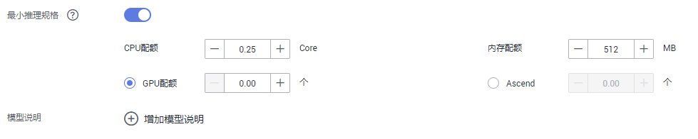

# 从训练中选择元模型

在ModelArts中创建训练作业，并完成模型训练，在得到满意的模型后，可以将训练后得到的模型导入至模型管理，方便统一管理，同时支持将模型快速部署上线为服务。

## 背景信息

-   如果使用ModelArts训练作业生成的模型，请确保训练作业已运行成功，且模型已存储至对应OBS目录下。
-   针对使用订阅算法的训练作业，无需推理代码和配置文件，其生成的模型可直接导入ModelArts。
-   针对使用常用框架或自定义镜像创建的训练作业，需根据[模型包规范介绍](模型包规范介绍.md)，将推理代码和配置文件上传至模型的存储目录中。
-   确保您使用的OBS目录与ModelArts在同一区域。

## 导入模型操作步骤

1.  登录ModelArts管理控制台，在左侧导航栏中选择“模型管理 \> 模型“，进入模型列表页面。
2.  单击左上角的“导入“，进入“导入模型“页面。
3.  在“导入模型“页面，填写相关参数。
    1.  填写模型基本信息，详细参数说明请参见[表1](#table19428112584211)。

        **表 1**  模型基本信息参数说明

        
        <table><thead align="left"><tr id="row2042972515427"><th class="cellrowborder" valign="top" width="18.91%" id="mcps1.2.3.1.1">
参数名称

        </th>
        <th class="cellrowborder" valign="top" width="81.08999999999999%" id="mcps1.2.3.1.2">
说明

        </th>
        </tr>
        </thead>
        <tbody><tr id="row164292250428"><td class="cellrowborder" valign="top" width="18.91%" headers="mcps1.2.3.1.1 ">
名称

        </td>
        <td class="cellrowborder" valign="top" width="81.08999999999999%" headers="mcps1.2.3.1.2 ">
模型名称。支持1～64位可见字符（含中文），名称可以包含字母、中文、数字、中划线、下划线。

        </td>
        </tr>
        <tr id="row5429112564217"><td class="cellrowborder" valign="top" width="18.91%" headers="mcps1.2.3.1.1 ">
版本

        </td>
        <td class="cellrowborder" valign="top" width="81.08999999999999%" headers="mcps1.2.3.1.2 ">
设置所创建模型的版本。第一次导入时，默认为0.0.1。

        </td>
        </tr>
        <tr id="row1427842211915"><td class="cellrowborder" valign="top" width="18.91%" headers="mcps1.2.3.1.1 ">
标签

        </td>
        <td class="cellrowborder" valign="top" width="81.08999999999999%" headers="mcps1.2.3.1.2 ">
模型标签，最多支持5个。

        </td>
        </tr>
        <tr id="row18429132512429"><td class="cellrowborder" valign="top" width="18.91%" headers="mcps1.2.3.1.1 ">
描述

        </td>
        <td class="cellrowborder" valign="top" width="81.08999999999999%" headers="mcps1.2.3.1.2 ">
模型的简要描述。

        </td>
        </tr>
        </tbody>
        </table>

    2.  填写元模型来源及其相关参数。根据用户的不同场景，“元模型来源“的选择有4种不同方式，请参见[导入模型的几种场景](模型管理简介.md#section179419351998)。当“元模型来源“选择“从训练中选择“时，其相关的参数配置请参见[表2](#table104931647171713)。当前ModelArts同时支持旧版训练和新版训练，请根据实际情况选择。

        **图 1**  从训练中选择元模型  
        

        **表 2**  元模型来源参数说明

        
        <table><thead align="left"><tr id="row14487647101714"><th class="cellrowborder" valign="top" width="18.57%" id="mcps1.2.3.1.1">
参数

        </th>
        <th class="cellrowborder" valign="top" width="81.43%" id="mcps1.2.3.1.2">
说明

        </th>
        </tr>
        </thead>
        <tbody><tr id="row6402118103411"><td class="cellrowborder" valign="top" width="18.57%" headers="mcps1.2.3.1.1 ">
“元模型来源”

        </td>
        <td class="cellrowborder" valign="top" width="81.43%" headers="mcps1.2.3.1.2 ">
选择“从训练中选择&gt;训练作业”或者“从训练中选择&gt;训练作业（New）”。

        
在“选择训练作业”右侧下拉框中选择当前帐号下已完成运行的训练作业及其“版本”。

        </td>
        </tr>
        <tr id="row341142193516"><td class="cellrowborder" valign="top" width="18.57%" headers="mcps1.2.3.1.1 ">
“部署类型”

        </td>
        <td class="cellrowborder" valign="top" width="81.43%" headers="mcps1.2.3.1.2 ">
导入模型后，选择此模型支持部署服务的类型，部署上线时只支持部署为此处选择的部署类型，例如此处只选择在线服务，那您导入后只能部署为在线服务。当前支持“在线服务”、“批量服务”和“边缘服务”。

        </td>
        </tr>
        <tr id="row144110213519"><td class="cellrowborder" valign="top" width="18.57%" headers="mcps1.2.3.1.1 ">
“推理代码”

        </td>
        <td class="cellrowborder" valign="top" width="81.43%" headers="mcps1.2.3.1.2 ">
显示模型推理代码URL，您可以直接复制此URL使用。

        </td>
        </tr>
        <tr id="row1295920816356"><td class="cellrowborder" valign="top" width="18.57%" headers="mcps1.2.3.1.1 ">
“参数配置”

        </td>
        <td class="cellrowborder" valign="top" width="81.43%" headers="mcps1.2.3.1.2 ">
单击右侧的，查看当前模型的入参和出参。

        </td>
        </tr>
        <tr id="row4583151118358"><td class="cellrowborder" valign="top" width="18.57%" headers="mcps1.2.3.1.1 ">
“运行时依赖”

        </td>
        <td class="cellrowborder" valign="top" width="81.43%" headers="mcps1.2.3.1.2 ">
罗列选中模型对环境的依赖。例如依赖“tensorflow”，安装方式为“pip”，其版本必须为1.8.0及以上版本。

        </td>
        </tr>
        </tbody>
        </table>

    3.  设置推理规格和模型说明。

        -   “最小推理规格“：如果您的模型需要一定的规格资源才能完成推理，您可以在此配置自定义推理规格，即您的模型部署上线进行正常推理所需要的规格。在后续版本部署上线时系统将会参考您填写的推理规格来分配资源，部署时您也可视情况修改该规格。需要注意的是此处自定义的规格，仅在部署边缘服务或者使用专属资源池部署在线服务场景有效。
        -   “模型说明“：为了帮助其他模型开发者更好的理解及使用您的模型，建议您提供模型的说明文档。单击“增加模型说明“，设置“文档名称“及其“URL“。模型说明最多支持3条。

        **图 2**  推理规格和模型说明  
        

    4.  确认信息填写无误，单击“立即创建“，完成模型导入。

        在模型列表中，您可以查看刚导入的模型及其对应的版本。当模型状态变更为“正常“时，表示模型导入成功。在此页面，您还可以创建新版本、快速部署模型、发布模型等操作。

## 后续操作

-   **[部署模型](模型部署简介.md)**：在“模型列表“中，单击模型名称左侧的小三角，打开此模型下的所有版本。在对应版本所在行，单击“操作“列的“部署“，在下拉框中选择部署类型，可以将模型部署上线为导入模型时所选择的部署类型。在部署服务的页面，详细参数填写请参见[模型部署简介](模型部署简介.md)的相关指导。

