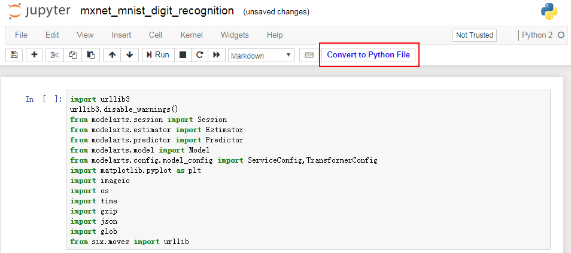
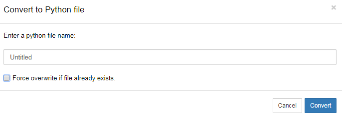

# 使用Convert to Python File功能

代码开发完成后，还支持将您输入的代码保存为“.py“文件，用于ModelArts训练作业的启动文件。

1.  在Notebook列表中，创建并打开一个Notebook，或者直接打开已有的Notebook。
2.  在Jupyter页面中，单击“New“，然后在列表下选择所需的AI引擎进入代码开发界面。
3.  在开发界面完成代码编写后，单击左上角的保存按钮。然后单击“Convert to Python File“将当前的“ipynb“转化为“python“文件，此功能可直接将您输入的代码保存为“.py“文件到工作目录。

    生成的“.py“文件可用于ModelArts训练作业的启动文件。

    **图 1**  Convert to Python File  
    

4.  在弹出的对话框中，根据实际情况填写文件名称，然后勾选或去勾选“Force overwrite if file already exists.“，默认为不勾选，表示当目录下存在相同名称文件时，不会执行覆盖操作。然后单击“Convert“完成操作。

    **图 2**  设置并保存  
    

