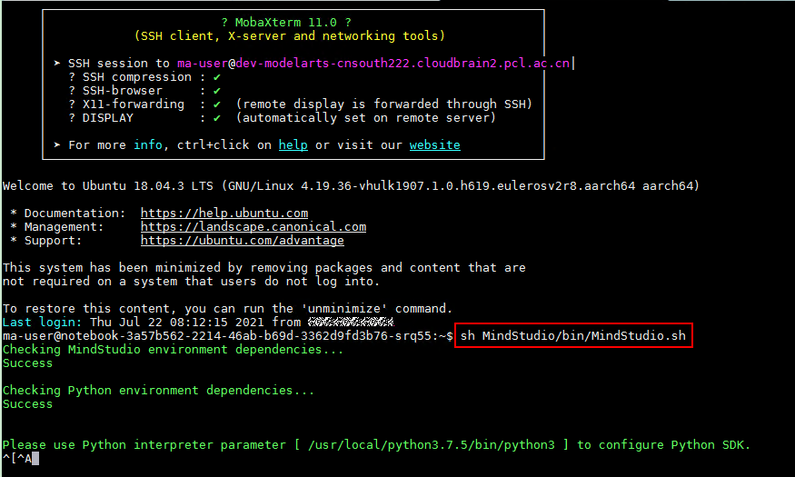

# 使用MindStudio开发Ascend算子<a name="modelarts_30_0018"></a>

## 背景介绍<a name="zh-cn_topic_0000001130028678_section1771417567435"></a>

MindStudio是一套基于IntelliJ框架的开发工具链平台，提供了应用开发、调试、模型转换功能，同时还提供了网络移植、优化和分析功能，为用户开发应用程序带来了极大的便利。

MindStudio提供了基于TBE和AI CPU的算子编程开发的集成开发环境，让不同平台下的算子移植更加便捷，适配昇腾AI处理器的速度更快。

ModelArts集成了基于MindStudio镜像的Notebook实例，方便用户通过ModelArts平台使用MindStudio镜像进行算子开发。

想了解更多关于MindStudio相关内容，请参见[MindStudio资料](https://support.huaweicloud.com/mindstudio301/)。

## 前提条件<a name="zh-cn_topic_0000001130028678_section7543105425315"></a>

1.  已经创建基于MindStudio引擎的Notebook实例，并设置允许远程访问的白名单IP地址。且该Notebook实例状态必须为“运行中“。具体操作参考[创建Notebook实例](创建Notebook实例.md)。

    **图 1**  创建基于MindStudio引擎的Notebook实例<a name="zh-cn_topic_0000001130028678_fig14832172313499"></a>  
    

2.  在Notebook实例详情页面获取开发环境IP地址（例如：dev-modelarts-cnnorth4.huaweicloud.com）和端口号。

    **图 2**  Notebook实例详情页面<a name="zh-cn_topic_0000001130028678_fig13821115753210"></a>  
    

3.  准备好密钥对。

    密钥对在用户第一次创建时，自动下载，之后使用相同的密钥时不会再有下载界面（用户一定要保存好），或者每次都使用新的密钥对。

    创建新的密钥对操作入口在创建Notebook实例页面中可以找到，如[图1](#zh-cn_topic_0000001130028678_fig14832172313499)所示。


## 在本地使用MobaXterm连接并打开MindStudio环境<a name="zh-cn_topic_0000001130028678_section183141553131416"></a>

在本地使用MobaXterm远程连接MindStudio开发环境。

1.  下载并安装MobaXterm软件，下载地址[MobaXterm](https://mobaxterm.mobatek.net/download.html)。对MobaXterm软件版本不做要求。
2.  打开MobaXterm，单击“Sessions “，在Session settings窗口设置SSH连接，单击“OK“，连接到Notebook实例环境中。

    **图 3**  在MobaXterm中设置SSH连接<a name="zh-cn_topic_0000001130028678_fig15001156113614"></a>  
    

    -   Remote host：云上Notebook实例的IP地址，即在Notebook实例详情页获取的地址。例如：dev-modelarts-cnnorth4.huaweicloud.com
    -   Port：云上Notebook实例的端口，即在Notebook实例详情页获取的端口号。
    -   Specify username：固定为ma-user
    -   Use private key：在创建Notebook实例时创建并保存的密钥对文件。

    > **说明：** 
    >如果使用MobaXterm远程连接Notebook失败，有可能是Notebook状态不是在“运行中”，或者允许远程访问的IP地址配置问题。

3.  在MobaXterm中连接到Notebook实例后，执行如下命令打开MindStudio，弹出UI界面即为打开MindStudio开发环境镜像成功。

    ```
    sh MindStudio/bin/MindStudio.sh
    ```

    **图 4**  连接到Notebook实例<a name="zh-cn_topic_0000001130028678_fig17377191414515"></a>  
    

    **图 5**  MindStudio UI界面<a name="zh-cn_topic_0000001130028678_fig686234172218"></a>  
    

4.  在[图5](#zh-cn_topic_0000001130028678_fig686234172218)的窗口中保持默认配置，单击“OK“，进入下一步。选择“Ascend Toolkit Path“为“/home/ma-user/Ascend/ascend-toolkit/3.3.0“，单击“Finish“。

    **图 6**  选择Ascend Toolkit Path<a name="zh-cn_topic_0000001130028678_fig767702923113"></a>  
    

5.  进入用户体验计划页面，勾选“Yes, I am willing to participate the User Experience Improvement Program“，单击“Agree“。
6.  进入MindStudio工程创建页面，单击新建工程，创建一个新工程。

    **图 7**  MindStudio工程创建页面<a name="zh-cn_topic_0000001130028678_fig106432044111012"></a>  
    

7.  在创建Ascend Operator工程页面，选择工程存放路径“/home/ma-user/work“目录。

    **图 8**  创建Ascend Operator工程<a name="zh-cn_topic_0000001130028678_fig36007254126"></a>  
    

    > **注意：** 
    >创建工程时，建议选择“/home/ma-user/work“目录存放工程文件。
    >“/home/ma-user/work“目录为持久化目录，Notebook实例停止后该目录下的内容不会丢失。

8.  单击Next，进入算子信息配置界面，参考[创建算子工程](https://support.huaweicloud.com/usermanual-mindstudio301/atlasms_02_0146.html)，完成算子信息配置。

    **图 9**  算子信息配置<a name="fig1773543622310"></a>  
    

9.  单击“Finish“，完成算子工程创建。
10. 算子开发之前，开发者需要参考[设置Python库](https://support.huaweicloud.com/usermanual-mindstudio301/atlasms_02_0147.html)章节设置算子工程依赖Python库。

    创建MindStudio算子更多操作介绍，请参见[MindStudio官方资料](https://support.huaweicloud.com/usermanual-mindstudio301/atlasms_02_0138.html)。


## 停止Notebook实例前备份文件<a name="zh-cn_topic_0000001130028678_section1019522941517"></a>

Notebook实例停止时，后端对应的容器环境会被删除，只有“/home/ma-user/work“目录下的内容会持久化保存，其他目录下的修改都会丢失。

**备份方法**

可以在停止Notebook实例前手工拷贝文件到/home/ma-user/work目录下。

需要拷贝的目录内容包括：

1.  /home/ma-user/ AscendProjects目录下的自建工程
2.  /home/ma-user/modelzoo/目录下的模型转换后的om文件、配置文件、评估报告
3.  /home/ma-user/.mindstudio目录下的ssh配置
4.  其他用户自己修改的内容

当Notebook实例再次启动时，用户将手工备份的目录内容拷贝回原始目录后即可正常继续使用。

