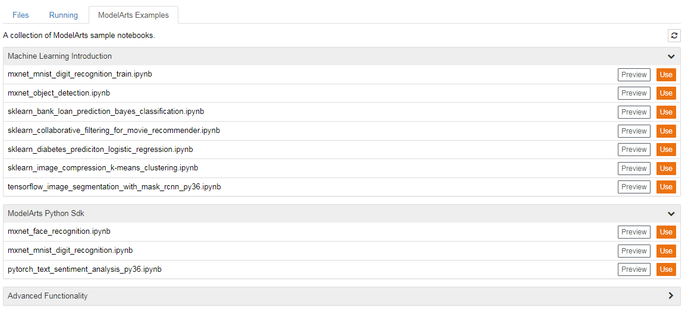

# 使用ModelArts示例

ModelArts提供了Notebook示例，方便初学者通过示例，快速了解如何使用ModelArts Notebook。

> **说明：**   
>Jupyter Notebook示例使用nbexamples扩展，有关nbexamples扩展的更多信息，请参阅[https://github.com/danielballan/nbexamples](https://github.com/danielballan/nbexamples)。  

## 预览ModelArts Examples

1.  在Notebook列表中，创建并打开一个Notebook，或者直接打开已有的Notebook。
2.  在Jupyter页面中，单击“ModelArts Examples“页签，此页面罗列了“Machine Learning Introduction“和“ModelArts Python Sdk“的示例。ModelArts提供的所有示例说明如[表1](#table718212719302)和[表2](#table8618152103019)所示。每个示例提供了详细的说明，您可以单击右侧的“Preview“预览示例。

    **图 1**  进入ModelArts Examples  
    

    **表 1**  Machine learning introduction示例

    
    <table><thead align="left"><tr id="row122957773019"><th class="cellrowborder" valign="top" width="36.78%" id="mcps1.2.3.1.1">
<strong id="b11605161314319">示例名称</strong>

    </th>
    <th class="cellrowborder" valign="top" width="63.22%" id="mcps1.2.3.1.2">
<strong id="b12950773019">描述</strong>

    </th>
    </tr>
    </thead>
    <tbody><tr id="row1629557183020"><td class="cellrowborder" valign="top" width="36.78%" headers="mcps1.2.3.1.1 ">
mxnet_mnist_digit_recognition_train.ipynb

    </td>
    <td class="cellrowborder" valign="top" width="63.22%" headers="mcps1.2.3.1.2 ">
本示例介绍使用MXNet实现MNIST数据集的手写数字图像识别应用，主要是完成训练脚本的开发。

    </td>
    </tr>
    <tr id="row102959715304"><td class="cellrowborder" valign="top" width="36.78%" headers="mcps1.2.3.1.1 ">
mxnet_object_detection.ipynb

    </td>
    <td class="cellrowborder" valign="top" width="63.22%" headers="mcps1.2.3.1.2 ">
本示例基于MXNet引擎搭建目标检测yolo-v3模型， 将其应用到华为云吉祥物"云宝"的检测中。

    </td>
    </tr>
    <tr id="row192968793017"><td class="cellrowborder" valign="top" width="36.78%" headers="mcps1.2.3.1.1 ">
sklearn_bank_loan_prediction_bayes_classification.ipynb

    </td>
    <td class="cellrowborder" valign="top" width="63.22%" headers="mcps1.2.3.1.2 ">
本示例基于XGBoost-Sklearn的Naive Bayes（朴素贝叶斯）分类器，预测客户是否有银行贷款的意向。

    </td>
    </tr>
    <tr id="row1296117163014"><td class="cellrowborder" valign="top" width="36.78%" headers="mcps1.2.3.1.1 ">
sklearn_collaborative_filtering_for_movie_recommender.ipynb

    </td>
    <td class="cellrowborder" valign="top" width="63.22%" headers="mcps1.2.3.1.2 ">
本示例基于XGBoost-Sklearn引擎计算相似矩阵，结合影评数据集实现电影推荐系统。

    </td>
    </tr>
    <tr id="row20296575305"><td class="cellrowborder" valign="top" width="36.78%" headers="mcps1.2.3.1.1 ">
sklearn_diabetes_prediciton_logistic_regression.ipynb

    </td>
    <td class="cellrowborder" valign="top" width="63.22%" headers="mcps1.2.3.1.2 ">
本示例基于XGBoost-Sklearn逻辑回归（Logistic Regression）, 预测人们是否患糖尿病。

    </td>
    </tr>
    <tr id="row1829613723015"><td class="cellrowborder" valign="top" width="36.78%" headers="mcps1.2.3.1.1 ">
sklearn_image_compression_k-means_clustering.ipynb

    </td>
    <td class="cellrowborder" valign="top" width="63.22%" headers="mcps1.2.3.1.2 ">
本示例基于XGBoost-Sklearn聚类算法k-means实现对图像的压缩。

    </td>
    </tr>
    <tr id="row92965763017"><td class="cellrowborder" valign="top" width="36.78%" headers="mcps1.2.3.1.1 ">
tensorflow_image_segmentation_with_mask_rcnn_py36.ipynb

    </td>
    <td class="cellrowborder" valign="top" width="63.22%" headers="mcps1.2.3.1.2 ">
本示例基于TensorFlow实现对Mask-RCNN模型进行训练，实现图像分割。

    </td>
    </tr>
    </tbody>
    </table>

    **表 2**  ModelArts Python SDK示例

    
    <table><thead align="left"><tr id="row8702185213015"><th class="cellrowborder" valign="top" width="36.75%" id="mcps1.2.3.1.1">
<strong id="b207231823116">示例名称</strong>

    </th>
    <th class="cellrowborder" valign="top" width="63.24999999999999%" id="mcps1.2.3.1.2">
<strong id="b3702175218309">描述</strong>

    </th>
    </tr>
    </thead>
    <tbody><tr id="row1170245218304"><td class="cellrowborder" valign="top" width="36.75%" headers="mcps1.2.3.1.1 ">
mxnet_face_recognition.ipynb

    </td>
    <td class="cellrowborder" valign="top" width="63.24999999999999%" headers="mcps1.2.3.1.2 ">
本示例基于Modelarts SDK功能，利用MXNet引擎，端到端实现人脸识别项目的一站式开发。

    </td>
    </tr>
    <tr id="row170275253020"><td class="cellrowborder" valign="top" width="36.75%" headers="mcps1.2.3.1.1 ">
mxnet_mnist_digit_recognition.ipynb

    </td>
    <td class="cellrowborder" valign="top" width="63.24999999999999%" headers="mcps1.2.3.1.2 ">
本示例基于Modelarts SDK功能，利用MXNet引擎，端到端实现手写数字识别项目的一站式开发，包括数据管理、提交训练作业、导入模型、部署在线服务和在线预测。

    </td>
    </tr>
    <tr id="row170375219304"><td class="cellrowborder" valign="top" width="36.75%" headers="mcps1.2.3.1.1 ">
obs_management_with_sdk.ipynb

    </td>
    <td class="cellrowborder" valign="top" width="63.24999999999999%" headers="mcps1.2.3.1.2 ">
本示例基于Modelarts SDK的OBS管理功能，展示SDK对OBS的增删改等操作。

    </td>
    </tr>
    <tr id="row177031052103014"><td class="cellrowborder" valign="top" width="36.75%" headers="mcps1.2.3.1.1 ">
pytorch_text_sentiment_analysis_py36.ipynb

    </td>
    <td class="cellrowborder" valign="top" width="63.24999999999999%" headers="mcps1.2.3.1.2 ">
本示例基于PyTorch引擎训练模型，实现文本情感分析。

    </td>
    </tr>
    </tbody>
    </table>

## 使用ModelArts Examples

在Jupyter界面中使用或查看Notebook示例。

1.  在Notebook列表中，创建并打开一个Notebook，或者直接打开已有的Notebook。
2.  在Jupyter页面中，单击“ModelArts Examples“页签，选择需要使用的示例，单击示例右侧的“Use“。
3.  在弹出的“Create a copy in your home directory“对话框中，设置新的“ipynb“文件名称，也可以直接使用默认文件，然后单击“Create copy“保存并打开新的“ipynb“文件。打开的示例文件如[图3](#fig32848815484)所示。

    使用示例是指将示例文件创建一个副本，其代码内容与示例一致。

    **图 2**  创建示例副本  
    

    **图 3**  打开示例文件  
    

