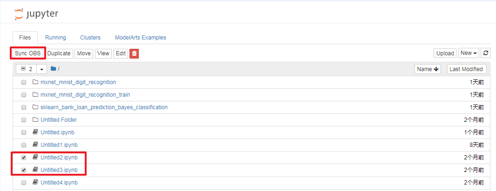

# 使用Sync OBS功能

如您在创建Notebook实例时，选择了OBS的“存储位置“，您写的代码会自动存储到您选择的OBS目录下。如您需要不同ipynb文件进行代码的相互调用，则可以使用Sync OBS功能。

Sync OBS功能是将在Notebook实例文件list列表选中的对象从OBS桶路径下同步到当前容器目录“\~/work“下。

## 注意事项

-   单次同步文件个数最多是1024个。
-   同步的对象总大小不超过500MB，即当前容器目录“\~/work“下已有200MB的文件了，那么用户使用Sync OBS能同步的最多就只有300MB文件。
-   Sync OBS功能只在带有OBS存储的实例上存在，因为非OBS存储的Notebook实例，其所有的文件读写操作都在用户容器里，即在“\~/work“容器目录。

## 操作步骤

Sync OBS功能的操作指导如下所示。

例如，“Untitled2.ipynb“需要调用“Untitled3.ipynb“中的“module“。选中这两个“ipynb“文件，然后单击界面上的“Sync OBS“，同步成功后，即可在代码间相互调用。

**图 1**  使用Sync OBS功能  

