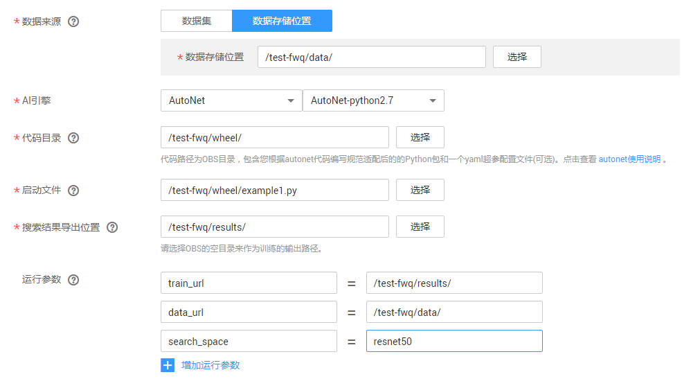
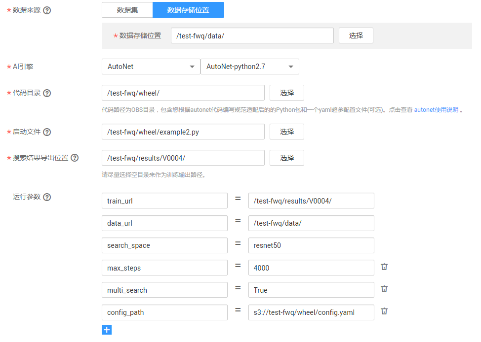
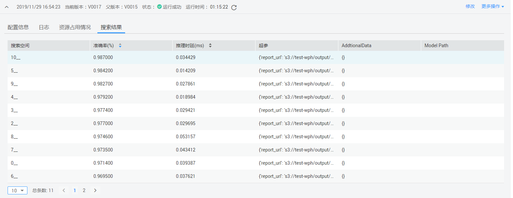
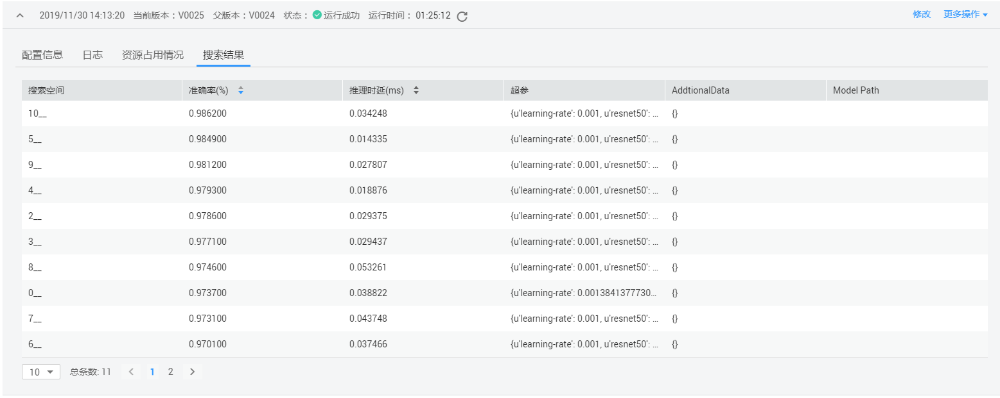

# 使用示例<a name="modelarts_23_0200"></a>

以使用resnet50在MNIST数据集上的分类任务为例。

## 数据准备<a name="section125371197439"></a>

ModelArts在公共OBS桶中提供了MNIST数据集，命名为“Mnist-Data-Set“，本文的操作示例可使用此数据集。请执行如下操作，将数据集上传至您的OBS目录下，例如上传至“test-modelarts/dataset-mnist“。

1.  单击[数据集下载链接](https://modelarts-cnnorth1-market-dataset.obs.cn-north-1.myhuaweicloud.com/dataset-market/Mnist-Data-Set/archiver/Mnist-Data-Set.zip)，将“Mnist-Data-Set“数据集下载至本地。
2.  在本地，将“Mnist-Data-Set.zip“压缩包解压。例如，解压至本地“Mnist-Data-Set“文件夹下。
3.  参考[上传文件](https://support.huaweicloud.com/usermanual-obs/zh-cn_topic_0045829660.html)，使用批量上传方式将“Mnist-Data-Set“文件夹下的所有文件上传至“test-modelarts/dataset-mnist“OBS路径下。

    “Mnist-Data-Set“数据集包含的内容如下所示，其中“.gz“为对应的压缩包。

    > **说明：**   
    >本示例需使用“.gz“压缩包格式，请务必将数据集的4个压缩包上传至OBS目录。  

    -   “t10k-images-idx3-ubyte.gz“：验证集，共包含10000个样本。
    -   “t10k-labels-idx1-ubyte.gz“：验证集标签，共包含10000个样本的类别标签。
    -   “train-images-idx3-ubyte.gz“：训练集，共包含60000个样本。
    -   “train-labels-idx1-ubyte.gz“：训练集标签，共包含60000个样本的类别标签。


## 修改代码<a name="section1817493764411"></a>

1.  下载初始代码  [mnist\_with\_summaries.py](https://github.com/tensorflow/tensorflow/blob/master/tensorflow/examples/tutorials/mnist/mnist_with_summaries.py)。

    ```
    # -*- coding: utf-8 -*-
    import argparse
    import tensorflow as tf
    import time
    from tensorflow.examples.tutorials.mnist import input_data
    
    parser = argparse.ArgumentParser()
    parser.add_argument('--max_steps', type=int, default=10,
                        help='Number of steps to run trainer.')
    parser.add_argument('--data_url', type=str, default="MNIST_data")
    FLAGS, unparsed = parser.parse_known_args()
    import autonet
    batch_size = 128
    
    def train():
      local_data = "/cache/data"
      import moxing as mox
      mox.file.copy_parallel(FLAGS.data_url, local_data)
      mnist = input_data.read_data_sets(local_data, one_hot=True)
      with tf.Graph().as_default():
        sess = tf.InteractiveSession()
        with tf.name_scope('input'):
          x = tf.placeholder(tf.float32, [None, 784], name='x-input')
          y_ = tf.placeholder(tf.int64, [None, 10], name='y-input')
        image_shaped_input = tf.reshape(x, [-1, 28, 28, 1])
        """用户自定义的resnet50经典网络"""
        def resnet50(input):
          ...
        y = resnet50(x)
        with tf.name_scope('cross_entropy'):
          y = tf.reduce_mean(y, [1, 2])
          y = tf.layers.dense(y, 10)
          cross_entropy = tf.losses.softmax_cross_entropy(
            y_, y)
    
        with tf.name_scope('train'):
          learning_rate = 0.001
          train_step = tf.train.AdamOptimizer(learning_rate).minimize(
            cross_entropy)
    
        with tf.name_scope('accuracy'):
          with tf.name_scope('correct_prediction'):
            correct_prediction = tf.equal(tf.argmax(y, 1), tf.argmax(y_, 1))
          with tf.name_scope('accuracy'):
            accuracy = tf.reduce_mean(tf.cast(correct_prediction, tf.float32))
        tf.global_variables_initializer().run()
        def feed_dict(train):
          if train:
            xs, ys = mnist.train.next_batch(100)
          else:
            xs, ys = mnist.test.images, mnist.test.labels
          return {x: xs, y_: ys}
        max_acc = 0
        latencys = []
        for i in range(FLAGS.max_steps):
          if i % 10 == 0:  # Record summaries and test-set accuracy
            loss, acc = sess.run([cross_entropy, accuracy], feed_dict=feed_dict(False))
            print('Accuracy at step %s: %s' % (i, acc))
            if acc > max_acc:
              max_acc = acc
          else:
            start = time.time()
            loss, _ = sess.run([cross_entropy, train_step], feed_dict=feed_dict(True))
            end = time.time()
            if i % 10 != 1:
              latencys.append(end - start)
        latency = sum(latencys) / len(latencys)
        print (latency, max_acc)
    
    
    if __name__ == '__main__':
      train()
    
    ```

2.  <a name="li15713545544"></a>参考[代码编写规范](代码编写规范.md)修改代码。

    纯NAS搜索代码，将修改后的代码保存为example1.py，并上传至OBS目录下。

    ```
    # -*- coding: utf-8 -*-
    import argparse
    import tensorflow as tf
    import time
    from tensorflow.examples.tutorials.mnist import input_data
    
    parser = argparse.ArgumentParser()
    parser.add_argument('--max_steps', type=int, default=10,
                        help='Number of steps to run trainer.')
    parser.add_argument('--data_url', type=str, default="MNIST_data")
    FLAGS, unparsed = parser.parse_known_args()
    import autonet
    batch_size = 128
    
    def train():
      local_data = "/cache/data"
      import moxing as mox
      mox.file.copy_parallel(FLAGS.data_url, local_data)
      mnist = input_data.read_data_sets(local_data, one_hot=True)
      with tf.Graph().as_default():
        sess = tf.InteractiveSession()
        with tf.name_scope('input'):
          x = tf.placeholder(tf.float32, [None, 784], name='x-input')
          y_ = tf.placeholder(tf.int64, [None, 10], name='y-input')
        image_shaped_input = tf.reshape(x, [-1, 28, 28, 1])
        #调用引擎内置的autonet包里的resnet50代替用户自定义的resnet50网络
        from autonet.client import ResNet50
        y = ResNet50(image_shaped_input, include_top=True, mode="train")
        with tf.name_scope('cross_entropy'):
          y = tf.reduce_mean(y, [1, 2])
          y = tf.layers.dense(y, 10)
          cross_entropy = tf.losses.softmax_cross_entropy(
            y_, y)
    
        with tf.name_scope('train'):
          learning_rate = 0.001
          train_step = tf.train.AdamOptimizer(learning_rate).minimize(
            cross_entropy)
    
        with tf.name_scope('accuracy'):
          with tf.name_scope('correct_prediction'):
            correct_prediction = tf.equal(tf.argmax(y, 1), tf.argmax(y_, 1))
          with tf.name_scope('accuracy'):
            accuracy = tf.reduce_mean(tf.cast(correct_prediction, tf.float32))
        tf.global_variables_initializer().run()
        def feed_dict(train):
          if train:
            xs, ys = mnist.train.next_batch(100)
          else:
            xs, ys = mnist.test.images, mnist.test.labels
          return {x: xs, y_: ys}
        max_acc = 0
        latencys = []
        for i in range(FLAGS.max_steps):
          if i % 10 == 0:  # Record summaries and test-set accuracy
            loss, acc = sess.run([cross_entropy, accuracy], feed_dict=feed_dict(False))
            print('Accuracy at step %s: %s' % (i, acc))
            if acc > max_acc:
              max_acc = acc
          else:
            start = time.time()
            loss, _ = sess.run([cross_entropy, train_step], feed_dict=feed_dict(True))
            end = time.time()
            if i % 10 != 1:
              latencys.append(end - start)
        latency = sum(latencys) / len(latencys)
        #调用autonet.client.report向上层manager反馈相应指标
        #autonet.client.report(max_acc, latency=latency, additional_data={"cost_time":sum(latencys)})
        autonet.client.report(max_acc, latency=latency)
    
    
    if __name__ == '__main__':
      train()
    ```

    多元搜索（超参+NAS）代码，将修改后的代码保存为example2.py，并上传至OBS目录下。同时，编写好的yaml配置文件，也上传至对应OBS目录下。

    ```
    # -*- coding: utf-8 -*-
    import argparse
    import tensorflow as tf
    from tensorflow.examples.tutorials.mnist import input_data
    import autonet.client as autonet  # addtional
    import hp_search as hp
    import time
    
    parser = argparse.ArgumentParser()
    parser.add_argument('--max_steps', type=int, default=100,
                        help='Number of steps to run trainer.')
    parser.add_argument('--data_url', type=str, default="MNIST_data")
    
    #接受超参搜索传入的超参learning_rate，超参key值与config文件保持一致
    parser.add_argument('--learning_rate', type=float, default=-1,       
                        help='Number of steps to run trainer.')
    FLAGS, unparsed = parser.parse_known_args()
    def train():
      local_data = "/cache/data"
      import moxing as mox
      mox.file.copy_parallel(FLAGS.data_url, local_data)
      mnist = input_data.read_data_sets(local_data, one_hot=True)
      with tf.Graph().as_default():
        sess = tf.InteractiveSession()
        with tf.name_scope('input'):
          x = tf.placeholder(tf.float32, [None, 784], name='x-input')
          y_ = tf.placeholder(tf.int64, [None, 10], name='y-input')
        image_shaped_input = tf.reshape(x, [-1, 28, 28, 1])
        #调用引擎内置的autonet包里的resnet50代替用户自定义的resnet50网络
        from autonet.client import ResNet50
        y = ResNet50(image_shaped_input, include_top=True, mode="train")
        with tf.name_scope('cross_entropy'):
          y = tf.reduce_mean(y, [1, 2])
          y = tf.layers.dense(y, 10)
          with tf.name_scope('total'):
            cross_entropy = tf.losses.softmax_cross_entropy(
              y_, y)
    
        with tf.name_scope('train'):
          #使用超参搜索器传入的超参进行训练
          train_step = tf.train.AdamOptimizer(FLAGS.learning_rate).minimize(
            cross_entropy)
    
        with tf.name_scope('accuracy'):
          with tf.name_scope('correct_prediction'):
            correct_prediction = tf.equal(tf.argmax(y, 1), tf.argmax(y_, 1))
          with tf.name_scope('accuracy'):
            accuracy = tf.reduce_mean(tf.cast(correct_prediction, tf.float32))
        tf.global_variables_initializer().run()
    
        def feed_dict(train):
          if train:
            xs, ys = mnist.train.next_batch(100)
          else:
            xs, ys = mnist.test.images, mnist.test.labels
          return {x: xs, y_: ys}
        max_acc = 0
        latencys = []
        for i in range(FLAGS.max_steps):
          if i % 10 == 0:
            loss, acc = sess.run([cross_entropy, accuracy], feed_dict=feed_dict(False))
            print('Accuracy at step %s: %s' % (i, acc))
            if acc > max_acc:
              max_acc = acc
          else:
            start = time.time()
            loss, _ = sess.run([cross_entropy, train_step], feed_dict=feed_dict(True))
            end = time.time()
            if i % 10 != 1:
              latencys.append(end - start)
            #每训练一步向超参搜索器反馈一次指标
            hp.METRICS(loss=loss)
        latency = sum(latencys) / len(latencys)
        #调用autonet.client.report向上层manager反馈相应指标
        #autonet.report(max_acc, latency=latency, additional_data={"learning_rate":FLAGS.learning_rate})
        autonet.report(max_acc, latency=latency)
        sess.close()
    
    if __name__ == '__main__':
      train()
    ```


## 启动搜索作业<a name="section592812492544"></a>

-   **纯NAS启动配置**

    参考[创建自动化搜索作业](创建自动化搜索作业.md)操作指导，创建一个自动化搜索作业，将启动文件设置为[修改代码](#section1817493764411)中步骤[2](#li15713545544)的示例代码文件example1.py，设置如下图所示的运行参数，然后启动作业。

    **图 1**  自动化搜索作业参数（纯NAS启动配置）<a name="fig147912229018"></a>  
    

-   **多元搜索\(超参+NAS\)启动配置**

    参考[创建自动化搜索作业](创建自动化搜索作业.md)操作指导，创建一个自动化搜索作业，将启动文件设置为[修改代码](#section1817493764411)中步骤[2](#li15713545544)的示例代码文件example2.py，设置如下图所示的运行参数，然后启动作业。

    **图 2**  自动化搜索作业参数（多元搜索启动配置）<a name="fig1725783314214"></a>  
    


## 查看搜索结果<a name="section15403122120558"></a>

等待自动化搜索作业运行结束后，单击作业名称进入作业详情页面，单击搜索结果页签，查看搜索结果。两个场景的结果分别为：

-   纯NAS结果

    **图 3**  查看搜索结果（纯NAS）<a name="fig1034133517311"></a>  
    

-   多元搜索\(超参+NAS\)结果

    **图 4**  查看搜索结果（多元搜索）<a name="fig82620171746"></a>  
    


