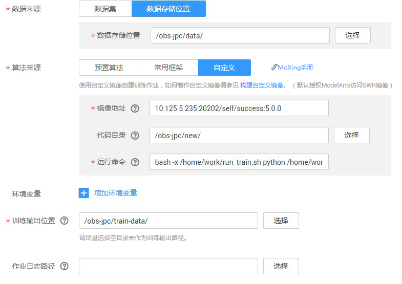
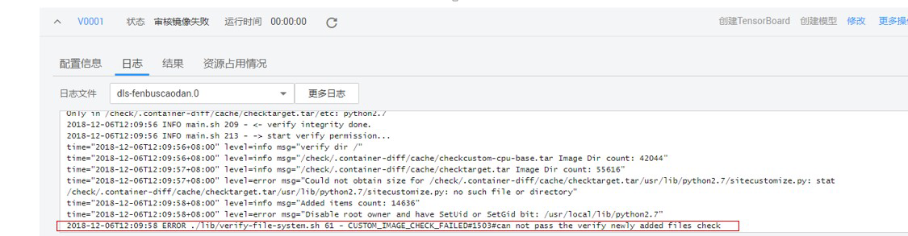

# 使用自定义镜像创建训练作业

用户将自定义镜像制作完成并上传至SWR后，可在ModelArts管理控制台，使用自定义镜像创建训练作业，完成模型训练操作。

## 创建训练作业

进入ModelArts管理控制台，参考[创建训练作业](创建训练作业.md)操作指导，创建训练作业。在使用自定义镜像创建作业时，需关注“算法来源“、“环境变量“和“资源池“参数的设置，详细参数请参见说明设置。

-   **“算法来源“**

    选择“自定义“页签。

    -   “镜像地址“：镜像上传到 SWR 后生成的地址。
    -   “代码目录“：用户存放训练代码的 OBS 路径。
    -   “运行命令“：镜像启动后的运行命令，基本格式如下所示。

        **bash /home/work/run\_train.sh  \{UserCommand\}**

        **bash /home/work/run\_train.sh  \[python/bash/..\] \{file\_location\} \{file\_parameter\}**

        采用这种形式，“代码目录“配置后，“run\_train.sh“将代码目录下载到容器的“/home/work/user-job-dir“目录中。

        例如，训练代码启动脚本在OBS路径为“s3://obs/app/train.py“，创建作业时选择OBS代码路径为“/obs/app/“， app目录会下载到“/user-job-dir“下，运行命令就可以设置为：

        **bash /home/work/run\_train.sh  python /home/work/user-job-dir/app/train.py \{python\_file\_parameter\}**

        **图 1**  创建训练作业  
        

-   **“环境变量“**

    容器启动后，除了用户在训练作业中自行增加的“环境变量“外，其它加载的环境变量如[表1](#table341782301619)所示。用户可以根据需求来确认在自己训练脚本的python中是否要使用这些环境变量，也可以通过运行命令中的“\{python\_file\_parameter\}“传入相关参数。

    **表 1**  可选环境变量说明

    
    <table><thead align="left"><tr id="row441882319161"><th class="cellrowborder" valign="top" width="23.1%" id="mcps1.2.3.1.1">
环境变量

    </th>
    <th class="cellrowborder" valign="top" width="76.9%" id="mcps1.2.3.1.2">
说明

    </th>
    </tr>
    </thead>
    <tbody><tr id="row241812311611"><td class="cellrowborder" valign="top" width="23.1%" headers="mcps1.2.3.1.1 ">
DLS_TASK_INDEX

    </td>
    <td class="cellrowborder" valign="top" width="76.9%" headers="mcps1.2.3.1.2 ">
当前容器索引，容器从0开始编号。单机训练的时候，该字段无意义。在分布式作业中，用户可以根据这个值来确定当前容器运行的算法逻辑。

    </td>
    </tr>
    <tr id="row154185239163"><td class="cellrowborder" valign="top" width="23.1%" headers="mcps1.2.3.1.1 ">
DLS_TASK_NUMBER

    </td>
    <td class="cellrowborder" valign="top" width="76.9%" headers="mcps1.2.3.1.2 ">
容器总数。对应“计算节点个数”。

    </td>
    </tr>
    <tr id="row1041882313169"><td class="cellrowborder" valign="top" width="23.1%" headers="mcps1.2.3.1.1 ">
DLS_APP_URL

    </td>
    <td class="cellrowborder" valign="top" width="76.9%" headers="mcps1.2.3.1.2 ">
代码目录。对应界面上“代码目录”配置，会加上协议名。比如，可直接使用“$DLS_APP_URL/*.py”来读取OBS下的文件。

    </td>
    </tr>
    <tr id="row241812361615"><td class="cellrowborder" valign="top" width="23.1%" headers="mcps1.2.3.1.1 ">
DLS_DATA_URL

    </td>
    <td class="cellrowborder" valign="top" width="76.9%" headers="mcps1.2.3.1.2 ">
数据集位置。对应界面上“数据来源”，会加上协议名。

    </td>
    </tr>
    <tr id="row20418162313160"><td class="cellrowborder" valign="top" width="23.1%" headers="mcps1.2.3.1.1 ">
DLS_TRAIN_URL

    </td>
    <td class="cellrowborder" valign="top" width="76.9%" headers="mcps1.2.3.1.2 ">
训练输出位置。对应界面上“训练输出位置”，会加上协议名。

    </td>
    </tr>
    <tr id="row10418152320162"><td class="cellrowborder" valign="top" width="23.1%" headers="mcps1.2.3.1.1 ">
BATCH_CUSTOM"$i"_HOSTS（分布式）

    
BATCH_{jobName}.0_HOSTS（单机）

    </td>
    <td class="cellrowborder" valign="top" width="76.9%" headers="mcps1.2.3.1.2 ">
当选择分布式的时候才有这个环境变量，即计算节点个数大于1时，此环境变量为“BATCH_CUSTOM"$i"_HOSTS”。

    
当选择单机时，即计算节点个数为1时，此环境变量为“BATCH_{jobName}.0_HOSTS”。

    
容器网络，容器的“hostname:port”。一个容器可以看到同一个作业中所有容器的HOSTS，根据索引的不同，分别为“BATCH_CUSTOM0_HOSTS”、“BATCH_CUSTOM1_HOSTS”等。当前，当资源池为8卡专属池的时候， 容器为主机网络启动，并且可以使用主机IB网络加速通信；其他资源池为容器网络。

    </td>
    </tr>
    </tbody>
    </table>

-   **“资源池“**

    当用户选择GPU时，默认会挂载缓存到“/cache“目录，用户可以使用此目录来储存临时文件。

    自定义镜像让用户对使用ModelArts有最大的灵活性，用户可以不采用**bash /home/work/run\_train.sh \{command\}**形式，把所需的东西全放在镜像，直接让容器执行某些指令。采用**bash /home/work/run\_train.sh \{command\}**形式，用户可以随意调参。

## 运行自定义镜像训练作业

用户上传自定义镜像到SWR后，在创建自定义镜像作业时，默认已经授权 ModelArts去获取镜像运行。自定义审核镜像第一次运行的时候，先审核镜像，审核内容请参见[自定义镜像规范](自定义镜像简介.md#section26795139453)，审核失败的原因见于日志，用户根据日志做相应的修改。

**图 2**  审核镜像失败  

镜像审核成功后，后台就会开始启动用户自定义镜像容器，开始跑自定义镜像训练作业，用户可根据日志来查看训练情况。

> **说明：**   
>审核成功后，再次使用相同镜像创建训练作业的时候，不会再次审核。  

**图 3**  运行日志  

