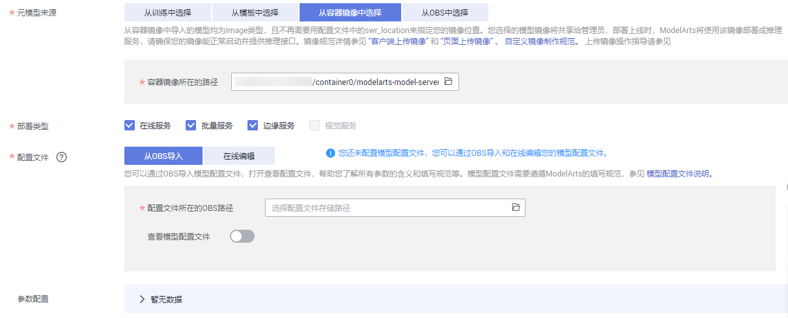

# 使用自定义镜像导入模型

用户将自定义镜像制作完成并上传至SWR后，可在ModelArts管理控制台，使用自定义镜像导入模型，并将模型部署上线。

## 导入模型

参考[导入模型](导入模型.md)操作指导，设置导入模型的基本设置，使用自定义镜像导入模型时，需重点关注“元模型来源“和“配置文件“两个参数的设置。

-   “元模型来源“

    选择“从容器镜像中选择“，然后在“容器镜像所在的路径“右侧输入框中，单击选择您的镜像。系统将自动罗列出当前账号上传至SWR服务的所有镜像。请根据实际情况选择您使用的镜像。

-   “配置文件“

    模型配置文件需单独编写，详细的编写指导请参见[模型配置文件编写说明](模型配置文件编写说明.md)，自定义镜像对应的配置文件示例请参见[自定义镜像类型的模型配置文件示例](模型配置文件编写说明.md#section9113122232018)。根据ModelArts规范编写完成后，可选择上传至OBS，或者直接在导入模型页面使用“在线编辑“功能。

**图 1**  使用自定义镜像导入模型  

## 部署上线

待使用自定义镜像导入模型成功后，即模型状态显示为正常时，您可以将模型部署为服务。在“模型列表“中，单击“部署“，选择服务类型，如“在线服务“。

您可以基于您自定义镜像的业务逻辑，将模型部署为在线服务、批量服务或边缘服务。使用其他方式导入的模型，其部署上线操作与自定义镜像方式相同，详细操作指导请参见[模型部署简介](模型部署简介.md)。

