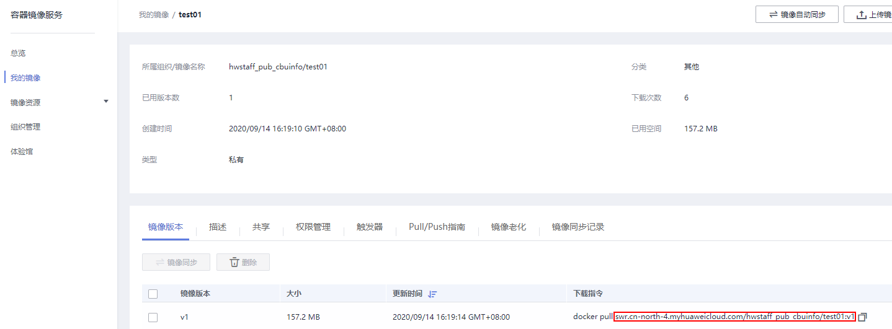

# 使用自定义镜像训练模型（Ascend）<a name="modelarts_23_0241"></a>

如果 Ascend-Powered-Engine 常用框架无法满足您的需求，您可以将算法构建为一个自定义镜像，通过自定义镜像创建训练作业。

## 前提条件<a name="zh-cn_topic_0000001096752499_zh-cn_topic_0284258935_zh-cn_topic_0216621184_section588716131207"></a>

-   数据已完成准备：已在ModelArts中创建可用的数据集，或者您已将用于训练的数据集上传至OBS目录。
-   如果“算法来源“为“自定义“，请完成镜像制作，自定义镜像制作规范参见[训练作业自定义镜像规范](训练作业自定义镜像规范.md)。
-   制作完成的自定义镜像需上传至SWR服务，请参考“《容器镜像服务用户指南》\>镜像管理\>客户端上传镜像“。
-   已在OBS创建至少1个空的文件夹，用于存储训练输出的内容。
-   确保您使用的OBS目录与ModelArts在同一区域。

## 注意事项<a name="zh-cn_topic_0000001096752499_zh-cn_topic_0284258935_zh-cn_topic_0216621184_section17890142914208"></a>

-   训练作业指定的数据集目录中，用于训练的数据名称（如图片名称、音频文件名、标注文件名称等），名称长度限制为0～255英文字符。如果数据集目录下，部分数据的文件名称超过255英文字符，训练作业将不会使用此数据，使用符合要求的数据继续进行训练。如果数据集目录下，所有数据的文件名称都超过了255英文字符，导致训练作业无数据可用，则会最终导致训练作业失败。
-   训练脚本中，“数据来源“、“训练输出位置“，两个参数必须为OBS路径。当需要对路径中进行读写交互时，建议使用[MoXing接口](https://support.huaweicloud.com/moxing-devg-modelarts/modelarts_11_0001.html)进行读写操作。

## 创建训练作业<a name="zh-cn_topic_0000001096752499_zh-cn_topic_0284258935_zh-cn_topic_0216621184_section210412592420"></a>

进入ModelArts管理控制台，参考[创建训练作业](zh-cn_topic_0171858284.md)操作指导，创建训练作业。在使用自定义镜像创建作业时，需关注“算法来源“、“环境变量“和“资源池“参数的设置。

您需要特别关注以下作业参数的设置：

-   “镜像地址“

    镜像上传到SWR后生成的地址。

    **图 1**  SWR镜像地址<a name="zh-cn_topic_0000001096752499_zh-cn_topic_0000001092217539_zh-cn_topic_0216621184_fig1610311596365"></a>  
    

-   “运行命令“

    若使用 ModelArts Ascend 基础镜像，运行命令参考如下：

    ```
    /bin/bash /home/work/run_train.sh ${obs-code-path} ${the-base-name-of-obs-code-path}/${boot-file} '/tmp/log/train.log' ${python_file_parameter}
    ```

    run\_train.sh 为ModelArts提供的启动脚本，可自动完成OBS代码路径下载至本地、Ascend HCCL RANK\_TABLE\_FILE v0.1 格式转 v1.0 格式、多P训练进程拉起功能，详细描述请参见[适用于Ascend芯片基础镜像](训练作业自定义镜像规范.md#section15496241203912)。

    > **说明：** 
    >-   “obs-code-path“: OBS 代码路径，例如 obs://training-bucket/ascend-tf-1.15/resnet50/
    >-   “the-base-name-of-obs-code-path“: OBS 代码路径的最后一级目录，例如 resnet50
    >-   “boot-file“: 以 .py 结尾的训练启动文件，例如 train.py
    >-   '/tmp/log/train.log': 默认值，日志重定向至该文件
    >-   “python\_file\_parameter“: 传入训练启动文件的参数，例如 --param1=value1 --param2=value2
    >运行命令示例：
    >```
    >/bin/bash /home/work/run_train.sh 'obs://training-bucket/ascend-tf-1.15/resnet50/' 'resnet50/train.py' '/tmp/log/train.log' --'data_url'='obs://training-bucket/cifar-10/' --'train_url'='obs://training-bucket/model/'
    >```

-   **“环境变量“**

    **表 1**  必选环境变量说明

    <a name="zh-cn_topic_0000001096752499_table17105117517"></a>
    <table><thead align="left"><tr id="zh-cn_topic_0000001096752499_row141019118516"><th class="cellrowborder" valign="top" width="23.13%" id="mcps1.2.3.1.1"><p id="zh-cn_topic_0000001096752499_p121013110514"><a name="zh-cn_topic_0000001096752499_p121013110514"></a><a name="zh-cn_topic_0000001096752499_p121013110514"></a>环境变量</p>
    </th>
    <th class="cellrowborder" valign="top" width="76.87%" id="mcps1.2.3.1.2"><p id="zh-cn_topic_0000001096752499_p121012185119"><a name="zh-cn_topic_0000001096752499_p121012185119"></a><a name="zh-cn_topic_0000001096752499_p121012185119"></a>说明</p>
    </th>
    </tr>
    </thead>
    <tbody><tr id="zh-cn_topic_0000001096752499_row5107110515"><td class="cellrowborder" valign="top" width="23.13%" headers="mcps1.2.3.1.1 "><p id="zh-cn_topic_0000001096752499_p61001195119"><a name="zh-cn_topic_0000001096752499_p61001195119"></a><a name="zh-cn_topic_0000001096752499_p61001195119"></a>RANK_TABLE_FILE</p>
    </td>
    <td class="cellrowborder" valign="top" width="76.87%" headers="mcps1.2.3.1.2 "><p id="zh-cn_topic_0000001096752499_p3883132205417"><a name="zh-cn_topic_0000001096752499_p3883132205417"></a><a name="zh-cn_topic_0000001096752499_p3883132205417"></a>该参数可以指定<span class="parmname" id="zh-cn_topic_0000001096752499_parmname138831422175415"><a name="zh-cn_topic_0000001096752499_parmname138831422175415"></a><a name="zh-cn_topic_0000001096752499_parmname138831422175415"></a>“jobstart_hccl.json”</span> 文件的生成路径。</p>
    <p id="zh-cn_topic_0000001096752499_p69001557105213"><a name="zh-cn_topic_0000001096752499_p69001557105213"></a><a name="zh-cn_topic_0000001096752499_p69001557105213"></a>建议配置为 /user/config，则<span class="parmname" id="zh-cn_topic_0000001096752499_parmname4492203814522"><a name="zh-cn_topic_0000001096752499_parmname4492203814522"></a><a name="zh-cn_topic_0000001096752499_parmname4492203814522"></a>“jobstart_hccl.json ”</span>文件路径为<span class="parmname" id="zh-cn_topic_0000001096752499_parmname1478265465111"><a name="zh-cn_topic_0000001096752499_parmname1478265465111"></a><a name="zh-cn_topic_0000001096752499_parmname1478265465111"></a>“/user/config/jobstart_hccl.json”</span>。</p>
    <p id="zh-cn_topic_0000001096752499_p1710114519"><a name="zh-cn_topic_0000001096752499_p1710114519"></a><a name="zh-cn_topic_0000001096752499_p1710114519"></a>算法开发者自行开发启动脚本时，可通过 <span class="parmname" id="zh-cn_topic_0000001096752499_parmname879819482546"><a name="zh-cn_topic_0000001096752499_parmname879819482546"></a><a name="zh-cn_topic_0000001096752499_parmname879819482546"></a>“${RANK_TABLE_FILE}/jobstart_hccl.json”</span>，获取文件。<span class="parmname" id="zh-cn_topic_0000001096752499_parmname15620043105410"><a name="zh-cn_topic_0000001096752499_parmname15620043105410"></a><a name="zh-cn_topic_0000001096752499_parmname15620043105410"></a>“jobstart_hccl.json”</span>是 v0.1 版本的，用于分布式通信，会在运行过程中被Ascend910 芯片的集合通信库解析。</p>
    </td>
    </tr>
    </tbody>
    </table>

    > **说明：** 
    >若未添加上述环境变量，则系统不会生成 RANK TABLE FILE，训练作业日志会停留在
    >```
    >Wait for Rank table file ready
    >```

    容器启动后，除了用户在训练作业中自行增加的“环境变量“外，其它加载的环境变量如[表2](#zh-cn_topic_0000001096752499_zh-cn_topic_0000001092217539_zh-cn_topic_0216621184_table341782301619)所示。用户可以根据需求来确认在自己训练脚本的python中是否要使用这些环境变量，也可以通过运行命令中的“\{python\_file\_parameter\}“传入相关参数。

    **表 2**  可选环境变量说明

    <a name="zh-cn_topic_0000001096752499_zh-cn_topic_0000001092217539_zh-cn_topic_0216621184_table341782301619"></a>
    <table><thead align="left"><tr id="zh-cn_topic_0000001096752499_zh-cn_topic_0000001092217539_zh-cn_topic_0216621184_row441882319161"><th class="cellrowborder" valign="top" width="23.1%" id="mcps1.2.3.1.1"><p id="zh-cn_topic_0000001096752499_zh-cn_topic_0000001092217539_zh-cn_topic_0216621184_p94186234169"><a name="zh-cn_topic_0000001096752499_zh-cn_topic_0000001092217539_zh-cn_topic_0216621184_p94186234169"></a><a name="zh-cn_topic_0000001096752499_zh-cn_topic_0000001092217539_zh-cn_topic_0216621184_p94186234169"></a>环境变量</p>
    </th>
    <th class="cellrowborder" valign="top" width="76.9%" id="mcps1.2.3.1.2"><p id="zh-cn_topic_0000001096752499_zh-cn_topic_0000001092217539_zh-cn_topic_0216621184_p3418123121615"><a name="zh-cn_topic_0000001096752499_zh-cn_topic_0000001092217539_zh-cn_topic_0216621184_p3418123121615"></a><a name="zh-cn_topic_0000001096752499_zh-cn_topic_0000001092217539_zh-cn_topic_0216621184_p3418123121615"></a>说明</p>
    </th>
    </tr>
    </thead>
    <tbody><tr id="zh-cn_topic_0000001096752499_zh-cn_topic_0000001092217539_zh-cn_topic_0216621184_row241812311611"><td class="cellrowborder" valign="top" width="23.1%" headers="mcps1.2.3.1.1 "><p id="zh-cn_topic_0000001096752499_zh-cn_topic_0000001092217539_zh-cn_topic_0216621184_p164181323131617"><a name="zh-cn_topic_0000001096752499_zh-cn_topic_0000001092217539_zh-cn_topic_0216621184_p164181323131617"></a><a name="zh-cn_topic_0000001096752499_zh-cn_topic_0000001092217539_zh-cn_topic_0216621184_p164181323131617"></a>DLS_TASK_INDEX</p>
    </td>
    <td class="cellrowborder" valign="top" width="76.9%" headers="mcps1.2.3.1.2 "><p id="zh-cn_topic_0000001096752499_zh-cn_topic_0000001092217539_zh-cn_topic_0216621184_p124185233169"><a name="zh-cn_topic_0000001096752499_zh-cn_topic_0000001092217539_zh-cn_topic_0216621184_p124185233169"></a><a name="zh-cn_topic_0000001096752499_zh-cn_topic_0000001092217539_zh-cn_topic_0216621184_p124185233169"></a>当前容器索引，容器从0开始编号。</p>
    </td>
    </tr>
    <tr id="zh-cn_topic_0000001096752499_zh-cn_topic_0000001092217539_zh-cn_topic_0216621184_row154185239163"><td class="cellrowborder" valign="top" width="23.1%" headers="mcps1.2.3.1.1 "><p id="zh-cn_topic_0000001096752499_zh-cn_topic_0000001092217539_zh-cn_topic_0216621184_p241872361615"><a name="zh-cn_topic_0000001096752499_zh-cn_topic_0000001092217539_zh-cn_topic_0216621184_p241872361615"></a><a name="zh-cn_topic_0000001096752499_zh-cn_topic_0000001092217539_zh-cn_topic_0216621184_p241872361615"></a>DLS_TASK_NUMBER</p>
    </td>
    <td class="cellrowborder" valign="top" width="76.9%" headers="mcps1.2.3.1.2 "><p id="zh-cn_topic_0000001096752499_zh-cn_topic_0000001092217539_zh-cn_topic_0216621184_p2418162314161"><a name="zh-cn_topic_0000001096752499_zh-cn_topic_0000001092217539_zh-cn_topic_0216621184_p2418162314161"></a><a name="zh-cn_topic_0000001096752499_zh-cn_topic_0000001092217539_zh-cn_topic_0216621184_p2418162314161"></a>容器总数。对应<span class="parmname" id="zh-cn_topic_0000001096752499_zh-cn_topic_0000001092217539_zh-cn_topic_0216621184_parmname17648115913216"><a name="zh-cn_topic_0000001096752499_zh-cn_topic_0000001092217539_zh-cn_topic_0216621184_parmname17648115913216"></a><a name="zh-cn_topic_0000001096752499_zh-cn_topic_0000001092217539_zh-cn_topic_0216621184_parmname17648115913216"></a>“计算节点个数”</span>。</p>
    </td>
    </tr>
    <tr id="zh-cn_topic_0000001096752499_zh-cn_topic_0000001092217539_zh-cn_topic_0216621184_row1041882313169"><td class="cellrowborder" valign="top" width="23.1%" headers="mcps1.2.3.1.1 "><p id="zh-cn_topic_0000001096752499_zh-cn_topic_0000001092217539_zh-cn_topic_0216621184_p18418162310164"><a name="zh-cn_topic_0000001096752499_zh-cn_topic_0000001092217539_zh-cn_topic_0216621184_p18418162310164"></a><a name="zh-cn_topic_0000001096752499_zh-cn_topic_0000001092217539_zh-cn_topic_0216621184_p18418162310164"></a>DLS_APP_URL</p>
    </td>
    <td class="cellrowborder" valign="top" width="76.9%" headers="mcps1.2.3.1.2 "><p id="zh-cn_topic_0000001096752499_zh-cn_topic_0000001092217539_zh-cn_topic_0216621184_p1041815238164"><a name="zh-cn_topic_0000001096752499_zh-cn_topic_0000001092217539_zh-cn_topic_0216621184_p1041815238164"></a><a name="zh-cn_topic_0000001096752499_zh-cn_topic_0000001092217539_zh-cn_topic_0216621184_p1041815238164"></a>代码目录。对应界面上<span class="parmname" id="zh-cn_topic_0000001096752499_zh-cn_topic_0000001092217539_zh-cn_topic_0216621184_parmname1940417410221"><a name="zh-cn_topic_0000001096752499_zh-cn_topic_0000001092217539_zh-cn_topic_0216621184_parmname1940417410221"></a><a name="zh-cn_topic_0000001096752499_zh-cn_topic_0000001092217539_zh-cn_topic_0216621184_parmname1940417410221"></a>“代码目录”</span>配置，会加上协议名。比如，可直接使用<span class="filepath" id="zh-cn_topic_0000001096752499_zh-cn_topic_0000001092217539_zh-cn_topic_0216621184_filepath1992581272213"><a name="zh-cn_topic_0000001096752499_zh-cn_topic_0000001092217539_zh-cn_topic_0216621184_filepath1992581272213"></a><a name="zh-cn_topic_0000001096752499_zh-cn_topic_0000001092217539_zh-cn_topic_0216621184_filepath1992581272213"></a>“$DLS_APP_URL/*.py”</span>来读取OBS下的文件。</p>
    </td>
    </tr>
    <tr id="zh-cn_topic_0000001096752499_zh-cn_topic_0000001092217539_zh-cn_topic_0216621184_row241812361615"><td class="cellrowborder" valign="top" width="23.1%" headers="mcps1.2.3.1.1 "><p id="zh-cn_topic_0000001096752499_zh-cn_topic_0000001092217539_zh-cn_topic_0216621184_p9418823141616"><a name="zh-cn_topic_0000001096752499_zh-cn_topic_0000001092217539_zh-cn_topic_0216621184_p9418823141616"></a><a name="zh-cn_topic_0000001096752499_zh-cn_topic_0000001092217539_zh-cn_topic_0216621184_p9418823141616"></a>DLS_DATA_URL</p>
    </td>
    <td class="cellrowborder" valign="top" width="76.9%" headers="mcps1.2.3.1.2 "><p id="zh-cn_topic_0000001096752499_zh-cn_topic_0000001092217539_zh-cn_topic_0216621184_p541882312164"><a name="zh-cn_topic_0000001096752499_zh-cn_topic_0000001092217539_zh-cn_topic_0216621184_p541882312164"></a><a name="zh-cn_topic_0000001096752499_zh-cn_topic_0000001092217539_zh-cn_topic_0216621184_p541882312164"></a>数据集位置。对应界面上<span class="parmname" id="zh-cn_topic_0000001096752499_zh-cn_topic_0000001092217539_zh-cn_topic_0216621184_parmname13774123032218"><a name="zh-cn_topic_0000001096752499_zh-cn_topic_0000001092217539_zh-cn_topic_0216621184_parmname13774123032218"></a><a name="zh-cn_topic_0000001096752499_zh-cn_topic_0000001092217539_zh-cn_topic_0216621184_parmname13774123032218"></a>“数据来源”</span>，会加上协议名。</p>
    </td>
    </tr>
    <tr id="zh-cn_topic_0000001096752499_zh-cn_topic_0000001092217539_zh-cn_topic_0216621184_row20418162313160"><td class="cellrowborder" valign="top" width="23.1%" headers="mcps1.2.3.1.1 "><p id="zh-cn_topic_0000001096752499_zh-cn_topic_0000001092217539_zh-cn_topic_0216621184_p194181923161611"><a name="zh-cn_topic_0000001096752499_zh-cn_topic_0000001092217539_zh-cn_topic_0216621184_p194181923161611"></a><a name="zh-cn_topic_0000001096752499_zh-cn_topic_0000001092217539_zh-cn_topic_0216621184_p194181923161611"></a>DLS_TRAIN_URL</p>
    </td>
    <td class="cellrowborder" valign="top" width="76.9%" headers="mcps1.2.3.1.2 "><p id="zh-cn_topic_0000001096752499_zh-cn_topic_0000001092217539_zh-cn_topic_0216621184_p1341812311164"><a name="zh-cn_topic_0000001096752499_zh-cn_topic_0000001092217539_zh-cn_topic_0216621184_p1341812311164"></a><a name="zh-cn_topic_0000001096752499_zh-cn_topic_0000001092217539_zh-cn_topic_0216621184_p1341812311164"></a>训练输出位置。对应界面上<span class="parmname" id="zh-cn_topic_0000001096752499_zh-cn_topic_0000001092217539_zh-cn_topic_0216621184_parmname95459352228"><a name="zh-cn_topic_0000001096752499_zh-cn_topic_0000001092217539_zh-cn_topic_0216621184_parmname95459352228"></a><a name="zh-cn_topic_0000001096752499_zh-cn_topic_0000001092217539_zh-cn_topic_0216621184_parmname95459352228"></a>“训练输出位置”</span>，会加上协议名。</p>
    </td>
    </tr>
    <tr id="zh-cn_topic_0000001096752499_zh-cn_topic_0000001092217539_zh-cn_topic_0216621184_row10418152320162"><td class="cellrowborder" valign="top" width="23.1%" headers="mcps1.2.3.1.1 "><p id="zh-cn_topic_0000001096752499_zh-cn_topic_0000001092217539_zh-cn_topic_0216621184_p28426261819"><a name="zh-cn_topic_0000001096752499_zh-cn_topic_0000001092217539_zh-cn_topic_0216621184_p28426261819"></a><a name="zh-cn_topic_0000001096752499_zh-cn_topic_0000001092217539_zh-cn_topic_0216621184_p28426261819"></a>BATCH_{jobName}.0_HOSTS（单机）</p>
    </td>
    <td class="cellrowborder" valign="top" width="76.9%" headers="mcps1.2.3.1.2 "><p id="zh-cn_topic_0000001096752499_zh-cn_topic_0000001092217539_zh-cn_topic_0216621184_p5277131971917"><a name="zh-cn_topic_0000001096752499_zh-cn_topic_0000001092217539_zh-cn_topic_0216621184_p5277131971917"></a><a name="zh-cn_topic_0000001096752499_zh-cn_topic_0000001092217539_zh-cn_topic_0216621184_p5277131971917"></a>当选择单机时，即计算节点个数为1时，此环境变量为<span class="parmname" id="zh-cn_topic_0000001096752499_zh-cn_topic_0000001092217539_zh-cn_topic_0216621184_parmname76051347132219"><a name="zh-cn_topic_0000001096752499_zh-cn_topic_0000001092217539_zh-cn_topic_0216621184_parmname76051347132219"></a><a name="zh-cn_topic_0000001096752499_zh-cn_topic_0000001092217539_zh-cn_topic_0216621184_parmname76051347132219"></a>“BATCH_{jobName}.0_HOSTS”</span>。</p>
    <p id="zh-cn_topic_0000001096752499_zh-cn_topic_0000001092217539_zh-cn_topic_0216621184_p1741832315165"><a name="zh-cn_topic_0000001096752499_zh-cn_topic_0000001092217539_zh-cn_topic_0216621184_p1741832315165"></a><a name="zh-cn_topic_0000001096752499_zh-cn_topic_0000001092217539_zh-cn_topic_0216621184_p1741832315165"></a>HOSTS环境变量的格式为<span class="parmname" id="zh-cn_topic_0000001096752499_zh-cn_topic_0000001092217539_zh-cn_topic_0216621184_parmname151655217221"><a name="zh-cn_topic_0000001096752499_zh-cn_topic_0000001092217539_zh-cn_topic_0216621184_parmname151655217221"></a><a name="zh-cn_topic_0000001096752499_zh-cn_topic_0000001092217539_zh-cn_topic_0216621184_parmname151655217221"></a>“hostname:port”</span>。一个容器可以看到同一个作业中所有容器的HOSTS，根据索引的不同，分别为<span class="parmname" id="zh-cn_topic_0000001096752499_zh-cn_topic_0000001092217539_zh-cn_topic_0216621184_parmname195191256152212"><a name="zh-cn_topic_0000001096752499_zh-cn_topic_0000001092217539_zh-cn_topic_0216621184_parmname195191256152212"></a><a name="zh-cn_topic_0000001096752499_zh-cn_topic_0000001092217539_zh-cn_topic_0216621184_parmname195191256152212"></a>“BATCH_CUSTOM0_HOSTS”</span>、<span class="parmname" id="zh-cn_topic_0000001096752499_zh-cn_topic_0000001092217539_zh-cn_topic_0216621184_parmname17178659202210"><a name="zh-cn_topic_0000001096752499_zh-cn_topic_0000001092217539_zh-cn_topic_0216621184_parmname17178659202210"></a><a name="zh-cn_topic_0000001096752499_zh-cn_topic_0000001092217539_zh-cn_topic_0216621184_parmname17178659202210"></a>“BATCH_CUSTOM1_HOSTS”</span>等。</p>
    </td>
    </tr>
    </tbody>
    </table>

    -   jobstart\_hccl.json 文件格式（v0.1）示例

        ```
        {
        	"group_count": "1",
        	"group_list": [{
        		"device_count": "1",
        		"group_name": "job-trainjob",
        		"instance_count": "1",
        		"instance_list": [{
        			"devices": [{
        				"device_id": "4",
        				"device_ip": "192.1.10.254"
        			}],
        			"pod_name": "jobxxxxxxxx-job-trainjob-0",
        			"server_id": "192.168.0.25"
        		}]
        	}],
        	"status": "completed"
        }
        ```

    -   jobstart\_hccl.json 文件格式（v1.0）示例

        ```
        {
        	"server_count": "1",
        	"server_list": [{
        		"device": [{
        			"device_id": "4",
        			"device_ip": "192.1.10.254",
        			"rank_id": "0"
        		}],
        		"server_id": "192.168.0.25"
        	}],
        	"status": "completed",
        	"version": "1.0"
        }
        ```


