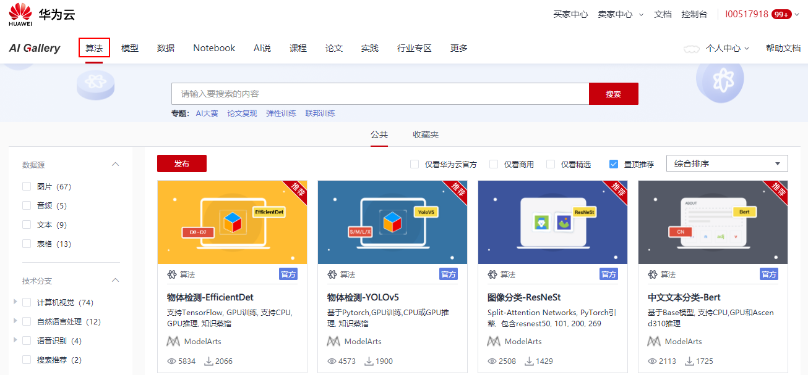
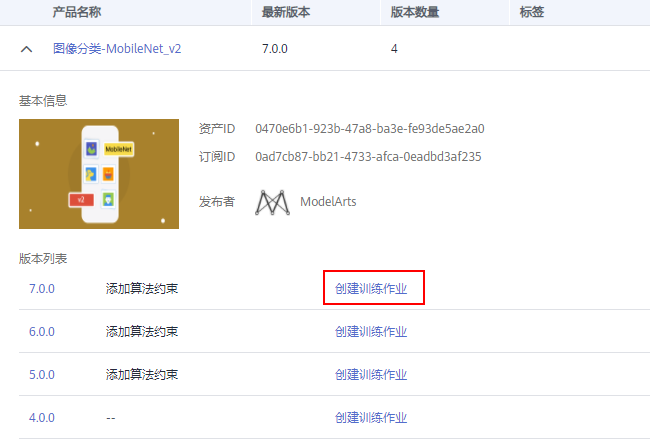

# 使用订阅算法

ModelArts的AI Gallery，发布了较多官方算法，可以帮助AI开发者快速开始训练和部署模型。对于不熟悉ModelArts的用户，可以快速订阅官方推荐算法实现模型训练全流程。

AI Gallery不仅可以订阅官方发布算法，也支持用户发布自定义算法和订阅其他开发者分享的算法。为了使用他人或者ModelArts官方分享的算法，您需要将AI Gallery的算法订阅至您的ModelArts中。

-   [查找算法](#section8245173313555)
-   [订阅算法](#section12552173912556)

## 查找算法

为了获得匹配您业务的算法，您可以通过多个入口区查找算法。

-   在“算法管理\>我的订阅“中，单击“查找算法“，可跳转至“AI Gallery“页面，查找相应的算法。
-   直接在左侧菜单栏中选择“AI Gallery“，进入“AI Gallery“页面，查找相应的算法。

    **图 1**  AI gallery  
    

    在AI Gallery的算法模块，根据算法的业务场景，官方发布的算法如[表1](#table28320425483)所示。

    **表 1**  官方发布算法

    
    <table><thead align="left"><tr id="zh-cn_topic_0267161612_zh-cn_topic_0235074426_row999191283818"><th class="cellrowborder" valign="top" width="10.54894510548945%" id="mcps1.2.7.1.1">
应用场景

    </th>
    <th class="cellrowborder" valign="top" width="24.107589241075893%" id="mcps1.2.7.1.2">
算法

    </th>
    <th class="cellrowborder" valign="top" width="10.97890210978902%" id="mcps1.2.7.1.3">
AI引擎

    </th>
    <th class="cellrowborder" valign="top" width="13.648635136486353%" id="mcps1.2.7.1.4">
支持服务类型

    </th>
    <th class="cellrowborder" valign="top" width="18.62813718628137%" id="mcps1.2.7.1.5">
训练使用的资源类型

    </th>
    <th class="cellrowborder" valign="top" width="22.087791220877914%" id="mcps1.2.7.1.6">
部署使用的资源类型

    </th>
    </tr>
    </thead>
    <tbody><tr id="zh-cn_topic_0267161612_zh-cn_topic_0235074426_row129915124387"><td class="cellrowborder" rowspan="13" valign="top" width="10.54894510548945%" headers="mcps1.2.7.1.1 ">
图像分类

    </td>
    <td class="cellrowborder" valign="top" width="24.107589241075893%" headers="mcps1.2.7.1.2 ">
<a href="https://marketplace.huaweicloud.com/markets/aihub/modelhub/detail/?id=40b66195-5bbe-463d-b8a2-03e57073538d" target="_blank" rel="noopener noreferrer">ResNet_v1_50</a>

    </td>
    <td class="cellrowborder" valign="top" width="10.97890210978902%" headers="mcps1.2.7.1.3 ">
TensorFlow

    </td>
    <td class="cellrowborder" valign="top" width="13.648635136486353%" headers="mcps1.2.7.1.4 ">
在线服务

    </td>
    <td class="cellrowborder" valign="top" width="18.62813718628137%" headers="mcps1.2.7.1.5 ">
GPU

    </td>
    <td class="cellrowborder" valign="top" width="22.087791220877914%" headers="mcps1.2.7.1.6 ">
CPU、GPU、Ascend 310

    </td>
    </tr>
    <tr id="zh-cn_topic_0267161612_zh-cn_topic_0235074426_row17458732172715"><td class="cellrowborder" valign="top" headers="mcps1.2.7.1.1 ">
<a href="https://marketplace.huaweicloud.com/markets/aihub/modelhub/detail/?id=e1d362e1-7162-4931-8b48-c10b44c47cff" target="_blank" rel="noopener noreferrer">ResNet_v1_101</a>

    </td>
    <td class="cellrowborder" valign="top" headers="mcps1.2.7.1.2 ">
TensorFlow

    </td>
    <td class="cellrowborder" valign="top" headers="mcps1.2.7.1.3 ">
在线服务

    </td>
    <td class="cellrowborder" valign="top" headers="mcps1.2.7.1.4 ">
GPU

    </td>
    <td class="cellrowborder" valign="top" headers="mcps1.2.7.1.5 ">
CPU、GPU、Ascend 310

    </td>
    </tr>
    <tr id="zh-cn_topic_0267161612_zh-cn_topic_0235074426_row861217281019"><td class="cellrowborder" valign="top" headers="mcps1.2.7.1.1 ">
<a href="https://marketplace.huaweicloud.com/markets/aihub/modelhub/detail/?id=fb03c9e2-bd5a-49e6-8455-af8ab2f5f788" target="_blank" rel="noopener noreferrer">ResNet_v1_50</a>

    </td>
    <td class="cellrowborder" valign="top" headers="mcps1.2.7.1.2 ">
TensorFlow

    </td>
    <td class="cellrowborder" valign="top" headers="mcps1.2.7.1.3 ">
在线服务

    </td>
    <td class="cellrowborder" valign="top" headers="mcps1.2.7.1.4 ">
Ascend 910

    </td>
    <td class="cellrowborder" valign="top" headers="mcps1.2.7.1.5 ">
CPU、GPU、Ascend 310

    </td>
    </tr>
    <tr id="zh-cn_topic_0267161612_zh-cn_topic_0235074426_row0194182517197"><td class="cellrowborder" valign="top" headers="mcps1.2.7.1.1 ">
<a href="https://marketplace.huaweicloud.com/markets/aihub/modelhub/detail/?id=6b454013-dab9-4028-8c7a-47375067202c" target="_blank" rel="noopener noreferrer">ResNet50</a>

    </td>
    <td class="cellrowborder" valign="top" headers="mcps1.2.7.1.2 ">
MindSpore

    </td>
    <td class="cellrowborder" valign="top" headers="mcps1.2.7.1.3 ">
在线服务

    </td>
    <td class="cellrowborder" valign="top" headers="mcps1.2.7.1.4 ">
Ascend 910

    </td>
    <td class="cellrowborder" valign="top" headers="mcps1.2.7.1.5 ">
Ascend 310

    </td>
    </tr>
    <tr id="zh-cn_topic_0267161612_zh-cn_topic_0235074426_row76131428109"><td class="cellrowborder" valign="top" headers="mcps1.2.7.1.1 ">
<a href="https://marketplace.huaweicloud.com/markets/aihub/modelhub/detail/?id=c537e9b9-a2be-4318-9be7-e223ef95d5a5" target="_blank" rel="noopener noreferrer">ResNet_v2_50</a>

    </td>
    <td class="cellrowborder" valign="top" headers="mcps1.2.7.1.2 ">
TensorFlow

    </td>
    <td class="cellrowborder" valign="top" headers="mcps1.2.7.1.3 ">
在线服务

    </td>
    <td class="cellrowborder" valign="top" headers="mcps1.2.7.1.4 ">
Ascend 910

    </td>
    <td class="cellrowborder" valign="top" headers="mcps1.2.7.1.5 ">
Ascend 310

    </td>
    </tr>
    <tr id="zh-cn_topic_0267161612_zh-cn_topic_0235074426_row2053015357348"><td class="cellrowborder" valign="top" headers="mcps1.2.7.1.1 ">
<a href="https://marketplace.huaweicloud.com/markets/aihub/modelhub/detail/?id=abeae53a-f1f4-45b7-b6b5-fa975b343b98" target="_blank" rel="noopener noreferrer">ResNet_v2_101</a>

    </td>
    <td class="cellrowborder" valign="top" headers="mcps1.2.7.1.2 ">
TensorFlow

    </td>
    <td class="cellrowborder" valign="top" headers="mcps1.2.7.1.3 ">
在线服务

    </td>
    <td class="cellrowborder" valign="top" headers="mcps1.2.7.1.4 ">
GPU

    </td>
    <td class="cellrowborder" valign="top" headers="mcps1.2.7.1.5 ">
CPU、GPU、Ascend 310

    </td>
    </tr>
    <tr id="zh-cn_topic_0267161612_zh-cn_topic_0235074426_row3458103212276"><td class="cellrowborder" valign="top" headers="mcps1.2.7.1.1 ">
<a href="https://marketplace.huaweicloud.com/markets/aihub/modelhub/detail/?id=9630c28e-1ca6-4d0e-9c31-1bee1198ba45" target="_blank" rel="noopener noreferrer">MobileNet_v1</a>

    </td>
    <td class="cellrowborder" valign="top" headers="mcps1.2.7.1.2 ">
TensorFlow

    </td>
    <td class="cellrowborder" valign="top" headers="mcps1.2.7.1.3 ">
在线服务

    </td>
    <td class="cellrowborder" valign="top" headers="mcps1.2.7.1.4 ">
GPU

    </td>
    <td class="cellrowborder" valign="top" headers="mcps1.2.7.1.5 ">
CPU、GPU、Ascend 310

    </td>
    </tr>
    <tr id="zh-cn_topic_0267161612_zh-cn_topic_0235074426_row4389909385"><td class="cellrowborder" valign="top" headers="mcps1.2.7.1.1 ">
<a href="https://marketplace.huaweicloud.com/markets/aihub/modelhub/detail/?id=0470e6b1-923b-47a8-ba3e-fe93de5ae2a0" target="_blank" rel="noopener noreferrer">MobileNet_v2</a>

    </td>
    <td class="cellrowborder" valign="top" headers="mcps1.2.7.1.2 ">
TensorFlow

    </td>
    <td class="cellrowborder" valign="top" headers="mcps1.2.7.1.3 ">
在线服务

    </td>
    <td class="cellrowborder" valign="top" headers="mcps1.2.7.1.4 ">
GPU

    </td>
    <td class="cellrowborder" valign="top" headers="mcps1.2.7.1.5 ">
CPU、GPU、Ascend 310

    </td>
    </tr>
    <tr id="zh-cn_topic_0267161612_zh-cn_topic_0235074426_row1561124718149"><td class="cellrowborder" valign="top" headers="mcps1.2.7.1.1 ">
<a href="https://marketplace.huaweicloud.com/markets/aihub/modelhub/detail/?id=cad65a02-ef22-46e1-bd5b-01f231da9272" target="_blank" rel="noopener noreferrer">Inception_v3</a>

    </td>
    <td class="cellrowborder" valign="top" headers="mcps1.2.7.1.2 ">
TensorFlow

    </td>
    <td class="cellrowborder" valign="top" headers="mcps1.2.7.1.3 ">
在线服务

    </td>
    <td class="cellrowborder" valign="top" headers="mcps1.2.7.1.4 ">
GPU

    </td>
    <td class="cellrowborder" valign="top" headers="mcps1.2.7.1.5 ">
CPU、GPU、Ascend 310

    </td>
    </tr>
    <tr id="zh-cn_topic_0267161612_zh-cn_topic_0235074426_row1280142803719"><td class="cellrowborder" valign="top" headers="mcps1.2.7.1.1 ">
<a href="https://marketplace.huaweicloud.com/markets/aihub/modelhub/detail/?id=10687cd7-1b61-4858-9445-e9d2ce027e62" target="_blank" rel="noopener noreferrer">ResNet50_AdaInfer</a>

    </td>
    <td class="cellrowborder" valign="top" headers="mcps1.2.7.1.2 ">
TensorFlow

    </td>
    <td class="cellrowborder" valign="top" headers="mcps1.2.7.1.3 ">
在线服务

    </td>
    <td class="cellrowborder" valign="top" headers="mcps1.2.7.1.4 ">
GPU

    </td>
    <td class="cellrowborder" valign="top" headers="mcps1.2.7.1.5 ">
CPU、GPU

    </td>
    </tr>
    <tr id="zh-cn_topic_0267161612_zh-cn_topic_0235074426_row17628202313716"><td class="cellrowborder" valign="top" headers="mcps1.2.7.1.1 ">
<a href="https://marketplace.huaweicloud.com/markets/aihub/modelhub/detail/?id=cfe5f5e6-84fe-400a-8323-2a0eb41b0011" target="_blank" rel="noopener noreferrer">Res2Net_50</a>

    </td>
    <td class="cellrowborder" valign="top" headers="mcps1.2.7.1.2 ">
TensorFlow

    </td>
    <td class="cellrowborder" valign="top" headers="mcps1.2.7.1.3 ">
在线服务

    </td>
    <td class="cellrowborder" valign="top" headers="mcps1.2.7.1.4 ">
GPU

    </td>
    <td class="cellrowborder" valign="top" headers="mcps1.2.7.1.5 ">
CPU、GPU、Ascend 310

    </td>
    </tr>
    <tr id="zh-cn_topic_0267161612_zh-cn_topic_0235074426_row662922314717"><td class="cellrowborder" valign="top" headers="mcps1.2.7.1.1 ">
<a href="https://marketplace.huaweicloud.com/markets/aihub/modelhub/detail/?id=27536e00-e8fc-43e4-9833-2e4b6e8e1f1d" target="_blank" rel="noopener noreferrer">Inception_ResNet_v2</a>

    </td>
    <td class="cellrowborder" valign="top" headers="mcps1.2.7.1.2 ">
TensorFlow

    </td>
    <td class="cellrowborder" valign="top" headers="mcps1.2.7.1.3 ">
在线服务

    </td>
    <td class="cellrowborder" valign="top" headers="mcps1.2.7.1.4 ">
GPU

    </td>
    <td class="cellrowborder" valign="top" headers="mcps1.2.7.1.5 ">
CPU、GPU、Ascend 310

    </td>
    </tr>
    <tr id="zh-cn_topic_0267161612_zh-cn_topic_0235074426_row26309237713"><td class="cellrowborder" valign="top" headers="mcps1.2.7.1.1 ">
EfficientNet<a href="https://marketplace.huaweicloud.com/markets/aihub/modelhub/detail/?id=9043fa73-079c-49da-b8b8-e56a9d857a2e" target="_blank" rel="noopener noreferrer">B0</a>/<a href="https://marketplace.huaweicloud.com/markets/aihub/modelhub/detail/?id=65e642e9-b892-4f06-9488-89ac7097b76c" target="_blank" rel="noopener noreferrer">B4</a>/<a href="https://marketplace.huaweicloud.com/markets/aihub/modelhub/detail/?id=7c2f7313-de4c-42e9-9fb7-1e956e469860" target="_blank" rel="noopener noreferrer">B7</a>/<a href="https://marketplace.huaweicloud.com/markets/aihub/modelhub/detail/?id=1c472adf-92b1-4589-9262-6035c4e54dbc" target="_blank" rel="noopener noreferrer">B8</a>

    </td>
    <td class="cellrowborder" valign="top" headers="mcps1.2.7.1.2 ">
PyTorch

    </td>
    <td class="cellrowborder" valign="top" headers="mcps1.2.7.1.3 ">
在线服务

    </td>
    <td class="cellrowborder" valign="top" headers="mcps1.2.7.1.4 ">
GPU

    </td>
    <td class="cellrowborder" valign="top" headers="mcps1.2.7.1.5 ">
CPU、GPU

    </td>
    </tr>
    <tr id="zh-cn_topic_0267161612_zh-cn_topic_0235074426_row29921218385"><td class="cellrowborder" rowspan="7" valign="top" width="10.54894510548945%" headers="mcps1.2.7.1.1 ">
物体检测

    </td>
    <td class="cellrowborder" valign="top" width="24.107589241075893%" headers="mcps1.2.7.1.2 ">
<a href="https://marketplace.huaweicloud.com/markets/aihub/modelhub/detail/?id=d965a19d-62e6-4a07-bb02-3db57ccf9c98" target="_blank" rel="noopener noreferrer">RetinaNet_ResNet50</a>

    </td>
    <td class="cellrowborder" valign="top" width="10.97890210978902%" headers="mcps1.2.7.1.3 ">
TensorFlow

    </td>
    <td class="cellrowborder" valign="top" width="13.648635136486353%" headers="mcps1.2.7.1.4 ">
在线服务

    </td>
    <td class="cellrowborder" valign="top" width="18.62813718628137%" headers="mcps1.2.7.1.5 ">
GPU

    </td>
    <td class="cellrowborder" valign="top" width="22.087791220877914%" headers="mcps1.2.7.1.6 ">
CPU、GPU、Ascend 310

    </td>
    </tr>
    <tr id="zh-cn_topic_0267161612_zh-cn_topic_0235074426_row11462716171716"><td class="cellrowborder" valign="top" headers="mcps1.2.7.1.1 ">
<a href="https://marketplace.huaweicloud.com/markets/aihub/modelhub/detail/?id=948196c8-3e7a-4729-850b-069101d6e95c" target="_blank" rel="noopener noreferrer">YOLOv3_ResNet18</a>

    </td>
    <td class="cellrowborder" valign="top" headers="mcps1.2.7.1.2 ">
TensorFlow

    </td>
    <td class="cellrowborder" valign="top" headers="mcps1.2.7.1.3 ">
在线服务

    </td>
    <td class="cellrowborder" valign="top" headers="mcps1.2.7.1.4 ">
GPU

    </td>
    <td class="cellrowborder" valign="top" headers="mcps1.2.7.1.5 ">
CPU、GPU、Ascend 310

    </td>
    </tr>
    <tr id="zh-cn_topic_0267161612_zh-cn_topic_0235074426_row4314152414122"><td class="cellrowborder" valign="top" headers="mcps1.2.7.1.1 ">
<a href="https://marketplace.huaweicloud.com/markets/aihub/modelhub/detail/?id=7087008a-7eec-4977-8b66-3a7703e9fd22" target="_blank" rel="noopener noreferrer">YOLOv3_ResNet18</a>

    </td>
    <td class="cellrowborder" valign="top" headers="mcps1.2.7.1.2 ">
TensorFlow

    </td>
    <td class="cellrowborder" valign="top" headers="mcps1.2.7.1.3 ">
在线服务

    </td>
    <td class="cellrowborder" valign="top" headers="mcps1.2.7.1.4 ">
Ascend 910

    </td>
    <td class="cellrowborder" valign="top" headers="mcps1.2.7.1.5 ">
Ascend 310

    </td>
    </tr>
    <tr id="zh-cn_topic_0267161612_zh-cn_topic_0235074426_row153636194453"><td class="cellrowborder" valign="top" headers="mcps1.2.7.1.1 ">
<a href="https://marketplace.huaweicloud.com/markets/aihub/modelhub/detail/?id=2d52a07e-ccbd-420f-8999-2ea7b4bdd691" target="_blank" rel="noopener noreferrer">YOLOv3_Darknet53</a>

    </td>
    <td class="cellrowborder" valign="top" headers="mcps1.2.7.1.2 ">
TensorFlow

    </td>
    <td class="cellrowborder" valign="top" headers="mcps1.2.7.1.3 ">
在线服务

    </td>
    <td class="cellrowborder" valign="top" headers="mcps1.2.7.1.4 ">
GPU

    </td>
    <td class="cellrowborder" valign="top" headers="mcps1.2.7.1.5 ">
CPU、GPU、Ascend 310

    </td>
    </tr>
    <tr id="zh-cn_topic_0267161612_zh-cn_topic_0235074426_row1398112011115"><td class="cellrowborder" valign="top" headers="mcps1.2.7.1.1 ">
<a href="https://marketplace.huaweicloud.com/markets/aihub/modelhub/detail/?id=9c6c4c3c-f74a-435a-a819-4eda700d3530" target="_blank" rel="noopener noreferrer">SSD_VGG</a>

    </td>
    <td class="cellrowborder" valign="top" headers="mcps1.2.7.1.2 ">
Caffe

    </td>
    <td class="cellrowborder" valign="top" headers="mcps1.2.7.1.3 ">
在线服务

    </td>
    <td class="cellrowborder" valign="top" headers="mcps1.2.7.1.4 ">
GPU

    </td>
    <td class="cellrowborder" valign="top" headers="mcps1.2.7.1.5 ">
暂不支持

    </td>
    </tr>
    <tr id="zh-cn_topic_0267161612_row546155515390"><td class="cellrowborder" valign="top" headers="mcps1.2.7.1.1 ">
<a href="https://marketplace.huaweicloud.com/markets/aihub/modelhub/detail/?id=e48f4e4d-5ebb-4753-a613-b44a5d965e7c" target="_blank" rel="noopener noreferrer">EfficientDet</a>

    </td>
    <td class="cellrowborder" valign="top" headers="mcps1.2.7.1.2 ">
Tensorflow

    </td>
    <td class="cellrowborder" valign="top" headers="mcps1.2.7.1.3 ">
在线服务

    </td>
    <td class="cellrowborder" valign="top" headers="mcps1.2.7.1.4 ">
GPU

    </td>
    <td class="cellrowborder" valign="top" headers="mcps1.2.7.1.5 ">
CPU、GPU

    </td>
    </tr>
    <tr id="zh-cn_topic_0267161612_row18851196104118"><td class="cellrowborder" valign="top" headers="mcps1.2.7.1.1 ">
<a href="https://marketplace.huaweicloud.com/markets/aihub/modelhub/detail/?id=d89bf587-ed85-476a-a579-5eb3915e2753" target="_blank" rel="noopener noreferrer">YOLOv5</a>

    </td>
    <td class="cellrowborder" valign="top" headers="mcps1.2.7.1.2 ">
Pytorch

    </td>
    <td class="cellrowborder" valign="top" headers="mcps1.2.7.1.3 ">
在线服务

    </td>
    <td class="cellrowborder" valign="top" headers="mcps1.2.7.1.4 ">
GPU

    </td>
    <td class="cellrowborder" valign="top" headers="mcps1.2.7.1.5 ">
CPU、GPU

    </td>
    </tr>
    <tr id="zh-cn_topic_0267161612_zh-cn_topic_0235074426_row199931223817"><td class="cellrowborder" rowspan="2" valign="top" width="10.54894510548945%" headers="mcps1.2.7.1.1 ">
文本分类

    </td>
    <td class="cellrowborder" valign="top" width="24.107589241075893%" headers="mcps1.2.7.1.2 ">
<a href="https://marketplace.huaweicloud.com/markets/aihub/modelhub/detail/?id=bce58703-4a50-451f-a262-eff9aa8d640c" target="_blank" rel="noopener noreferrer">BERT</a>

    </td>
    <td class="cellrowborder" valign="top" width="10.97890210978902%" headers="mcps1.2.7.1.3 ">
TensorFlow

    </td>
    <td class="cellrowborder" valign="top" width="13.648635136486353%" headers="mcps1.2.7.1.4 ">
在线服务

    </td>
    <td class="cellrowborder" valign="top" width="18.62813718628137%" headers="mcps1.2.7.1.5 ">
GPU

    </td>
    <td class="cellrowborder" valign="top" width="22.087791220877914%" headers="mcps1.2.7.1.6 ">
CPU、GPU、Ascend 310

    </td>
    </tr>
    <tr id="zh-cn_topic_0267161612_row13350614183513"><td class="cellrowborder" valign="top" headers="mcps1.2.7.1.1 ">
<a href="https://marketplace.huaweicloud.com/markets/aihub/modelhub/detail/?id=46e3eced-7362-4c9e-9d92-cd19bb0fb779" target="_blank" rel="noopener noreferrer">NEZHA</a>

    </td>
    <td class="cellrowborder" valign="top" headers="mcps1.2.7.1.2 ">
TensorFlow

    </td>
    <td class="cellrowborder" valign="top" headers="mcps1.2.7.1.3 ">
在线服务

    </td>
    <td class="cellrowborder" valign="top" headers="mcps1.2.7.1.4 ">
GPU

    </td>
    <td class="cellrowborder" valign="top" headers="mcps1.2.7.1.5 ">
GPU

    </td>
    </tr>
    <tr id="zh-cn_topic_0267161612_zh-cn_topic_0235074426_row10105744395"><td class="cellrowborder" rowspan="2" valign="top" width="10.54894510548945%" headers="mcps1.2.7.1.1 ">
图像语义分割

    </td>
    <td class="cellrowborder" valign="top" width="24.107589241075893%" headers="mcps1.2.7.1.2 ">
<a href="https://marketplace.huaweicloud.com/markets/aihub/modelhub/detail/?id=260e2464-8ad4-401c-a177-33bec533468d" target="_blank" rel="noopener noreferrer">DeepLabV3</a>

    </td>
    <td class="cellrowborder" valign="top" width="10.97890210978902%" headers="mcps1.2.7.1.3 ">
TensorFlow

    </td>
    <td class="cellrowborder" valign="top" width="13.648635136486353%" headers="mcps1.2.7.1.4 ">
在线服务

    </td>
    <td class="cellrowborder" valign="top" width="18.62813718628137%" headers="mcps1.2.7.1.5 ">
GPU

    </td>
    <td class="cellrowborder" valign="top" width="22.087791220877914%" headers="mcps1.2.7.1.6 ">
Ascend 310

    </td>
    </tr>
    <tr id="zh-cn_topic_0267161612_zh-cn_topic_0235074426_row010624414917"><td class="cellrowborder" valign="top" headers="mcps1.2.7.1.1 ">
<a href="https://marketplace.huaweicloud.com/markets/aihub/modelhub/detail/?id=ce3c8d84-798d-4975-b359-45ca3de2c02b" target="_blank" rel="noopener noreferrer">DeepLabV3</a>

    </td>
    <td class="cellrowborder" valign="top" headers="mcps1.2.7.1.2 ">
TensorFlow

    </td>
    <td class="cellrowborder" valign="top" headers="mcps1.2.7.1.3 ">
在线服务

    </td>
    <td class="cellrowborder" valign="top" headers="mcps1.2.7.1.4 ">
Ascend 910

    </td>
    <td class="cellrowborder" valign="top" headers="mcps1.2.7.1.5 ">
Ascend 310

    </td>
    </tr>
    <tr id="zh-cn_topic_0267161612_zh-cn_topic_0235074426_row984201171416"><td class="cellrowborder" valign="top" width="10.54894510548945%" headers="mcps1.2.7.1.1 ">
声音分类

    </td>
    <td class="cellrowborder" valign="top" width="24.107589241075893%" headers="mcps1.2.7.1.2 ">
<a href="https://marketplace.huaweicloud.com/markets/aihub/modelhub/detail/?id=6889bd98-b49d-4953-8c2f-15b6b9320a40" target="_blank" rel="noopener noreferrer">声音分类</a>

    </td>
    <td class="cellrowborder" valign="top" width="10.97890210978902%" headers="mcps1.2.7.1.3 ">
TensorFlow

    </td>
    <td class="cellrowborder" valign="top" width="13.648635136486353%" headers="mcps1.2.7.1.4 ">
在线服务

    </td>
    <td class="cellrowborder" valign="top" width="18.62813718628137%" headers="mcps1.2.7.1.5 ">
GPU

    </td>
    <td class="cellrowborder" valign="top" width="22.087791220877914%" headers="mcps1.2.7.1.6 ">
CPU、GPU

    </td>
    </tr>
    <tr id="zh-cn_topic_0267161612_row196148165398"><td class="cellrowborder" valign="top" width="10.54894510548945%" headers="mcps1.2.7.1.1 ">
时序预测

    </td>
    <td class="cellrowborder" valign="top" width="24.107589241075893%" headers="mcps1.2.7.1.2 ">
<a href="https://marketplace.huaweicloud.com/markets/aihub/modelhub/detail/?id=4486f688-a08c-48e7-b34f-d7ca1756d604" target="_blank" rel="noopener noreferrer">时序预测</a>

    </td>
    <td class="cellrowborder" valign="top" width="10.97890210978902%" headers="mcps1.2.7.1.3 ">
PyTorch

    </td>
    <td class="cellrowborder" valign="top" width="13.648635136486353%" headers="mcps1.2.7.1.4 ">
在线服务

    </td>
    <td class="cellrowborder" valign="top" width="18.62813718628137%" headers="mcps1.2.7.1.5 ">
GPU

    </td>
    <td class="cellrowborder" valign="top" width="22.087791220877914%" headers="mcps1.2.7.1.6 ">
暂不支持

    </td>
    </tr>
    <tr id="zh-cn_topic_0267161612_row2076116269398"><td class="cellrowborder" valign="top" width="10.54894510548945%" headers="mcps1.2.7.1.1 ">
强化学习

    </td>
    <td class="cellrowborder" valign="top" width="24.107589241075893%" headers="mcps1.2.7.1.2 ">
<a href="https://marketplace.huaweicloud.com/markets/aihub/modelhub/detail/?id=c01c57ee-bbcd-44d4-8181-e9630f79740c" target="_blank" rel="noopener noreferrer">强化学习GameAI</a>

    </td>
    <td class="cellrowborder" valign="top" width="10.97890210978902%" headers="mcps1.2.7.1.3 ">
TensorFlow

    </td>
    <td class="cellrowborder" valign="top" width="13.648635136486353%" headers="mcps1.2.7.1.4 ">
在线服务

    </td>
    <td class="cellrowborder" valign="top" width="18.62813718628137%" headers="mcps1.2.7.1.5 ">
GPU

    </td>
    <td class="cellrowborder" valign="top" width="22.087791220877914%" headers="mcps1.2.7.1.6 ">
GPU

    </td>
    </tr>
    </tbody>
    </table>

## 订阅算法

1.  进入“AI Gallery“，选择“算法“页签，参考[订阅模型或算法并推送至ModelArts](https://support.huaweicloud.com/aimarket-modelarts/modelarts_18_0004.html#section1)操作指导，订阅您所需的算法。
2.  订阅后的算法，将自动展现在“算法管理\>我的订阅“页面中。进入此页面内，单击“产品名称“左侧的小三角，展开算法详情，在“版本列表“区域，单击“创建训练作业“即可进行后续操作。

    **图 2**  订阅算法  
    

