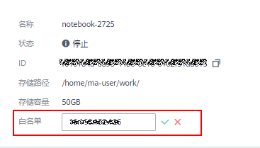
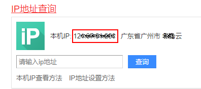

# 修改Notebook远程连接IP地址

在创建Notebook实例时，设置了允许远程连接Notebook的白名单IP地址。当用户需要更换一个IP地址远程连接Notebook实例时，可以在Notebook的实例详情页修改白名单IP地址。

1.  登录ModelArts管理控制台，在左侧菜单栏中选择“开发环境 \> Notebook“，进入新版Notebook管理页面。
2.  在Notebook列表，单击某个具体的实例名称，进入查看实例详情页面。单击白名单右侧的修改，可以修改允许远程访问Notebook的IP地址。修改后，单击保存即可。

    **图 1**  修改白名单IP地址  
    

    此处的IP地址，请填写外网IP地址。如果用户使用的访问机器和华为云ModelArts服务的网络有隔离，则访问机器的外网地址需要在主流搜索引擎中搜索“IP地址查询”获取，而不是使用ipconfig或ifconfigip命令在本地查询。

    **图 2**  查询外网IP地址  
    

