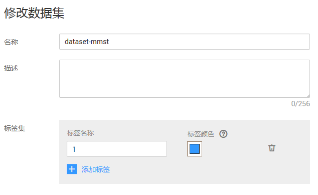

# 修改数据集

对于已创建的数据集，您可以修改数据集的基本信息以匹配业务变化。

## 前提条件

已存在创建完成的数据集。

## 修改数据集基本信息

1.  登录ModelArts管理控制台，在左侧菜单栏中选择“数据管理（Beta） \> 数据集“，进入“数据集“管理页面。
2.  在数据集列表中，单击操作列的“更多 \> 修改“。

    或者，您可以单击数据集名称，进入数据集“概览“页，在页面右上角单击“修改“。

3.  参考[表1](#table151481125214)修改数据集基本信息，然后单击“确定“完成修改。

    > **说明：**   
    >针对“物体检测“类型的数据集，如果已启用团队标注，无法将其修改为不启用团队标注。  

    **图 1**  修改数据集  
    

    **表 1**  参数说明

    
    <table><thead align="left"><tr id="row414119529"><th class="cellrowborder" valign="top" width="26.479999999999997%" id="mcps1.2.3.1.1">
参数

    </th>
    <th class="cellrowborder" valign="top" width="73.52%" id="mcps1.2.3.1.2">
说明

    </th>
    </tr>
    </thead>
    <tbody><tr id="row115515529"><td class="cellrowborder" valign="top" width="26.479999999999997%" headers="mcps1.2.3.1.1 ">
名称

    </td>
    <td class="cellrowborder" valign="top" width="73.52%" headers="mcps1.2.3.1.2 ">
数据集的名称，名称只能是字母、数字、下划线或者中划线组成的合法字符串。

    </td>
    </tr>
    <tr id="row181516125215"><td class="cellrowborder" valign="top" width="26.479999999999997%" headers="mcps1.2.3.1.1 ">
描述

    </td>
    <td class="cellrowborder" valign="top" width="73.52%" headers="mcps1.2.3.1.2 ">
数据集的简要描述。

    </td>
    </tr>
    <tr id="row815131145210"><td class="cellrowborder" valign="top" width="26.479999999999997%" headers="mcps1.2.3.1.1 ">
标签集

    </td>
    <td class="cellrowborder" valign="top" width="73.52%" headers="mcps1.2.3.1.2 ">
仅“图像分类”、“物体检测”、“声音分类”、“命名实体”、“文本分类”类型的数据集涉及修改“标签集”，且只有“命名实体”、“物体检测”、“文本分类”类型的数据集涉及修改“标签颜色”。

    <ul id="ul6460155605215"><li><strong id="b44597565527">修改标签名称</strong>：在标签名称文本框中，输入标签名称。标签名称只能是中文、字母、数字、下划线或中划线组成的合法字符串。长度为1～32字符。</li><li><strong id="b789413811248">添加标签属性</strong>：针对“物体检测”类型的数据集，支持为标签添加标签属性。</li><li><strong id="b045915655217">添加标签</strong>：单击添加标签。</li><li><strong id="b54601456195210">设置标签颜色</strong>：在每个标签右侧的标签颜色区域下，单击，然后在如下所示色板中选择颜色，或者直接输入十六进制颜色码进行设置。

    </li></ul>
    </td>
    </tr>
    </tbody>
    </table>

