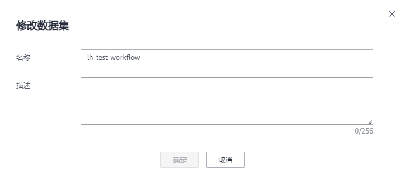

# 修改数据集

对于已创建的数据集，您可以修改数据集的基本信息以匹、配业务变化。

## 前提条件

已存在创建完成的数据集。

## 修改数据集基本信息

1.  登录ModelArts管理控制台，在左侧菜单栏中选择“数据管理\>数据集“，进入“数据集“管理页面。
2.  在数据集列表中，单击操作列的“修改“。

    或者，您可以单击数据集名称，进入数据集“概览“页，在页面右上角单击“修改“。

3.  参考[表1](#zh-cn_topic_0170886811_table151481125214)修改数据集基本信息，然后单击“确定“完成修改。

    **图 1**  修改数据集  
    

    **表 1**  参数说明

    
    <table><thead align="left"><tr id="zh-cn_topic_0170886811_row414119529"><th class="cellrowborder" valign="top" width="26.479999999999997%" id="mcps1.2.3.1.1">
参数

    </th>
    <th class="cellrowborder" valign="top" width="73.52%" id="mcps1.2.3.1.2">
说明

    </th>
    </tr>
    </thead>
    <tbody><tr id="zh-cn_topic_0170886811_row115515529"><td class="cellrowborder" valign="top" width="26.479999999999997%" headers="mcps1.2.3.1.1 ">
名称

    </td>
    <td class="cellrowborder" valign="top" width="73.52%" headers="mcps1.2.3.1.2 ">
数据集的名称，名称只能是字母、数字、下划线或者中划线组成的合法字符串。

    </td>
    </tr>
    <tr id="zh-cn_topic_0170886811_row181516125215"><td class="cellrowborder" valign="top" width="26.479999999999997%" headers="mcps1.2.3.1.1 ">
描述

    </td>
    <td class="cellrowborder" valign="top" width="73.52%" headers="mcps1.2.3.1.2 ">
数据集的简要描述。

    </td>
    </tr>
    </tbody>
    </table>

