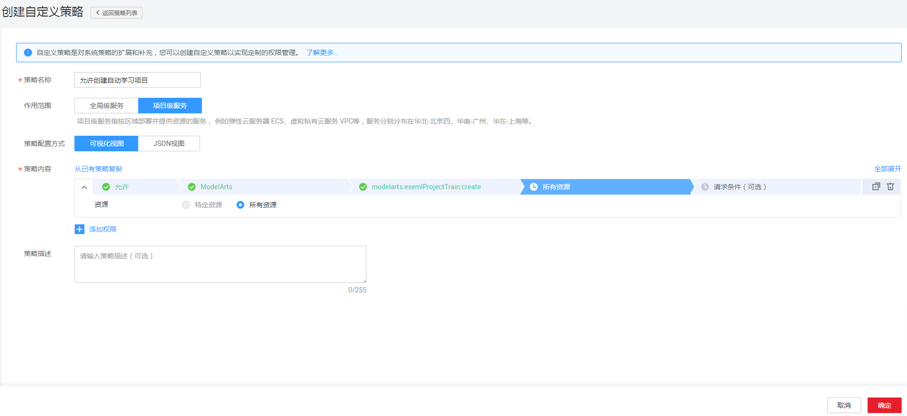
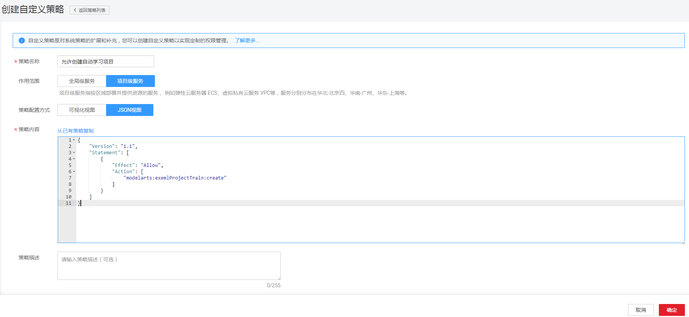

# 创建ModelArts自定义策略<a name="modelarts_23_0080"></a>

如果系统预置的ModelArts权限，不满足您的授权要求，可以创建自定义策略。自定义策略中可以添加的授权项（Action）请参考[《ModelArts API参考》\>权限策略和授权项](https://support.huaweicloud.com/api-modelarts/modelarts_03_0146.html)。如下以定制一个禁止创建和删除资源的权限策略为例。

## 前提条件<a name="section1783020250912"></a>

-   请先在IAM控制台中开通细粒度策略，开通方法请参见：[申请细粒度访问控制公测](https://support.huaweicloud.com/usermanual-iam/iam_01_019.html)。
-   自定义策略需要编写策略（JSON格式），请您先熟悉策略结构，具体请参见[策略语法：细粒度策略](策略语法-细粒度策略.md)。
-   请确定自定义策略需要允许哪些操作，拒绝哪些操作，并获取操作对应的授权项。授权项请参见：[《ModelArts API参考》\>权限策略和授权项](https://support.huaweicloud.com/api-modelarts/modelarts_03_0146.html)。

## 可视化视图配置自定义策略<a name="section24744865"></a>

1.  在IAM控制台，单击左侧导航栏的“策略”，在右上角选择“创建自定义策略”。

    

2.  在“创建自定义策略”中，配置如下信息：

    

    -   “策略名称”：填写“允许创建自动学习项目”。
    -   “作用范围”：根据服务的属性填写，ModelArts为项目级服务，选择“项目级服务”。
    -   “策略配置方式”：选择可视化视图。
    -   “策略内容”：选择“允许”。

3.  在“云服务”中选择“ModelArts”。
4.  在“操作”中勾选“ReadWrite”中的“modelarts:exemlProject:create”，即“允许创建自动学习项目”。
5.  单击“确定”后，自定义策略创建成功。

## JSON视图配置自定义策略<a name="section21377195"></a>

1.  在IAM控制台，单击左侧导航栏的“策略”，在右上角选择“创建自定义策略”。

    

2.  在“创建自定义策略”中，填写如下参数：

    

    -   “策略名称”：填写“允许创建自动学习项目”。
    -   “作用范围”：根据服务的属性填写，ModelArts为项目级服务，选择“项目级服务”。
    -   “策略配置方式”：JSON视图。
    -   “策略内容”：将如下内容拷贝至策略内容中。如下策略表示允许创建自动学习项目。

        ```
        {
            "Version": "1.1",
            "Statement": [
                {
                    "Effect": "Allow",
                    "Action": [
                        "modelarts:exemlProject:create"
                    ]
                }
            ]
        }
        ```

3.  单击“确定”后，系统会自动校验语法，如跳转到策略列表，则自定义策略创建成功；如提示“策略内容错误”，请按照语法规范进行修改。

## 验证自定义策略权限<a name="section4940144546"></a>

1.  将新创建的自定义策略授予用户组，使得用户组中的用户仅具备_变更云服务器规格_的权限。
2.  用户登录并验证自定义策略定义的权限：变更云服务器规格。

    权限授予成功后，用户可以通过控制台以及REST API等多种方式验证。此处以登录控制台为例，介绍用户如何验证允许创建自动学习项目的权限。

    1.  使用新创建的用户登录华为云，登录方法选择为“IAM用户登录”。
        -   账号名为该IAM用户所属华为云账号的名称。
        -   用户名和密码为账号在IAM创建用户时输入的用户名和密码。

    2.  在ModelArts服务页面，进行创建自动学习项目操作，操作成功，权限配置正确并已生效。
    3.  尝试进行其他操作，例如：删除自动学习项目

        系统显示“权限不足”，权限配置正确并已生效。


## 策略样例<a name="section1493518251395"></a>

-   示例1：拒绝用户删除自动学习项目

    拒绝策略需要同时配合其他策略使用，否则没有实际作用。用户被授予的策略中，一个授权项的作用如果同时存在Allow和Deny，则遵循Deny优先。

    如果您给用户授予ModelArts Admin的系统策略，但不希望用户拥有ModelArts Admin中定义的删除自动学习项目权限，您可以创建一条拒绝删除自动学习项目的自定义策略，然后同时将ModelArts Admin和拒绝策略授予用户，根据Deny优先原则，则用户可以对ModelArts执行除了删除自动学习项目外的所有操作。拒绝策略示例如下：

    ```
    { 
          "Version": "1.1", 
          "Statement": [ 
                { 
    		  "Effect": "Deny", 
                      "Action": [ 
                            "modelarts:exemlProject:delete" 
                      ] 
                } 
          ] 
    }
    ```

-   示例2：仅为用户授予开发环境的使用权限

    为某一用户配置ModelArts开发环境的使用权限时，由于依赖OBS服务的授权，因此必须配置相关的OBS最小化权限项，包含OBS桶和OBS对象的权限。建议采用[多个授权项策略](策略语法-细粒度策略.md#section1228667174118)的方式配置，此用户的策略配置示例如下所示：

    ```
    { 
        "Version": "1.1", 
        "Statement": [ 
            { 
                "Effect": "Allow", 
                "Action": [ 
                    "obs:bucket:ListAllMyBuckets", 
                    "obs:bucket:CreateBucket", 
                    "obs:bucket:ListBucket" ,
                    "obs:bucket:ListBucketVersions" ,
                    "obs:bucket:HeadBucket" ,
                    "obs:bucket:PutBucketAcl" ,
                    "obs:object:PutObject" ,
                    "obs:object:GetObject" ,
                    "obs:object:GetObjectVersion" ,
                    "obs:object:GetObjectVersionAcl" 
                ] 
            }, 
            { 
                "Effect": "Allow", 
                "Action": [ 
                    "modelarts:notebook:list", 
                    "modelarts:notebook:create" ,
                    "modelarts:notebook:get" ,
                    "modelarts:notebook:update" ,
                    "modelarts:notebook:delete" ,
                    "modelarts:notebook:action" ,
                    "modelarts:notebook:access" 
                ] 
            } 
        ] 
    }
    ```


