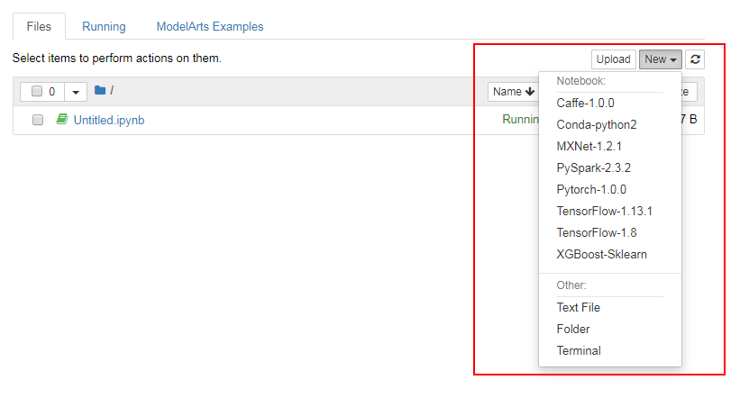

# 创建并打开Notebook

在开始进行模型开发前，您需要创建Notebook，并打开Notebook进行编码。

## 背景信息

-   创建和使用Notebook需要消耗资源，需要收费。根据您选择的资源不同，收费标准不同，针对不同类型资源的价格，详情请参见[产品价格详情](https://www.huaweicloud.com/price_detail.html#/modelarts_detail)。
-   “运行中“的Notebook将一直收费，当您不需要使用时，建议停止Notebook，避免产生不必要的费用。在创建Notebook时，也可以选择开启自动停止功能，在指定时间内停止运行Notebook，避免产生不必要的费用。
-   “启动中“、“停止“或“错误“状态的Notebook，无法执行打开操作。
-   一个账户最多创建10个Notebook。
-   由于ModelArts支持多种AI引擎，在创建Notebook实例时，首先选择Python2或Python3的工作环境，Notebook实例创建完成后，再访问Notebook实例，在Jupyter页面创建对应AI引擎的工作环境。详情指导请参见[选择不同AI引擎新建文件](#section498263112184)。
-   如果设置使用OBS存储，确保您指定的OBS目录与ModelArts在同一区域。

## 创建Notebook

1.  登录ModelArts管理控制台，在左侧菜单栏中选择“开发环境\>Notebook“，进入“Notebook“管理页面。
2.  单击“创建“进入“创建Notebook“页面，参考[表1](#table49201520828)填写信息。

    **表 1**  参数说明

    
    <table><thead align="left"><tr id="row199161820229"><th class="cellrowborder" valign="top" width="16.71%" id="mcps1.2.3.1.1">
参数名称

    </th>
    <th class="cellrowborder" valign="top" width="83.28999999999999%" id="mcps1.2.3.1.2">
说明

    </th>
    </tr>
    </thead>
    <tbody><tr id="row17917112012210"><td class="cellrowborder" valign="top" width="16.71%" headers="mcps1.2.3.1.1 ">
“计费方式”

    </td>
    <td class="cellrowborder" valign="top" width="83.28999999999999%" headers="mcps1.2.3.1.2 ">
按需计费。当前仅支持按需计费，无需修改。

    </td>
    </tr>
    <tr id="row1291714201927"><td class="cellrowborder" valign="top" width="16.71%" headers="mcps1.2.3.1.1 ">
“名称”

    </td>
    <td class="cellrowborder" valign="top" width="83.28999999999999%" headers="mcps1.2.3.1.2 ">
Notebook的名称。只能包含数字、字母、下划线和中划线，长度不能超过20位且不能为空。

    </td>
    </tr>
    <tr id="row27561314171414"><td class="cellrowborder" valign="top" width="16.71%" headers="mcps1.2.3.1.1 ">
“自动停止”

    </td>
    <td class="cellrowborder" valign="top" width="83.28999999999999%" headers="mcps1.2.3.1.2 ">
默认开启，且默认值为“1小时后”，表示该Notebook实例将在运行1小时之后自动停止，即1小时后停止计费。

    
开启自动停止功能后，可选择“1小时后”、“2小时后”、“4小时后”、“6小时后”或“自定义”几种模式。选择“自定义”模式时，可指定1~24小时范围内任意整数。

    </td>
    </tr>
    <tr id="row1917112010214"><td class="cellrowborder" valign="top" width="16.71%" headers="mcps1.2.3.1.1 ">
“描述”

    </td>
    <td class="cellrowborder" valign="top" width="83.28999999999999%" headers="mcps1.2.3.1.2 ">
对Notebook的简要描述。

    </td>
    </tr>
    <tr id="row8918182013219"><td class="cellrowborder" valign="top" width="16.71%" headers="mcps1.2.3.1.1 ">
“工作环境”

    </td>
    <td class="cellrowborder" valign="top" width="83.28999999999999%" headers="mcps1.2.3.1.2 ">
当前支持2种工作环境，分别为“Python2”和“Python3”，不同工作环境其对应可使用的AI引擎不同，详细支持列表请参见<a href="Notebook简介.md#section191109611479">支持的AI引擎</a>。

    
每个工作环境多种AI引擎，可以在同一个Notebook实例中使用所有支持的AI引擎，不同的引擎之间可快速、方便的切换，并且有独立的运行环境。您可以在Notebook实例创建完成后，进入Jupyter页面创建对应AI引擎的开发环境。

    
 说明： 

ModelArts还支持Keras引擎，详细说明请参见<a href="https://support.huaweicloud.com/modelarts_faq/modelarts_05_0042.html" target="_blank" rel="noopener noreferrer">ModelArts是否支持Keras引擎？</a>

    

    </td>
    </tr>
    <tr id="row1491818201024"><td class="cellrowborder" valign="top" width="16.71%" headers="mcps1.2.3.1.1 ">
“资源池”

    </td>
    <td class="cellrowborder" valign="top" width="83.28999999999999%" headers="mcps1.2.3.1.2 ">
可选公共资源池和专属资源池，关于ModelArts专属资源池的介绍和购买，请参见<a href="资源池.md">资源池</a>。

    </td>
    </tr>
    <tr id="row691916202217"><td class="cellrowborder" valign="top" width="16.71%" headers="mcps1.2.3.1.1 ">
“类型”

    </td>
    <td class="cellrowborder" valign="top" width="83.28999999999999%" headers="mcps1.2.3.1.2 ">
支持CPU和GPU两种类型。GPU性能更佳，但是相对CPU而言，费用更高。

    </td>
    </tr>
    <tr id="row13919142012210"><td class="cellrowborder" valign="top" width="16.71%" headers="mcps1.2.3.1.1 ">
“规格”

    </td>
    <td class="cellrowborder" valign="top" width="83.28999999999999%" headers="mcps1.2.3.1.2 ">
只有选择“公共资源池”时，需要选择规格。根据选择的类型不同，可选规格也不同。

    <ul id="ul0557112811613"><li>CPU规格支持：“2核8GiB”、“8核32GiB”。</li><li>GPU规格支持：“8核64GiB 1*p100”（默认）、“8核64Gi B 1*v100NV32”（仅在华北-北京四可用）</li></ul>
    </td>
    </tr>
    <tr id="row29205209212"><td class="cellrowborder" valign="top" width="16.71%" headers="mcps1.2.3.1.1 ">
“存储配置”

    </td>
    <td class="cellrowborder" valign="top" width="83.28999999999999%" headers="mcps1.2.3.1.2 ">
存储配置可选“云硬盘”和“对象存储服务”。

    <ul id="ul491912207219"><li>选择“云硬盘”作为存储位置
根据实际使用量设置磁盘规格。磁盘规格默认5GB。ModelArts提供5GB容量供用户免费使用。超出5GB时，超出部分每GB按“超高IO”类型的收费标准进行按需收费。磁盘规格的取值范围为5GB～500GB。

    
选择此模式，用户在Notebook列表的所有文件读写操作都是针对容器中的内容操作，与OBS无关；重启该实例，内容不丢失。

    </li><li>选择“对象存储服务”作为存储位置
在“存储位置”右侧单击“选择”，设置用于存储Notebook数据的OBS路径。如果想直接使用已有的文件或数据，可将数据提前上传至对应的OBS路径下。“存储位置”不能设置为OBS桶的根目录，需设置为对应OBS桶下的具体目录。

    
选择此模式，用户在Notebook列表的所有文件读写操作是基于所选择的OBS路径下的内容操作，与当前实例空间无关。如果您需要将内容同步到实例空间，先选中该内容，单击“Sync OBS”，即可将所选内容同步到当前容器空间，详细操作可参见<a href="使用Sync-OBS功能.md">使用Sync OBS功能</a>。重启该实例时，内容不丢失。

    </li></ul>
    </td>
    </tr>
    </tbody>
    </table>

3.  参数填写完成后，单击“下一步“进行规格确认。
4.  参数确认无误后，单击“立即创建“，完成Notebook的创建操作。

    进入Notebook列表，正在创建中的Notebook状态为“启动中“，创建过程需要几分钟，请耐心等待。当Notebook状态变为“运行中“时，表示Notebook已创建完成。

## 打开Notebook

在Notebook列表中，选择需要打开的Notebook，单击“操作“列中的“打开“，进入“Jupyter Notebook“开发页面。

在“Jupyter Notebook“页面中，有“Files“、“Running“、“Clusters“、“ModelArts Examples“4个页签。

**图 1**  Jupyter Notebook开发界面  

## 选择不同AI引擎新建文件

打开Notebook实例后，进入“Jupyter Notebook“页面，在“Files“页签下，您可以单击右上角“New“，然后选择所需的AI引擎，创建一个用于编码的文件。

**图 2**  选择不同的AI引擎  

