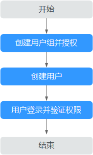

# 创建并授权使用ModelArts

如果您需要对您所拥有的ModelArts进行精细的权限管理，您可以使用[统一身份认证服务](https://support.huaweicloud.com/usermanual-iam/iam_01_0001.html)（Identity and Access Management，简称IAM），通过IAM，您可以：

-   根据企业的业务组织，在您的华为云帐号中，给企业中不同职能部门的员工创建IAM用户，让员工拥有唯一安全凭证，并使用ModelArts资源。
-   根据企业用户的职能，设置不同的访问权限，以达到用户之间的权限隔离。
-   将ModelArts资源委托给更专业、高效的其他华为云帐号或者云服务，这些帐号或者云服务可以根据权限进行代运维。

如果华为云帐号已经能满足您的要求，不需要创建独立的IAM用户，您可以跳过本章节，不影响您使用ModelArts服务的其它功能。

本章节为您介绍对用户授权的方法，操作流程如[图1](#fig144521252173120)所示。

## 前提条件

-   给用户组授权之前，请您了解用户组可以添加的ModelArts权限，并结合实际需求进行选择，ModelArts支持的系统权限，请参见：[ModelArts系统权限](https://support.huaweicloud.com/productdesc-modelarts/modelarts_01_0017.html)。
-   由于ModelArts的使用权限依赖OBS服务的授权，您需要为用户授予OBS的系统权限，详细说明请参见[OBS权限管理](https://support.huaweicloud.com/productdesc-obs/obs_03_0045.html)。
-   若您需要对除ModelArts和OBS之外的其它服务授权，IAM支持服务的所有策略请参见[权限策略](https://support.huaweicloud.com/usermanual-permissions/iam_01_0001.html)。

## 示例流程

**图 1**  给用户授权ModelArts权限流程  

1.  [创建用户组并授权](https://support.huaweicloud.com/usermanual-iam/iam_03_0001.html)

    在IAM控制台创建用户组，并授予“ModelArts CommonOperations“权限。

    由于ModelArts依赖OBS权限，请为用户组授予“作用范围“为“全局级服务“的“Tenant Administrator“策略。

2.  [创建用户并加入用户组](https://support.huaweicloud.com/usermanual-iam/iam_02_0001.html)

    在IAM控制台创建用户，并将其加入[1](#li745043065117)中创建的用户组。

3.  [用户登录](https://support.huaweicloud.com/usermanual-iam/iam_01_0552.html)并验证权限

    新创建的用户登录控制台，切换至授权区域，验证权限：

    -   在“服务列表”中选择ModelArts，进入ModelArts主界面，单击“专属资源\>创建”，如果无法进行创建（假设当前权限仅包含ModelArts CommonOperations），表示“ModelArts CommonOperations”已生效。
    -   在“服务列表”中选择除ModelArts外（假设当前策略仅包含ModelArts CommonOperations）的任一服务，若提示权限不足，表示“ModelArts CommonOperations”已生效。
    -   在“服务列表”中选择ModelArts，进入ModelArts主界面，单击“数据管理\>数据集\>创建数据集”，如果可以成功访问对应的OBS路径，表示全局级服务的“Tenant Administrator”已生效。

