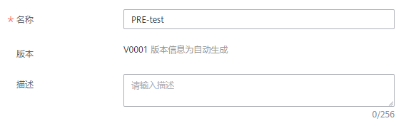
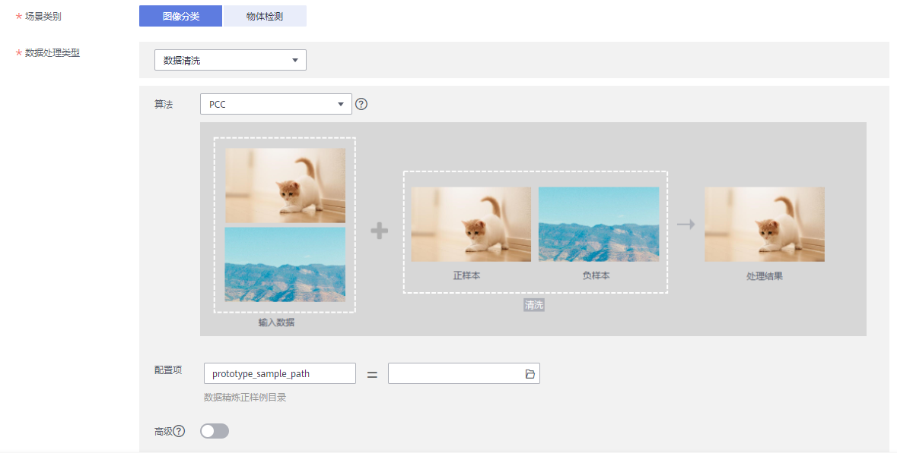
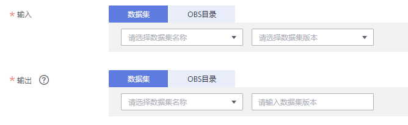
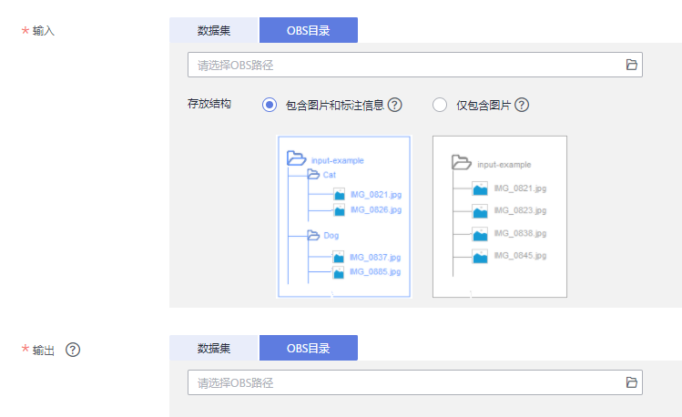

# 创建数据处理任务

您可以创建一个数据处理任务，对已有的数据进行数据校验、数据清洗、数据选择或者数据增强操作。

## 前提条件

-   数据已准备完成：已经创建数据集或者已经将数据上传至OBS
-   确保您使用的OBS与ModelArts在同一区域

## 创建数据处理任务

1.  登录ModelArts管理控制台，在左侧的导航栏中选择“数据管理\>数据处理“，进入“数据处理“页面。
2.  在“数据处理“页面，单击“创建“进入“创建数据处理“页面。
3.  在创建数据处理页面，填写相关算法参数。
    1.  填写基本信息。基本信息包括“名称“、“版本“和“描述“。其中“版本“信息由系统自动生成，按“V0001“、“V0002“规则命名，用户无法修改。

        您可以根据实际情况填写“名称“和“描述“信息。

        **图 1**  创建数据处理基本信息  
        

    2.  设置场景类别。场景类别当前支持“图像分类“和“物体检测“。
    3.  设置数据处理类型。数据处理类型支持“数据清洗“、“数据校验“、“数据选择“和“数据增强“。

        针对不同的数据处理类型，您需要填写相应算子的设置参数，算子的详细参数参见[预置算子说明](预置算子说明.md)。

        **图 2**  设置场景类别和数据处理类型  
        

    4.  设置输入与输出。需根据实际数据情况选择“数据集“或“OBS目录“。设置为“数据集“时，需填写“数据集名称“和“数据集版本“；设置为“OBS目录“时，需填写正确的OBS路径。

        **图 3**  输入输出设置-数据集  
        

        **图 4**  输入输出设置-OBS目录  
        

    5.  确认参数填写无误后，单击“创建“，完成数据处理任务的创建。

