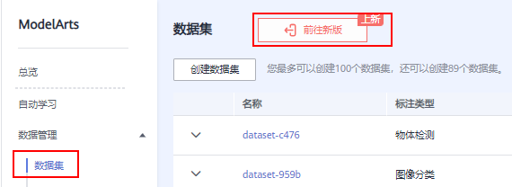
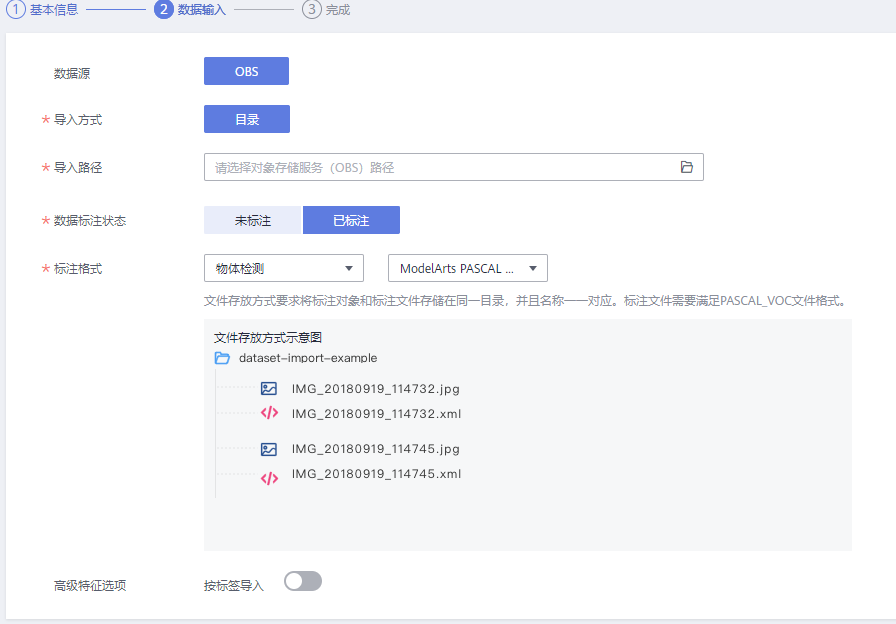
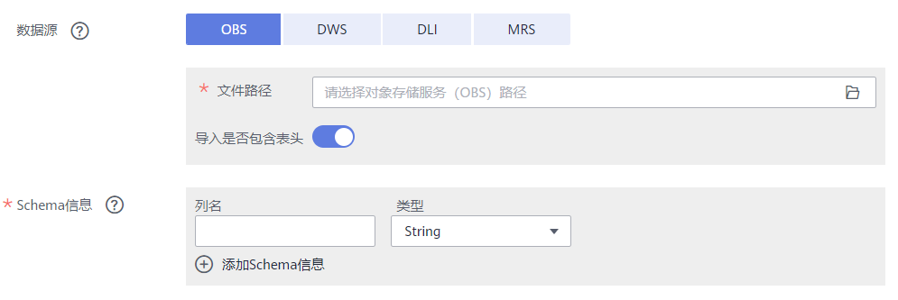

# 创建数据集

在ModelArts进行数据管理时，首先您需要创建一个数据集，后续的操作，如标注数据、导入数据、数据集发布等，都是基于您创建的数据集。

> **说明：** 
>当前ModelArts同时存在新版数据集和旧版数据集。
>新版数据集在旧版的基础上将创建数据集和创建标注任务进行了解耦，创建数据集和创建标注作业分别是独立的任务，使用更灵活。
>本文档主要介绍新版数据集创建流程。旧版数据集创建，请参考[创建数据集（旧版）](https://support.huaweicloud.com/engineers-modelarts/modelarts_23_0004_0.html)。

## 前提条件

-   数据管理功能需要获取访问OBS权限，在未进行委托授权之前，无法使用此功能。在使用数据管理功能之前，请前往“全局配置”页面，使用委托完成访问授权。
-   已创建用于存储数据的OBS桶及文件夹。并且，数据存储的OBS桶与ModelArts在同一区域。

## 操作步骤

1.  登录ModelArts管理控制台，在左侧菜单栏中选择“数据管理\> 数据集“，单击“前往新版“，进入新版“数据集“管理页面。

    **图 1**  进入新版数据集  
    

2.  单击“创建数据集“，进入“创建数据集“页面，根据数据类型以及数据标注要求，选择创建不同类型的数据集。
    1.  填写数据集基本信息，数据集的“名称“、“描述“、“数据格式“、“数据类型“和“数据集输出位置“。ModelArts目前支持的类型及其说明请参见[数据集的类型](数据管理简介.md#zh-cn_topic_0171496996_section51771731153811)。

        **图 2**  数据集基本信息  
        

    2.  基本信息填写完成后，单击“下一步”，填写数据集的数据输入信息，选择“导入路径”、“数据标注状态”、和数据“标注格式”。

        针对不同类型的数据集，数据输入支持的标注格式不同，ModelArts目前支持的标注格式及其说明请参见[导入数据](导入数据.md)。

        **图 3**  选择数据格式和数据类型  
        

    3.  参数填写无误后，单击页面右下角“创建“。

        数据集创建完成后，系统自动跳转至数据集管理页面，针对创建好的数据集，您可以执行数据导入、发布、修改、删除、数据处理、数据标注、数据特征、版本管理和导出操作。

        不同类型数据集，支持的操作请参见[不同类型数据集支持的功能](数据管理简介.md#table475114812297)。

## 文件型（图片、音频、文本、视频、自由格式）

**表 1**  数据集的详细参数

<table><thead align="left"><tr id="row9965104219516"><th class="cellrowborder" valign="top" width="21.38%" id="mcps1.2.3.1.1">
参数名称

</th>
<th class="cellrowborder" valign="top" width="78.62%" id="mcps1.2.3.1.2">
说明

</th>
</tr>
</thead>
<tbody><tr id="row7965442105117"><td class="cellrowborder" valign="top" width="21.38%" headers="mcps1.2.3.1.1 ">
数据集输出位置

</td>
<td class="cellrowborder" valign="top" width="78.62%" headers="mcps1.2.3.1.2 ">
选择数据集输出位置的OBS路径，此位置会存放输出的标注信息等文件。

 说明： 

“数据集输出位置”不能与“数据输入路径”为同一路径，且不能是“数据输入路径”的子目录。

“数据集输出位置”建议选择一个空目录。

</td>
</tr>
<tr id="row096544210518"><td class="cellrowborder" valign="top" width="21.38%" headers="mcps1.2.3.1.1 ">
导入路径

</td>
<td class="cellrowborder" valign="top" width="78.62%" headers="mcps1.2.3.1.2 ">
选择需要导入数据的OBS路径，此位置会作为数据集的数据存储路径。

 说明： 

创建数据集时，此OBS路径下的数据会导入数据集，后续若直接在OBS中修改数据，会造成数据集的数据与OBS的数据不一致，可能导致部分数据不可用。如果需要在数据集中修改数据，建议使用<a href="图像分类.md#section616011413170">同步新数据</a>或4章节<a href="导入数据.md">导入数据</a>功能。

</td>
</tr>
<tr id="row7965442105112"><td class="cellrowborder" valign="top" width="21.38%" headers="mcps1.2.3.1.1 ">
数据标注状态

</td>
<td class="cellrowborder" valign="top" width="78.62%" headers="mcps1.2.3.1.2 ">
选择数据的标注状态，分为“未标注”和“已标注”。

选择“已标注”时，需指定标注格式，并保证数据文件满足响应的格式规范，否则可能存在导入失败的情况。

仅图片（物体检测、图像分类、图像分割）、音频（声音分类）、文本（文本分类）类型的标注任务支持导入已标注数据。

</td>
</tr>
</tbody>
</table>

## 表格型（表格）

**图 4**  表格类型的参数  

> **说明：** 
>使用CSV文件时，需要注意以下两点：
>-   当数据类型选择String时，默认会把双引号内的数据当作一条，所以同一行数据需要保证双引号闭环，否则会导致数据过大，无法显示。
>-   当CSV文件的某一行的列数与定义的Schema不同，则会忽略当前行。

**表 2**  数据集的详细参数

<table><thead align="left"><tr id="row179220595614"><th class="cellrowborder" valign="top" width="21.38%" id="mcps1.2.3.1.1">
参数名称

</th>
<th class="cellrowborder" valign="top" width="78.62%" id="mcps1.2.3.1.2">
说明

</th>
</tr>
</thead>
<tbody><tr id="row1592214598610"><td class="cellrowborder" valign="top" width="21.38%" headers="mcps1.2.3.1.1 ">
数据集输出位置

</td>
<td class="cellrowborder" valign="top" width="78.62%" headers="mcps1.2.3.1.2 ">
选择表格数据存储路径（OBS路径），此位置会存放由数据源导入的数据。此位置不能和OBS数据源中的文件路径相同或为其子目录。

创建表格数据集后，在存储路径下会自动生成以下4个目录。

<ul id="ul11922559668"><li>annotation：版本发布目录，每次发布版本，会在此目录下生成和版本名称相同的子目录。</li><li>data：数据存放目录，导入的数据会放在此目录。</li><li>logs：日志存放目录。</li><li>temp：临时工作目录。</li></ul>
</td>
</tr>
<tr id="row692217591963"><td class="cellrowborder" valign="top" width="21.38%" headers="mcps1.2.3.1.1 ">
数据源（“OBS”）

</td>
<td class="cellrowborder" valign="top" width="78.62%" headers="mcps1.2.3.1.2 "><ul id="ul119222059266"><li>“文件路径”：单击输入框右侧按钮，可打开当前帐号下的所有OBS桶，请选择需要导入的数据文件所在目录。</li><li>“导入是否包含表头”：开启表示导入文件包含表头，此时会将导入文件的第一行作为列名，否则会添加默认列名，自动填写在Schema信息中。</li></ul>

OBS的详细功能说明，请参见《<a href="https://support.huaweicloud.com/usermanual-obs/obs_03_0054.html" target="_blank" rel="noopener noreferrer">OBS用户指南</a>》。

</td>
</tr>
<tr id="row13922959761"><td class="cellrowborder" valign="top" width="21.38%" headers="mcps1.2.3.1.1 ">
数据源（“DWS”）

</td>
<td class="cellrowborder" valign="top" width="78.62%" headers="mcps1.2.3.1.2 "><ul id="ul1292220591765"><li>“集群名称”：系统自动将当前账号下的DWS集群展现在列表中，您可以在下拉框中选择您所需的DWS集群。</li><li>“数据库名称”：根据选择的DWS集群，填写数据所在的数据库名称。</li><li>“表名称”：根据选择的数据库，填写数据所在的表。</li><li>“用户名”：输入DWS集群管理员用户的用户名。</li><li>“密码”：输入DWS集群管理员用户的密码。</li></ul>

DWS的详细功能说明，请参见《<a href="https://support.huaweicloud.com/dws/index.html" target="_blank" rel="noopener noreferrer">DWS用户指南</a>》。

 说明： 

从DWS导入数据，需要借助DLI的功能，如果用户没有访问DLI服务的权限，需根据页面提示创建DLI的委托。

</td>
</tr>
<tr id="row7923115916610"><td class="cellrowborder" valign="top" width="21.38%" headers="mcps1.2.3.1.1 ">
数据源（“DLI”）

</td>
<td class="cellrowborder" valign="top" width="78.62%" headers="mcps1.2.3.1.2 "><ul id="ul159237591762"><li>“队列名称”：系统自动将当前帐号下的DLI队列展现在列表中，您可以在下拉框中选择您所需的队列。</li><li>“数据库名称”：根据选择的队列展现所有的数据库，请在下拉框中选择您所需的数据库。</li><li>“表名称”：根据选择的数据库展现此数据库中的所有表。请在下拉框中选择您所需的表。</li></ul>

DLI的详细功能说明，请参见《<a href="https://support.huaweicloud.com/dli/index.html" target="_blank" rel="noopener noreferrer">DLI用户指南</a>》。

</td>
</tr>
<tr id="row19923185914615"><td class="cellrowborder" valign="top" width="21.38%" headers="mcps1.2.3.1.1 ">
数据源（“MRS”）

</td>
<td class="cellrowborder" valign="top" width="78.62%" headers="mcps1.2.3.1.2 "><ul id="ul1092313591612"><li>“集群名称”：系统自动将当前帐号下的MRS集群展现在此列表中，但是流式集群不支持导入操作。请在下拉框中选择您所需的集群。</li><li>“文件路径”：根据选择的集群，输入对应的文件路径，此文件路径为HDFS路径。</li><li>“导入是否包含表头”：开启表示导入时将表头同时导入。</li></ul>

MRS的详细功能说明，请参见《<a href="https://support.huaweicloud.com/mrs/index.html" target="_blank" rel="noopener noreferrer">MRS用户指南</a>》。

</td>
</tr>
<tr id="row992335920611"><td class="cellrowborder" valign="top" width="21.38%" headers="mcps1.2.3.1.1 ">
Schema信息

</td>
<td class="cellrowborder" valign="top" width="78.62%" headers="mcps1.2.3.1.2 ">
表格的列名和对应类型，需要跟导入数据的列数保持一致。请根据您导入的数据输入“列名”，同时选择此列的“类型”。其中支持的类型见<a href="#table1292316598616">表3</a>。

单击“添加Schema信息”，即可增加一行列。创建数据集时必须指定schema，且一旦创建不支持修改。

从OBS数据源导入数据，会自动获取文件路径下csv文件的schema，如果多个csv文件的schema不一致会报错。

</td>
</tr>
</tbody>
</table>

**表 3**  Schema数据类型说明

<table><thead align="left"><tr id="row892412596613"><th class="cellrowborder" valign="top" width="14.35143514351435%" id="mcps1.2.5.1.1">
类型

</th>
<th class="cellrowborder" valign="top" width="35.68356835683568%" id="mcps1.2.5.1.2">
描述

</th>
<th class="cellrowborder" valign="top" width="11.8011801180118%" id="mcps1.2.5.1.3">
存储空间

</th>
<th class="cellrowborder" valign="top" width="38.16381638163816%" id="mcps1.2.5.1.4">
范围

</th>
</tr>
</thead>
<tbody><tr id="row1792416595619"><td class="cellrowborder" valign="top" width="14.35143514351435%" headers="mcps1.2.5.1.1 ">
String

</td>
<td class="cellrowborder" valign="top" width="35.68356835683568%" headers="mcps1.2.5.1.2 ">
字符串

</td>
<td class="cellrowborder" valign="top" width="11.8011801180118%" headers="mcps1.2.5.1.3 ">
-

</td>
<td class="cellrowborder" valign="top" width="38.16381638163816%" headers="mcps1.2.5.1.4 ">
-

</td>
</tr>
<tr id="row10924135916614"><td class="cellrowborder" valign="top" width="14.35143514351435%" headers="mcps1.2.5.1.1 ">
Short

</td>
<td class="cellrowborder" valign="top" width="35.68356835683568%" headers="mcps1.2.5.1.2 ">
有符号整数

</td>
<td class="cellrowborder" valign="top" width="11.8011801180118%" headers="mcps1.2.5.1.3 ">
2字节

</td>
<td class="cellrowborder" valign="top" width="38.16381638163816%" headers="mcps1.2.5.1.4 ">
-32768-32767

</td>
</tr>
<tr id="row2924959461"><td class="cellrowborder" valign="top" width="14.35143514351435%" headers="mcps1.2.5.1.1 ">
Int

</td>
<td class="cellrowborder" valign="top" width="35.68356835683568%" headers="mcps1.2.5.1.2 ">
有符号整数

</td>
<td class="cellrowborder" valign="top" width="11.8011801180118%" headers="mcps1.2.5.1.3 ">
4字节

</td>
<td class="cellrowborder" valign="top" width="38.16381638163816%" headers="mcps1.2.5.1.4 ">
-2147483648～2147483647

</td>
</tr>
<tr id="row39242591562"><td class="cellrowborder" valign="top" width="14.35143514351435%" headers="mcps1.2.5.1.1 ">
Long

</td>
<td class="cellrowborder" valign="top" width="35.68356835683568%" headers="mcps1.2.5.1.2 ">
有符号整数

</td>
<td class="cellrowborder" valign="top" width="11.8011801180118%" headers="mcps1.2.5.1.3 ">
8字节

</td>
<td class="cellrowborder" valign="top" width="38.16381638163816%" headers="mcps1.2.5.1.4 ">
-9223372036854775808～9223372036854775807

</td>
</tr>
<tr id="row17924185918612"><td class="cellrowborder" valign="top" width="14.35143514351435%" headers="mcps1.2.5.1.1 ">
Double

</td>
<td class="cellrowborder" valign="top" width="35.68356835683568%" headers="mcps1.2.5.1.2 ">
双精度浮点型

</td>
<td class="cellrowborder" valign="top" width="11.8011801180118%" headers="mcps1.2.5.1.3 ">
8字节

</td>
<td class="cellrowborder" valign="top" width="38.16381638163816%" headers="mcps1.2.5.1.4 ">
-

</td>
</tr>
<tr id="row119240590616"><td class="cellrowborder" valign="top" width="14.35143514351435%" headers="mcps1.2.5.1.1 ">
Float

</td>
<td class="cellrowborder" valign="top" width="35.68356835683568%" headers="mcps1.2.5.1.2 ">
单精度浮点型

</td>
<td class="cellrowborder" valign="top" width="11.8011801180118%" headers="mcps1.2.5.1.3 ">
4字节

</td>
<td class="cellrowborder" valign="top" width="38.16381638163816%" headers="mcps1.2.5.1.4 ">
-

</td>
</tr>
<tr id="row179241598612"><td class="cellrowborder" valign="top" width="14.35143514351435%" headers="mcps1.2.5.1.1 ">
Byte

</td>
<td class="cellrowborder" valign="top" width="35.68356835683568%" headers="mcps1.2.5.1.2 ">
有符号整数

</td>
<td class="cellrowborder" valign="top" width="11.8011801180118%" headers="mcps1.2.5.1.3 ">
1字节

</td>
<td class="cellrowborder" valign="top" width="38.16381638163816%" headers="mcps1.2.5.1.4 ">
-128-127

</td>
</tr>
<tr id="row1592510598610"><td class="cellrowborder" valign="top" width="14.35143514351435%" headers="mcps1.2.5.1.1 ">
Date

</td>
<td class="cellrowborder" valign="top" width="35.68356835683568%" headers="mcps1.2.5.1.2 ">
日期类型，描述了特定的年月日，格式：yyyy-MM-dd，例如2014-05-29

</td>
<td class="cellrowborder" valign="top" width="11.8011801180118%" headers="mcps1.2.5.1.3 ">
-

</td>
<td class="cellrowborder" valign="top" width="38.16381638163816%" headers="mcps1.2.5.1.4 ">
-

</td>
</tr>
<tr id="row7925059368"><td class="cellrowborder" valign="top" width="14.35143514351435%" headers="mcps1.2.5.1.1 ">
Timestamp

</td>
<td class="cellrowborder" valign="top" width="35.68356835683568%" headers="mcps1.2.5.1.2 ">
时间戳，表示日期和时间。格式：yyyy-MM-dd HH:mm:ss

</td>
<td class="cellrowborder" valign="top" width="11.8011801180118%" headers="mcps1.2.5.1.3 ">
-

</td>
<td class="cellrowborder" valign="top" width="38.16381638163816%" headers="mcps1.2.5.1.4 ">
-

</td>
</tr>
<tr id="row2925135919615"><td class="cellrowborder" valign="top" width="14.35143514351435%" headers="mcps1.2.5.1.1 ">
Boolean

</td>
<td class="cellrowborder" valign="top" width="35.68356835683568%" headers="mcps1.2.5.1.2 ">
布尔类型

</td>
<td class="cellrowborder" valign="top" width="11.8011801180118%" headers="mcps1.2.5.1.3 ">
1字节

</td>
<td class="cellrowborder" valign="top" width="38.16381638163816%" headers="mcps1.2.5.1.4 ">
TRUE/FALSE

</td>
</tr>
</tbody>
</table>

