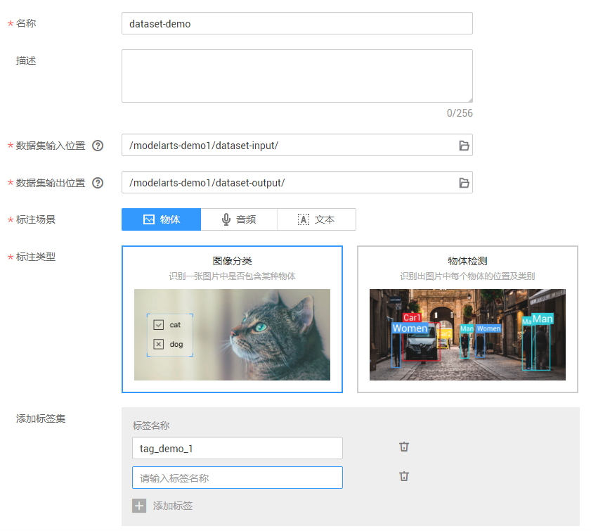
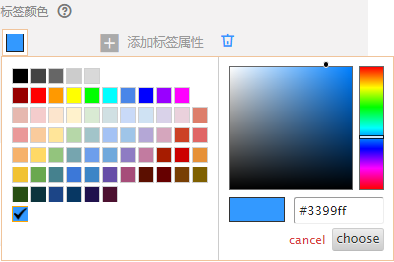

# 创建数据集

在ModelArts进行数据管理时，首先您需要创建一个数据集，后续的操作，如标注数据、导入数据、数据集发布等，都是基于您创建和管理的数据集。

## 前提条件

-   数据管理功能需要获取访问OBS权限，在未进行委托授权之前，无法使用此功能。您可以在“数据管理（Beta） \> 数据集“页面，单击“服务授权“，由具备授权的账号“同意授权“后，即可使用。
-   已创建用于存储数据的OBS桶及文件夹。并且，数据存储的OBS桶与ModelArts在同一区域。
-   需要使用的数据已上传至OBS。

## 操作步骤

1.  登录ModelArts管理控制台，在左侧菜单栏中选择“数据管理（Beta） \> 数据集“，进入“数据集“管理页面。
2.  单击“创建数据集“，在创建数据集页面，参考[表1](#table23211921112213)填写信息，然后单击“创建“。

    **图 1**  创建数据集  
    

    **表 1**  参数说明

    
    <table><thead align="left"><tr id="row93205217220"><th class="cellrowborder" valign="top" width="21.38%" id="mcps1.2.3.1.1">
参数名称

    </th>
    <th class="cellrowborder" valign="top" width="78.62%" id="mcps1.2.3.1.2">
说明

    </th>
    </tr>
    </thead>
    <tbody><tr id="row332072152218"><td class="cellrowborder" valign="top" width="21.38%" headers="mcps1.2.3.1.1 ">
名称

    </td>
    <td class="cellrowborder" valign="top" width="78.62%" headers="mcps1.2.3.1.2 ">
数据集的名称，名称只能是字母、数字、下划线或者中划线组成的合法字符串。

    </td>
    </tr>
    <tr id="row1332082114226"><td class="cellrowborder" valign="top" width="21.38%" headers="mcps1.2.3.1.1 ">
描述

    </td>
    <td class="cellrowborder" valign="top" width="78.62%" headers="mcps1.2.3.1.2 ">
数据集的简要描述。

    </td>
    </tr>
    <tr id="row8320521152212"><td class="cellrowborder" valign="top" width="21.38%" headers="mcps1.2.3.1.1 ">
数据集输入位置

    </td>
    <td class="cellrowborder" valign="top" width="78.62%" headers="mcps1.2.3.1.2 ">
单击选择数据集输入位置的OBS路径。

    </td>
    </tr>
    <tr id="row032162112228"><td class="cellrowborder" valign="top" width="21.38%" headers="mcps1.2.3.1.1 ">
数据集输出位置

    </td>
    <td class="cellrowborder" valign="top" width="78.62%" headers="mcps1.2.3.1.2 ">
单击选择数据集输出位置的OBS路径。

    
 说明： 

“数据集输出位置”不能与“数据集输入位置”为同一路径，且不能是“数据集输入位置”的子目录。

    

    </td>
    </tr>
    <tr id="row77214335814"><td class="cellrowborder" valign="top" width="21.38%" headers="mcps1.2.3.1.1 ">
标注场景

    </td>
    <td class="cellrowborder" valign="top" width="78.62%" headers="mcps1.2.3.1.2 ">
可选择“物体”、“音频”和“文本”三种标注场景。

    </td>
    </tr>
    <tr id="row63031058350"><td class="cellrowborder" valign="top" width="21.38%" headers="mcps1.2.3.1.1 ">
标注类型

    </td>
    <td class="cellrowborder" valign="top" width="78.62%" headers="mcps1.2.3.1.2 "><ul id="ul17863164214481"><li>标注场景为“物体”时<ul id="ul65891048194813"><li>图像分类：识别一张图片中是否包含某种物体。</li><li>物体检测：识别出图片中每个物体的位置及类别。</li></ul>
    </li><li>标注场景为“音频”时<ul id="ul780114539486"><li>声音分类：对声音进行分类。</li><li>语音内容：对语音内容进行标注。</li><li>语音分割：对语音进行分段标注。</li></ul>
    </li><li>标注场景为“文本”时<ul id="ul341715563481"><li>文本分类：对文本的内容按照标签进行分类处理。</li><li>命名实体：针对文本中的实体片段进行标注，如“时间”、“地点”等。</li><li>文本三元组：针对文本中的实体片段和实体之间的关系进行标注。</li></ul>
    </li></ul>
    </td>
    </tr>
    <tr id="row9921552103716"><td class="cellrowborder" valign="top" width="21.38%" headers="mcps1.2.3.1.1 ">
添加标签集

    </td>
    <td class="cellrowborder" valign="top" width="78.62%" headers="mcps1.2.3.1.2 "><ul id="ul1050710321403"><li><strong id="b1298114512011">设置标签名称</strong>：在标签名称文本框中，输入标签名称。标签名称只能是中文、字母、数字、下划线或中划线组成的合法字符串。长度为1～32字符。</li><li><strong id="b789413811248">添加标签属性</strong>：针对“物体检测”类型的数据集，支持为标签添加标签属性。</li><li><strong id="b13661481202">添加标签</strong>：单击添加标签。</li><li><strong id="b82591522009">设置标签颜色</strong>：在每个标签右侧的标签颜色区域下，单击，然后在如下所示色板中选择颜色，或者直接输入十六进制颜色码进行设置。

    </li></ul>
    </td>
    </tr>
    <tr id="row153988545298"><td class="cellrowborder" valign="top" width="21.38%" headers="mcps1.2.3.1.1 ">
启用团队标注

    </td>
    <td class="cellrowborder" valign="top" width="78.62%" headers="mcps1.2.3.1.2 ">
当选择的“标注类型”为“物体检测”时，支持“团队标注”功能。您可以选择是否启用团队标注。

    
在启用“团队标注”前，需确保您已经在“标注团队”管理页面，添加相应的团队以及成员。如果没有标注团队，可直接从界面链接跳转至“标注团队”页面，添加您的团队并为其添加成员。详细指导请参见<a href="团队标注简介.md">团队标注简介</a>。

    
启用团队标注功能的数据集，在创建完成后，可以在“标注类型”中看到“团队标注”的标识。

    </td>
    </tr>
    </tbody>
    </table>

    数据集创建完成后，系统自动跳转至数据集管理页面，针对创建好的数据集，您可以执行标注数据、发布、管理版本、修改、导入和删除等操作。

