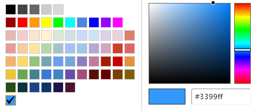

# 创建标注作业

由于模型训练过程需要大量有标签的数据，因此在模型训练之前需对没有标签的数据添加标签。您可以通过创建单人标注作业或团队标注作业对数据进行手工标注，或对任务启动智能标注添加标签，快速完成对图片的标注操作，也可以对已标注图片修改或删除标签进行重新标注。

## 标注作业支持的数据类型

对于不同类型的数据集，用户可以选择不同的标注任务，当前ModelArts支持如下类型的标注任务。

-   图片
    -   图像分类：识别一张图片中是否包含某种物体。
    -   物体检测：识别出图片中每个物体的位置及类别。
    -   图像分割：根据图片中的物体划分出不同区域。

-   音频
    -   声音分类：对声音进行分类。
    -   语音内容：对语音内容进行标注。
    -   语音分割：对语音进行分段标注。

-   文本
    -   文本分类：对文本的内容按照标签进行分类处理。
    -   命名实体：针对文本中的实体片段进行标注，如“时间”、“地点”等。
    -   文本三元组：针对文本中的实体片段和实体之间的关系进行标注。

-   视频

    视频标注：识别出视频中每个物体的位置及分类。目前仅支持mp4格式。

## 前提条件

在进行数据标注前，需要创建相应类型的数据集。具体步骤参考[创建数据集](https://support.huaweicloud.com/dataprepare-modelarts/dataprepare-modelarts-0006.html)。

## 操作步骤

1.  登录ModelArts管理控制台，在左侧菜单栏中选择“数据管理\> 数据标注“，进入“数据标注“管理页面。
2.  单击“创建标注作业“，进入“创建标注作业“页面，根据需求创建不同类型的标注作业。
    1.  填写标注作业基本信息，标注作业的“名称“和“描述“。

        **图 1**  标注作业基本信息  
        

    2.  根据您的需求，选择“标注场景“和“标注类型“。

        **图 2**  选择标注场景和标注类型  
        

    3.  针对不同类型的标注作业，需填写参数不同，请参考如下类型标注作业对应的参数介绍。
        -   [图片（图像分类、物体检测、图像分割）](#section8625131415541)
        -   [音频（声音分类、语音内容、语音分割）](#section17893314546)
        -   [文本（文本分类、命名实体、文本三元组）](#section16230452125420)
        -   [视频](#section1357212065510)

    4.  参数填写无误后，单击页面右下角“创建“。

        标注作业创建完成后，系统自动跳转至数据标注管理页面，针对创建好的标注作业，您可以执行智能标注、发布、修改和删除等操作。

## 图片（图像分类、物体检测、图像分割）

**图 3**  图像分类和物体检测类型的参数  

**表 1**  图片类型标注作业的详细参数

<table><thead align="left"><tr id="row104281010184813"><th class="cellrowborder" valign="top" width="16.56%" id="mcps1.2.3.1.1">
参数名称

</th>
<th class="cellrowborder" valign="top" width="83.44%" id="mcps1.2.3.1.2">
说明

</th>
</tr>
</thead>
<tbody><tr id="row696205562719"><td class="cellrowborder" valign="top" width="16.56%" headers="mcps1.2.3.1.1 ">
数据集名称

</td>
<td class="cellrowborder" valign="top" width="83.44%" headers="mcps1.2.3.1.2 ">
选择支持当前标注类型的数据集。

</td>
</tr>
<tr id="row2961355182718"><td class="cellrowborder" valign="top" width="16.56%" headers="mcps1.2.3.1.1 ">
添加标签集

</td>
<td class="cellrowborder" valign="top" width="83.44%" headers="mcps1.2.3.1.2 "><ul id="ul296855172717"><li><strong id="b11971755202718">设置标签名称</strong>：在标签名称文本框中，输入标签名称。标签名称只能是中文、字母、数字、下划线或中划线组成的合法字符串。长度为1～32字符。</li><li><strong id="b109785512279">添加标签</strong>：单击“添加标签”可增加多个标签。</li><li><strong id="b597655152717">设置标签颜色</strong>：仅“物体检测”类型标注作业需设置此参数。在每个标签右侧的标签颜色区域下，可在色板中选择颜色，或者直接输入十六进制颜色码进行设置。</li><li><strong id="b12783182325219">设置标签属性</strong>：针对“物体检测”类型标注作业，在设置完标签颜色后，可在右侧单击加号，增加对应的标签属性。标签属性用于区分同一标签物体的不同属性。例如，黄色小猫、黑色小猫。标签为cat，颜色为不同的标签属性。</li></ul>
</td>
</tr>
<tr id="row18467937132814"><td class="cellrowborder" valign="top" width="16.56%" headers="mcps1.2.3.1.1 ">
启用团队标注

</td>
<td class="cellrowborder" valign="top" width="83.44%" headers="mcps1.2.3.1.2 ">
选择是否启用团队标注。图像分割暂不支持团队标注，当选择图像分割类型时，界面不显示此参数。

启用团队标注功能，需填写对应的团队标注任务“名称”、“类型”，同时选择对应的“标注团队”及参与标注的“团队成员”。参数详细介绍请参见<a href="管理团队标注任务.md">管理团队标注任务</a>。

在启用“团队标注”前，需确保您已经在“标注团队”管理页面，添加相应的团队以及成员。如果没有标注团队，可直接从界面链接跳转至“标注团队”页面，添加您的团队并为其添加成员。详细指导请参见<a href="团队标注简介.md">团队标注简介</a>。

启用团队标注功能的数据集，在创建完成后，可以在“标注类型”中看到“团队标注”的标识。

</td>
</tr>
</tbody>
</table>

## 音频（声音分类、语音内容、语音分割）

**图 4**  声音分类、语音内容、语音分割类型的参数  

**表 2**  音频类型标注作业的详细参数

<table><thead align="left"><tr id="row1592421124811"><th class="cellrowborder" valign="top" width="21.38%" id="mcps1.2.3.1.1">
参数名称

</th>
<th class="cellrowborder" valign="top" width="78.62%" id="mcps1.2.3.1.2">
说明

</th>
</tr>
</thead>
<tbody><tr id="row136850410356"><td class="cellrowborder" valign="top" width="21.38%" headers="mcps1.2.3.1.1 ">
数据集名称

</td>
<td class="cellrowborder" valign="top" width="78.62%" headers="mcps1.2.3.1.2 ">
选择支持当前标注类型的数据集。

</td>
</tr>
<tr id="row06861746356"><td class="cellrowborder" valign="top" width="21.38%" headers="mcps1.2.3.1.1 ">
添加标签集（声音分类）

</td>
<td class="cellrowborder" valign="top" width="78.62%" headers="mcps1.2.3.1.2 ">
“声音分类”类型的标注作业可以添加标签集。

<ul id="ul145841130153519"><li><strong id="b145841830133510">设置标签名称</strong>：在标签名称文本框中，输入标签名称。标签名称只能是中文、字母、数字、下划线或中划线组成的合法字符串。长度为1～32字符。</li><li><strong id="b145843305353">添加标签</strong>：单击“添加标签”可增加多个标签。</li></ul>
</td>
</tr>
<tr id="row641762015010"><td class="cellrowborder" valign="top" width="21.38%" headers="mcps1.2.3.1.1 ">
标签管理（语音分割）

</td>
<td class="cellrowborder" valign="top" width="78.62%" headers="mcps1.2.3.1.2 ">
“语音分割”类型的标注作业，支持标签管理。

<ul id="ul6872101844010"><li><strong id="b3763185418553">单标签</strong>
单标签适用于一段音频标注只有一种类别的音频，通常标注一个标签。<ul id="ul2479163915568"><li><strong id="b10479113995615">设置标签名称</strong>：在“标签名”列输入标签名称。标签名称只能是中文、字母、数字、下划线或中划线组成的合法字符串。长度为1～32字符。</li><li><strong id="b1747923995618">设置标签颜色</strong>：在“标签颜色”列设置标签颜色。可在色板中选择颜色，或者直接输入十六进制颜色码进行设置。</li></ul>

</li><li><strong id="b1494035718553">多标签</strong>
多标签适用于多维度标注，例如在一段音频标注噪音与人说话的声音两种类别，其中说话的声音还可以标注为不同人的声音。单击“新建标签类别”可添加多个标签类别，一个标签类别可以包含多个标签。“标签类别”和“标签名”只能是中文、字母、数字、下划线或中划线组成的合法字符串。长度为1～32字符。<ul id="ul156635985717"><li><strong id="b86631097571">设置标签类别</strong>：在“标签类别”输入标签类别的名称。</li><li><strong id="b1366399125711">设置标签名称</strong>：在“标签名”输入标签名称。</li><li><strong id="b266311995713">添加标签</strong>：单击“添加标签”可增加多个标签。</li></ul>

</li></ul>
</td>
</tr>
<tr id="row6369551591"><td class="cellrowborder" valign="top" width="21.38%" headers="mcps1.2.3.1.1 ">
启用语音内容标注（语音分割）

</td>
<td class="cellrowborder" valign="top" width="78.62%" headers="mcps1.2.3.1.2 ">
仅“语音分割”类型数据集支持设置，默认关闭。如果启用此功能，支持针对语音内容进行标注。

</td>
</tr>
<tr id="row1848516403251"><td class="cellrowborder" valign="top" width="21.38%" headers="mcps1.2.3.1.1 ">
启用团队标注（语音分割）

</td>
<td class="cellrowborder" valign="top" width="78.62%" headers="mcps1.2.3.1.2 ">
仅“语音分割”类型支持团队标注，因此选择创建语音分割类型时，支持设置是否启用团队标注。

启用团队标注功能，需填写对应的团队标注任务“名称”、“类型”，同时选择对应的“标注团队”及参与标注的“团队成员”。参数详细介绍请参见<a href="管理团队标注任务.md#zh-cn_topic_0209053802_section72262410214">创建团队标注任务</a>。

在启用“团队标注”前，需确保您已经在“标注团队”管理页面，添加相应的团队以及成员。如果没有标注团队，可直接从界面链接跳转至“标注团队”页面，添加您的团队并为其添加成员。详细指导请参见<a href="团队标注简介.md">团队标注简介</a>。

启用团队标注功能的数据集，在创建完成后，可以在“标注类型”中看到“团队标注”的标识。

</td>
</tr>
</tbody>
</table>

## 文本（文本分类、命名实体、文本三元组）

**图 5**  文本分类、命名实体、文本三元组类型的参数  

**表 3**  文本类型标注作业的详细参数

<table><thead align="left"><tr id="row3365115064716"><th class="cellrowborder" valign="top" width="21.39%" id="mcps1.2.3.1.1">
参数名称

</th>
<th class="cellrowborder" valign="top" width="78.61%" id="mcps1.2.3.1.2">
说明

</th>
</tr>
</thead>
<tbody><tr id="row1364011184389"><td class="cellrowborder" valign="top" width="21.39%" headers="mcps1.2.3.1.1 ">
数据集名称

</td>
<td class="cellrowborder" valign="top" width="78.61%" headers="mcps1.2.3.1.2 ">
选择支持当前标注类型的数据集。

</td>
</tr>
<tr id="row11640181883813"><td class="cellrowborder" valign="top" width="21.39%" headers="mcps1.2.3.1.1 ">
添加标签集（文本分类、命名实体）

</td>
<td class="cellrowborder" valign="top" width="78.61%" headers="mcps1.2.3.1.2 "><ul id="ul17640418143817"><li><strong id="b664011814383">设置标签名称</strong>：在标签名称文本框中，输入标签名称。标签名称只能是中文、字母、数字、下划线或中划线组成的合法字符串。长度为1～32字符。</li><li><strong id="b8640191815388">添加标签</strong>：单击“添加标签”可增加多个标签。</li><li><strong id="b26401918143817">设置标签颜色</strong>：在每个标签右侧的标签颜色区域下，可在色板中选择颜色，或者直接输入十六进制颜色码进行设置。

</li></ul>
</td>
</tr>
<tr id="row20425155914112"><td class="cellrowborder" valign="top" width="21.39%" headers="mcps1.2.3.1.1 ">
添加标签集（文本三元组）

</td>
<td class="cellrowborder" valign="top" width="78.61%" headers="mcps1.2.3.1.2 ">
针对“文本三元组”类型的数据集，需要设置实体标签和关系标签。

<ul id="ul1854925916423"><li><strong id="b133911627174411">实体标签</strong>：需设置标签名以及标签颜色。可在颜色区域右侧单击加号增加多个标签。</li><li><strong id="b81711729114412">关系标签</strong>：关系标签为两个实体之间的关系。需设置起始实体和终止实体，您需要先添加至少2个实体标签后，再添加关系标签。</li></ul>

</td>
</tr>
<tr id="row864091833818"><td class="cellrowborder" valign="top" width="21.39%" headers="mcps1.2.3.1.1 ">
启用团队标注

</td>
<td class="cellrowborder" valign="top" width="78.61%" headers="mcps1.2.3.1.2 ">
选择是否启用团队标注。

启用团队标注功能，需填写对应的团队标注任务“名称”、“类型”，同时选择对应的“标注团队”及参与标注的“团队成员”。参数详细介绍请参见<a href="管理团队标注任务.md#zh-cn_topic_0209053802_section72262410214">创建团队标注任务</a>。

在启用“团队标注”前，需确保您已经在“标注团队”管理页面，添加相应的团队以及成员。如果没有标注团队，可直接从界面链接跳转至“标注团队”页面，添加您的团队并为其添加成员。详细指导请参见<a href="团队标注简介.md">团队标注简介</a>。

启用团队标注功能的数据集，在创建完成后，可以在“标注类型”中看到“团队标注”的标识。

</td>
</tr>
</tbody>
</table>

## 视频

**图 6**  视频类型的参数  

**表 4**  视频类型标注作业的详细参数

<table><thead align="left"><tr id="row4235536569"><th class="cellrowborder" valign="top" width="21.36%" id="mcps1.2.3.1.1">
参数名称

</th>
<th class="cellrowborder" valign="top" width="78.64%" id="mcps1.2.3.1.2">
说明

</th>
</tr>
</thead>
<tbody><tr id="row92315365616"><td class="cellrowborder" valign="top" width="21.36%" headers="mcps1.2.3.1.1 ">
数据集名称

</td>
<td class="cellrowborder" valign="top" width="78.64%" headers="mcps1.2.3.1.2 ">
选择支持当前标注类型的数据集。

</td>
</tr>
<tr id="row1924125318564"><td class="cellrowborder" valign="top" width="21.36%" headers="mcps1.2.3.1.1 ">
添加标签集

</td>
<td class="cellrowborder" valign="top" width="78.64%" headers="mcps1.2.3.1.2 "><ul id="ul82455313562"><li><strong id="b1524353115617">设置标签名称</strong>：在标签名称文本框中，输入标签名称。标签名称只能是中文、字母、数字、下划线或中划线组成的合法字符串。长度为1～32字符。</li><li><strong id="b62420532567">添加标签</strong>：单击“添加标签”可增加多个标签。</li><li><strong id="b12249535568">设置标签颜色</strong>：在每个标签右侧的标签颜色区域下，可在色板中选择颜色，或者直接输入十六进制颜色码进行设置。</li></ul>
</td>
</tr>
</tbody>
</table>

