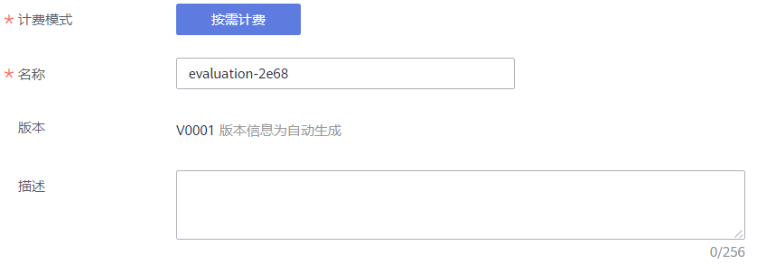
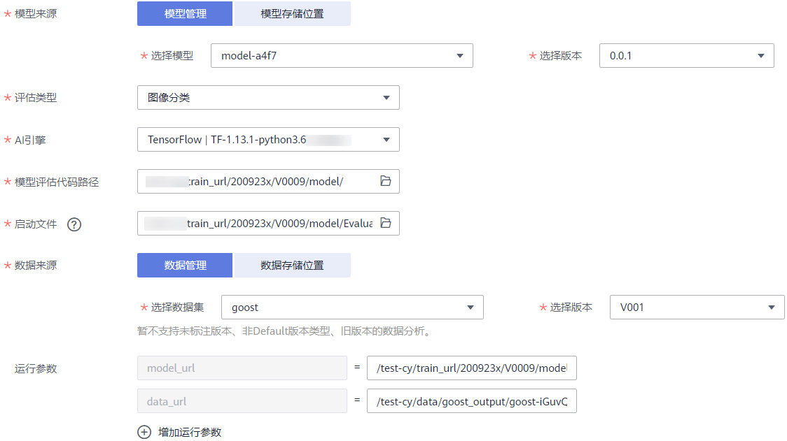
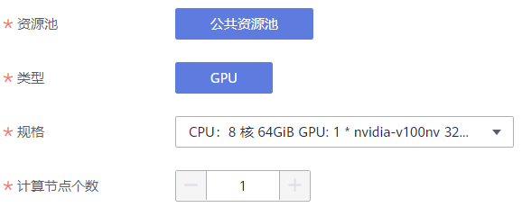

# 创建模型评估作业

在“模型管理\>评估/诊断”页面中，在编写好评估脚本之后，您可以创建评估作业来对模型进行评估。在完成评估之后您可以通过评估作业的评估结果，查看每一次评估的对应指标结果。

## 使用前必读

-   由于评估作业运行需消耗资源，确保帐户未欠费。
-   模型评估代码已完成编写，且已上传至OBS目录。同时，确保您使用的OBS与ModelArts在同一区域。
-   评估代码的启动文件为“.py“格式。
-   已准备好数据源。已在ModelArts创建数据集，类型为“图像分类“或“物体检测“，且数据集已完成发布。或者，已经将“图像分类“、“物体检测“、“语义分割“的数据传至对应的OBS路径。
-   评估模型的代码编写请参见[模型评估接口](模型评估接口.md)和[模型评估代码示例](模型评估代码示例.md)。

## 创建作业

1.  登录ModelArts管理控制台，在左侧菜单栏中选择“模型管理 \> 评估/诊断“。
2.  在“评估/诊断“管理页面，单击左上角的“创建“，进入“创建评估作业“页面。
3.  在“创建评估作业“页面中，填写基本信息、作业相关信息以及资源池相关信息。
    1.  填写基本信息。

        **表 1**  基本信息

        
        <table><thead align="left"><tr id="row128599585516"><th class="cellrowborder" valign="top" width="30.330000000000002%" id="mcps1.2.3.1.1">
参数

        </th>
        <th class="cellrowborder" valign="top" width="69.67%" id="mcps1.2.3.1.2">
说明

        </th>
        </tr>
        </thead>
        <tbody><tr id="row128591458552"><td class="cellrowborder" valign="top" width="30.330000000000002%" headers="mcps1.2.3.1.1 ">
计费模式

        </td>
        <td class="cellrowborder" valign="top" width="69.67%" headers="mcps1.2.3.1.2 ">
默认为按需计费，不可更改。

        </td>
        </tr>
        <tr id="row185935105518"><td class="cellrowborder" valign="top" width="30.330000000000002%" headers="mcps1.2.3.1.1 ">
名称

        </td>
        <td class="cellrowborder" valign="top" width="69.67%" headers="mcps1.2.3.1.2 ">
指定作业名称，用于区分作业。

        </td>
        </tr>
        <tr id="row1346515364418"><td class="cellrowborder" valign="top" width="30.330000000000002%" headers="mcps1.2.3.1.1 ">
版本

        </td>
        <td class="cellrowborder" valign="top" width="69.67%" headers="mcps1.2.3.1.2 ">
由系统自动生成，按“V0001”、“V0002”规则命名，用户无法修改。

        </td>
        </tr>
        <tr id="row78601658559"><td class="cellrowborder" valign="top" width="30.330000000000002%" headers="mcps1.2.3.1.1 ">
描述

        </td>
        <td class="cellrowborder" valign="top" width="69.67%" headers="mcps1.2.3.1.2 ">
评估作业的简要描述。

        </td>
        </tr>
        </tbody>
        </table>

        **图 1**  基本信息  
        

    2.  填写作业相关信息。

        **表 2**  评估作业参数说明

        
        <table><thead align="left"><tr id="row1298423485918"><th class="cellrowborder" valign="top" width="21.3%" id="mcps1.2.3.1.1">
参数

        </th>
        <th class="cellrowborder" valign="top" width="78.7%" id="mcps1.2.3.1.2">
说明

        </th>
        </tr>
        </thead>
        <tbody><tr id="row6245151317516"><td class="cellrowborder" valign="top" width="21.3%" headers="mcps1.2.3.1.1 ">
模型来源

        </td>
        <td class="cellrowborder" valign="top" width="78.7%" headers="mcps1.2.3.1.2 ">
模型来源可分为两种：

        <ul id="ul27095200611"><li>模型管理：从ModelArts模型管理列表中选择一个可用的模型及其对应版本。下拉框自动显示当前帐号下已导入成功的模型。</li><li>模型存储位置：即用户将其模型上传至OBS，然后从对应的OBS路径中选择用于评估的模型。</li></ul>
        </td>
        </tr>
        <tr id="row151602477145"><td class="cellrowborder" valign="top" width="21.3%" headers="mcps1.2.3.1.1 ">
评估类型

        </td>
        <td class="cellrowborder" valign="top" width="78.7%" headers="mcps1.2.3.1.2 ">
可选“图像分类”、“物体检测”和“语义分割”。请根据您的模型适用场景选择评估类型。

        </td>
        </tr>
        <tr id="row6985173417594"><td class="cellrowborder" valign="top" width="21.3%" headers="mcps1.2.3.1.1 ">
AI引擎

        </td>
        <td class="cellrowborder" valign="top" width="78.7%" headers="mcps1.2.3.1.2 ">
从右侧下拉框中选择评估作业使用的AI引擎。目前支持“TensorFlow|TF-1.13.1-python3.6”、“PyTorch | PyTorch-1.4.0-python3.6”、“TensorFlow | TF-2.1.0-python3.6”。

        </td>
        </tr>
        <tr id="row19855343595"><td class="cellrowborder" valign="top" width="21.3%" headers="mcps1.2.3.1.1 ">
模型评估代码路径

        </td>
        <td class="cellrowborder" valign="top" width="78.7%" headers="mcps1.2.3.1.2 ">
指定模型评估代码存储路径，此路径为OBS目录。建议在创建作业前，将用于评估模型的代码上传至OBS桶中。

        </td>
        </tr>
        <tr id="row332914384919"><td class="cellrowborder" valign="top" width="21.3%" headers="mcps1.2.3.1.1 ">
启动文件

        </td>
        <td class="cellrowborder" valign="top" width="78.7%" headers="mcps1.2.3.1.2 ">
评估代码存储目录设置完成后，选择目录下评估模型的启动文件。启动文件必须为“.py”格式。

        </td>
        </tr>
        <tr id="row69855348599"><td class="cellrowborder" valign="top" width="21.3%" headers="mcps1.2.3.1.1 ">
数据来源

        </td>
        <td class="cellrowborder" valign="top" width="78.7%" headers="mcps1.2.3.1.2 ">
分为“数据管理”和“数据存储位置”2种来源。当评估类型为“图像分类”或“物体检测”时，支持从数据管理或数据存储位置选择数据。当评估类型为“语义分割”时，只支持从数据存储位置选择数据。

        <ul id="ul141530266199"><li>“数据管理”即从ModelArts数据管理选择数据集及其对应的版本，要求您选择的数据集类型与评估类型一致。</li><li>“数据存储位置”即从OBS对应获取数据集，选择对应的OBS路径即可。</li></ul>
        </td>
        </tr>
        <tr id="row144844484214"><td class="cellrowborder" valign="top" width="21.3%" headers="mcps1.2.3.1.1 ">
运行参数

        </td>
        <td class="cellrowborder" valign="top" width="78.7%" headers="mcps1.2.3.1.2 ">
根据上方配置的信息，系统将默认填写对应的model_url和data_url两个参数。

        
您可以单击“增加运行参数”，添加评估代码中所需的更多参数设置。

        </td>
        </tr>
        </tbody>
        </table>

        **图 2**  设置作业相关信息  
        

    3.  设置运行作业使用的资源池及其规格信息。由于目前评估模型的限制，资源池相关参数，可直接使用默认值，不需修改。

        **表 3**  资源池的参数说明

        
        <table><thead align="left"><tr id="row844752211111"><th class="cellrowborder" valign="top" width="22.939999999999998%" id="mcps1.2.3.1.1">
参数

        </th>
        <th class="cellrowborder" valign="top" width="77.06%" id="mcps1.2.3.1.2">
说明

        </th>
        </tr>
        </thead>
        <tbody><tr id="row44471422141117"><td class="cellrowborder" valign="top" width="22.939999999999998%" headers="mcps1.2.3.1.1 ">
资源池

        </td>
        <td class="cellrowborder" valign="top" width="77.06%" headers="mcps1.2.3.1.2 ">
目前评估作业只支持使用公共资源池。

        </td>
        </tr>
        <tr id="row544742216118"><td class="cellrowborder" valign="top" width="22.939999999999998%" headers="mcps1.2.3.1.1 ">
类型

        </td>
        <td class="cellrowborder" valign="top" width="77.06%" headers="mcps1.2.3.1.2 ">
由于评估模型需要较高性能的资源，因此目前只支持使用GPU类型。

        </td>
        </tr>
        <tr id="row944712213116"><td class="cellrowborder" valign="top" width="22.939999999999998%" headers="mcps1.2.3.1.1 ">
规格

        </td>
        <td class="cellrowborder" valign="top" width="77.06%" headers="mcps1.2.3.1.2 ">
目前支持8核64GiB GPU规格。

        </td>
        </tr>
        <tr id="row64471922191115"><td class="cellrowborder" valign="top" width="22.939999999999998%" headers="mcps1.2.3.1.1 ">
计算节点个数

        </td>
        <td class="cellrowborder" valign="top" width="77.06%" headers="mcps1.2.3.1.2 ">
默认为1。目前仅支持单节点运行模式。

        </td>
        </tr>
        </tbody>
        </table>

        **图 3**  选择资源池及其规格  
        

4.  确认填写参数无误后，单击“下一步“。
5.  在“规格确认“页面，再次确认评估作业的详细参数，确认无误后，单击“提交“完成评估作业的创建。

    评估作业创建后，作业将会开始运行，运行过程需要几分钟时间，请耐心等待。在“评估/诊断“管理页面中，当作业状态显示为“已完成“时，表示已完成评估作业，可单击作业名称，选择对应作业版本查看评估结果。

    由于使用的是公共资源池，当存在较多用户同时提交作业时，可能您的作业将出现“排队中”的状态，表示在等待空闲资源。

## 后续操作

评估作业创建完成后，您可以执行如下后续操作，帮助您判断模型是否满足业务诉求。

-   **查看评估结果**：评估作业创建后将完成一次评估，您可以查看评估作业生成的评估结果，您可以结合相关指标查看评估结果。详细操作请参见[查看评估结果](查看评估结果.md)。
-   **创建新版本**：如果第一次评估不满足业务诉求，您可以创建一个新版本，更改数据集或评估代码，再次进行评估。详细操作请参见[创建新版本](管理评估作业版本.md#section921759103310)。
-   **删除评估作业**：如果您创建的评估作业不再需要，为避免资源浪费，您可以删除相应的评估作业。在“评估/诊断“管理页面，选择对应的作业，单击操作列的“删除“，即可删除此作业。由于删除后无法恢复，请谨慎操作。

