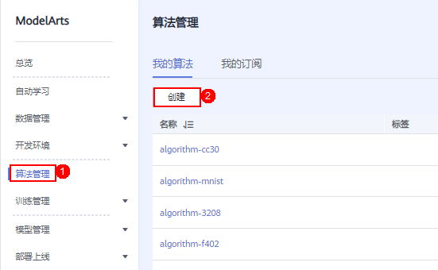
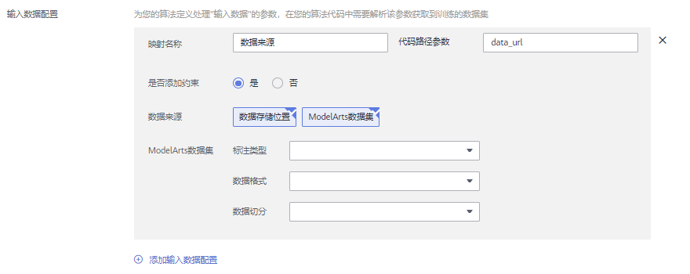
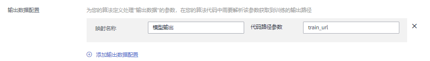
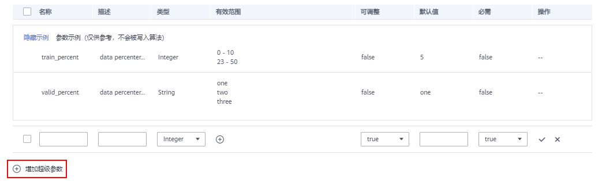

# 创建算法

针对您在本地或使用其他工具开发的算法，支持上传至ModelArts中统一管理。在创建自定义算法过程中，您需要关注以下内容：

1.  [前提条件](#section13181641194916)
2.  [进入创建算法页面](#modelarts_23_0512_section1478003731615)
3.  [设置算法基本信息](#modelarts_23_0512_section1534119614910)
4.  [设置创建方式](#modelarts_23_0512_section058543274910)
5.  [配置输入输出数据](#section19643153517516)
6.  [定义超参](#modelarts_23_0512_section1883311313516)
7.  [支持的策略](#modelarts_23_0512_section1959512404445)
8.  [定义训练约束](#modelarts_23_0512_section11326178153512)
9.  [后续操作](#modelarts_23_0512_section743865313613)

## 前提条件

-   数据已完成准备：已在ModelArts中创建可用的数据集，或者您已将用于训练的数据集上传至OBS目录。
-   请准备好自定义脚本，并上传至OBS目录。训练脚本开发指导参见[开发自定义脚本](开发自定义脚本.md)。
-   已在OBS创建至少1个空的文件夹，用于存储训练输出的内容。
-   由于训练作业运行需消耗资源，确保帐户未欠费。
-   确保您使用的OBS目录与ModelArts在同一区域。

## 进入创建算法页面

1.  登录ModelArts管理控制台，单击左侧菜单栏的“算法管理“。
2.  在“我的算法“管理页面，单击“创建“，进入“创建算法“页面。

    **图 1**  创建算法  
    

## 设置算法基本信息

基本信息包含“名称“和“描述“。目前算法管理为公测功能，免费试用。

**图 2**  设置算法基本信息  

## 设置创建方式

选择“自定义脚本“创建算法。

用户需根据实际算法代码情况设置“AI引擎“、“代码目录“和“启动文件“。选择的AI引擎和编写算法代码时选择的框架必须一致。例如编写算法代码使用的是TensorFlow，则在创建算法时也要选择TensorFlow。

**表 1**  创建方式参数说明

<table><thead align="left"><tr id="modelarts_23_0512_row9666145216491"><th class="cellrowborder" valign="top" width="21.14%" id="mcps1.2.3.1.1">
参数

</th>
<th class="cellrowborder" valign="top" width="78.86%" id="mcps1.2.3.1.2">
说明

</th>
</tr>
</thead>
<tbody><tr id="modelarts_23_0512_row1266685211491"><td class="cellrowborder" valign="top" width="21.14%" headers="mcps1.2.3.1.1 ">
“AI引擎”

</td>
<td class="cellrowborder" valign="top" width="78.86%" headers="mcps1.2.3.1.2 ">
支持的AI引擎请参考<a href="使用自定义脚本简介.md">使用自定义脚本简介</a>。

</td>
</tr>
<tr id="modelarts_23_0512_row46663522494"><td class="cellrowborder" valign="top" width="21.14%" headers="mcps1.2.3.1.1 ">
“代码目录”

</td>
<td class="cellrowborder" valign="top" width="78.86%" headers="mcps1.2.3.1.2 ">
算法代码存储的OBS路径。训练代码、依赖安装包或者预生成模型等训练所需文件上载至该代码目录下。

代码目录下不能存在他人上传的文件和目录，也不能存在无关的文件和目录，否则可能导致失败。

请注意不要将训练数据放在代码目录路径下。训练数据比较大，训练代码目录在训练作业启动后会下载至后台，可能会有下载失败的风险。

训练作业创建完成后，ModelArts会将代码目录及其子目录下载至后台容器中。

 说明： 
<ul id="modelarts_23_0512_ul179321959191811"><li>编程语言不限。</li><li>文件数（含文件、文件夹数量）不超过1024个。</li><li>文件总大小不超过5GB。</li></ul>

</td>
</tr>
<tr id="modelarts_23_0512_row1466665219497"><td class="cellrowborder" valign="top" width="21.14%" headers="mcps1.2.3.1.1 ">
“启动文件”

</td>
<td class="cellrowborder" valign="top" width="78.86%" headers="mcps1.2.3.1.2 ">
必须为“代码目录”下的文件，且以“.py”或“.pyc”结尾，即ModelArts目前只支持使用Python语言编写的启动文件。

代码目录路径中的启动文件为训练启动的入口。

</td>
</tr>
</tbody>
</table>

**图 3**  使用自定义脚本创建算法  

## 配置输入输出数据

训练过程中，自定义算法需要从OBS桶或者数据集中获取数据进行模型训练，训练产生的输出结果也需要存储至OBS桶中。用户的算法代码中需解析输入输出参数实现ModelArts后台与OBS的数据交互，用户可以参考[使用常用框架的训练代码开发](开发自定义脚本.md)完成适配Modelarts训练的代码开发。

创建自定义算法时，用户需要将算法代码中定义的输入输出参数进行配置。

-   输入数据配置

    **表 2**  输入数据配置

    
    <table><thead align="left"><tr id="row1664393512515"><th class="cellrowborder" valign="top" width="25.619999999999997%" id="mcps1.2.3.1.1">
参数

    </th>
    <th class="cellrowborder" valign="top" width="74.38%" id="mcps1.2.3.1.2">
参数说明

    </th>
    </tr>
    </thead>
    <tbody><tr id="row1643103515114"><td class="cellrowborder" valign="top" width="25.619999999999997%" headers="mcps1.2.3.1.1 ">
映射名称

    </td>
    <td class="cellrowborder" valign="top" width="74.38%" headers="mcps1.2.3.1.2 ">
输入参数的说明，用户可以自定义描述。默认为“数据来源”。

    </td>
    </tr>
    <tr id="row19643163505113"><td class="cellrowborder" valign="top" width="25.619999999999997%" headers="mcps1.2.3.1.1 ">
代码路径参数

    </td>
    <td class="cellrowborder" valign="top" width="74.38%" headers="mcps1.2.3.1.2 ">
如果您的算法代码中使用argparse解析data_url为输入数据参数，则在创建的算法需要配置输入数据代码参数为data_url。根据实际代码中的输入数据参数定义此处的名称。

    
此处设置的代码路径参数必须与算法代码中解析的输入数据参数保持一致，否则您的算法代码无法获取正确的输入数据。

    </td>
    </tr>
    <tr id="row3643133511511"><td class="cellrowborder" valign="top" width="25.619999999999997%" headers="mcps1.2.3.1.1 ">
是否添加约束

    </td>
    <td class="cellrowborder" valign="top" width="74.38%" headers="mcps1.2.3.1.2 ">
用户可以根据实际情况限制数据来源的方式，可以设置为支持数据存储位置或者ModelArts数据集。

    
如果用户选择数据来源为ModelArts数据集，还可以约束以下三种：

    <ul id="ul364312353513"><li>标注类型。数据类型请参考<a href="zh-cn_topic_0170886810.md">标注数据</a>。</li><li>数据格式。可选“Default”和“CarbonData”，支持多选。其中“Default”代表Manifest格式。</li><li>数据切分。仅“图像分类”、“物体检测”、“文本分类”和“声音分类”类型数据集支持进行数据切分功能。
可选“仅支持切分的数据集”、“仅支持未切分数据集”和“无限制”。数据切分详细内容可参考<a href="zh-cn_topic_0170886812.md#section1811135818517">发布数据集</a>。

    </li></ul>
    </td>
    </tr>
    <tr id="row5644193516517"><td class="cellrowborder" valign="top" width="25.619999999999997%" headers="mcps1.2.3.1.1 ">
添加输入数据配置

    </td>
    <td class="cellrowborder" valign="top" width="74.38%" headers="mcps1.2.3.1.2 ">
用户可以根据实际算法确定多个输入数据来源。

    </td>
    </tr>
    </tbody>
    </table>

    **图 4**  输入数据配置  
    

-   输出数据配置

    **表 3**  输出数据配置

    
    <table><thead align="left"><tr id="row136441235185119"><th class="cellrowborder" valign="top" width="25.619999999999997%" id="mcps1.2.3.1.1">
参数

    </th>
    <th class="cellrowborder" valign="top" width="74.38%" id="mcps1.2.3.1.2">
参数说明

    </th>
    </tr>
    </thead>
    <tbody><tr id="row186441735125118"><td class="cellrowborder" valign="top" width="25.619999999999997%" headers="mcps1.2.3.1.1 ">
映射名称

    </td>
    <td class="cellrowborder" valign="top" width="74.38%" headers="mcps1.2.3.1.2 ">
输出参数的说明，用户可以自定义描述。默认为“输出数据”。

    </td>
    </tr>
    <tr id="row46441035125117"><td class="cellrowborder" valign="top" width="25.619999999999997%" headers="mcps1.2.3.1.1 ">
代码路径参数

    </td>
    <td class="cellrowborder" valign="top" width="74.38%" headers="mcps1.2.3.1.2 ">
如果您的算法代码中使用argparse解析train_url为训练输出参数，则在创建的算法需要配置输出数据参数为train_url。根据实际代码中的训练输出参数定义此处的名称。

    
此处设置的代码路径参数必须与算法代码中解析的训练输出参数保持一致，否则您的算法代码无法获取正确的输出路径。

    </td>
    </tr>
    <tr id="row18644143555114"><td class="cellrowborder" valign="top" width="25.619999999999997%" headers="mcps1.2.3.1.1 ">
添加输出数据配置

    </td>
    <td class="cellrowborder" valign="top" width="74.38%" headers="mcps1.2.3.1.2 ">
用户可以根据实际算法确定多个输出数据路径。

    </td>
    </tr>
    </tbody>
    </table>

    **图 5**  输出数据配置  
    

## 定义超参

使用常用框架创建算法时，ModelArts支持用户自定义超参，方便用户查阅或修改。定义超参后会体现在启动命令中，以命令行参数的形式传入您的启动文件中。

1.  导入超参
    -   手动添加超参

        您可以单击“增加超级参数“手动添加超参。请注意超参输入的内容应该只包含大小写字母、中文、数字、空格、中划线、下划线、逗号和句号。

        **图 6**  添加超参  
        

2.  编辑超参。超参参数说明参见[表4](#modelarts_23_0512_table143901732155115)。

    **表 4**  超参编辑参数

    
    <table><thead align="left"><tr id="modelarts_23_0512_row103901032175115"><th class="cellrowborder" valign="top" width="13.69%" id="mcps1.2.3.1.1">
参数

    </th>
    <th class="cellrowborder" valign="top" width="86.31%" id="mcps1.2.3.1.2">
说明

    </th>
    </tr>
    </thead>
    <tbody><tr id="modelarts_23_0512_row1539013285118"><td class="cellrowborder" valign="top" width="13.69%" headers="mcps1.2.3.1.1 ">
名称

    </td>
    <td class="cellrowborder" valign="top" width="86.31%" headers="mcps1.2.3.1.2 ">
填入超参名称。

    
 说明： 

超参名称支持64个以内字符，仅支持大小写字母、数字、下划线和中划线。

    

    </td>
    </tr>
    <tr id="modelarts_23_0512_row1139073216511"><td class="cellrowborder" valign="top" width="13.69%" headers="mcps1.2.3.1.1 ">
描述

    </td>
    <td class="cellrowborder" valign="top" width="86.31%" headers="mcps1.2.3.1.2 ">
填入超参的描述说明

    
 说明： 

超参描述支持大小写字母、中文、数字、空格、中划线、下划线、逗号和句号。

    

    </td>
    </tr>
    <tr id="modelarts_23_0512_row13390332125116"><td class="cellrowborder" valign="top" width="13.69%" headers="mcps1.2.3.1.1 ">
类型

    </td>
    <td class="cellrowborder" valign="top" width="86.31%" headers="mcps1.2.3.1.2 ">
填入超参的数据类型。支持String、Integer、Float和Boolean。

    </td>
    </tr>
    <tr id="modelarts_23_0512_row1939153220517"><td class="cellrowborder" valign="top" width="13.69%" headers="mcps1.2.3.1.1 ">
默认值

    </td>
    <td class="cellrowborder" valign="top" width="86.31%" headers="mcps1.2.3.1.2 ">
填入超参的默认值。创建训练作业时，默认使用该值进行训练。

    </td>
    </tr>
    <tr id="modelarts_23_0512_row639103819578"><td class="cellrowborder" valign="top" width="13.69%" headers="mcps1.2.3.1.1 ">
约束

    </td>
    <td class="cellrowborder" valign="top" width="86.31%" headers="mcps1.2.3.1.2 ">
单击约束。在弹出对话框中，支持用户设置默认值的取值范围或者枚举值范围。

    </td>
    </tr>
    <tr id="modelarts_23_0512_row8391163215519"><td class="cellrowborder" valign="top" width="13.69%" headers="mcps1.2.3.1.1 ">
必需

    </td>
    <td class="cellrowborder" valign="top" width="86.31%" headers="mcps1.2.3.1.2 ">
可选是或者否。如果您选择否，在使用该算法创建训练作业时，支持在创建训练作业页面删除该超参。如果您选择是，则不支持删除操作。

    </td>
    </tr>
    </tbody>
    </table>

    **图 7**  超参编辑设置  
    

## 支持的策略

如果您使用“PyTorch-1.4.0-python3.6-v2“或者“TF-1.13.1-python3.6-v2“引擎创建自定义算法，ModelArts支持用户使用自动化搜索功能。自动化搜索功能在零代码修改的前提下，自动找到最优的超参，有助于提高模型精度和收敛速度。详细的参数配置请参考[超参搜索配置](创建超参搜索作业.md#section54440253422)。

## 定义训练约束

用户可以根据实际情况定义此算法的训练约束。

1.  训练约束
    -   资源类型：可选“CPU“、“GPU“和“Ascend“，支持多选。
    -   多卡训练：可选“支持“和“不支持“。
    -   分布式训练：可选“支持“和“不支持“。

        **图 8**  算法训练约束  
        

## 后续操作

创建算法完成后，在“算法管理“页面，等待算法就绪。当新创建的算法状态变更为“就绪“时，即可执行其他操作。可以使用算法快速创建训练作业，构建模型，详细操作请参见[创建训练作业](创建训练作业.md)。

