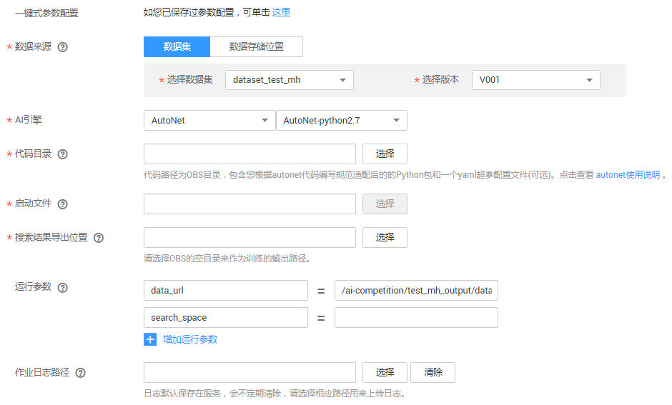
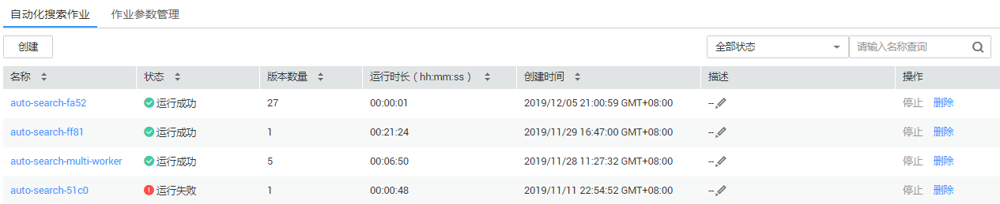

# 创建自动化搜索作业

目前用户的使用方式有两种，分别是神经网络架构搜索\(纯NAS搜索\)与超参搜索结合神经网络架构搜索（多元搜索）。NAS搜索仅进行网络结构的变换，其搜索代价是单次网络训练时间消耗的4到10倍。多元搜索则会针对变换后的网络结构，搜索出一套契合的训练超参出来，效果更好，但操作更复杂，代价更高，其搜索的代价可以通过配置超参的尝试次数与单次尝试的最多训练步数决定，一般为单次网络训练的20倍。

## 前提条件

-   数据已完成准备：已在ModelArts中创建可用的数据集，或者您已将用于自动化搜索作业的数据上传至OBS目录。
-   用于自动化搜索作业的代码已准备就绪，且已上传至OBS目录。autonet代码编写规范请参见[代码编写规范](代码编写规范.md)，yaml超参配置文件的编写规范请参见[yaml配置文件说明](yaml配置文件说明.md)。
-   已在OBS创建至少2个空的文件夹，用于存储搜索结果以及作业日志。
-   由于训练作业运行需消耗资源，确保账户未欠费。
-   确保您使用的OBS目录与ModelArts在同一区域。

## 背景信息

-   目前，自动化搜索作业的AI引擎仅支持“AutoNet-python2.7“。“AutoNet-python2.7“为ModelArts提供的引擎，内置了TensorFlow 1.13.0版本的引擎。在编写自动化搜索作业的代码时，需使用TensorFlow 1.13.0版本相应的接口。

## 创建自动化搜索作业

1.  登录ModelArts管理控制台，在左侧导航栏中选择“训练管理 \> 自动化搜索作业“，默认进入“自动化搜索作业“列表。
2.  在“自动化搜索作业“列表中，单击左上角“创建“，进入“创建自动化搜索作业“页面。
3.  在创建自动化搜索作业页面，填写作业相关参数，然后单击“下一步“。
    1.  填写基本信息。基本信息包含“计费模式“、“名称“、“版本“和“描述“。其中“计费模式“当前仅支持“按需计费“，不支持修改。“版本“信息由系统自动生成，按“V001“、“V002“递增规则命名，用户无法修改。

        您可以根据实际情况填写“名称“和“描述“信息。

        **图 1**  自动化搜索作业基本信息  
        

    2.  填写自动化搜索作业参数。包含数据来源、算法来源等关键信息，详情请参见[表1](#table1819364517144)。

        **图 2**  设置作业参数  
        

        **表 1**  自动化搜索作业的参数说明

        
        <table><thead align="left"><tr id="row111285509146"><th class="cellrowborder" valign="top" width="18.37%" id="mcps1.2.3.1.1">
参数名称

        </th>
        <th class="cellrowborder" valign="top" width="81.63%" id="mcps1.2.3.1.2">
说明

        </th>
        </tr>
        </thead>
        <tbody><tr id="row5512145291613"><td class="cellrowborder" valign="top" width="18.37%" headers="mcps1.2.3.1.1 ">
一键式参数配置

        </td>
        <td class="cellrowborder" valign="top" width="81.63%" headers="mcps1.2.3.1.2 ">
如果您在ModelArts已保存作业参数，您可以根据界面提示，选择已有的作业参数，快速完成训练作业的参数配置。

        </td>
        </tr>
        <tr id="row1819384501419"><td class="cellrowborder" valign="top" width="18.37%" headers="mcps1.2.3.1.1 ">
数据来源（数据集）

        </td>
        <td class="cellrowborder" valign="top" width="81.63%" headers="mcps1.2.3.1.2 ">
从ModelArts数据管理中选择可用的数据集及其版本。

        <ul id="ul2598192417254"><li>“选择数据集”：从右侧下拉框中选择ModelArts系统中已有的数据集。当ModelArts无可用数据集时，此下拉框为空。</li><li>“选择版本”：根据“选择数据集”指定的数据集选择其版本。</li></ul>
        </td>
        </tr>
        <tr id="row124412527189"><td class="cellrowborder" valign="top" width="18.37%" headers="mcps1.2.3.1.1 ">
数据来源（数据存储位置）

        </td>
        <td class="cellrowborder" valign="top" width="81.63%" headers="mcps1.2.3.1.2 ">
从OBS桶中选择训练数据。在“数据存储位置”右侧，单击“选择”，从弹出的对话框中，选择数据存储的OBS桶及其文件夹。

        </td>
        </tr>
        <tr id="row1872803452418"><td class="cellrowborder" valign="top" width="18.37%" headers="mcps1.2.3.1.1 ">
AI引擎

        </td>
        <td class="cellrowborder" valign="top" width="81.63%" headers="mcps1.2.3.1.2 ">
目前，自动化搜索作业的AI引擎仅支持“AutoNet-python2.7”。请使用Python 2.7工作环境编写代码。

        </td>
        </tr>
        <tr id="row1460412549244"><td class="cellrowborder" valign="top" width="18.37%" headers="mcps1.2.3.1.1 ">
代码目录

        </td>
        <td class="cellrowborder" valign="top" width="81.63%" headers="mcps1.2.3.1.2 ">
指定AutoNet代码文件存储的OBS路径，此处设置为“启动文件”的所在目录即可。

        </td>
        </tr>
        <tr id="row22401645142911"><td class="cellrowborder" valign="top" width="18.37%" headers="mcps1.2.3.1.1 ">
启动文件

        </td>
        <td class="cellrowborder" valign="top" width="81.63%" headers="mcps1.2.3.1.2 ">
AutoNet代码的启动文件，一般以“.py”格式结尾。

        </td>
        </tr>
        <tr id="row9438165172520"><td class="cellrowborder" valign="top" width="18.37%" headers="mcps1.2.3.1.1 ">
搜索结果导出位置

        </td>
        <td class="cellrowborder" valign="top" width="81.63%" headers="mcps1.2.3.1.2 ">
用于存储作业输出结果。建议选择一个空目录。请勿将数据集存储的目录作为训练输出位置。

        </td>
        </tr>
        <tr id="row19194124531419"><td class="cellrowborder" valign="top" width="18.37%" headers="mcps1.2.3.1.1 ">
运行参数

        </td>
        <td class="cellrowborder" valign="top" width="81.63%" headers="mcps1.2.3.1.2 ">
代码中的命令行参数设置值，请确保参数名称和代码的参数名称保持一致。“AutoNet-python2.7”引擎内置了一些运行参数，如<a href="#table882153112558">表4</a>所示，此运行参数会在启动作业时自动发给服务。针对必选参数，您需要在创建作业时进行设置。针对您自己在代码中定义的参数，也必须在此处增加运行参数及其对应参数值，用于作业运行时调用。

        
例如：max_steps=10，其中“max_steps”为代码中的某个传参。

        </td>
        </tr>
        <tr id="row14194104591416"><td class="cellrowborder" valign="top" width="18.37%" headers="mcps1.2.3.1.1 ">
作业日志路径

        </td>
        <td class="cellrowborder" valign="top" width="81.63%" headers="mcps1.2.3.1.2 ">
选择作业运行中产生的日志文件存储路径。单击“选择”可从OBS中选择一个目录作为日志输出路径，也可以单击“清除”，将已设置的路径删除。

        </td>
        </tr>
        </tbody>
        </table>

    3.  选择用于自动化搜索作业的资源。由于目前用于自动化搜索作业的资源有限，仅提供了部分资源规格，资源相关的参数已按当前支持的规格填写，无需修改。其相应的描述请参见[表2](#table1110144413718)。

        **图 3**  选择资源  
        

        **表 2**  资源参数说明

        
        <table><thead align="left"><tr id="row495964715372"><th class="cellrowborder" valign="top" width="21.740000000000002%" id="mcps1.2.3.1.1">
参数名称

        </th>
        <th class="cellrowborder" valign="top" width="78.25999999999999%" id="mcps1.2.3.1.2">
说明

        </th>
        </tr>
        </thead>
        <tbody><tr id="row2110154443711"><td class="cellrowborder" valign="top" width="21.740000000000002%" headers="mcps1.2.3.1.1 ">
资源池

        </td>
        <td class="cellrowborder" valign="top" width="78.25999999999999%" headers="mcps1.2.3.1.2 ">
选择训练作业资源池。自动化搜索作业目前仅支持选择公共资源池，且目前仅支持GPU规格，“8核 64GiB GPU”。

        </td>
        </tr>
        <tr id="row411134413716"><td class="cellrowborder" valign="top" width="21.740000000000002%" headers="mcps1.2.3.1.1 ">
计算节点个数

        </td>
        <td class="cellrowborder" valign="top" width="78.25999999999999%" headers="mcps1.2.3.1.2 ">
选择计算节点的个数。如果节点个数设置为1，表示后台的计算模式是单机模式。目前仅支持单机模式。

        </td>
        </tr>
        </tbody>
        </table>

    4.  配置订阅消息，并设置是否将当前自动化搜索作业中的参数保存为作业参数。

        **图 4**  配置订阅消息  
        

        **表 3**  订阅消息及作业参数参数说明

        
        <table><thead align="left"><tr id="row1614614211435"><th class="cellrowborder" valign="top" width="22.33%" id="mcps1.2.3.1.1">
参数名称

        </th>
        <th class="cellrowborder" valign="top" width="77.66999999999999%" id="mcps1.2.3.1.2">
说明

        </th>
        </tr>
        </thead>
        <tbody><tr id="row131731715438"><td class="cellrowborder" valign="top" width="22.33%" headers="mcps1.2.3.1.1 ">
订阅消息

        </td>
        <td class="cellrowborder" valign="top" width="77.66999999999999%" headers="mcps1.2.3.1.2 ">
订阅消息使用消息通知服务，在事件列表中选择需要监控的资源池状态，在事件发生时发送消息通知。

        
此参数为可选参数，您可以根据实际情况设置是否打开开关。如果开启订阅消息，请根据实际情况填写如下参数。

        <ul id="ul4779327174518"><li>“主题名”：订阅消息主题名称。您可以单击<a href="https://console.huaweicloud.com/smn/?region=southchina#/smn/manager/dashboard" target="_blank" rel="noopener noreferrer">创建主题</a>，在消息通知服务中创建主题。</li><li>“事件列表”：订阅事件。当前可选择“OnJobRunning”、“OnJobSucceeded”、“OnJobFailed”三种事件，分别代表训练运行中、运行成功、运行失败。</li></ul>
        </td>
        </tr>
        <tr id="row0394182311432"><td class="cellrowborder" valign="top" width="22.33%" headers="mcps1.2.3.1.1 ">
保存作业参数

        </td>
        <td class="cellrowborder" valign="top" width="77.66999999999999%" headers="mcps1.2.3.1.2 ">
勾选此参数，表示将当前训练作业设置的作业参数保存，方便后续一键复制使用。

        
勾选“保存训练参数”，然后填写“作业参数名称”和“作业参数描述”，即可完成当前参数配置的保存。训练作业创建成功后，您可以从ModelArts的作业参数列表中查看保存的信息，详细操作指导请参见<a href="管理作业参数.md">管理作业参数</a>。

        </td>
        </tr>
        </tbody>
        </table>

    5.  完成参数填写后，单击“下一步“。

4.  在“规格确认“页面，确认填写信息无误后，单击“立即创建“，完成自动化搜索作业的创建。自动化搜索作业一般需要运行一段时间，根据您选择的数据量和资源不同，训练时间将耗时几分钟到几十分钟不等。

    > **说明：**   
    >自动化搜索作业创建完成后，将立即启动。  

    您可以前往“自动化搜索作业“列表，查看作业的基本情况。在作业列表中，刚创建的作业“状态“为“初始化“，当作业的“状态“变为“运行成功“时，表示作业运行结束，其输出结果将存储至对应的“搜索结果导出位置“中。当作业的“状态“变为“运行失败“时，您可以单击作业的名称，进入详情页面，通过查看日志等手段处理问题。

    **图 5**  自动化搜索作业列表  
    

## 预置的运行参数及API参考

**表 4**  支持的运行参数

<table><thead align="left"><tr id="row6822113145512"><th class="cellrowborder" valign="top" width="26.877312268773125%" id="mcps1.2.5.1.1">
参数名

</th>
<th class="cellrowborder" valign="top" width="15.728427157284273%" id="mcps1.2.5.1.2">
是否必选

</th>
<th class="cellrowborder" valign="top" width="14.308569143085691%" id="mcps1.2.5.1.3">
类型

</th>
<th class="cellrowborder" valign="top" width="43.08569143085691%" id="mcps1.2.5.1.4">
含义

</th>
</tr>
</thead>
<tbody><tr id="row0822193113558"><td class="cellrowborder" valign="top" width="26.877312268773125%" headers="mcps1.2.5.1.1 ">
multi_search

</td>
<td class="cellrowborder" valign="top" width="15.728427157284273%" headers="mcps1.2.5.1.2 ">
否

</td>
<td class="cellrowborder" valign="top" width="14.308569143085691%" headers="mcps1.2.5.1.3 ">
bool

</td>
<td class="cellrowborder" valign="top" width="43.08569143085691%" headers="mcps1.2.5.1.4 ">
False表示纯NAS搜索，True代表多元搜索。默认为False

</td>
</tr>
<tr id="row112539301538"><td class="cellrowborder" valign="top" width="26.877312268773125%" headers="mcps1.2.5.1.1 ">
config_path

</td>
<td class="cellrowborder" valign="top" width="15.728427157284273%" headers="mcps1.2.5.1.2 ">
是（使用多元搜索时）

</td>
<td class="cellrowborder" valign="top" width="14.308569143085691%" headers="mcps1.2.5.1.3 ">
string

</td>
<td class="cellrowborder" valign="top" width="43.08569143085691%" headers="mcps1.2.5.1.4 ">
超参搜索配置文件路径，即yaml配置文件的路径（OBS路径）。填写OBS路径时，请使用“s3://”开头。

</td>
</tr>
<tr id="row1111165914312"><td class="cellrowborder" valign="top" width="26.877312268773125%" headers="mcps1.2.5.1.1 ">
search_space

</td>
<td class="cellrowborder" valign="top" width="15.728427157284273%" headers="mcps1.2.5.1.2 ">
是

</td>
<td class="cellrowborder" valign="top" width="14.308569143085691%" headers="mcps1.2.5.1.3 ">
string

</td>
<td class="cellrowborder" valign="top" width="43.08569143085691%" headers="mcps1.2.5.1.4 ">
指定搜索空间，可选搜索空间请参见<a href="#table114541011162313">表5</a>。

</td>
</tr>
<tr id="row1436819550311"><td class="cellrowborder" valign="top" width="26.877312268773125%" headers="mcps1.2.5.1.1 ">
train_url

</td>
<td class="cellrowborder" valign="top" width="15.728427157284273%" headers="mcps1.2.5.1.2 ">
是

</td>
<td class="cellrowborder" valign="top" width="14.308569143085691%" headers="mcps1.2.5.1.3 ">
string

</td>
<td class="cellrowborder" valign="top" width="43.08569143085691%" headers="mcps1.2.5.1.4 ">
搜索结果的存放路径。当您设置了“搜索结果导出位置”参数后，将自动生成参数及其参数值。

</td>
</tr>
</tbody>
</table>

**表 5**  搜索空间和API参考

<table><thead align="left"><tr id="row204554113234"><th class="cellrowborder" valign="top" width="18.72%" id="mcps1.2.5.1.1">
搜索空间

</th>
<th class="cellrowborder" valign="top" width="23.43%" id="mcps1.2.5.1.2">
ModelArts AutoNet API

</th>
<th class="cellrowborder" valign="top" width="21.2%" id="mcps1.2.5.1.3">
入参

</th>
<th class="cellrowborder" valign="top" width="36.65%" id="mcps1.2.5.1.4">
说明

</th>
</tr>
</thead>
<tbody><tr id="row12455141162318"><td class="cellrowborder" rowspan="5" valign="top" width="18.72%" headers="mcps1.2.5.1.1 ">
resnet18

</td>
<td class="cellrowborder" rowspan="5" valign="top" width="23.43%" headers="mcps1.2.5.1.2 ">
autonet.client.resnet18

</td>
<td class="cellrowborder" valign="top" width="21.2%" headers="mcps1.2.5.1.3 ">
inputs

</td>
<td class="cellrowborder" valign="top" width="36.65%" headers="mcps1.2.5.1.4 ">
输入数据tensor。

</td>
</tr>
<tr id="row1515716312313"><td class="cellrowborder" valign="top" headers="mcps1.2.5.1.1 ">
include_top

</td>
<td class="cellrowborder" valign="top" headers="mcps1.2.5.1.2 "><ul id="ul660154764913"><li>设置为“True”时，返回所有stage输出。</li><li>设置为“False”时，只返回最后一个stage输出。</li></ul>
</td>
</tr>
<tr id="row6710145152410"><td class="cellrowborder" valign="top" headers="mcps1.2.5.1.1 ">
mode

</td>
<td class="cellrowborder" valign="top" headers="mcps1.2.5.1.2 "><ul id="ul023521105019"><li>设置为“eval”时，不训练bn层参数。</li><li>设置为“Train”时候，训练bn层参数。</li></ul>
</td>
</tr>
<tr id="row1566417281332"><td class="cellrowborder" valign="top" headers="mcps1.2.5.1.1 ">
data_format

</td>
<td class="cellrowborder" valign="top" headers="mcps1.2.5.1.2 ">
设置tensor数据格式，支持“NHWC”和“NCHW”两种格式，默认为“NHWC”。

</td>
</tr>
<tr id="row9917171727"><td class="cellrowborder" valign="top" headers="mcps1.2.5.1.1 ">
load_weight

</td>
<td class="cellrowborder" valign="top" headers="mcps1.2.5.1.2 "><ul id="ul99841455015"><li>设置为“True”，则预加载在imagenet上训练的模型参数,目前只支持resnet50。</li><li>设置为“False”，则从头开始训练模型。</li></ul>
</td>
</tr>
<tr id="row245521111232"><td class="cellrowborder" valign="top" width="18.72%" headers="mcps1.2.5.1.1 ">
resnet34

</td>
<td class="cellrowborder" valign="top" width="23.43%" headers="mcps1.2.5.1.2 ">
autonet.client.resnet34

</td>
<td class="cellrowborder" valign="top" width="21.2%" headers="mcps1.2.5.1.3 ">
-

</td>
<td class="cellrowborder" valign="top" width="36.65%" headers="mcps1.2.5.1.4 ">
入参与autonet.client.resnet18接口一样

</td>
</tr>
<tr id="row14456171122313"><td class="cellrowborder" valign="top" width="18.72%" headers="mcps1.2.5.1.1 ">
resnet50

</td>
<td class="cellrowborder" valign="top" width="23.43%" headers="mcps1.2.5.1.2 ">
autonet.client.resnet50

</td>
<td class="cellrowborder" valign="top" width="21.2%" headers="mcps1.2.5.1.3 ">
-

</td>
<td class="cellrowborder" valign="top" width="36.65%" headers="mcps1.2.5.1.4 ">
入参与autonet.client.resnet18接口一样

</td>
</tr>
<tr id="row1245619113234"><td class="cellrowborder" valign="top" width="18.72%" headers="mcps1.2.5.1.1 ">
resnet101

</td>
<td class="cellrowborder" valign="top" width="23.43%" headers="mcps1.2.5.1.2 ">
autonet.client.resnet101

</td>
<td class="cellrowborder" valign="top" width="21.2%" headers="mcps1.2.5.1.3 ">
-

</td>
<td class="cellrowborder" valign="top" width="36.65%" headers="mcps1.2.5.1.4 ">
入参与autonet.client.resnet18接口一样

</td>
</tr>
<tr id="row1245631112236"><td class="cellrowborder" rowspan="3" valign="top" width="18.72%" headers="mcps1.2.5.1.1 ">
dense_fc

</td>
<td class="cellrowborder" rowspan="3" valign="top" width="23.43%" headers="mcps1.2.5.1.2 ">
autonet.client.dense_fc

</td>
<td class="cellrowborder" valign="top" width="21.2%" headers="mcps1.2.5.1.3 ">
inputs

</td>
<td class="cellrowborder" valign="top" width="36.65%" headers="mcps1.2.5.1.4 ">
输入数据tensor。

</td>
</tr>
<tr id="row16861105992511"><td class="cellrowborder" valign="top" headers="mcps1.2.5.1.1 ">
start_channel

</td>
<td class="cellrowborder" valign="top" headers="mcps1.2.5.1.2 ">
初始channel数。

</td>
</tr>
<tr id="row784555562520"><td class="cellrowborder" valign="top" headers="mcps1.2.5.1.1 ">
mode

</td>
<td class="cellrowborder" valign="top" headers="mcps1.2.5.1.2 "><ul id="ul131087810502"><li>设置为“eval”时，不训练bn层参数。</li><li>设置为“Train”时，训练bn层参数</li></ul>
</td>
</tr>
<tr id="row74567112235"><td class="cellrowborder" valign="top" width="18.72%" headers="mcps1.2.5.1.1 ">
dense_conv

</td>
<td class="cellrowborder" valign="top" width="23.43%" headers="mcps1.2.5.1.2 ">
autonet.client.dense_conv

</td>
<td class="cellrowborder" valign="top" width="21.2%" headers="mcps1.2.5.1.3 ">
-

</td>
<td class="cellrowborder" valign="top" width="36.65%" headers="mcps1.2.5.1.4 ">
与autonet.client.dense_fc接口一样

</td>
</tr>
<tr id="row1054564763519"><td class="cellrowborder" rowspan="4" valign="top" width="18.72%" headers="mcps1.2.5.1.1 ">
report

</td>
<td class="cellrowborder" rowspan="4" valign="top" width="23.43%" headers="mcps1.2.5.1.2 ">
autonet.client.report

</td>
<td class="cellrowborder" valign="top" width="21.2%" headers="mcps1.2.5.1.3 ">
acc

</td>
<td class="cellrowborder" valign="top" width="36.65%" headers="mcps1.2.5.1.4 ">
模型最终精度，必填。

</td>
</tr>
<tr id="row8349632133612"><td class="cellrowborder" valign="top" headers="mcps1.2.5.1.1 ">
latency

</td>
<td class="cellrowborder" valign="top" headers="mcps1.2.5.1.2 ">
模型最终推理时延。

</td>
</tr>
<tr id="row20752728143613"><td class="cellrowborder" valign="top" headers="mcps1.2.5.1.1 ">
model_path

</td>
<td class="cellrowborder" valign="top" headers="mcps1.2.5.1.2 ">
模型文件保存路径，建议用户完成模型导出并将导出路径进行反馈。

</td>
</tr>
<tr id="row1758519414012"><td class="cellrowborder" valign="top" headers="mcps1.2.5.1.1 ">
additional_data

</td>
<td class="cellrowborder" valign="top" headers="mcps1.2.5.1.2 ">
需要额外保存的键值对。

</td>
</tr>
<tr id="row620291612106"><td class="cellrowborder" valign="top" width="18.72%" headers="mcps1.2.5.1.1 ">
METRICS

</td>
<td class="cellrowborder" valign="top" width="23.43%" headers="mcps1.2.5.1.2 ">
hpsearch.METRICS

</td>
<td class="cellrowborder" valign="top" width="21.2%" headers="mcps1.2.5.1.3 ">
入参名为用户在超参yaml配置文件中指定的searchAlgorithmMetric字段的值

</td>
<td class="cellrowborder" valign="top" width="36.65%" headers="mcps1.2.5.1.4 ">
具体可以参考多元搜索的示例代码，请参见<a href="使用示例.md#li9961961100">•多元搜索(超参+NAS)启动配置</a>。

</td>
</tr>
</tbody>
</table>

## 后续操作

针对自动化搜索作业，支持作业版本管理、停止或删除作业、查看作业详情以及作业参数管理等功能，其操作与训练作业类似。本文不再赘述，建议参考训练作业的操作指导。与训练作业不同的是，自动化搜索作业暂时不支持创建和管理对应的可视化作业。

-   **停止或删除作业**：与训练作业类似，请参考[停止或删除作业](停止或删除作业.md)操作指导。
-   **管理作业版本**：与训练作业类似，请参考[管理训练作业版本](管理训练作业版本.md)操作指导。
-   **查看作业详情**：与训练作业类似，请参考[查看作业详情](查看作业详情.md)操作指导。
-   **管理作业参数**：与训练作业类似，请参考[管理作业参数](管理作业参数.md)操作指导。

