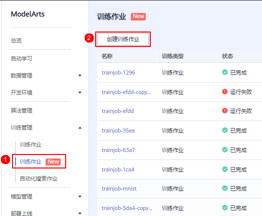
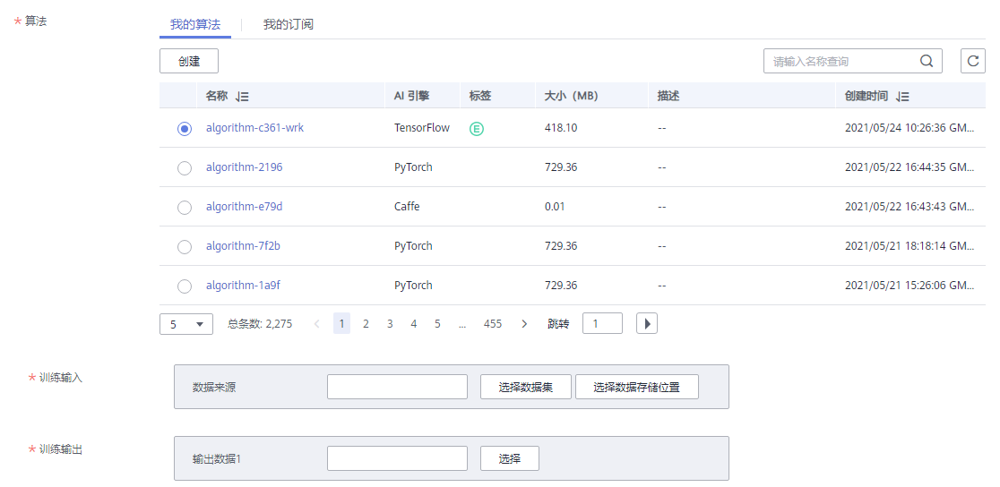

# 创建训练作业

训练管理模块是ModelArts不可或缺的功能模块，用于创建训练作业、查看训练情况以及管理训练版本。模型训练是一个不断迭代和优化的过程。在训练模块的统一管理下，方便用户试验算法、数据和超参数的各种组合，便于追踪最佳的模型与输入配置，您可以通过不同版本间的评估指标比较，确定最佳训练作业。

## 前提条件

-   数据已完成准备：已在ModelArts中创建可用的数据集，或者您已将用于训练的数据上传至OBS目录。
-   “算法管理“中，已[使用自定义脚本](使用自定义脚本.md)或者已[使用订阅算法](使用订阅算法.md)。
-   已在OBS创建至少1个空的文件夹，用于存储训练输出的内容。
-   由于训练作业运行需消耗资源，确保帐户未欠费。
-   确保您使用的OBS目录与ModelArts在同一区域。

## 创建训练作业

1.  登录ModelArts管理控制台，在左侧导航栏中选择“训练管理 \> 训练作业（New）“，默认进入“训练作业“列表。
2.  单击“创建训练作业“，进入“创建训练作业“页面，在该页面填写训练作业相关参数。

    **图 1**  进入创建训练作业页面  
    

3.  填写基本信息。基本信息包含“名称“和“描述“。

    **图 2**  训练作业基本信息  
    

4.  填写算法配置参数。请根据您的算法类型选择算法来源。

    **图 3**  算法来源选择  
    

    **表 1**  作业参数说明

    
    <table><thead align="left"><tr id="row20643337121419"><th class="cellrowborder" valign="top" width="14.89%" id="mcps1.2.4.1.1">
参数名称

    </th>
    <th class="cellrowborder" valign="top" width="17.549999999999997%" id="mcps1.2.4.1.2">
子参数

    </th>
    <th class="cellrowborder" valign="top" width="67.56%" id="mcps1.2.4.1.3">
说明

    </th>
    </tr>
    </thead>
    <tbody><tr id="row1464415371142"><td class="cellrowborder" rowspan="2" valign="top" width="14.89%" headers="mcps1.2.4.1.1 ">
算法

    

    </td>
    <td class="cellrowborder" valign="top" width="17.549999999999997%" headers="mcps1.2.4.1.2 ">
我的算法

    </td>
    <td class="cellrowborder" valign="top" width="67.56%" headers="mcps1.2.4.1.3 ">
选择“我的算法”页签，勾选“算法名称”左侧按钮，即选中该算法。

    
如果没有创建算法，请单击“创建”进入创建算法页面，详细操作指导参见<a href="创建算法.md">创建算法</a>。

    </td>
    </tr>
    <tr id="row2644103718148"><td class="cellrowborder" valign="top" headers="mcps1.2.4.1.1 ">
我的订阅

    </td>
    <td class="cellrowborder" valign="top" headers="mcps1.2.4.1.2 ">
选择“我的订阅”页签，单击下拉三角标选择算法版本。勾选算法版本，即选中该算法。

    
如果没有订阅算法，请单击“查找算法”进入算法订阅页面，详细操作参见<a href="https://support.huaweicloud.com/aimarket-modelarts/modelarts_18_0004.html" target="_blank" rel="noopener noreferrer">订阅算法</a>指导。

    </td>
    </tr>
    <tr id="row264443781414"><td class="cellrowborder" rowspan="3" valign="top" width="14.89%" headers="mcps1.2.4.1.1 ">
训练输入

    </td>
    <td class="cellrowborder" valign="top" width="17.549999999999997%" headers="mcps1.2.4.1.2 ">
-

    </td>
    <td class="cellrowborder" valign="top" width="67.56%" headers="mcps1.2.4.1.3 ">
请选择云上数据存储位置作为训练输入。

    
此处训练输入与您选择算法的“输入数据配置”匹配，参见<a href="创建算法.md#table126437359515">表2</a>。例如您的训练代码中使用argparse解析data_url为输入数据超参，则在创建的算法需要配置输入数据代码参数为data_url。在此处，您可以选择数据集或者OBS存储位置作为输入的云上路径。训练启动时，会下载云上路径的数据至运行容器。

    </td>
    </tr>
    <tr id="row66442037131411"><td class="cellrowborder" valign="top" headers="mcps1.2.4.1.1 ">
选择数据集

    </td>
    <td class="cellrowborder" valign="top" headers="mcps1.2.4.1.2 ">
从ModelArts数据管理中选择可用的数据集及其版本。

    
单击“选择数据集”，在弹出的对话框中，勾选目标数据集并选择对应的版本。

    
 说明： 

如果该选项置灰，表示该算法的输入不支持选择数据集。

    

    </td>
    </tr>
    <tr id="row12644237161418"><td class="cellrowborder" valign="top" headers="mcps1.2.4.1.1 ">
选择数据存储位置

    </td>
    <td class="cellrowborder" valign="top" headers="mcps1.2.4.1.2 ">
从OBS桶中选择训练数据。

    
单击“选择数据存储位置”，从弹出的对话框中，选择数据存储的OBS桶及其文件夹。

    
 说明： 

如果该选项置灰，表示该算法的输入不支持选择数据存储位置。

    

    </td>
    </tr>
    <tr id="row864515375141"><td class="cellrowborder" valign="top" width="14.89%" headers="mcps1.2.4.1.1 ">
训练输出

    </td>
    <td class="cellrowborder" valign="top" width="17.549999999999997%" headers="mcps1.2.4.1.2 ">
-

    </td>
    <td class="cellrowborder" valign="top" width="67.56%" headers="mcps1.2.4.1.3 ">
选择训练结果的存储位置（OBS路径）。为避免出现错误，建议选择一个空目录用作“训练输出”。

    
模型输出参数与您选择算法的“输出数据配置”匹配，参见<a href="创建算法.md#table8644335195117">表3</a>。例如您的训练代码中使用argparse解析train_url为输出路径参数，则在创建的算法需要配置输入数据代码参数为train_url。在此处，您可以选择OBS路径作为云上存储位置。训练过程中时，会上传训练输出至指定OBS路径。

    </td>
    </tr>
    <tr id="row9645163711149"><td class="cellrowborder" valign="top" width="14.89%" headers="mcps1.2.4.1.1 ">
超参

    </td>
    <td class="cellrowborder" valign="top" width="17.549999999999997%" headers="mcps1.2.4.1.2 ">
-

    </td>
    <td class="cellrowborder" valign="top" width="67.56%" headers="mcps1.2.4.1.3 ">
此参数根据您选择的算法不同而不同。

    
如果您在创建算法时已经定义超参，此处会显示该算法所有超参。超参可修改、可删除状态取决于您在创建算法时的超参约束设置，详见<a href="创建算法.md#modelarts_23_0512_section1883311313516">定义超参</a>。

    
如果您在创建算法时设置支持自定义超参，您可以单击“增加调优参数”，添加多条超参用于调优。

    </td>
    </tr>
    </tbody>
    </table>

    > **说明：** 
    >根据您选择的算法不同，训练输入、训练输出和调优参数显示不同。
    >当“训练输入“显示为“当前算法没有输入通道“，表明您不需要在该页面配置输入数据。
    >当“训练输出“显示为“当前算法没有输出通道“，表明您不需要在该页面配置输出路径。
    >当“调优参数“显示为“当前所选算法不支持自定义调优参数“，表明您不需要在该页面配置超参用于调优。

5.  选择训练资源的规格。训练参数的可选范围与已有算法的使用约束保持一致。

    **图 4**  选择训练作业资源  
    

    **表 2**  资源参数说明

    
    <table><thead align="left"><tr id="row1779103431617"><th class="cellrowborder" valign="top" width="22.32%" id="mcps1.2.3.1.1">
参数名称

    </th>
    <th class="cellrowborder" valign="top" width="77.68%" id="mcps1.2.3.1.2">
说明

    </th>
    </tr>
    </thead>
    <tbody><tr id="row3791133461615"><td class="cellrowborder" valign="top" width="22.32%" headers="mcps1.2.3.1.1 ">
资源池

    </td>
    <td class="cellrowborder" valign="top" width="77.68%" headers="mcps1.2.3.1.2 ">
选择训练作业资源池。训练作业支持选择“公共资源池”和“专属资源池”。目前暂时不支持“专属资源池”。

    </td>
    </tr>
    <tr id="row179114343162"><td class="cellrowborder" valign="top" width="22.32%" headers="mcps1.2.3.1.1 ">
资源类型

    </td>
    <td class="cellrowborder" valign="top" width="77.68%" headers="mcps1.2.3.1.2 ">
可选CPU、GPU、Ascend。

    </td>
    </tr>
    <tr id="row4791133410162"><td class="cellrowborder" valign="top" width="22.32%" headers="mcps1.2.3.1.1 ">
规格

    </td>
    <td class="cellrowborder" valign="top" width="77.68%" headers="mcps1.2.3.1.2 ">
针对不同的资源类型，选择资源规格。如果您的算法已定义使用CPU或GPU，根据已有算法约束条件，您可以在有效规格选择合适的资源规格，无效选项置灰不可选。

    
不同的资源类型的数据盘容量是不同的，为避免训练过程中出现内存不足的情况，请参考<a href="https://support.huaweicloud.com/modelarts_faq/modelarts_05_0090.html" target="_blank" rel="noopener noreferrer">训练环境中不同规格资源“/cache”目录的大小</a>。

    </td>
    </tr>
    <tr id="row17791113416169"><td class="cellrowborder" valign="top" width="22.32%" headers="mcps1.2.3.1.1 ">
计算节点个数

    </td>
    <td class="cellrowborder" valign="top" width="77.68%" headers="mcps1.2.3.1.2 ">
选择计算节点的个数。默认值为“1”。

    </td>
    </tr>
    <tr id="row5791193417165"><td class="cellrowborder" valign="top" width="22.32%" headers="mcps1.2.3.1.1 ">
作业日志路径

    </td>
    <td class="cellrowborder" valign="top" width="77.68%" headers="mcps1.2.3.1.2 "><ul id="ul1791103414167"><li>如果用户选择CPU或者GPU规格，可以选择是否打开永久保存按钮。
打开永久保存按钮后，用户需要选择作业运行中产生的日志文件存储路径。

    </li><li>如果用户选择Ascend规格，用户需要选择作业运行中产生的日志文件存储路径。
请选择一个空的OBS目录用于存储日志文件。
 说明： 

请注意选择的OBS目录有读写权限。

    

    

    </li></ul>
    </td>
    </tr>
    </tbody>
    </table>

1.  单击“提交“，完成训练作业的创建。

    训练作业一般需要运行一段时间。要查看训练作业实时情况，您可以前往训练作业列表，查看训练作业的基本情况。在训练作业列表中，刚创建的训练作业“状态“为“初始化“，当训练作业的“状态“变为“运行成功“时，表示训练作业运行结束，其生成的模型将存储至对应的“训练输出“中。当训练作业的“状态“变为“运行失败“时，您可以单击训练作业的名称，进入详情页面，通过查看日志等手段处理问题，详情请参考[查看作业详情](查看作业详情.md)。

    > **说明：** 
    >训练作业创建完成后，将立即启动，运行过程中将按照您选择的资源按需计费。

