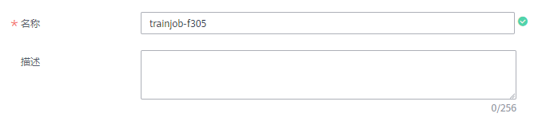

# 创建训练作业

数据准备完成后，您可以创建一个训练作业，对已有数据进行模型训练。每一个训练作业创建完成后，将自动完成一次训练。

## 前提条件

-   数据已完成准备：已在ModelArts中创建可用的数据集，或者您已将用于训练的数据集上传至OBS目录。
-   如果“算法来源“为“常用框架“，请准备好训练脚本，并上传至OBS目录。
-   如果“算法来源“为“自定义“，请按照规范完成镜像制作，并上传至SWR服务，同时，训练脚本已上传至OBS目录。
-   已在OBS创建至少1个空的文件夹，用于存储训练输出的内容。
-   由于训练作业运行需消耗资源，确保账户未欠费。
-   确保您使用的OBS目录与ModelArts在同一区域。

## 注意事项

训练作业指定的数据集目录中，用于训练的数据名称（如图片名称、音频文件名、标注文件名称等），名称长度限制为0～255英文字符。如果数据集目录下，部分数据的文件名称超过255英文字符，训练作业将不会使用此数据，使用符合要求的数据进行继续进行训练。如果数据集目录下，所有数据的文件名称都超过了255英文字符，导致训练作业无数据可用，则会最终导致训练作业失败。

## 创建训练作业

1.  登录ModelArts管理控制台，在左侧导航栏中选择“训练管理 \> 训练作业“，默认进入“训练作业“列表。
2.  在训练作业列表中，单击左上角“创建“，进入“创建训练作业“页面。
3.  在创建训练作业页面，填写训练作业相关参数，然后单击“下一步“。
    1.  填写基本信息。基本信息包含“计费模式“、“名称“、“版本“和“描述“。其中“计费模式“当前仅支持“按需计费“，不支持修改。“版本“信息由系统自动生成，按“V001“、“V002“规则命名，用户无法修改。

        您可以根据实际情况填写“名称“和“描述“信息。

        **图 1**  训练作业基本信息  
        

    2.  填写作业参数。包含数据来源、算法来源等关键信息，详情请参见[表1](#table1819364517144)。

        **图 2**  设置作业参数  
        

        **表 1**  作业参数说明

        
        <table><thead align="left"><tr id="row111285509146"><th class="cellrowborder" valign="top" width="15.2%" id="mcps1.2.4.1.1">
参数名称

        </th>
        <th class="cellrowborder" valign="top" width="17.24%" id="mcps1.2.4.1.2">
子参数

        </th>
        <th class="cellrowborder" valign="top" width="67.56%" id="mcps1.2.4.1.3">
说明

        </th>
        </tr>
        </thead>
        <tbody><tr id="row5512145291613"><td class="cellrowborder" valign="top" width="15.2%" headers="mcps1.2.4.1.1 ">
一键式参数配置

        </td>
        <td class="cellrowborder" valign="top" width="17.24%" headers="mcps1.2.4.1.2 ">
-

        </td>
        <td class="cellrowborder" valign="top" width="67.56%" headers="mcps1.2.4.1.3 ">
如果您在ModelArts已保存作业参数，您可以根据界面提示，选择已有的作业参数，快速完成训练作业的参数配置。

        </td>
        </tr>
        <tr id="row1819384501419"><td class="cellrowborder" valign="top" width="15.2%" headers="mcps1.2.4.1.1 ">
数据来源

        

        </td>
        <td class="cellrowborder" valign="top" width="17.24%" headers="mcps1.2.4.1.2 ">
数据集

        </td>
        <td class="cellrowborder" valign="top" width="67.56%" headers="mcps1.2.4.1.3 ">
从ModelArts数据管理中选择可用的数据集及其版本。

        <ul id="ul2598192417254"><li>“选择数据集”：从右侧下拉框中选择ModelArts系统中已有的数据集。当ModelArts无可用数据集时，此下拉框为空。</li><li>“选择版本”：根据“选择数据集”指定的数据集选择其版本。</li></ul>
        
一个训练作业，支持选择多个数据集，单击增加一个数据集，单击删除当前行指定的数据集。

        </td>
        </tr>
        <tr id="row124412527189"><td class="cellrowborder" valign="top" width="15.2%" headers="mcps1.2.4.1.1 ">
数据来源

        </td>
        <td class="cellrowborder" valign="top" width="17.24%" headers="mcps1.2.4.1.2 ">
数据存储位置

        </td>
        <td class="cellrowborder" valign="top" width="67.56%" headers="mcps1.2.4.1.3 ">
从OBS桶中选择训练数据。在“数据存储位置”右侧，单击“选择”，从弹出的对话框中，选择数据存储的OBS桶及其文件夹。

        
当“算法来源”选择“常用框架”时，一个训练作业，支持选择多个数据存储路径，单击增加一个数据存储路径，单击删除当前行指定的数据存储路径。

        </td>
        </tr>
        <tr id="row1819324581415"><td class="cellrowborder" rowspan="3" valign="top" width="15.2%" headers="mcps1.2.4.1.1 ">
算法来源

        </td>
        <td class="cellrowborder" valign="top" width="17.24%" headers="mcps1.2.4.1.2 ">
预置算法

        </td>
        <td class="cellrowborder" valign="top" width="67.56%" headers="mcps1.2.4.1.3 ">
使用ModelArts的预置算法，详细介绍请参见<a href="预置算法简介.md">预置算法简介</a>。

        </td>
        </tr>
        <tr id="row19879134472114"><td class="cellrowborder" valign="top" headers="mcps1.2.4.1.1 ">
常用框架

        </td>
        <td class="cellrowborder" valign="top" headers="mcps1.2.4.1.2 ">
选择“AI引擎”和“版本”，选择“代码目录”及“启动文件”。选择的AI引擎和编写训练代码时选择的框架必须一致。例如编写训练代码使用的是TensorFlow，则在创建训练作业时也要选择TensorFlow。如果您的模型需要安装Python依赖包时，请按照ModelArts定义的要求将依赖包及其配置文件放置“代码目录”中，详细说明请参见<a href="https://support.huaweicloud.com/modelarts_faq/modelarts_05_0063.html" target="_blank" rel="noopener noreferrer">模型中引用依赖包时，如何创建训练作业？</a>

        
当前ModelArts支持的AI引擎及对应版本如下所示。

        <ul id="ul15397202453116"><li>TensorFlow：TF-1.8.0-python3.6、TF-1.8.0-python2.7、TF-1.13.1-python3.6、TF-1.13.1-python2.7</li><li>MXNet：MXNet-1.2.1-python3.6、MXNet-1.2.1-python2.7</li><li>Caffe：Caffe-1.0.0-python2.7</li><li>Spark_MLlib：Spark-2.3.2-python2.7、Spark-2.3.2-python3.6</li><li>Scikit_Learn：Scikit_Learn-0.18.1-python2.7、Scikit_Learn-0.18.1-python3.6</li><li>XGBoost：XGBoost-0.8-python2.7、XGBoost-0.8-python3.6</li><li>PyTorch：PyTorch-1.0.0-python2.7、PyTorch-1.0.0-python3.6</li></ul>
        
 说明： 

MoXing是华为云ModelArts团队自研的分布式训练加速框架，它构建于开源的深度学习引擎TensorFlow、MXNet、PyTorch、Keras之上，详细说明请参见<a href="https://github.com/huaweicloud/ModelArts-Lab/tree/master/docs/moxing_api_doc" target="_blank" rel="noopener noreferrer">MoXing使用说明</a>。如果您使用的是MoXing框架编写训练脚本，在创建训练作业时，请根据您选用的接口选择其对应的AI引擎和版本。“efficient_ai”是华为云ModelArts团队自研的加速压缩工具，它支持对训练作业进行量化、剪枝和蒸馏来加速模型推理速度，详细说明请参见<a href="https://github.com/huaweicloud/ModelArts-Lab/tree/master/docs/efficient_ai_doc" target="_blank" rel="noopener noreferrer">efficient_ai使用说明</a>。

        

        </td>
        </tr>
        <tr id="row4880154420211"><td class="cellrowborder" valign="top" headers="mcps1.2.4.1.1 ">
自定义

        </td>
        <td class="cellrowborder" valign="top" headers="mcps1.2.4.1.2 ">
可使用自定义镜像创建训练作业，如何制作自定义镜像请参见<a href="使用自定义镜像.md">构建自定义镜像</a>。

        </td>
        </tr>
        <tr id="row19194124531419"><td class="cellrowborder" valign="top" width="15.2%" headers="mcps1.2.4.1.1 ">
运行参数

        </td>
        <td class="cellrowborder" valign="top" width="17.24%" headers="mcps1.2.4.1.2 ">
-

        </td>
        <td class="cellrowborder" valign="top" width="67.56%" headers="mcps1.2.4.1.3 ">
代码中的命令行参数设置值，请确保参数名称和代码的参数名称保持一致。

        
例如：train_steps=10000，其中“train_steps”为代码中的某个传参。

        </td>
        </tr>
        <tr id="row419484518148"><td class="cellrowborder" valign="top" width="15.2%" headers="mcps1.2.4.1.1 ">
训练输出位置

        </td>
        <td class="cellrowborder" valign="top" width="17.24%" headers="mcps1.2.4.1.2 ">
-

        </td>
        <td class="cellrowborder" valign="top" width="67.56%" headers="mcps1.2.4.1.3 ">
选择训练结果的存储位置。

        
 说明： 

为避免出现错误，建议选择一个空目录用作“训练输出位置”。请勿将数据集存储的目录作为训练输出位置。

        

        </td>
        </tr>
        <tr id="row14194104591416"><td class="cellrowborder" valign="top" width="15.2%" headers="mcps1.2.4.1.1 ">
作业日志路径

        </td>
        <td class="cellrowborder" valign="top" width="17.24%" headers="mcps1.2.4.1.2 ">
-

        </td>
        <td class="cellrowborder" valign="top" width="67.56%" headers="mcps1.2.4.1.3 ">
选择作业运行中产生的日志文件存储路径。

        </td>
        </tr>
        </tbody>
        </table>

    3.  选择用于训练作业的资源。

        **图 3**  选择资源  
        

        **表 2**  资源参数说明

        
        <table><thead align="left"><tr id="row495964715372"><th class="cellrowborder" valign="top" width="22.33%" id="mcps1.2.3.1.1">
参数名称

        </th>
        <th class="cellrowborder" valign="top" width="77.66999999999999%" id="mcps1.2.3.1.2">
说明

        </th>
        </tr>
        </thead>
        <tbody><tr id="row2110154443711"><td class="cellrowborder" valign="top" width="22.33%" headers="mcps1.2.3.1.1 ">
资源池

        </td>
        <td class="cellrowborder" valign="top" width="77.66999999999999%" headers="mcps1.2.3.1.2 ">
选择训练作业资源池。训练作业支持选择公共资源池和专属资源池。

        
公共资源池又可以选择CPU或GPU两种规格，不同规格的资源池，其收费标准不同，详情请参见<a href="https://www.huaweicloud.com/price_detail.html#/modelarts_detail" target="_blank" rel="noopener noreferrer">价格详情说明</a>。专属资源池的创建请参见<a href="资源池.md">资源池</a>。

        
 说明： 

如果您在训练代码使用的是GPU资源，则在选择资源池时只能选择GPU集群，否则会导致训练作业失败。

        

        </td>
        </tr>
        <tr id="row411134413716"><td class="cellrowborder" valign="top" width="22.33%" headers="mcps1.2.3.1.1 ">
计算节点个数

        </td>
        <td class="cellrowborder" valign="top" width="77.66999999999999%" headers="mcps1.2.3.1.2 ">
选择计算节点的个数。如果节点个数设置为1，表示后台的计算模式是单机模式；如果节点个数设置大于1，表示后台的计算模式为分布式的。请根据实际编码情况选择计算模式。

        
当“常用框架”选择Caffe时，只支持单机模式，即“计算节点个数”必须设置为“1”。针对其他“常用框架”，您可以根据业务情况选择单机模式或分布式模式。

        </td>
        </tr>
        </tbody>
        </table>

    4.  配置订阅消息，并设置是否将当前训练作业中的参数保存为作业参数。

        **图 4**  配置订阅消息  
        

        **表 3**  订阅消息及作业参数参数说明

        
        <table><thead align="left"><tr id="row1614614211435"><th class="cellrowborder" valign="top" width="22.33%" id="mcps1.2.3.1.1">
参数名称

        </th>
        <th class="cellrowborder" valign="top" width="77.66999999999999%" id="mcps1.2.3.1.2">
说明

        </th>
        </tr>
        </thead>
        <tbody><tr id="row131731715438"><td class="cellrowborder" valign="top" width="22.33%" headers="mcps1.2.3.1.1 ">
订阅消息

        </td>
        <td class="cellrowborder" valign="top" width="77.66999999999999%" headers="mcps1.2.3.1.2 ">
订阅消息使用消息通知服务，在事件列表中选择需要监控的资源池状态，在事件发生时发送消息通知。

        
此参数为可选参数，您可以根据实际情况设置是否打开开关。如果开启订阅消息，请根据实际情况填写如下参数。

        <ul id="ul4779327174518"><li>“主题名”：订阅消息主题名称。您可以单击<a href="https://console.huaweicloud.com/smn/?region=southchina#/smn/manager/dashboard" target="_blank" rel="noopener noreferrer">创建主题</a>，在消息通知服务中创建主题。</li><li>“事件列表”：订阅事件。当前可选择“OnJobRunning”、“OnJobSucceeded”、“OnJobFailed”三种事件，分别代表训练运行中、运行成功、运行失败。</li></ul>
        </td>
        </tr>
        <tr id="row0394182311432"><td class="cellrowborder" valign="top" width="22.33%" headers="mcps1.2.3.1.1 ">
保存作业参数

        </td>
        <td class="cellrowborder" valign="top" width="77.66999999999999%" headers="mcps1.2.3.1.2 ">
勾选此参数，表示将当前训练作业设置的作业参数保存，方便后续一键复制使用。

        
勾选“保存训练参数”，然后填写“作业参数名称”和“作业参数描述”，即可完成当前参数配置的保存。训练作业创建成功后，您可以从ModelArts的作业参数列表中查看保存的信息，详细操作指导请参见<a href="管理作业参数.md">管理作业参数</a>。

        </td>
        </tr>
        </tbody>
        </table>

    5.  完成参数填写后，单击“下一步“。

4.  在“规格确认“页面，确认填写信息无误后，单击“立即创建“，完成训练作业的创建。训练作业一般需要运行一段时间，根据您选择的数据量和资源不同，训练时间将耗时几分钟到几十分钟不等。

    > **说明：**   
    >训练作业创建完成后，将立即启动，运行过程中将按照您选择的资源按需计费。  

    您可以前往训练作业列表，查看训练作业的基本情况。在训练作业列表中，刚创建的训练作业“状态“为“初始化“，当训练作业的“状态“变为“运行成功“时，表示训练作业运行结束，其生成的模型将存储至对应的“训练输出位置“中。当训练作业的“状态“变为“运行失败“时，您可以单击训练作业的名称，进入详情页面，通过查看日志等手段处理问题。

