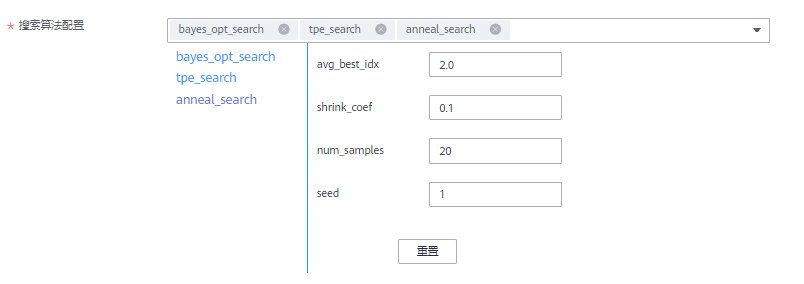
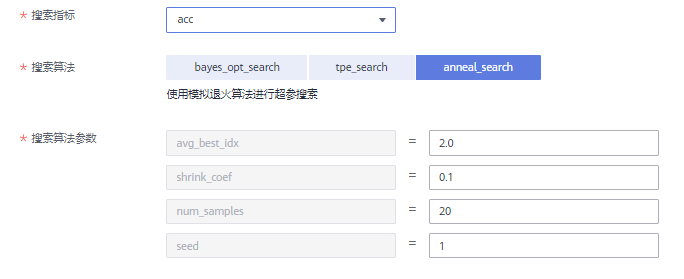

# 创建超参搜索作业

## 背景信息

对于用户希望优化的超参，需在“超参“设置中定义，可以给定名称、类型、默认值、约束等，具体设置方法可以参考[定义超参](创建算法.md#modelarts_23_0512_section1883311313516)。

如果用户使用的AI引擎为“PyTorch-1.4.0-python3.6-v2“或“TF-1.13.1-python3.6-v2“，并且优化的超参类型为float类型，ModelArts支持用户使用超参搜索功能。

在0代码修改的基础下，实现算法模型的超参搜索。需要完成以下步骤：

1.  [准备工作](#section19539763520)
2.  [创建算法](#section54440253422)
3.  [创建训练作业（New）](#section3995430104214)
4.  [查看超参搜索作业详情](#section1194724314164)

## 准备工作

-   数据已完成准备：已在ModelArts中创建可用的数据集，或者您已将用于训练的数据集上传至OBS目录。
-   请准备好训练脚本，并上传至OBS目录。训练脚本开发指导参见[开发自定义脚本](开发自定义脚本.md)。
-   在训练代码中，用户需打印搜索指标参数。
-   已在OBS创建至少1个空的文件夹，用于存储训练输出的内容。
-   由于训练作业运行需消耗资源，确保帐户未欠费。
-   确保您使用的OBS目录与ModelArts在同一区域。

## 创建算法

进入ModelArts控制台，参考[创建算法](创建算法.md)操作指导，创建自定义算法。在配置自定义算法参数时，需关注“超参“和“支持的策略“参数的设置。

**图 1**  超参搜索作业参数  

对于用户希望优化的超参，需在“超参“设置中定义，可以给定名称、类型、默认值、约束等，具体设置方法可以参考[定义超参](创建算法.md#modelarts_23_0512_section1883311313516)。

单击勾选自动搜索，用户为算法设置算法搜索功能。自动搜索作业运行过程中，ModelArts后台通过指标正则表达式获取搜索指标参数，朝指定的优化方向进行超参优化。用户需要在代码中打印搜索参数并在控制台配置以下参数：

-   搜索指标

    搜索指标为目标函数的值，通常可以设置为loss、accuracy等。通过优化搜索指标的目标值超优化方向收敛，找到最契合的超参，提高模型精度和收敛速度。

    **表 1**  搜索指标参数

    
    <table><thead align="left"><tr id="row697918392225"><th class="cellrowborder" valign="top" width="34.54%" id="mcps1.2.3.1.1">
参数

    </th>
    <th class="cellrowborder" valign="top" width="65.46%" id="mcps1.2.3.1.2">
说明

    </th>
    </tr>
    </thead>
    <tbody><tr id="row597943919224"><td class="cellrowborder" valign="top" width="34.54%" headers="mcps1.2.3.1.1 ">
名称

    </td>
    <td class="cellrowborder" valign="top" width="65.46%" headers="mcps1.2.3.1.2 ">
搜索指标的名称。需要与您在代码中打印的搜索指标参数保持一致。

    </td>
    </tr>
    <tr id="row297993919220"><td class="cellrowborder" valign="top" width="34.54%" headers="mcps1.2.3.1.1 ">
优化方向

    </td>
    <td class="cellrowborder" valign="top" width="65.46%" headers="mcps1.2.3.1.2 ">
可选“最大化”或者“最小化”。

    </td>
    </tr>
    <tr id="row6979113910224"><td class="cellrowborder" valign="top" width="34.54%" headers="mcps1.2.3.1.1 ">
指标正则

    </td>
    <td class="cellrowborder" valign="top" width="65.46%" headers="mcps1.2.3.1.2 ">
填入正则表达式。您可以单击智能生成功能自动获取正则表达式。

    </td>
    </tr>
    </tbody>
    </table>

    **图 2**  搜索指标参数  
    

-   设置自动化搜索参数

    从已设置的“超参”中选择可用于搜索优化的超参。优化的超参仅支持float类型，选中自动化搜索参数后，需设置取值范围。

    **图 3**  自动化参数设置  
    

-   搜索算法配置

    ModelArts内置三种超参搜索算法，用户可以根据实际情况选择对应的算法，支持多选。对应的算法和参数解析请参考以下：

    -   bayes\_opt\_search:[贝叶斯优化\(SMAC\)](贝叶斯优化(SMAC).md)
    -   tpe\_search:[TPE算法](TPE算法.md)
    -   anneal\_search:[模拟退火算法\(Anneal\)](模拟退火算法(Anneal).md)

        **图 4**  搜索算法配置  
        

创建算法完成后，在“算法管理“页面，等待算法就绪。当新创建的算法状态变更为“就绪“时，即可执行其他操作。

## 创建训练作业（New）

登录ModelArts控制台，参考[创建训练作业](创建训练作业.md)操作指导，创建训练作业。用户需关注以下操作才能开启超参搜索。

当您选择支持超参搜索的算法，需单击超级参数的范围设置按钮才能开启超参搜索功能。

**图 5**  范围设置  

开启超参搜索功能后，用户可以设置搜索指标、搜索算法和搜索算法参数。三个参数显示的支持值与[算法管理模块的超参设置](#section54440253422)一一对应。

**图 6**  超参搜索参数设置  

完成超参搜索作业的创建后，训练作业需要运行一段时间。

## 查看超参搜索作业详情

训练作业运行结束后，您可以通过查看训练作业详情判断此训练作业是否满意。

进入ModelArts控制台，您可以参考[查看作业详情](查看作业详情.md)操作指导。如果训练作业是超参搜索作业，用户可以查看自动超参搜索结果。

**图 7**  超参搜索结果  

