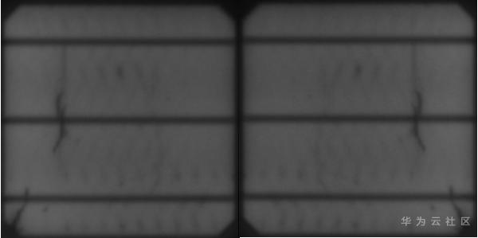

# 利用模型评估功能进行数据增强<a name="modelarts_eval_0012"></a>

## 场景描述<a name="zh-cn_topic_0275437248_section992250195613"></a>

数据集是训练中最重要的一个环节，modelarts平台虽然给出了每类5张图片就能训练的限制，但是这种限制对一个工业级的应用场景往往是远远不够的。这里介绍其中一种带标签扩充数据集的方法。

## 原理说明<a name="zh-cn_topic_0275437248_section1664553568"></a>

**数据集情况**

首先，这是一个分类的问题，需要检测出工业零件表面的瑕疵，判断是否为残次品，如下是样例图片。

**图 1**  样例图片<a name="zh-cn_topic_0275437248_fig46348455814"></a>  


这是两块太阳能电板的表面，左侧是正常的，右侧是有残缺和残次现象的，需要用一个模型来区分这两类的图片，帮助定位哪些太阳能电板存在问题。左侧的正常样本754张，右侧的残次样本358张，验证集同样，正常样本754张，残次样本357张。总样本在2000张左右，对于一般工业要求的95%以上准确率模型而言属于一个非常小的样本。先直接拿这个数据集用Pytorch加载imagenet的resnet50模型训练，整体精度ACC在86.06%左右，召回率正常类为97.3%，但非正常类为62.9%，还不能达到用户预期。

小样本学习few-shot fewshot learning \(FSFSL\)的常见方法，基本都是从两个方向入手。一是数据本身，二是从模型训练本身，也就是对图像提取的特征做文章。这里从数据本身入手，首先观察数据集，都是300\*300的灰度图像，而且都已太阳能电板表面的正面俯视为整张图片。这属于预先处理的很好的图片。那么针对这种图片，翻转镜像对图片整体结构影响不大，所以我们首先可以做的就是flip操作，增加数据的多样性。flip效果如下。

**图 2**  flip效果<a name="zh-cn_topic_0275437248_fig125324281005"></a>  


这样数据集就从1100张扩增到了2200张，还是不是很多，但是直接观察数据集已经没什么太好的扩充办法了。这时想使用Modelarts模型评估功能来评估模型对数据的泛化能力。这里调用了提供的模型评估接口，deep\_moxing.model\_analysis下面的analyse接口。

```
def validate(val_loader, model, criterion, args):
batch_time = AverageMeter('Time', ':6.3f')
losses = AverageMeter('Loss', ':.4e')
top1 = AverageMeter('Acc@1', ':6.2f')
top5 = AverageMeter('Acc@5', ':6.2f')
progress = ProgressMeter(
len(val_loader),
[batch_time, losses, top1, top5],
prefix='Test: ')
pred_list = []
target_list = []
# switch to evaluate mode
model.eval()
with torch.no_grad():
end = time.time()
for i, (images, target) in enumerate(val_loader):
if args.gpu is not None:
images = images.cuda(args.gpu, non_blocking=True)
target = target.cuda(args.gpu, non_blocking=True)

# compute output
output = model(images)
loss = criterion(output, target)
# 获取logits输出结果pred和实际目标的结果target
pred_list += output.cpu().numpy()[:, :2].tolist()
target_list += target.cpu().numpy().tolist()
# measure accuracy and record loss
acc1, acc5 = accuracy(output, target, topk=(1, 5), i=i)
losses.update(loss.item(), images.size(0))
top1.update(acc1[0], images.size(0))
top5.update(acc5[0], images.size(0))

# measure elapsed time
batch_time.update(time.time() - end)
end = time.time()

if i % args.print_freq == 0:
progress.display(i)
# TODO: this should also be done with the ProgressMeter
print(' * Acc@1 {top1.avg:.3f} Acc@5 {top5.avg:.3f}'
.format(top1=top1, top5=top5))
# 获取图片的存储路径name
name_list = val_loader.dataset.samples
for idx in range(len(name_list)):
name_list[idx] = name_list[idx][0]
analyse(task_type='image_classification', save_path='/home/image_labeled/',
pred_list=pred_list, label_list=target_list, name_list=name_list)
return top1.avg
```

上段代码大部分都是Pytorch训练ImageNet中的验证部分代码，需要获取三个list，模型pred直接结果logits、图片实际类别target和图片存储路径name。然后按如上的调用方法调用analyse接口，会在save\_path的目录下生成一个json文件，放到Modelarts训练输出目录里，就能在评估结果里看到对模型的分析结果。这里是线下生成的json文件再上传到线上看可视化结果。关于敏感度分析结果如[表1](#zh-cn_topic_0275437248_table27921514289)和[表2](#zh-cn_topic_0275437248_table65661318718)所示。

**表 1**  图像亮度敏感度分析

<a name="zh-cn_topic_0275437248_table27921514289"></a>
<table><thead align="left"><tr id="zh-cn_topic_0275437248_row2792185152814"><th class="cellrowborder" valign="top" width="33.33333333333333%" id="mcps1.2.4.1.1"><p id="zh-cn_topic_0275437248_p730319132202"><a name="zh-cn_topic_0275437248_p730319132202"></a><a name="zh-cn_topic_0275437248_p730319132202"></a>特征值分布</p>
</th>
<th class="cellrowborder" valign="top" width="33.33333333333333%" id="mcps1.2.4.1.2"><p id="zh-cn_topic_0275437248_p54749465611"><a name="zh-cn_topic_0275437248_p54749465611"></a><a name="zh-cn_topic_0275437248_p54749465611"></a>0</p>
</th>
<th class="cellrowborder" valign="top" width="33.33333333333333%" id="mcps1.2.4.1.3"><p id="zh-cn_topic_0275437248_p124732464617"><a name="zh-cn_topic_0275437248_p124732464617"></a><a name="zh-cn_topic_0275437248_p124732464617"></a>1</p>
</th>
</tr>
</thead>
<tbody><tr id="zh-cn_topic_0275437248_row67933542818"><td class="cellrowborder" valign="top" width="33.33333333333333%" headers="mcps1.2.4.1.1 "><p id="zh-cn_topic_0275437248_p83033135207"><a name="zh-cn_topic_0275437248_p83033135207"></a><a name="zh-cn_topic_0275437248_p83033135207"></a>0% - 20%</p>
</td>
<td class="cellrowborder" valign="top" width="33.33333333333333%" headers="mcps1.2.4.1.2 "><p id="zh-cn_topic_0275437248_p364810542612"><a name="zh-cn_topic_0275437248_p364810542612"></a><a name="zh-cn_topic_0275437248_p364810542612"></a>0.7273</p>
</td>
<td class="cellrowborder" valign="top" width="33.33333333333333%" headers="mcps1.2.4.1.3 "><p id="zh-cn_topic_0275437248_p76472541561"><a name="zh-cn_topic_0275437248_p76472541561"></a><a name="zh-cn_topic_0275437248_p76472541561"></a>0.8864</p>
</td>
</tr>
<tr id="zh-cn_topic_0275437248_row279316552815"><td class="cellrowborder" valign="top" width="33.33333333333333%" headers="mcps1.2.4.1.1 "><p id="zh-cn_topic_0275437248_p16303613152014"><a name="zh-cn_topic_0275437248_p16303613152014"></a><a name="zh-cn_topic_0275437248_p16303613152014"></a>20% - 40%</p>
</td>
<td class="cellrowborder" valign="top" width="33.33333333333333%" headers="mcps1.2.4.1.2 "><p id="zh-cn_topic_0275437248_p176461654960"><a name="zh-cn_topic_0275437248_p176461654960"></a><a name="zh-cn_topic_0275437248_p176461654960"></a>0.8446</p>
</td>
<td class="cellrowborder" valign="top" width="33.33333333333333%" headers="mcps1.2.4.1.3 "><p id="zh-cn_topic_0275437248_p864516542061"><a name="zh-cn_topic_0275437248_p864516542061"></a><a name="zh-cn_topic_0275437248_p864516542061"></a>0.6892</p>
</td>
</tr>
<tr id="zh-cn_topic_0275437248_row5793651285"><td class="cellrowborder" valign="top" width="33.33333333333333%" headers="mcps1.2.4.1.1 "><p id="zh-cn_topic_0275437248_p19303191362011"><a name="zh-cn_topic_0275437248_p19303191362011"></a><a name="zh-cn_topic_0275437248_p19303191362011"></a>40% - 60%</p>
</td>
<td class="cellrowborder" valign="top" width="33.33333333333333%" headers="mcps1.2.4.1.2 "><p id="zh-cn_topic_0275437248_p19645654763"><a name="zh-cn_topic_0275437248_p19645654763"></a><a name="zh-cn_topic_0275437248_p19645654763"></a>0.9077</p>
</td>
<td class="cellrowborder" valign="top" width="33.33333333333333%" headers="mcps1.2.4.1.3 "><p id="zh-cn_topic_0275437248_p3644165410617"><a name="zh-cn_topic_0275437248_p3644165410617"></a><a name="zh-cn_topic_0275437248_p3644165410617"></a>0.4615</p>
</td>
</tr>
<tr id="zh-cn_topic_0275437248_row177936592811"><td class="cellrowborder" valign="top" width="33.33333333333333%" headers="mcps1.2.4.1.1 "><p id="zh-cn_topic_0275437248_p14303213152019"><a name="zh-cn_topic_0275437248_p14303213152019"></a><a name="zh-cn_topic_0275437248_p14303213152019"></a>60% - 80%</p>
</td>
<td class="cellrowborder" valign="top" width="33.33333333333333%" headers="mcps1.2.4.1.2 "><p id="zh-cn_topic_0275437248_p964445413616"><a name="zh-cn_topic_0275437248_p964445413616"></a><a name="zh-cn_topic_0275437248_p964445413616"></a>0.9496</p>
</td>
<td class="cellrowborder" valign="top" width="33.33333333333333%" headers="mcps1.2.4.1.3 "><p id="zh-cn_topic_0275437248_p176432543613"><a name="zh-cn_topic_0275437248_p176432543613"></a><a name="zh-cn_topic_0275437248_p176432543613"></a>0.5116</p>
</td>
</tr>
<tr id="zh-cn_topic_0275437248_row6793158282"><td class="cellrowborder" valign="top" width="33.33333333333333%" headers="mcps1.2.4.1.1 "><p id="zh-cn_topic_0275437248_p130319135201"><a name="zh-cn_topic_0275437248_p130319135201"></a><a name="zh-cn_topic_0275437248_p130319135201"></a>80% - 100%</p>
</td>
<td class="cellrowborder" valign="top" width="33.33333333333333%" headers="mcps1.2.4.1.2 "><p id="zh-cn_topic_0275437248_p064219541615"><a name="zh-cn_topic_0275437248_p064219541615"></a><a name="zh-cn_topic_0275437248_p064219541615"></a>0.966</p>
</td>
<td class="cellrowborder" valign="top" width="33.33333333333333%" headers="mcps1.2.4.1.3 "><p id="zh-cn_topic_0275437248_p26421454065"><a name="zh-cn_topic_0275437248_p26421454065"></a><a name="zh-cn_topic_0275437248_p26421454065"></a>0.5625</p>
</td>
</tr>
<tr id="zh-cn_topic_0275437248_row16961632152815"><td class="cellrowborder" valign="top" width="33.33333333333333%" headers="mcps1.2.4.1.1 "><p id="zh-cn_topic_0275437248_p830331317201"><a name="zh-cn_topic_0275437248_p830331317201"></a><a name="zh-cn_topic_0275437248_p830331317201"></a>标准差</p>
</td>
<td class="cellrowborder" valign="top" width="33.33333333333333%" headers="mcps1.2.4.1.2 "><p id="zh-cn_topic_0275437248_p564135416620"><a name="zh-cn_topic_0275437248_p564135416620"></a><a name="zh-cn_topic_0275437248_p564135416620"></a>0.0864</p>
</td>
<td class="cellrowborder" valign="top" width="33.33333333333333%" headers="mcps1.2.4.1.3 "><p id="zh-cn_topic_0275437248_p364016541062"><a name="zh-cn_topic_0275437248_p364016541062"></a><a name="zh-cn_topic_0275437248_p364016541062"></a>0.1516</p>
</td>
</tr>
</tbody>
</table>

**表 2**  图像亮度敏感度分析

<a name="zh-cn_topic_0275437248_table65661318718"></a>
<table><thead align="left"><tr id="zh-cn_topic_0275437248_row05671031578"><th class="cellrowborder" valign="top" width="33.33333333333333%" id="mcps1.2.4.1.1"><p id="zh-cn_topic_0275437248_p756710311174"><a name="zh-cn_topic_0275437248_p756710311174"></a><a name="zh-cn_topic_0275437248_p756710311174"></a>特征值分布</p>
</th>
<th class="cellrowborder" valign="top" width="33.33333333333333%" id="mcps1.2.4.1.2"><p id="zh-cn_topic_0275437248_p1567143116714"><a name="zh-cn_topic_0275437248_p1567143116714"></a><a name="zh-cn_topic_0275437248_p1567143116714"></a>0</p>
</th>
<th class="cellrowborder" valign="top" width="33.33333333333333%" id="mcps1.2.4.1.3"><p id="zh-cn_topic_0275437248_p356703110711"><a name="zh-cn_topic_0275437248_p356703110711"></a><a name="zh-cn_topic_0275437248_p356703110711"></a>1</p>
</th>
</tr>
</thead>
<tbody><tr id="zh-cn_topic_0275437248_row1056710318716"><td class="cellrowborder" valign="top" width="33.33333333333333%" headers="mcps1.2.4.1.1 "><p id="zh-cn_topic_0275437248_p256720311779"><a name="zh-cn_topic_0275437248_p256720311779"></a><a name="zh-cn_topic_0275437248_p256720311779"></a>0% - 20%</p>
</td>
<td class="cellrowborder" valign="top" width="33.33333333333333%" headers="mcps1.2.4.1.2 "><p id="zh-cn_topic_0275437248_p1117714561276"><a name="zh-cn_topic_0275437248_p1117714561276"></a><a name="zh-cn_topic_0275437248_p1117714561276"></a>0.7556</p>
</td>
<td class="cellrowborder" valign="top" width="33.33333333333333%" headers="mcps1.2.4.1.3 "><p id="zh-cn_topic_0275437248_p21761856777"><a name="zh-cn_topic_0275437248_p21761856777"></a><a name="zh-cn_topic_0275437248_p21761856777"></a>0.8333</p>
</td>
</tr>
<tr id="zh-cn_topic_0275437248_row175678316717"><td class="cellrowborder" valign="top" width="33.33333333333333%" headers="mcps1.2.4.1.1 "><p id="zh-cn_topic_0275437248_p2056710311470"><a name="zh-cn_topic_0275437248_p2056710311470"></a><a name="zh-cn_topic_0275437248_p2056710311470"></a>20% - 40%</p>
</td>
<td class="cellrowborder" valign="top" width="33.33333333333333%" headers="mcps1.2.4.1.2 "><p id="zh-cn_topic_0275437248_p1717617569714"><a name="zh-cn_topic_0275437248_p1717617569714"></a><a name="zh-cn_topic_0275437248_p1717617569714"></a>0.8489</p>
</td>
<td class="cellrowborder" valign="top" width="33.33333333333333%" headers="mcps1.2.4.1.3 "><p id="zh-cn_topic_0275437248_p1417515561720"><a name="zh-cn_topic_0275437248_p1417515561720"></a><a name="zh-cn_topic_0275437248_p1417515561720"></a>0.6466</p>
</td>
</tr>
<tr id="zh-cn_topic_0275437248_row105671031275"><td class="cellrowborder" valign="top" width="33.33333333333333%" headers="mcps1.2.4.1.1 "><p id="zh-cn_topic_0275437248_p20567231277"><a name="zh-cn_topic_0275437248_p20567231277"></a><a name="zh-cn_topic_0275437248_p20567231277"></a>40% - 60%</p>
</td>
<td class="cellrowborder" valign="top" width="33.33333333333333%" headers="mcps1.2.4.1.2 "><p id="zh-cn_topic_0275437248_p1317595612716"><a name="zh-cn_topic_0275437248_p1317595612716"></a><a name="zh-cn_topic_0275437248_p1317595612716"></a>0.9239</p>
</td>
<td class="cellrowborder" valign="top" width="33.33333333333333%" headers="mcps1.2.4.1.3 "><p id="zh-cn_topic_0275437248_p3174656374"><a name="zh-cn_topic_0275437248_p3174656374"></a><a name="zh-cn_topic_0275437248_p3174656374"></a>0.6316</p>
</td>
</tr>
<tr id="zh-cn_topic_0275437248_row956719311374"><td class="cellrowborder" valign="top" width="33.33333333333333%" headers="mcps1.2.4.1.1 "><p id="zh-cn_topic_0275437248_p656713311273"><a name="zh-cn_topic_0275437248_p656713311273"></a><a name="zh-cn_topic_0275437248_p656713311273"></a>60% - 80%</p>
</td>
<td class="cellrowborder" valign="top" width="33.33333333333333%" headers="mcps1.2.4.1.2 "><p id="zh-cn_topic_0275437248_p91741456579"><a name="zh-cn_topic_0275437248_p91741456579"></a><a name="zh-cn_topic_0275437248_p91741456579"></a>0.9492</p>
</td>
<td class="cellrowborder" valign="top" width="33.33333333333333%" headers="mcps1.2.4.1.3 "><p id="zh-cn_topic_0275437248_p217320561719"><a name="zh-cn_topic_0275437248_p217320561719"></a><a name="zh-cn_topic_0275437248_p217320561719"></a>0.8</p>
</td>
</tr>
<tr id="zh-cn_topic_0275437248_row1256711311375"><td class="cellrowborder" valign="top" width="33.33333333333333%" headers="mcps1.2.4.1.1 "><p id="zh-cn_topic_0275437248_p8567531178"><a name="zh-cn_topic_0275437248_p8567531178"></a><a name="zh-cn_topic_0275437248_p8567531178"></a>80% - 100%</p>
</td>
<td class="cellrowborder" valign="top" width="33.33333333333333%" headers="mcps1.2.4.1.2 "><p id="zh-cn_topic_0275437248_p217345619717"><a name="zh-cn_topic_0275437248_p217345619717"></a><a name="zh-cn_topic_0275437248_p217345619717"></a>0.9631</p>
</td>
<td class="cellrowborder" valign="top" width="33.33333333333333%" headers="mcps1.2.4.1.3 "><p id="zh-cn_topic_0275437248_p517275610713"><a name="zh-cn_topic_0275437248_p517275610713"></a><a name="zh-cn_topic_0275437248_p517275610713"></a>0.5946</p>
</td>
</tr>
<tr id="zh-cn_topic_0275437248_row15567531370"><td class="cellrowborder" valign="top" width="33.33333333333333%" headers="mcps1.2.4.1.1 "><p id="zh-cn_topic_0275437248_p7567123115714"><a name="zh-cn_topic_0275437248_p7567123115714"></a><a name="zh-cn_topic_0275437248_p7567123115714"></a>标准差</p>
</td>
<td class="cellrowborder" valign="top" width="33.33333333333333%" headers="mcps1.2.4.1.2 "><p id="zh-cn_topic_0275437248_p217120561573"><a name="zh-cn_topic_0275437248_p217120561573"></a><a name="zh-cn_topic_0275437248_p217120561573"></a>0.0771</p>
</td>
<td class="cellrowborder" valign="top" width="33.33333333333333%" headers="mcps1.2.4.1.3 "><p id="zh-cn_topic_0275437248_p1917115561472"><a name="zh-cn_topic_0275437248_p1917115561472"></a><a name="zh-cn_topic_0275437248_p1917115561472"></a>0.0963</p>
</td>
</tr>
</tbody>
</table>

上述两个表的意思是，不同的特征值范围图片分别测试的精度是多少。比如亮度敏感度分析的第一项0%-20%，可以理解为，在图片亮度较低的场景下对与0类和其他亮度条件的图片相比，精度要低很多。整体来看，主要是为了检测1类，1类在图片的亮度和清晰度两项上显得都很敏感，也就是模型不能很好地处理图片的这两项特征变化的图片。那这不就是我要扩增数据集的方向吗？

同时，ModelArts平台还提供了使用“数据处理\>数据扩增“功能，可以直接扩充数据集。

那么我们就得到一个正常类2210张，瑕疵类1174张图片的数据集，用同样的策略扔进pytorch中训练，得到的结果。

**表 3**  数据扩增后的结果

<a name="zh-cn_topic_0275437248_table9782444135"></a>
<table><thead align="left"><tr id="zh-cn_topic_0275437248_row378104414139"><th class="cellrowborder" valign="top" width="25%" id="mcps1.2.5.1.1"><p id="zh-cn_topic_0275437248_p172771750171317"><a name="zh-cn_topic_0275437248_p172771750171317"></a><a name="zh-cn_topic_0275437248_p172771750171317"></a>方法</p>
</th>
<th class="cellrowborder" valign="top" width="25%" id="mcps1.2.5.1.2"><p id="zh-cn_topic_0275437248_p0278105020134"><a name="zh-cn_topic_0275437248_p0278105020134"></a><a name="zh-cn_topic_0275437248_p0278105020134"></a>accuracy</p>
</th>
<th class="cellrowborder" valign="top" width="25%" id="mcps1.2.5.1.3"><p id="zh-cn_topic_0275437248_p162782050111315"><a name="zh-cn_topic_0275437248_p162782050111315"></a><a name="zh-cn_topic_0275437248_p162782050111315"></a>recall norm类</p>
</th>
<th class="cellrowborder" valign="top" width="25%" id="mcps1.2.5.1.4"><p id="zh-cn_topic_0275437248_p15278165012138"><a name="zh-cn_topic_0275437248_p15278165012138"></a><a name="zh-cn_topic_0275437248_p15278165012138"></a>recall abnorm类</p>
</th>
</tr>
</thead>
<tbody><tr id="zh-cn_topic_0275437248_row177844417139"><td class="cellrowborder" valign="top" width="25%" headers="mcps1.2.5.1.1 "><p id="zh-cn_topic_0275437248_p7278250131311"><a name="zh-cn_topic_0275437248_p7278250131311"></a><a name="zh-cn_topic_0275437248_p7278250131311"></a>原版</p>
</td>
<td class="cellrowborder" valign="top" width="25%" headers="mcps1.2.5.1.2 "><p id="zh-cn_topic_0275437248_p152784502133"><a name="zh-cn_topic_0275437248_p152784502133"></a><a name="zh-cn_topic_0275437248_p152784502133"></a>86.06%</p>
</td>
<td class="cellrowborder" valign="top" width="25%" headers="mcps1.2.5.1.3 "><p id="zh-cn_topic_0275437248_p13278145081318"><a name="zh-cn_topic_0275437248_p13278145081318"></a><a name="zh-cn_topic_0275437248_p13278145081318"></a>97.3%</p>
</td>
<td class="cellrowborder" valign="top" width="25%" headers="mcps1.2.5.1.4 "><p id="zh-cn_topic_0275437248_p2027845071315"><a name="zh-cn_topic_0275437248_p2027845071315"></a><a name="zh-cn_topic_0275437248_p2027845071315"></a>62.9%</p>
</td>
</tr>
<tr id="zh-cn_topic_0275437248_row1581472135"><td class="cellrowborder" valign="top" width="25%" headers="mcps1.2.5.1.1 "><p id="zh-cn_topic_0275437248_p17278135081317"><a name="zh-cn_topic_0275437248_p17278135081317"></a><a name="zh-cn_topic_0275437248_p17278135081317"></a>从1100张扩增到2940张</p>
</td>
<td class="cellrowborder" valign="top" width="25%" headers="mcps1.2.5.1.2 "><p id="zh-cn_topic_0275437248_p10278145011311"><a name="zh-cn_topic_0275437248_p10278145011311"></a><a name="zh-cn_topic_0275437248_p10278145011311"></a>86.31%</p>
</td>
<td class="cellrowborder" valign="top" width="25%" headers="mcps1.2.5.1.3 "><p id="zh-cn_topic_0275437248_p15278350131319"><a name="zh-cn_topic_0275437248_p15278350131319"></a><a name="zh-cn_topic_0275437248_p15278350131319"></a>97.6%</p>
</td>
<td class="cellrowborder" valign="top" width="25%" headers="mcps1.2.5.1.4 "><p id="zh-cn_topic_0275437248_p1427818500137"><a name="zh-cn_topic_0275437248_p1427818500137"></a><a name="zh-cn_topic_0275437248_p1427818500137"></a>62.5%</p>
</td>
</tr>
</tbody>
</table>

从上述结果中，发现精度并没有明显提升。重新分析一下数据集，这种工业类的数据集往往都存在一个样本不均匀的问题，这里虽然接近2：1，但是检测的要求针对有瑕疵的类别的比较高，应该让模型倾向于有瑕疵类去学习，而且看到1类的也就是有瑕疵类的结果比较敏感，所以其实还是存在样本不均衡的情况。由此后面的这两种增强方法只针对了1类也就是有问题的破损类做，最终得到3000张左右，1508张正常类图片，1432张有瑕疵类图片，这样样本就相对平衡了。用同样的策略扔进resnet50中训练。最终得到的精度信息。

**表 4**  修改扩增数据后的结果

<a name="zh-cn_topic_0275437248_table125841833155"></a>
<table><thead align="left"><tr id="zh-cn_topic_0275437248_row17584736155"><th class="cellrowborder" valign="top" width="25%" id="mcps1.2.5.1.1"><p id="zh-cn_topic_0275437248_p164713921514"><a name="zh-cn_topic_0275437248_p164713921514"></a><a name="zh-cn_topic_0275437248_p164713921514"></a>方法</p>
</th>
<th class="cellrowborder" valign="top" width="25%" id="mcps1.2.5.1.2"><p id="zh-cn_topic_0275437248_p164728971518"><a name="zh-cn_topic_0275437248_p164728971518"></a><a name="zh-cn_topic_0275437248_p164728971518"></a>accuracy</p>
</th>
<th class="cellrowborder" valign="top" width="25%" id="mcps1.2.5.1.3"><p id="zh-cn_topic_0275437248_p194728913158"><a name="zh-cn_topic_0275437248_p194728913158"></a><a name="zh-cn_topic_0275437248_p194728913158"></a>recall norm类</p>
</th>
<th class="cellrowborder" valign="top" width="25%" id="mcps1.2.5.1.4"><p id="zh-cn_topic_0275437248_p247249171517"><a name="zh-cn_topic_0275437248_p247249171517"></a><a name="zh-cn_topic_0275437248_p247249171517"></a>recall abnorm类</p>
</th>
</tr>
</thead>
<tbody><tr id="zh-cn_topic_0275437248_row1058583171520"><td class="cellrowborder" valign="top" width="25%" headers="mcps1.2.5.1.1 "><p id="zh-cn_topic_0275437248_p747269101511"><a name="zh-cn_topic_0275437248_p747269101511"></a><a name="zh-cn_topic_0275437248_p747269101511"></a>原版</p>
</td>
<td class="cellrowborder" valign="top" width="25%" headers="mcps1.2.5.1.2 "><p id="zh-cn_topic_0275437248_p1247259181512"><a name="zh-cn_topic_0275437248_p1247259181512"></a><a name="zh-cn_topic_0275437248_p1247259181512"></a>86.06%</p>
</td>
<td class="cellrowborder" valign="top" width="25%" headers="mcps1.2.5.1.3 "><p id="zh-cn_topic_0275437248_p104726941514"><a name="zh-cn_topic_0275437248_p104726941514"></a><a name="zh-cn_topic_0275437248_p104726941514"></a>97.3%</p>
</td>
<td class="cellrowborder" valign="top" width="25%" headers="mcps1.2.5.1.4 "><p id="zh-cn_topic_0275437248_p9472494152"><a name="zh-cn_topic_0275437248_p9472494152"></a><a name="zh-cn_topic_0275437248_p9472494152"></a>62.9%</p>
</td>
</tr>
<tr id="zh-cn_topic_0275437248_row17585834155"><td class="cellrowborder" valign="top" width="25%" headers="mcps1.2.5.1.1 "><p id="zh-cn_topic_0275437248_p104723911512"><a name="zh-cn_topic_0275437248_p104723911512"></a><a name="zh-cn_topic_0275437248_p104723911512"></a>从1100张扩增到2940张</p>
</td>
<td class="cellrowborder" valign="top" width="25%" headers="mcps1.2.5.1.2 "><p id="zh-cn_topic_0275437248_p104727961520"><a name="zh-cn_topic_0275437248_p104727961520"></a><a name="zh-cn_topic_0275437248_p104727961520"></a>89.13%</p>
</td>
<td class="cellrowborder" valign="top" width="25%" headers="mcps1.2.5.1.3 "><p id="zh-cn_topic_0275437248_p847214921513"><a name="zh-cn_topic_0275437248_p847214921513"></a><a name="zh-cn_topic_0275437248_p847214921513"></a>97.2%</p>
</td>
<td class="cellrowborder" valign="top" width="25%" headers="mcps1.2.5.1.4 "><p id="zh-cn_topic_0275437248_p1647214971518"><a name="zh-cn_topic_0275437248_p1647214971518"></a><a name="zh-cn_topic_0275437248_p1647214971518"></a>71.3%</p>
</td>
</tr>
</tbody>
</table>

## 总结<a name="zh-cn_topic_0275437248_section1454810641910"></a>

可以看到，同样在验证集，正常样本754张，残次样本357张的样本上，Acc1的精度整体提升了接近3%，重要指标残次类的recall提升了8.4%。所以直接扩充数据集的方法很有效，而且结合模型评估能让您参考哪些扩增的方法是有意义的。当然还有很重要的一点，要排除原始数据集存在的问题，比如这里存在的样本不均衡问题，具体情况具体分析，这个扩增的方法就会变得简单实用。

之后基于这个实验的结果和数据集。帮助用户改了一些训练策略，换了个更厉害的网络，就达到了用户的要求，当然这都是定制化分析的结果，这里不详细展开说明了。

数据集引自：

Buerhop-Lutz, C.; Deitsch, S.; Maier, A.; Gallwitz, F.; Berger, S.; Doll, B.; Hauch, J.; Camus, C. & Brabec, C. J. A Benchmark for Visual Identification of Defective Solar Cells in Electroluminescence Imagery. European PV Solar Energy Conference and Exhibition \(EU PVSEC\), 2018. DOI: 10.4229/35thEUPVSEC20182018-5CV.3.15

Deitsch, S.; Buerhop-Lutz, C.; Maier, A. K.; Gallwitz, F. & Riess, C. Segmentation of Photovoltaic Module Cells in Electroluminescence Images. CoRR, 2018, abs/1806.06530

Deitsch, S.; Christlein, V.; Berger, S.; Buerhop-Lutz, C.; Maier, A.; Gallwitz, F. & Riess, C. Automatic classification of defective photovoltaic module cells in electroluminescence images. Solar Energy, Elsevier BV, 2019, 185, 455-468. DOI: 10.1016/j.solener.2019.02.067

