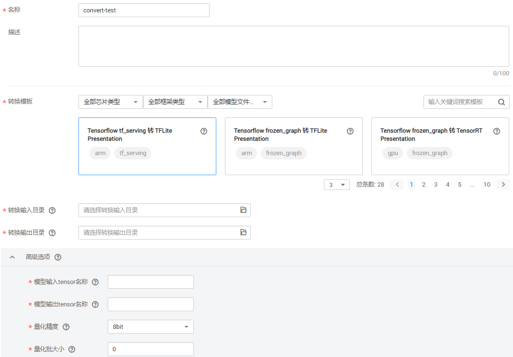

# 压缩和转换模型操作

针对您在ModelArts或者本地构建的模型，为获得更高的算力，希望将模型应用于Ascend芯片、ARM或GPU上，此时，您需要将已有模型压缩/转换成相应的格式后，再应用至不同的芯片类型。

ModelArts提供了模型转换功能，即将已有的模型转换成所需格式，以便应用于算力和性能更高的芯片上。

模型转换主要应用场景如下所示：

-   使用Caffe（.caffemodel格式）或者Tensorflow框架（“frozen\_graph“或“saved\_model“格式）训练的模型，使用转换功能可转换成om格式，转换后的模型可在昇腾（Ascend）芯片上部署运行。
-   使用Tensorflow框架训练模型（frozen\_graph或“saved\_model“格式）， 使用转换功能可以将模型转换量化成tflite格式，转换后的模型可以在ARM上部署运行。
-   使用Tensorflow框架训练模型（frozen\_graph或“saved\_model“格式）， 使用转换功能可以将模型转换量化成tensorRT格式， 转换后的模型可以在nvidia p4 GPU上部署运行。

## 约束限制

-   模型转换当前只支持三种芯片类型，分别为：Ascend、ARM、GPU。
-   模型转换当前仅支持原始框架类型为Caffe和Tensorflow的模型转换。当原始框架类型为Caffe时，输入数据类型为FLOAT；当原始框架类型为Tensorflow时，输入数据类型为INT32、BOOL、UINT8、FLOAT。
-   ModelArts提供了转换模板供用户选择，只能选择对应模板进行转换，支持的模板描述，请参见[转换模板](转换模板.md)。
-   现阶段由于tflite和tensorRT支持的算子和量化算子有限，可能存在部分模型转换失败的情况。如果出现转换失败，可以将页面的日志框滑到最后或者去转换输出目录下查看错误日志。
-   针对用于Ascend芯片的模型转换，其转换限制说明可参见“昇腾开发者社区“的[约束及参数说明](https://support.huaweicloud.com/mcg-atlas200dkappc32/atlasmc_05_0003.html)。
-   压缩/转换任务指定的OBS路径，需确保OBS目录与ModelArts在同一区域。
-   转换后的模型，再导入ModelArts时，需[使用模型模板导入](从模板中选择元模型.md)。
-   针对“训练管理 \> 训练作业 \> 预置算法“，只有“yolov3\_resnet18“支持模型转换，其他预置算法不支持模型转换功能。针对“AI Gallery \> 算法“，官方发布的算法，都支持使用模型转换功能。
-   支持模型文件类型为onnx的模型转换，转换时会先将其转换为Tensorflow框架的FrozenGraphDef格式，然后再转换为om格式。转换工具要求onnx版本为1.6.0，opset为9+。
-   当原始框架类型为Caffe时，模型文件（.prototxt）和权重文件（.caffemodel）的op name、op type必须保持名称一致（包括大小写）。
-   当原始框架类型为Caffe时，除了top与bottom相同的layer以外（例如BatchNorm，Scale，ReLU等），其他layer的top名称需要与其name名称保持一致。
-   当原始框架类型为TensorFlow时，支持FrozenGraphDef格式和SavedModel 格式。如果是SavedModel格式，转换时会先将其转换为FrozenGraphDef格式，然后再转换为om格式。
-   不支持动态shape的输入，例如：NHWC输入为\[?,?,?,3\]多个维度可任意指定数值。模型转换时需指定固定数值。
-   输入数据最大支持四维，转维算子（reshape、expanddim等）不能输出五维。
-   模型中的所有层算子除const算子外，输入和输出需要满足“dim!=0“。
-   模型转换不支持含有训练算子的模型。
-   量化（uint8）后的模型不支持模型转换。
-   模型中的算子只支持2D卷积，暂不支持3D卷积。暂不支持多批量转换batch\_normalization\_1算子和FusedBatchNorm算子。
-   只支持[Caffe算子清单](https://support.huaweicloud.com/opl-atlas500app/atlasoperator_09_0004.html)和[Tensorflow算子](https://support.huaweicloud.com/opl-atlas500app/atlasoperator_09_0005.html)清单中的算子，并需满足算子限制条件。

## 创建模型压缩/转换任务

1.  登录ModelArts管理控制台，在左侧导航栏中选择“模型管理 \>  压缩/转换“，进入模型转换列表页面。
2.  单击左上角的“创建任务“，进入任务创建任务页面。
3.  在“创建任务“页面，参考，填写转换任务的详细参数。
    1.  填写转换任务的“名称“和“描述“信息。
    2.  填写转换任务的具体参数，详细描述请参见[表1](#table365172905220)。

        **表 1**  参数说明

        
        <table><thead align="left"><tr id="row165162935216"><th class="cellrowborder" valign="top" width="20.39%" id="mcps1.2.3.1.1">
参数

        </th>
        <th class="cellrowborder" valign="top" width="79.61%" id="mcps1.2.3.1.2">
说明

        </th>
        </tr>
        </thead>
        <tbody><tr id="row16632985213"><td class="cellrowborder" valign="top" width="20.39%" headers="mcps1.2.3.1.1 ">
输入框架

        </td>
        <td class="cellrowborder" valign="top" width="79.61%" headers="mcps1.2.3.1.2 ">
目前支持转换的框架有“Caffe”和“TensorFlow”。

        </td>
        </tr>
        <tr id="row136613294525"><td class="cellrowborder" valign="top" width="20.39%" headers="mcps1.2.3.1.1 ">
转换输入目录

        </td>
        <td class="cellrowborder" valign="top" width="79.61%" headers="mcps1.2.3.1.2 ">
用于转换的模型所在目录，此目录必须为OBS目录，且模型文件的目录需符合ModelArts规范，详情请参见<a href="模型输入目录规范.md">模型输入目录规范</a>。

        </td>
        </tr>
        <tr id="row138213335529"><td class="cellrowborder" valign="top" width="20.39%" headers="mcps1.2.3.1.1 ">
输出框架

        </td>
        <td class="cellrowborder" valign="top" width="79.61%" headers="mcps1.2.3.1.2 ">
当“输入框架”选择“Caffe”时，“输出框架”支持“MindSpore”。

        
当“输入框架”选择“TensorFlow”时，“输出框架”支持“TFLite”、“MindSpore”、“TensorRT”。

        </td>
        </tr>
        <tr id="row19822143316528"><td class="cellrowborder" valign="top" width="20.39%" headers="mcps1.2.3.1.1 ">
转换输出目录

        </td>
        <td class="cellrowborder" valign="top" width="79.61%" headers="mcps1.2.3.1.2 ">
模型转换完成后，根据此参数设置的目录存储模型。输出目录需符合ModelArts规范要求，详情请参见<a href="模型输出目录说明.md">模型输出目录说明</a>。

        </td>
        </tr>
        <tr id="row206881843165813"><td class="cellrowborder" valign="top" width="20.39%" headers="mcps1.2.3.1.1 ">
转换模板

        </td>
        <td class="cellrowborder" valign="top" width="79.61%" headers="mcps1.2.3.1.2 ">
ModelArts提供了一系列的模板，定义转换功能以及转换过程中所需的参数。当前支持的转换模板详细描述请参见<a href="转换模板.md">转换模板</a>。转换模板右侧下拉框，将根据您选择的“输入框架”和“输出框架”，展现匹配的模板。

        
在下拉框选择模板后，下方将呈现此模板对应的高级参数。例如量化精度，方便您可以对模型转换任务进行更高阶的设置。

        
不同的转换模板，其对应的高级选项支持的参数不同，每个模板支持的详细参数，请参见<a href="转换模板.md">转换模板</a>。

        </td>
        </tr>
        </tbody>
        </table>

        **图 1**  创建模型压缩/转换任务  
        

4.  任务信息填写完成后，单击右下角“立即创建“。

    创建完成后，系统自动跳转至“模型压缩/转换列表“中。刚创建的转换任务将呈现在界面中，其“任务状态“为“初始化“。任务执行过程预计需要几分钟到十几分钟不等，请耐心等待，当“任务状态“变为“成功“时，表示任务运行完成并且模型转换成功。

    如果“任务状态“变为“失败“，建议单击任务名称进入详情页面，查看日志信息，根据日志信息调整任务的相关参数并创建新的转换任务。

    模型转换成功后，有如下几个使用场景：

    -   可以在HiLens管理控制台，导入转换后的模型，导入后可将模型安装部署至HiLens Kits设备上。
    -   登录“转换输出目录“对应的OBS路径，下载目录中的模型（.om格式），部署至您的设备中。

## 删除压缩/转换任务

针对运行结束的任务，如果不需要再使用，您可以删除转换任务。其中，“运行中“或“初始化“状态中的任务不支持删除操作。

> **说明：** 
>任务删除后，将无法恢复，请谨慎操作。

-   **删除单个**

    在“模型压缩/转换列表“中，针对需要删除的单个任务，您可以在此任务所在行，单击操作列的“删除“，完成删除操作。

-   **批量删除**

    在“模型压缩/转换列表“中，勾选多个待删除的任务，然后单击左上角“删除“，完成批量任务的删除操作。

