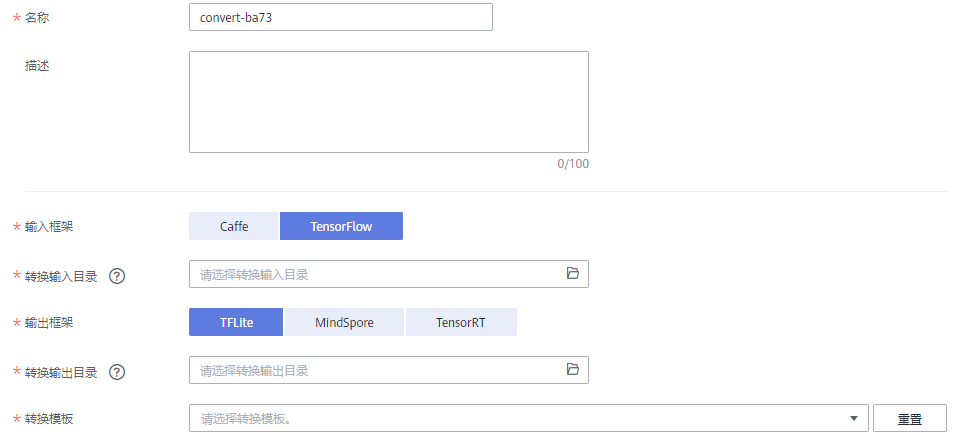

# 压缩和转换模型操作

针对您在ModelArts或者本地构建的模型，为获得更高的算力，希望将模型应用于Ascend芯片、ARM或GPU上，此时，您需要将已有模型压缩/转换成相应的格式后，再应用至不同的芯片类型。

ModelArts提供了模型转换功能，即将已有的模型转换成所需格式，以便应用于算力和性能更高的芯片上。

模型转换主要应用场景如下所示：

-   使用Caffe（.caffemodel格式）或者Tensorflow框架（frozen\_graph格式）训练模型，使用转换功能可将模型转换成om格式，转换后的模型可华为昇腾（Ascend）芯片上部署运行
-   使用Tensorflow框架训练模型（frozen\_graph或“saved\_model“格式）， 使用转换功能可以将模型转换量化成tflite格式模型，转换后的模型可以在ARM上部署运行
-   使用Tensorflow框架训练模型（frozen\_graph或“saved\_model“格式）， 使用转换功能可以将模型转换量化成tensorRT格式模型， 转换后的模型可以在nvidia p4 GPU上部署运行

## 背景信息

-   模型转换当前只支持三种芯片类型，分别为：Ascend、ARM、GPU。
-   模型转换当前仅支持Caffe和TensorFlow框架训练输出的模型。
-   ModelArts提供了转换模板供用户选择，只能选择对应模板进行转换，支持的模板描述，请参见[转换模板](转换模板.md)。
-   现阶段由于tflite和tensorRT支持的算子和量化算子有限，可能存在部分模型转换失败的情况，如果出现转换失败，可以通过提[工单](https://console.huaweicloud.com/ticket/?region=cn-east-2&locale=zh-cn#/ticketindex/createIndex)获得专业的技术支持。
-   压缩/转换任务指定的OBS路径，需确保OBS目录与ModelArts在同一区域。

## 创建模型压缩/转换任务

1.  登录ModelArts管理控制台，在左侧导航栏中选择“模型管理 \>  压缩/转换“，进入模型转换列表页面。
2.  单击左上角的“创建任务“，进入任务创建任务页面。
3.  在“创建任务“页面，参考[表1](#table1796410181761)，填写相关信息。

    **表 1**  参数说明

    
    <table><thead align="left"><tr id="row1096417181165"><th class="cellrowborder" valign="top" width="23%" id="mcps1.2.3.1.1">
参数

    </th>
    <th class="cellrowborder" valign="top" width="77%" id="mcps1.2.3.1.2">
说明

    </th>
    </tr>
    </thead>
    <tbody><tr id="row159640181065"><td class="cellrowborder" valign="top" width="23%" headers="mcps1.2.3.1.1 ">
名称

    </td>
    <td class="cellrowborder" valign="top" width="77%" headers="mcps1.2.3.1.2 ">
转换任务的名称。

    </td>
    </tr>
    <tr id="row59644181565"><td class="cellrowborder" valign="top" width="23%" headers="mcps1.2.3.1.1 ">
描述

    </td>
    <td class="cellrowborder" valign="top" width="77%" headers="mcps1.2.3.1.2 ">
转换任务的简要描述。

    </td>
    </tr>
    <tr id="row8964418860"><td class="cellrowborder" valign="top" width="23%" headers="mcps1.2.3.1.1 ">
转换模板

    </td>
    <td class="cellrowborder" valign="top" width="77%" headers="mcps1.2.3.1.2 ">
ModelArts提供了一系列的模板，定义转换功能以及转换过程中所需的参数。

    
当前支持的转换模板详细描述请参见<a href="转换模板.md">转换模板</a>。您可以从界面的模板卡片列表中选择所需模板。您也可以通过右侧搜索框输入关键词搜索模板，或者基于“芯片类型”、“框架类型”、“模型文件格式”三个维度筛选所需模板。

    <ul id="ul54226551112"><li>“芯片类型”：ModelArts转换模板支持三种芯片类型，分别为Ascend、ARM、GPU。</li><li>“框架类型”：转换模板基于不同的框架，生成不同格式的模型。目前支持Tensorflow和Caffe两种框架类型。</li><li>“模型文件格式”：下拉列表罗列当前支持的模型文件格式，通过模型文件格式选择。目前支持“caffemodel”、“frozen_gragh”、“tf_serving”文件格式。</li></ul>
    </td>
    </tr>
    <tr id="row1496441810611"><td class="cellrowborder" valign="top" width="23%" headers="mcps1.2.3.1.1 ">
转换输入目录

    </td>
    <td class="cellrowborder" valign="top" width="77%" headers="mcps1.2.3.1.2 ">
用于转换的模型所在目录，此目录必须为OBS目录，且模型文件的目录需符合ModelArts规范，详情请参见<a href="模型输入目录规范.md">模型输入目录规范</a>。

    </td>
    </tr>
    <tr id="row199641718466"><td class="cellrowborder" valign="top" width="23%" headers="mcps1.2.3.1.1 ">
转换输出目录

    </td>
    <td class="cellrowborder" valign="top" width="77%" headers="mcps1.2.3.1.2 ">
模型转换完成后，根据此参数设置的目录存储模型。输出目录需符合ModelArts规范要求，详情请参见<a href="模型输出目录说明.md">模型输出目录说明</a>。

    </td>
    </tr>
    <tr id="row7964161815614"><td class="cellrowborder" valign="top" width="23%" headers="mcps1.2.3.1.1 ">
高级选项

    </td>
    <td class="cellrowborder" valign="top" width="77%" headers="mcps1.2.3.1.2 ">
针对不同的转换模板，ModelArts提供了更多的选项设置，例如量化精度，方便您可以对模型转换任务进行更高阶的设置。

    
不同的转换模板，其对应的高级选项支持的参数不同，每个模板支持的详细参数，请参见<a href="转换模板.md">转换模板</a>。

    </td>
    </tr>
    </tbody>
    </table>

    **图 1**  创建模型压缩/转换任务  
    

4.  任务信息填写完成后，单击右下角“立即创建“。

    创建完成后，系统自动跳转至“模型压缩/转换列表“中。刚创建的转换任务将呈现在界面中，其“任务状态“为“初始化“。任务执行过程预计需要几分钟到十几分钟不等，请耐心等待，当“任务状态“变为“成功“时，表示任务运行完成并且模型转换成功。

    如果“任务状态“变为“失败“，建议单击任务名称进入详情页面，查看日志信息，根据日志信息调整任务的相关参数并创建新的转换任务。

## 删除压缩/转换任务

针对运行结束的任务，如果不需要再使用，您可以删除转换任务。其中，“运行中“或“初始化“状态中的任务不支持删除操作。

> **说明：**   
>任务删除后，将无法恢复，请谨慎操作。  

-   删除单个

    在“模型压缩/转换列表“中，针对需要删除的单个任务，您可以在此任务所在行，单击操作列的“删除“，完成删除操作。

-   批量删除：

    在“模型压缩/转换列表“中，勾选多个待删除的任务，然后单击左上角“删除“，完成批量任务的删除操作。

