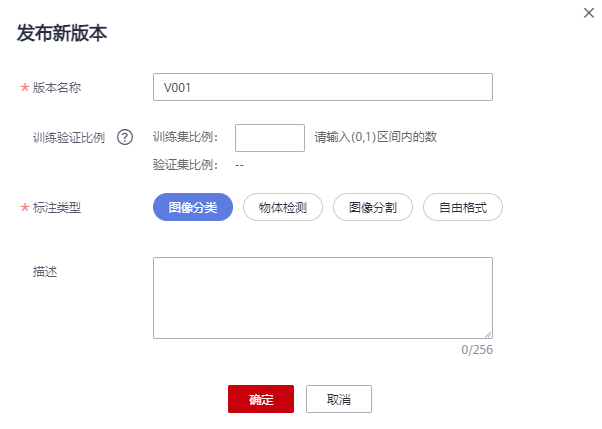

# 发布数据集<a name="modelarts_23_0018"></a>

ModelArts在数据集管理过程中，针对同一个数据源，对不同时间标注后的数据，按版本进行区分，方便后续模型构建和开发过程中，选择对应的数据集版本进行使用。数据标注完成后，您可以将数据集当前状态进行发布，生成一个新的数据集版本。

## 关于数据集版本<a name="section38541340654"></a>

-   针对刚创建的数据集（未发布前），无数据集版本信息，必须执行发布操作后，才能应用于模型开发或训练。
-   数据集版本，默认按V001、V002递增规则进行命名，您也可以在发布时自定义设置。
-   您可以将任意一个版本设置为当前目录，即表示数据集列表中进入的数据集详情，为此版本的数据及标注信息。

## 发布数据集<a name="section1811135818517"></a>

1.  登录ModelArts管理控制台，在左侧菜单栏中选择“数据管理（Beta） \> 数据集“，进入“数据集“管理页面。
2.  在数据集列表中，单击操作列的“发布“。

    或者，您可以单击数据集名称，进入数据集“概览“页，在页面右上角单击“发布“。

3.  在“发布新版本“弹出框中，填写“版本名称“和“版本格式“，然后单击“确定“。

    “版本名称“默认按V001、V002递增规则进行命名，您也可以设置为自定义的名称。名称只能包含字母、数字、中划线或下划线。

    “版本格式“支持“Default“和“CabonData“两种。

    **图 1**  发布数据集<a name="fig399915934916"></a>  
    

    版本发布后，您可以前往版本管理查看详细信息。系统默认将最新的版本作为当前目录。


## 数据集发布后，相关文件的目录结构说明<a name="section125341142131112"></a>

由于数据集是基于OBS目录管理的，发布为新版本后，对应的数据集输出位置，也将基于新版本生成目录。

以图像分类为例，数据集发布后，对应OBS路径下生成，其相关文件的目录如下所示。

```
|-- user-specified-output-path
    |-- DatasetName-datasetId
        |-- annotation
            |-- VersionMame1
                |-- VersionMame1.manifest
            |-- VersionMame2
                ...
            |-- ...
```

以物体检测为例，如果数据集导入的是Manifest文件，在数据集发布后，其相关文件的目录结构如下。

```
|-- user-specified-output-path
    |-- DatasetName-datasetId
        |-- annotation
            |-- VersionMame1
                |-- VersionMame1.manifest
                |-- file1.jpg
                |-- file1.xml
                |-- ...
            |-- VersionMame2
                ...
            |-- ...

```

