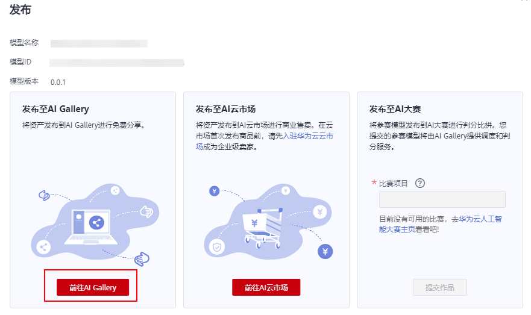
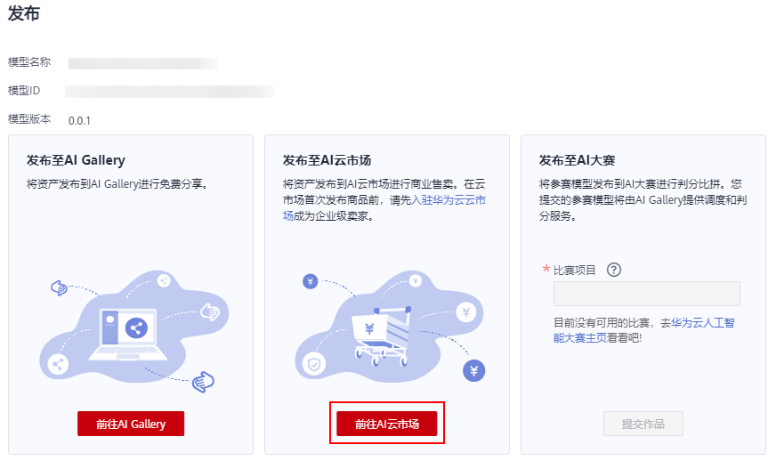

# 发布模型

针对导入至ModelArts的模型，支持以下三种发布方式：

-   [发布至AI Gallery](#section7657125010180)

    AI Gallery是在ModelArts的基础上构建的开发者生态社区，提供算法、模型、数据集等内容的共享，为高校科研机构、AI应用开发商、解决方案集成商、企业级个人开发者等群体，提供安全、开放的共享，加速AI资产的开发与落地。

    发布至AI Gallery的资产是免费的，只需要支付在使用过程中消耗的硬件资源，硬件资源费用将根据实际使用情况由华为云ModelArts管理控制台向使用方收取。

-   [发布至AI 云市场](#section08761829112215)

    华为云云市场是软件及服务交易交付平台。云市场AI专区汇聚优质的人工智能服务提供商，提供丰富的人工智能解决方案、应用、API及算法模型，助力用户快速部署、接入、调用相关应用，方便地购买和使用算法模型。

    发布至云市场AI专区的模型为商业售卖资产。买家需购买商品的使用配额进行有偿使用。

    > **说明：** 
    >云市场仅支持企业级卖家发布商品，请在首次发布商品前[入驻华为云市场](https://marketplace.huaweicloud.com/sellercenter/)成为企业级卖家。

-   [参赛发布](#section272195221218)

    华为云人工智能大赛面向开发者组织了一些开发者大赛，您可以在ModelArts开发模型，并将参赛模型提交至对应的比赛项目。

## 前提条件

已在ModelArts中导入模型。且至少存在一个版本。

## 发布至AI Gallery

ModelArts提供了“AI Gallery“功能，方便将个人的模型等共享给所有ModelArts用户，您也可以从“AI Gallery“获取他人共享的内容，快速完成构建。在您完成模型的训练和导入之后，您可以将自己的模型分享至“AI Gallery“，进行知识共享。

1.  登录ModelArts管理控制台，在左侧导航栏中选择“模型管理 \> 模型“，进入模型列表页面。
2.  单击模型左侧的小三角展开版本列表，单击“操作“列的“发布 “进入发布页面。
3.  在发布弹出框中，单击“前往AI Gallery“进入AI Gallery。

    **图 1**  前往AI Gallery  
    

4.  进入AI Gallery后，请参考[免费分享模型](https://support.huaweicloud.com/aimarket-modelarts/modelarts_18_0007.html)。

## 发布至AI 云市场

华为云云市场有完整的售前、交易、售后的保障体系，用户无需担忧交易，省心省力。在您完成模型的训练和导入之后，您可以将自己的模型发布至AI 云市场进行商品售卖。请在首次发布商品前[入驻华为云市场](https://marketplace.huaweicloud.com/sellercenter/)成为企业级卖家。

1.  登录ModelArts管理控制台，在左侧导航栏中选择“模型管理 \> 模型“，进入模型列表页面。
2.  单击模型左侧的小三角展开版本列表，单击“操作“列的“发布“进入发布页面。
3.  在发布弹出框中，单击“前往AI 云市场“进入云市场。

    **图 2**  前往云市场  
    

4.  进入云市场后，请参考[发布AI资产类商品操作指导](https://support.huaweicloud.com/usermanual-marketplace/sp_topic_0000125.html)。

## 参赛发布

华为云人工智能大赛面向开发者组织了一些开发者大赛，您可以在ModelArts开发模型，并将参赛模型提交至对应的比赛项目。

1.  登录ModelArts管理控制台，在左侧导航栏中选择“模型管理 \> 模型“，进入模型列表页面。
2.  单击模型左侧的小三角展开版本列表，单击“操作“列的“发布“进入发布页面。
3.  在发布弹出框中，填写“比赛项目“，确认模型信息无误后，单击“提交作品“完成提交。

    **图 3**  提交参赛模型  
    

