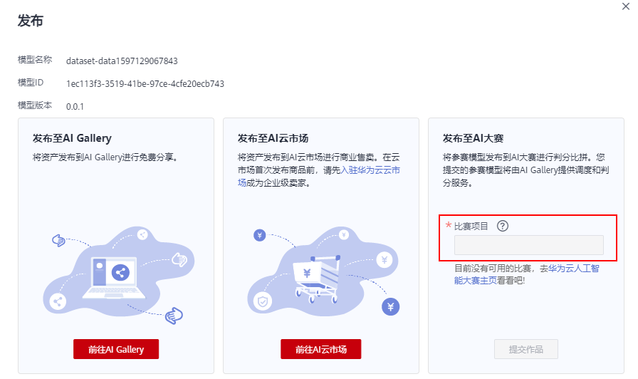

# 发布模型

针对导入至ModelArts的模型，支持[将模型发布至AI市场](#section7657125010180)或[将参赛模型提交至比赛项目](#section272195221218)。

## 前提条件

已在ModelArts中导入模型。且至少存在一个版本。

## 发布至AI市场

ModelArts提供了“AI市场“功能，方便将个人的模型、API、数据集等共享给所有ModelArts用户，您也可以从“AI市场“获取他人共享的内容，快速完成构建。在您完成模型的训练和导入之后，您可以将自己的模型分享至“AI市场“，进行知识共享。

1.  登录ModelArts管理控制台，在左侧导航栏中选择“模型管理 \> 模型“，进入模型列表页面。
2.  单击模型左侧的小三角展开版本列表，单击“操作“列的“发布 \> 市场发布“进入AI市场。

    > **说明：**   
    >在“华北-北京一”区域同时存在旧版和新版的AI市场，您需要在弹出的对话框中选择需要发布的AI市场，推荐发布至“新版AI市场”，目前已不支持将模型发布至“旧版AI市场”。在“华北-北京四”区域，仅支持新版AI市场，单击“市场发布”按钮后，将直接发布至新版AI市场。  

3.  进入AI市场后，单击“新建模型“，将您的模型发布至市场，共享给其他用户。新版AI市场的详细操作指导请参见[分享或查看我的模型](AI市场（新版）.md#section1727217378401)。

## 参赛发布

华为云人工智能大赛面向开发者组织了一些开发者大赛，您可以在ModelArts开发模型，并将参赛模型提交至对应的比赛项目。

1.  登录ModelArts管理控制台，在左侧导航栏中选择“模型管理 \> 模型“，进入模型列表页面。
2.  单击模型左侧的小三角展开版本列表，单击“操作“列的“发布 \> 参赛发布“进入AI市场。
3.  在如下弹出框中，填写“比赛项目“，确认模型信息无误后，单击“确定“完成提交。

    **图 1**  提交参赛模型  
    

