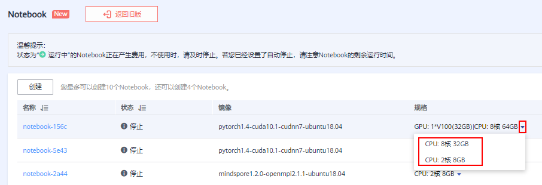
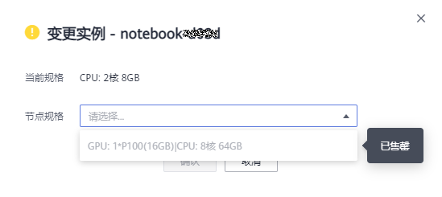

# 变更Notebook实例运行规格

## 前提条件

Notebook实例状态必须在“停止“中。

## 切换规格

ModelArts允许用户在同一个Notebook实例中切换节点运行规格，方便用户灵活调整规格资源。

1.  登录ModelArts管理控制台，在左侧菜单栏中选择“开发环境 \> Notebook“，进入新版Notebook管理页面。
2.  在Notebook列表，单击某个Notebook实例右侧操作栏中的“更多 \> 变更实例“，进入“变更实例“对话框。

    

    **图 1**  变更实例  
    

3.  选择要变更的节点规格，单击“确认“。

    如果下拉框中的节点规格呈灰色显示，表示该资源规格已售罄，无法选择。

