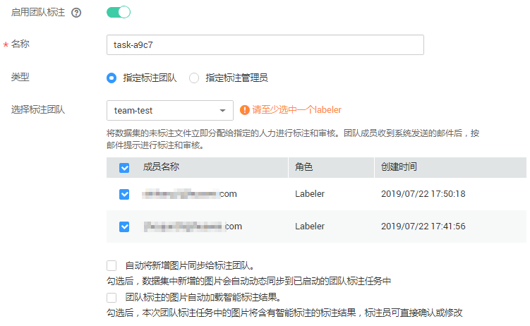
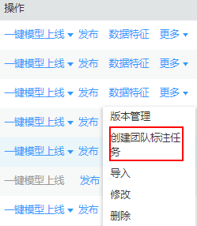

# 团队标注简介

数据标注任务中，一般由一个人完成，但是针对数据集较大时，需要多人协助完成。ModelArts提供了团队标注功能，可以由多人组成一个标注团队，针对同一个数据集进行标注管理。

> **说明：**   
>团队标注功能当前仅支持“物体检测”类型的数据集。  

## 如何启用团队标注

-   创建数据集时，打开“启用团队标注”开关，同时指定一个标注团队，或者指定标注管理员。

    **图 1**  创建数据集时启用  
    

-   对于已创建，且未启用团队标注的数据集。可通过创建一个团队标注任务，直接启用团队标注功能。创建团队标注的操作详情请参见[创建团队标注任务](管理团队标注任务.md#section72262410214)。

    **图 2**  在数据集列表中创建团队标注任务  
    

    **图 3**  在数据集概览页中创建团队标注任务  
    

## 团队标注相关操作

-   [管理团队](管理团队.md)
-   [管理成员](管理成员.md)
-   [管理团队标注任务](管理团队标注任务.md)

