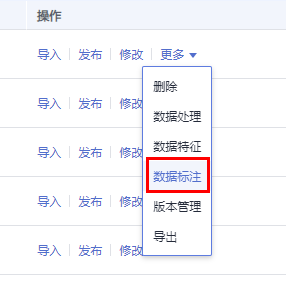

# 团队标注简介

数据标注任务中，一般由一个人完成，但是针对数据集较大时，需要多人协助完成。ModelArts提供了团队标注功能，可以由多人组成一个标注团队，共同完成同一个标注作业。

> **说明：** 
>团队标注功能当前仅支持“图像分类“、“物体检测“、“文本分类“、“命名实体“、“文本三元组“、“语音分割“类型的标注作业。

## 如何创建团队标注作业

-   创建标注作业时，打开“启用团队标注”开关，同时指定一个标注团队，或者指定标注管理员。

    **图 1**  创建团队标注作业  
    

-   对于同一个数据集，可以创建多个团队标注任务。创建团队标注的操作详情请参见[创建团队标注任务](管理团队标注任务.md#zh-cn_topic_0209053802_section72262410214)。

    **图 2**  在数据集列表中创建团队标注任务  
    

    **图 3**  在数据集概览页中，选择标注标注任务页签，点击“新建标注任务”，创建团队标注任务  
    

    **图 4**  在数据集详情页创建团队标注任务  
    

    > **说明：** 
    >-   当标注人员第一次收到标注邮件时，会告知标注的地址\(labelConsole\)以及默认初始密码。
    >-   只有当创建团队标注任务时，标注人员才会收到邮件。创建标注团队及添加标注团队的成员并不会发送邮件。此外，当所有样本都是已标注状态时，创建团队标注任务也不会收到邮件。

## 团队标注相关操作

-   [管理团队](管理团队.md)
-   [管理成员](管理成员.md)
-   [管理团队标注任务](管理团队标注任务.md)

