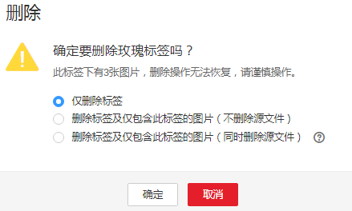

# 图像分类

由于模型训练过程需要大量有标签的图片数据，因此在模型训练之前需对没有标签的图片添加标签。您可以通过手工标注或智能一键标注的方式添加标签，快速完成对图片的标注操作，也可以对已标注图片修改或删除标签进行重新标注。

针对图像分类场景，开始标注前，您需要了解：

-   图片标注支持多标签，即一张图片可添加多个标签。
-   标签名是由中文、大小写字母、数字、中划线或下划线组成，且不超过32位的字符串。

## 进入数据集详情页

1.  登录ModelArts管理控制台，在左侧菜单栏中选择“数据管理（Beta） \> 数据集“，进入“数据集“管理页面。
2.  在数据集列表中，基于“标注类型“选择需要进行标注的数据集，单击数据集名称进入数据集概览页。

    此操作默认进入数据集当前版本的概览页，如果需要对其他版本进行数据标注，请先在“版本管理“操作中，将需要进行数据标注的版本设置为“当前版本。“详细操作指导请参见[管理数据集版本](管理数据集版本.md)。

3.  在数据集概览页中，单击右上角“开始标注“，进入数据集详情页。数据集详情页默认展示此数据集下全部数据。

## 同步数据源

ModelArts会自动从数据集输入位置同步数据至数据集详情页，包含数据及标注信息。

为了快速获取OBS桶中最新数据，可在数据集详情页的“全部“或“未标注“页签中，单击“同步数据源“，快速将通过OBS上传的数据添加到数据集中。

## 筛选数据

在数据集概览页中，单击页面右上角的“标注数据“，进入数据集的详情页面，默认展示数据集中全部数据。在“全部“、“未标注“或“已标注“页签下，您可以在筛选条件区域，添加筛选条件，快速过滤出您想要查看的数据。

支持的筛选条件如下所示，您可以设置一个或多个选项进行筛选。

-   难例集：难例或非难例。
-   标签：您可以选择全部标签，或者基于您指定的标签，选中其中一个或多个。
-   样本创建时间：1个月内、1天内或自定义，如果选择自定义，可以在时间框中指定明确时间范围。
-   文件名或目录：根据文件名称或者文件存储目录筛选。
-   标注人：选择执行标注操作的账号名称。
-   样本属性：表示自动分组生成的属性。

**图 1**  筛选条件  

## 标注图片（手工标注）

数据集详情页中，展示了此数据集中“全部“、“未标注“和“已标注“的图片，默认显示“全部“的图片列表。单击图片右下角，即可进行图片的预览，对于已标注图片，预览页面下方会显示该图片的标签信息。

1.  在“未标注“页签，勾选需进行标注的图片。
    -   手工点选：在图片列表中，单击图片，当图片右上角出现蓝色勾选框时，表示已勾选。可勾选同类别的多个图片，一起添加标签。
    -   批量选中：如果图片列表的当前页，所有图片属于一种类型，可以在图片列表的右上角单击“选择当前页“，则当前页面所有的图片将选中。

2.  添加标签。

    1.  在右侧的“添加标签“区域中，单击“标签名“右侧的文本框中设置标签。

        方式一（已存在标签）：单击“标签名“右侧的文本框，然后从下拉列表中选择已有的标签。

        方式二（新增标签）：在标签名右侧的文本框中，直接输入新的标签名，然后单击“添加“。

    2.  查看“选中文件标签“的信息，确认无误后，单击“确认“。此时，选中的图片将被自动移动至“已标注“页签，且在“未标注“和“全部“页签中，标签的信息也将随着标注步骤进行更新，如增加的标签名称、各标签对应的图片数量。

    **图 2**  添加标签  
    

## 确认为难例

在数据集详情页面，选中需要标注为难例的图片数据（可选择多个），然后单击“确认为难例“。此时，选中的数据将携带难例的属性，您可以通过筛选功能，查看难例集中属于难例的数据。

## 查看已标注图片

在数据集详情页，单击“已标注“页签，您可以查看已完成标注的图片列表。单击图片，可在右侧的“选中文件标签“中了解当前图片的标签信息。

## 修改标注

当数据完成标注后，您还可以进入已标注页签，对已标注的数据进行修改。

-   **基于图片修改**

    在数据集详情页面，单击“已标注“页签，然后在图片列表中选中待修改的图片（选择一个或多个）。在右侧标签信息区域中对图片信息进行修改。

    -   添加标签：在“标签名“右侧文本框中，选择已有标签或输入新的标签名，然后单击“确定“，为选中图片增加标签。
    -   修改标签：在“选中文件标签“区域中，单击操作列的，然后在文本框中输入正确的标签名，然后单击完成修改。

        **图 3**  编辑标签  
        

    -   删除标签：在“选中文件标签“区域中，单击操作列的删除该标签。

-   **基于标签修改**

    在数据集详情页面，单击“已标注“页签，在图片列表右侧，显示全部标签的信息。

    **图 4**  全部标签的信息  
    

    -   修改标签：单击操作列的，然后在弹出的对话框中输入修改后的标签名，然后单击“确定“完成修改。修改后，之前添加了此标签的图片，都将被标注为新的标签名称。
    -   删除标签：单击操作列的，在弹出的对话框中，选择“仅删除标签“、“删除标签及仅包含此标签的图片（不删除源文件）“或“删除标签及仅包含此标签的图片（同时删除源文件）“，然后单击“确定“。

        **图 5**  删除标签  
        

## 添加图片

除了数据集输入位置自动同步的数据外，您还可以在ModelArts界面中，直接添加图片，用于数据标注。

1.  在数据集详情页面，单击“全部“或“未标注“页签，然后单击左上角“添加图片“。
2.  在弹出的“添加图片“对话框中，单击“添加图片“。

    选择本地环境中需要上传的图片，可以一次性选择多张图片。图片只支持JPG、JPEG、PNG、BMP格式，且一次上传图片的总大小不能超过8MB。

    图片选择完成后，“添加图片“对话框将显示上传图片的缩略图以及图片大小。

    **图 6**  添加图片  
    

3.  在添加图片对话框中，单击“确定“，完成添加图片的操作。

    您添加的图片将自动呈现在“未标注“的图片列表中。且图片将自动存储至此“数据集输入位置“对应的OBS目录中。

## 删除图片

通过数据删除操作，可将需要丢弃的图片数据快速删除。

在“全部“、“未标注“或“已标注“页面中，依次单击选中需要删除的图片，或者选择“勾选当前页“选中该页面所有图片，然后单击左上角“删除图“。在弹出的对话框中，根据实际情况选择是否勾选“同时删除源文件“，确认信息无误后，单击“确定“完成图片删除操作。

其中，被选中的图片，其右上角将显示为勾选状态。如果当前页面无选中图片时，“删除图片“按钮为灰色，无法执行删除操作。

> **须知：**   
>如果勾选了“同时删除源文件“，删除图片操作将删除对应OBS目录下存储的图片，此操作可能会影响已使用此源文件的其他数据集或数据集版本，有可能导致展示异常或训练/推理异常。删除后，数据将无法恢复，请谨慎操作。  

