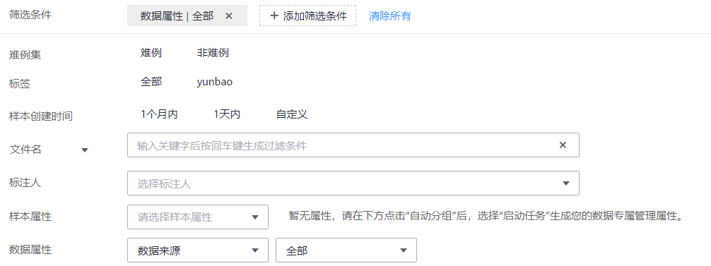
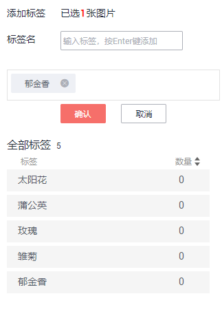
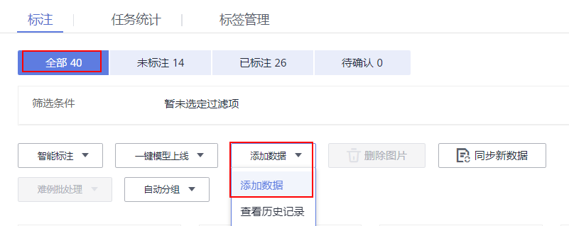
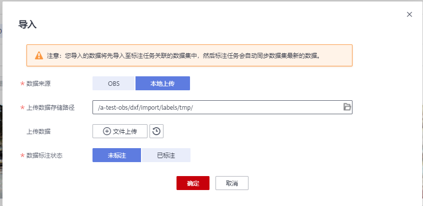

# 图像分类

由于模型训练过程需要大量有标签的图片数据，因此在模型训练之前需对没有标签的图片添加标签。您可以通过手工标注或智能一键标注的方式添加标签，快速完成对图片的标注操作，也可以对已标注图片修改或删除标签进行重新标注。

针对图像分类场景，开始标注前，您需要了解：

-   图片标注支持多标签，即一张图片可添加多个标签。
-   标签名是由中文、大小写字母、数字、中划线或下划线组成，且不超过32位的字符串。

## 开始标注

1.  登录ModelArts管理控制台，在左侧菜单栏中选择“数据管理\> 数据标注“，进入“数据标注“管理页面。
2.  在数据集列表中，基于“标注类型“选择需要进行标注的数据集，单击标注作业名称进入标注作业标注详情页。
3.  在标注作业标注详情中，展示此标注作业下全部数据。

## 同步新数据

ModelArts会自动将数据集中新增的数据同步至标注作业，包含数据及当前标注作业支持的标注信息。

为了快速获取数据集中最新数据，可在标注作业详情页的“全部“、“未标注“或“已标注“页签中，单击“同步新数据“，快速将数据集中的数据添加到标注作业中。

## 筛选数据

在标注作业详情页面，默认展示作业中全部数据，您可以在“全部“、“未标注“或“已标注“页签下，在筛选条件区域，单击“展开“，添加筛选条件，快速过滤出您想要查看的数据。

支持的筛选条件如下所示，您可以设置一个或多个选项进行筛选。

-   难例集：难例或非难例。
-   标签：您可以选择全部标签，或者基于您指定的标签，选中其中一个或多个。
-   样本创建时间：1个月内、1天内或自定义，如果选择自定义，可以在时间框中指定明确时间范围。
-   文件名或目录：根据文件名称或者文件存储目录筛选。
-   标注人：选择执行标注操作的帐号名称。
-   样本属性：表示自动分组生成的属性。只有启用了[自动分组](https://support.huaweicloud.com/engineers-modelarts/modelarts_23_0213.html)任务后才可使用此筛选条件。
-   数据属性：暂不支持。

**图 1**  筛选条件  

## 标注图片（手工标注）

在标注作业详情页中，展示了此数据集中“全部“、“未标注“和“已标注“的图片，默认显示“全部“的图片列表。单击图片，即可进行图片的预览，对于已标注图片，预览页面下方会显示该图片的标签信息。

1.  在“未标注“页签，勾选需进行标注的图片。
    -   手工点选：在图片列表中，单击勾选图片左上角的选择框，进入选择模式，表示图片已勾选。可勾选同类别的多个图片，一起添加标签。
    -   批量选中：如果图片列表的当前页，所有图片属于一种类型，可以在图片列表的右上角单击“选择当前页“，则当前页面所有的图片将选中。

2.  为选中图片添加标签。

    1.  在右侧的“添加标签“区域中，单击“标签名“右侧的文本框中设置标签。

        单击“标签名“右侧的文本框，然后从下拉列表中选择已有的标签。如果已有标签无法满足要求时，直接在文本框中添加新标签。

    2.  单击“确认“。此时，选中的图片将被自动移动至“已标注“页签，且在“未标注“和“全部“页签中，标签的信息也将随着标注步骤进行更新，如增加的标签名称、各标签对应的图片数量。

    **图 2**  添加标签  
    

## 查看已标注图片

在标注任务详情页，单击“已标注”页签，您可以查看已完成标注的图片列表。图片缩略图下方默认呈现其对应的标签，您也可以勾选图片，在右侧的“选中文件标签”中了解当前图片的标签信息。

## 修改标注

当数据完成标注后，您还可以进入已标注页签，对已标注的数据进行修改。

-   **基于图片修改**

    在标注作业详情页面，单击“已标注“页签，然后在图片列表中选中待修改的图片（选择一个或多个）。在右侧标签信息区域中对图片信息进行修改。

    修改标签：在“选中文件标签“区域中，单击操作列的编辑图标，然后在文本框中输入正确的标签名，然后单击确定图标完成修改。

    删除标签：在“选中文件标签“区域中，单击操作列的删除图标删除该标签。此操作仅删除选中图片中的标签。

    **图 3**  编辑标签  
    

-   **基于标签修改**

    在标注作业详情页，单击“标签管理”页签，显示全部标签列表。

    -   修改标签：单击操作列的修改按钮，然后在弹出的对话框中输入修改后的标签名，然后单击“确定“完成修改。修改后，之前添加了此标签的图片，都将被标注为新的标签名称。
    -   删除标签：单击操作列的删除按钮，之前添加了此标签的图片，都将删除此标签。。

    **图 4**  全部标签的信息  
    

## 添加数据

除了同步数据集中的新数据外，您还可以在标注作业中，直接添加图片，用于数据标注。添加的数据将先导入至标注任务关联的数据集中，然后标注任务会自动同步数据集中最新的数据。

1.  在标注作业详情页面，单击“全部“或“未标注“页签，然后单击左上角“添加数据“，选择添加数据。

    **图 5**  添加数据  
    

2.  在弹出的导入对话框中，选择数据来源和导入方式，选择导入的数据路径和数据标注状态。

    **图 6**  添加图片  
    

    

3.  在导入对话框中，单击“确定“，完成添加数据的操作。

    您添加的图片将自动呈现在“全部“的图片列表中。

## 删除图片

通过数据删除操作，可将需要丢弃的图片数据快速删除。

在“全部“、“未标注“或“已标注“页面中，依次选中需要删除的图片，或者选择“选择当前页“选中该页面所有图片，然后单击左上角“删除图片“。在弹出的对话框中，根据实际情况选择是否勾选“同时删除源文件“，确认信息无误后，单击“确定“完成图片删除操作。

其中，被选中的图片，其左上角将显示为勾选状态。如果当前页面无选中图片时，“删除图片“按钮为灰色，无法执行删除操作。

> **说明：** 
>如果勾选了“同时删除源文件“，删除图片操作将删除对应OBS目录下存储的图片，此操作可能会影响已使用此源文件的其他数据集或数据集版本，有可能导致展示异常或训练/推理异常。删除后，数据将无法恢复，请谨慎操作。

